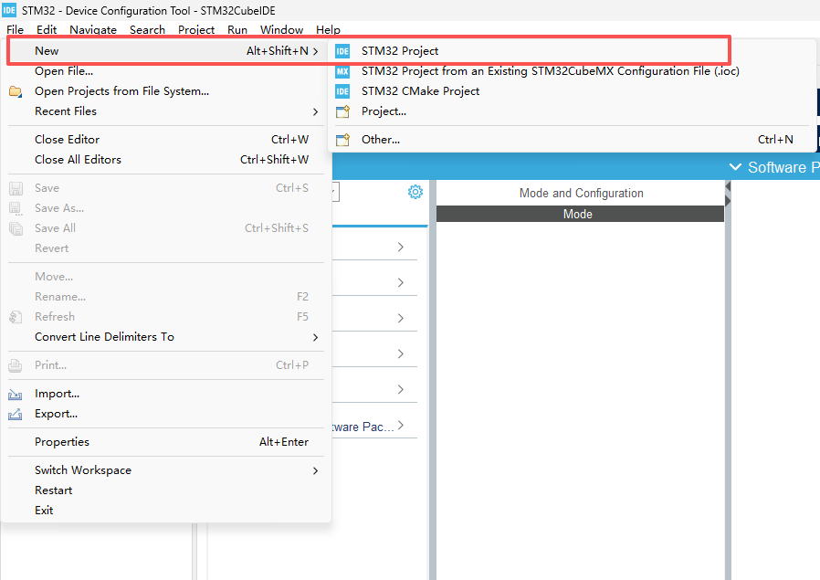
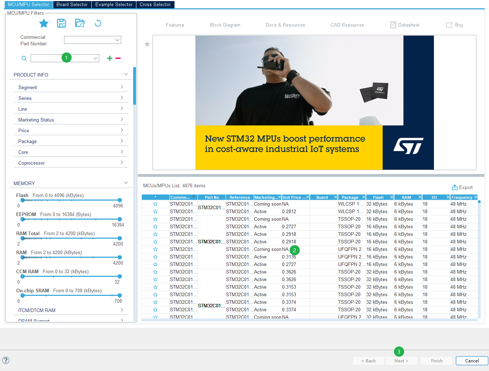
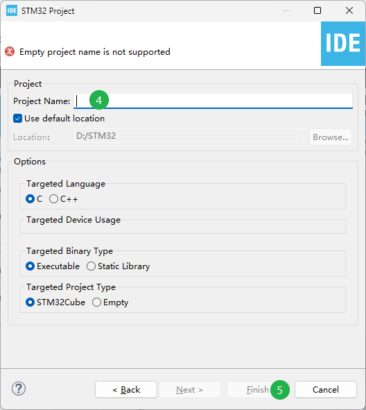
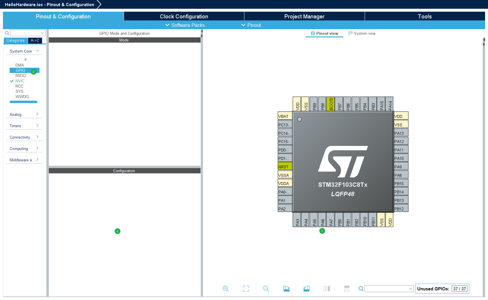
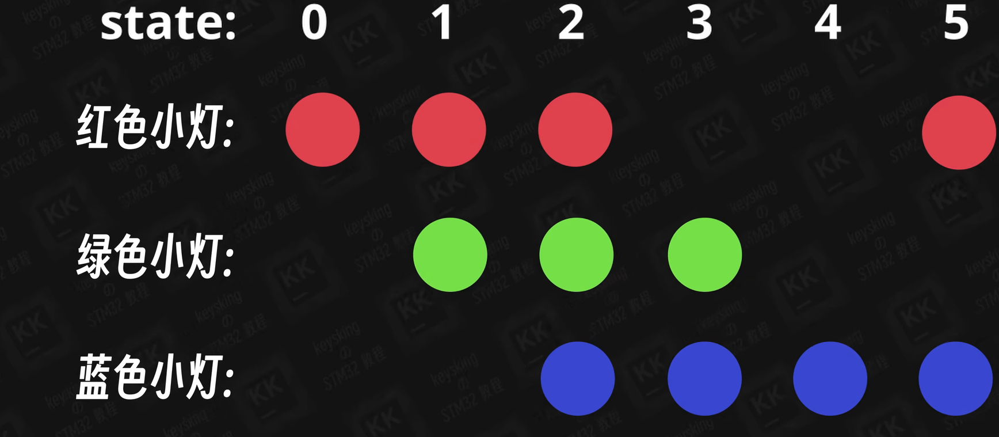
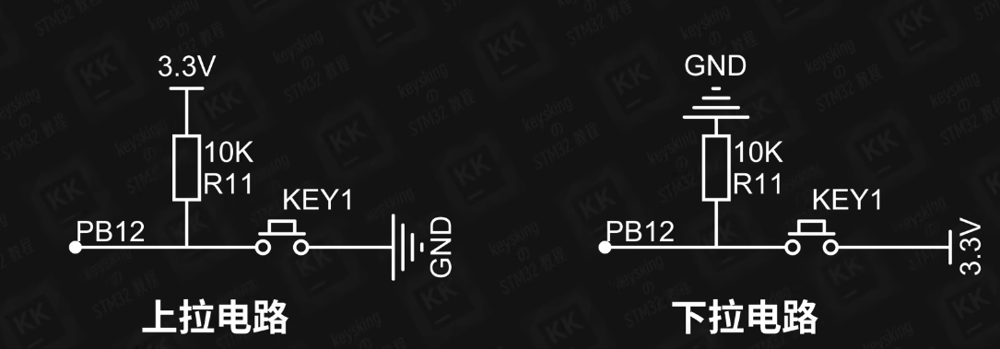
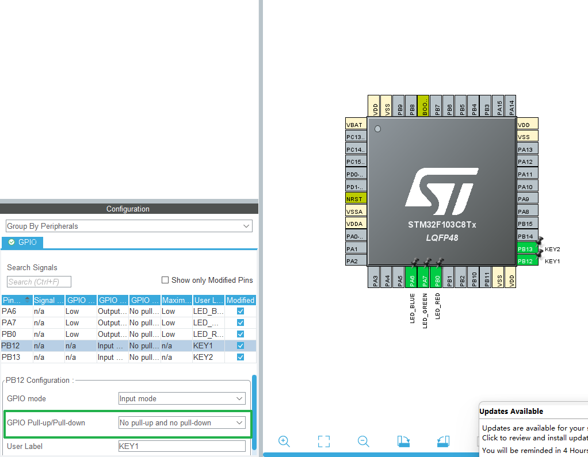
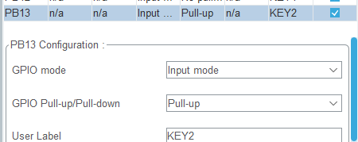
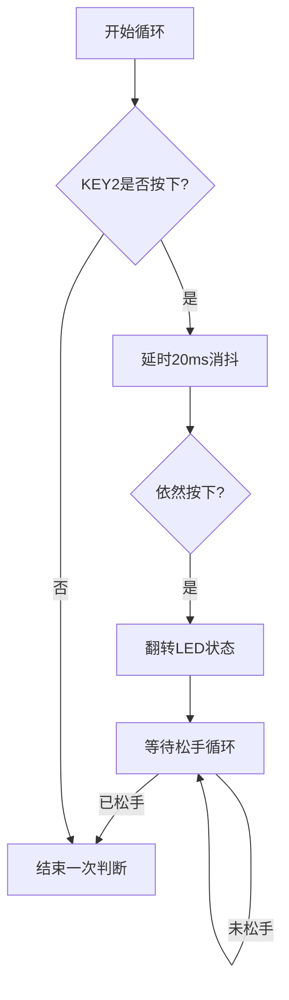

# 点亮LED

## 识别电路原理图，确认需求


根据电路原理图得知，PA6、PA7、PB0分别与`STM32F103C8T6`的对应端口相连接（端口相连即电路连通）。

## GPIO八大模式：**4种输入**、**4种输出**
### 4 种输入模式 (Input)

主要用于读取传感器信号、按键或外部电平。

| 模式   | 英文名             | 论文/应用场景                | 快速理解                          |
|------|-----------------|------------------------|-------------------------------|
| 浮空输入 | Input Floating  | 用于 I2C、USART 等通信接收端。   | 引脚电压完全由外部决定。没接东西时，数值会乱跳（不稳定）。 |
| 上拉输入 | Input Pull-up   | 最常用。 用于读取按键、霍尔传感器。     | 引脚内部接了个电阻到 VCC。默认高电平，外部接地时变低。 |
| 下拉输入 | Input Pull-down | 用于某些高电平触发的检测电路。        | 引脚内部接电阻到 GND。默认低电平。           |
| 模拟输入 | Analog          | ADC 采集必备。 测电压、测光敏、测电量。 | 关闭所有数字处理，信号直接传给内部 ADC 模块。     |

### 4 种输出模式 (Output)

主要用于驱动 LED、继电器、电机或通信总线。

| 模式   | 英文名           | 论文/应用场景                | 快速理解                             |
|------|---------------|------------------------|----------------------------------|
| 推挽输出 | Push-Pull     | 最常用。 驱动 LED、蜂鸣器、数字通讯。  | 既能输出高电平，也能输出低电平，驱动能力强。           |
| 开漏输出 | Open-Drain    | I2C 总线、电平转换。           | 自己只能输出低。想输出高？必须在外面接一个上拉电阻。       |
| 复用推挽 | AF Push-Pull  | PWM 波形输出（电机控制）、SPI 通讯。 | 引脚控制权交给了片上外设（如定时器），而不是简单的 0 和 1。 |
| 复用开漏 | AF Open-Drain | I2C 通讯的引脚配置。           | 同样交给外设控制，但具备开漏特性。                |

## 新建工程（后文将不重复此章节）

File→New→STM32 Project


1. 在搜索文本框内输入`F103C8T6`
2. 在搜索出的芯片中选择`F103C8T6`（点击左侧小⭐图标，可在左边栏点击大⭐图标直接选择已收藏的芯片）
3. 点击Next
4. 输入项目名（保持下方Targeted Protect Type选项为STM32Cube）
5. 点击Finish

### 结构说明


项目结构说明：
- Core：源代码文件夹
	- Src→main.c：项目源代码
- HelloHardware.ioc（xx.ioc）：芯片可视化

### 工具栏介绍


1. 编译源代码
2. 在单片机运行该代码
3. 点击下拉箭头，可在已编译的代码中选择并运行
### 代码编辑说明

编写代码要写在对应BEGIN……END注释块内编写，否则编译后会丢失代码。

## 开发

### 分配引脚

在Pinout&Configuration页面，将 PA6、PA7、PB0 配置为 GPIO_Output，并分别设置 User label 为 BLUE、GREEN、RED
**左键**点击对应的引脚，选择 GPIO_Output；
 
**右键**点击对应的引脚，选择 User label，分别输入 BLUE、GREEN、RED


*配置过引脚后，不要忘记按Ctrl+S保存以使编译器同步代码！*

### 配置GPIO

设置初始电平：高电平点亮LED，低电平熄灭LED

### 代码编写
```c
HAL_GPIO_WritePin(RED_GPIO_Port, RED_Pin, GPIO_PIN_SET); //红色，点亮  
HAL_GPIO_WritePin(BLUE_GPIO_Port, BLUE_Pin, GPIO_PIN_RESET); //蓝色，熄灭  
HAL_GPIO_WritePin(GREEN_GPIO_Port, GREEN_Pin, GPIO_PIN_RESET); //绿色，熄灭  
HAL_Delay(1000);  
HAL_GPIO_WritePin(RED_GPIO_Port, RED_Pin, GPIO_PIN_RESET); //红色，熄灭  
HAL_GPIO_WritePin(BLUE_GPIO_Port, BLUE_Pin, GPIO_PIN_RESET); //蓝色，熄灭  
HAL_GPIO_WritePin(GREEN_GPIO_Port, GREEN_Pin, GPIO_PIN_SET); //绿色，点亮  
HAL_Delay(1000);  
HAL_GPIO_WritePin(RED_GPIO_Port, RED_Pin, GPIO_PIN_RESET); //红色，熄灭  
HAL_GPIO_WritePin(BLUE_GPIO_Port, BLUE_Pin, GPIO_PIN_SET); //蓝色，点亮  
HAL_GPIO_WritePin(GREEN_GPIO_Port, GREEN_Pin, GPIO_PIN_RESET); //绿色，熄灭  
HAL_Delay(1000);
```
说明：
`HAL_GPIO_WritePin()`函数：设置一组IO口中的一个或者多个IO口的电平状态。
参数列表：`(GPIOx, GPIO_Pin, PinState)`
- `GPIOx`：定义哪组引脚
- `GPIO_Pin`：定义该组下的 某个引脚
- `PinState`：设置引脚电平状态（两个取值：`GPIO_PIN_RESET`低电平；`GPIO_PIN_SET`高电平
`HAL_Delay(Delay)`：设置延迟时间，单位为毫秒

#### 拓展：实现流水灯效果


在`while(1)`（永真）循环中写入如下代码：

```c
if (state <= 2 || state == 5) {

HAL_GPIO_WritePin(LED_RED_GPIO_Port, LED_RED_Pin, GPIO_PIN_SET);

} else {

HAL_GPIO_WritePin(LED_RED_GPIO_Port, LED_RED_Pin, GPIO_PIN_RESET);

}

if (state >= 1 || state <= 3) {

HAL_GPIO_WritePin(LED_GREEN_GPIO_Port, LED_GREEN_Pin, GPIO_PIN_SET);

  

} else {

HAL_GPIO_WritePin(LED_GREEN_GPIO_Port, LED_GREEN_Pin,

GPIO_PIN_RESET);

}

if (state >= 2 || state <= 5) {

HAL_GPIO_WritePin(LED_BLUE_GPIO_Port, LED_BLUE_Pin, GPIO_PIN_SET);

} else {

HAL_GPIO_WritePin(LED_BLUE_GPIO_Port, LED_BLUE_Pin, GPIO_PIN_RESET);

}

HAL_Delay(300);

HAL_GPIO_WritePin(GPIOx, GPIO_Pin, PinState)

state++;

if (state >= 5) {

state = 0;

}
```
**别忘了在上方定义state的值：`int state = 0;`**
优化思路：目前使用 `if-else` 逻辑较为繁琐。这种定时切换状态的逻辑可描述为“有限状态机（FSM）”，每一帧 `HAL_Delay` 代表一个状态周期。
```c
switch(state) {
    case 0: // 状态0：红灯亮
        HAL_GPIO_WritePin(LED_RED_GPIO_Port, LED_RED_Pin, GPIO_PIN_SET);
        // ... 其他灯灭
        break;
    case 1: // 状态1：绿灯亮
        // ...
        break;
}
```
# 使用按键点亮LED

## 实现效果

- 按住 KEY1 绿灯亮，松开绿灯熄灭
    
- 按一下 KEY2，蓝灯亮/灭翻转一次
    
- 按一下 KEY3，红灯亮/灭翻转一次

## 识别电路原理图，确认需求


### KEY1未按下时
电容作用：消除抖动
需要将PB12设置为浮空输入模式，使用电源将GPIO口处的电平拉高的操作，称其为**上拉**，又被称为加个上拉电阻
>浮空输入模式：GPIO口内部处于高阻态（芯片内部存在巨大电阻），电阻越大，分压越多。电阻的压降几乎为0V。
>PB12读取的为高电平，3.3V
>上拉电阻：限流，防止电源与GND直接相连而短路


### KEY1按下时

PB12直接与GND连通，相当于导线。PB12读取的电平为低电平，为0V

上拉电路与下拉电路（上拉电路的中的3.3V与GND交换便形成了下拉电路


*总结：按键松开→高电平；按键按下：低电平*

## 开发

### 分配引脚
在Pinout&Configuration页面，配置如下引脚
**输出引脚**：将 PA6、PA7、PB0 分别设置为 GPIO_Output，并分别设置 User label 为 BLUE、GREEN、RED
**输入引脚**：将 PB12、PB13、PB15 设置为 GPIO_Input，并分别设置 User label 为 KEY1、KEY2、KEY3
- 左键点击对应的引脚，选择 GPIO_Output 或 GPIO_Input；
- 右键点击对应的引脚，选择 User label，分别输入 BLUE、GREEN、KEY1、KEY2

### 代码编写

#### KEY1部分

```c
HAL_GPIO_ReadPin(KEY1_GPIO_Port, KEY1_Pin); //(GPIO的分组,用户标签) 读KEY1所代表GPIO口的当前电平状态


//如果按钮为低电平（按下状态），则将绿LED设置为高电平（亮）

if (HAL_GPIO_ReadPin(KEY1_GPIO_Port, KEY1_Pin) == GPIO_PIN_RESET) {

HAL_GPIO_WritePin(LED_GREEN_GPIO_Port, LED_GREEN_Pin, GPIO_PIN_SET);

}

else{

HAL_GPIO_WritePin(LED_GREEN_GPIO_Port, LED_GREEN_Pin, GPIO_PIN_RESET);

}
```

说明：
`HAL_GPIO_ReadPin()`：读取指定引脚当前的电平状态
参数列表：`GPIOx, GPIO_Pin`
- `GPIOx`：端口号
- `GPIO_Pin`：引脚号
该函数具有返回值，返回值为高/低电平的枚举，我们可利用这一点做判断

```c
//stm32f1xx_hal_gpio.c
//…………………………
GPIO_PinState HAL_GPIO_ReadPin(GPIO_TypeDef *GPIOx, uint16_t GPIO_Pin)

{

GPIO_PinState bitstatus;

  

/* Check the parameters */

assert_param(IS_GPIO_PIN(GPIO_Pin));

  

if ((GPIOx->IDR & GPIO_Pin) != (uint32_t)GPIO_PIN_RESET)

{

bitstatus = GPIO_PIN_SET;

}

else

{

bitstatus = GPIO_PIN_RESET;

}

return bitstatus;

}
```
从上述代码可以看出，该函数返回值为`GPIO_PinState`类型。而头文件`stm32f1xx_hal_gpio.h`中的`GPIO_PIN_RESET = 0u,GPIO_PIN_SET`正是我们需要的枚举类型。
```c
//stm32f1xx_hal_gpio.h
typedef enum

{

GPIO_PIN_RESET = 0u,

GPIO_PIN_SET

} GPIO_PinState;
```

（PB13的分配引脚省略）
GPIO在芯片内部实现了上拉/下拉（浮空输入模式），根据原理图，PB13需要配备**上拉属性模式**


#### KEY2部分


```c
HAL_GPIO_ReadPin(KEY1_GPIO_Port, KEY1_Pin); //(GPIO的分组,用户标签) 读KEY1所代表GPIO口的当前电平状态

//利用HAL_GPIO_ReadPin自身携带的返回值枚举做判断

//如果按钮为低电平（按下状态），则将绿LED设置为高电平（亮）

if (HAL_GPIO_ReadPin(KEY1_GPIO_Port, KEY1_Pin) == GPIO_PIN_RESET) {

HAL_GPIO_WritePin(LED_GREEN_GPIO_Port, LED_GREEN_Pin, GPIO_PIN_SET);

} else {

HAL_GPIO_WritePin(LED_GREEN_GPIO_Port, LED_GREEN_Pin,

GPIO_PIN_RESET);

}
//以上是KEY1部分==================================================================

//根据原理图，不按下key2按钮时，KEY2读取高电平，按下读取低电平；并再次读取低电平时就熄灭红色led

if (HAL_GPIO_ReadPin(KEY2_GPIO_Port, KEY2_Pin) == GPIO_PIN_RESET) {

HAL_Delay(10);

//若此时仍然为按下状态，则进行以下步骤

if (HAL_GPIO_ReadPin(KEY2_GPIO_Port, KEY2_Pin) == GPIO_PIN_RESET) {

HAL_GPIO_WritePin(LED_RED_GPIO_Port, LED_RED_Pin, GPIO_PIN_SET);

HAL_GPIO_TogglePin(LED_RED_GPIO_Port, LED_RED_Pin);

//实际的小灯如果直写到上面会出现紊乱的问题，

//原因：按键从按下后，就一直在重复亮/灭的状态。需要以下代码解决：

while (HAL_GPIO_ReadPin(KEY2_GPIO_Port, KEY2_Pin)

== GPIO_PIN_RESET) {}

}
```

`HAL_Delay(10);`作用：在实际的硬件中，可能按键的物理回弹性能不够好，可能也会触发抖动，加入此行代码为软件消抖

`HAL_GPIO_TogglePin()：翻转GPIO口输出的电平
参数列表：`GPIOx`, `GPIO_Pin`
- `GPIOx`：端口号
- `GPIO_Pin`：引脚号

#### KEY3部分

- **按键松开（默认）** $\rightarrow$ 电路断开 $\rightarrow$ 上拉电阻起作用 $\rightarrow$ 引脚 = **3.3V (High)** $\rightarrow$ `ReadPin` 返回 `1`。
    
- **按键按下（触发）** $\rightarrow$ 电路接通 GND $\rightarrow$ 引脚 = **0V (Low)** $\rightarrow$ `ReadPin` 返回 `0`。


