## 基础知识储备

### 1. 电源术语[GPIO内部电路原理](#GPIO内部电路原理)
- **VDD/VSS**：数字电源正/负。
- **VDDA/VSSA**：模拟电源正/负（给 ADC 供电，要求更干净）。
- **VBAT**：电池备用电源（接纽扣电池，掉电后维持 RTC 时间）。

### 2. 逻辑电平 (Logic Level)
- **高电平 (High)**：逻辑 1，STM32 对应 3.3V。
- **低电平 (Low)**：逻辑 0，STM32 对应 0V (GND)。
- **阈值**：并不是只有 0V 才是低电平。通常 < 0.8V 视为低，> 2.0V 视为高。

### 3. 通信基础
- **串行 vs 并行**：单行道 vs 多行道。
- **全双工 vs 半双工**：同时对讲 vs 轮流喊话（如单片机和电脑通信通常是全双工）。

### 4. 引脚耐压与保护 (Pin Tolerance)

- **5V 容忍 (FT / Five-volt Tolerant)**：标注为 FT 的引脚可安全接入 5V 信号，不会损坏芯片。
- **0 容忍 (Non-FT)**：非 FT 引脚最高仅支持 $V_{DD} + 0.3V$（约 3.6V），接入 5V 会烧毁二极管甚至芯片。
- **识别方法**：不能在代码里判断，必须看**数据手册（Datasheet）**的引脚定义表：
	- 在引脚类型（I/O Level）一栏，标注为 **FT** 的即为 5V 容忍。
	- 标注为 **TT** 或空着的引脚，就是 **0 容忍**。
    
### 5. GPIO 内部保护电路

- **钳位二极管 (Clamping Diode)**：I/O 引脚内部上下各有一个保护二极管，用于吸收电压波动。
- **上保护 (VDD 侧)**：当 $V_{in} > V_{DD} + 0.7V$ 时导通，保护芯片不被高压击穿。
- **下保护 (VSS 侧)**：当 $V_{in} < V_{SS} - 0.7V$（即电压变成负值）时导通，将电流引入地。
	- **注意**：并非电压小于 3.3V 就触发下保护，而是要小于 0V 才会触发。
- **限流电阻**：位于保护电路之后，用于在信号进入逻辑电路前限制电流，起到缓冲作用。

### 6. Datasheet 查表口诀
* ***找 FT 标**：搜 `Pin definitions` 表格，IO Level 列有 FT 则支持 5V。
* **找复用功能**：看 `Alternate functions` 列，决定该引脚能变身成 PWM 还是串口。
* **找供电范围**：搜 `Operating conditions`，确认 VDD 是不是 2.0V~3.6V。

### 7. 寄存器级别控制原理 (Register Level)
- **32位宽度**：STM32 寄存器固定为 32 位二进制，通过特定位的 0/1 状态控制物理电路。
- **BSRR (原子操作)**：
    - 往 `BSRR` 低 16 位的第 $n$ 位写 `1` $\rightarrow$ 引脚 $Pn$ 置高。
    - 往 `BSRR` 高 16 位的第 $n+16$ 位写 `1` $\rightarrow$ 引脚 $Pn$ 置低。
- **硬件执行效率**：`HAL_GPIO_WritePin` 最终翻译为一条汇编指令直接操作内存地址，延迟极低。

### 8. 输入模式的底层细节
- **模拟输入 (Analog)**：关闭施密特触发器，信号损耗最低，适合省电和 ADC。
- **浮空输入 (Floating)**：施密特触发器开启，电平不稳定。**严禁**在悬空时直接读取作为逻辑判断。
- **上拉/下拉 (Pull-up/down)**：内部阻值约 40kΩ。注意：高速通讯（如 I2C 高速模式）需外接更小的强上拉电阻。

### 9. 信号传输路径总结
1. 引脚 $\rightarrow$ 保护二极管 $\rightarrow$ 上下拉电阻选择 $\rightarrow$
2. **分支 A**：模拟输入（直达 ADC）。
3. **分支 B**：施密特触发器（信号整形） $\rightarrow$ 输入数据寄存器 (IDR) / 复用功能输入 (USART/TIM)。


# 点亮LED

## 识别电路原理图，确认需求

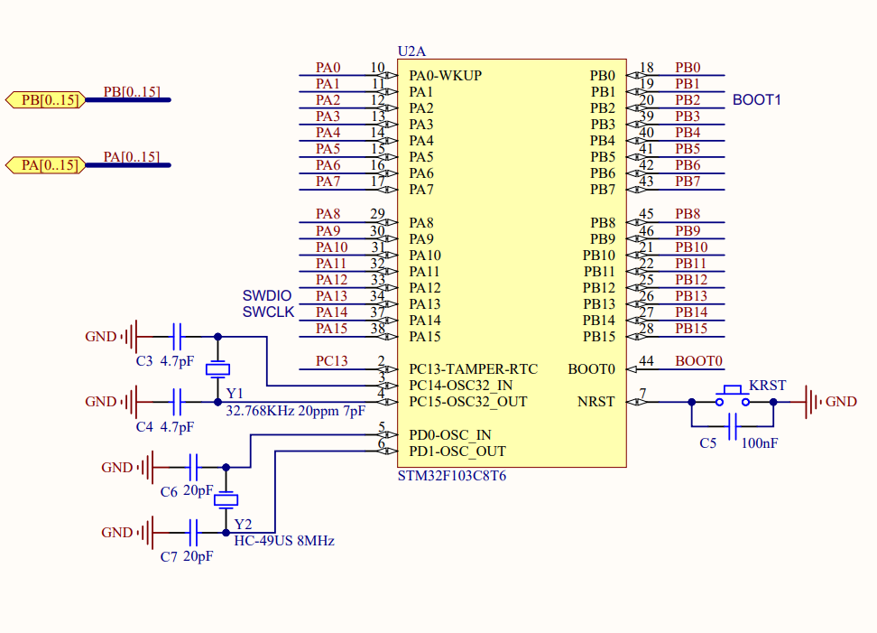
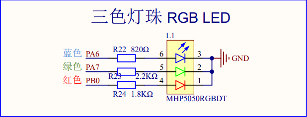
根据电路原理图得知，PA6、PA7、PB0分别与`STM32F103C8T6`的对应端口相连接（端口相连即电路连通）。

## GPIO八大模式：**4种输入**、**4种输出**
### 4 种输入模式 (Input)

主要用于读取传感器信号、按键或外部电平。

| 模式   | 英文名             | 论文/应用场景                | 快速理解                          |
|------|-----------------|------------------------|-------------------------------|
| 浮空输入 | Input Floating  | 用于 I2C、USART 等通信接收端。   | 引脚电压完全由外部决定。没接东西时，数值会乱跳（不稳定）。 |
| 上拉输入 | Input Pull-up   | 最常用。 用于读取按键、霍尔传感器。     | 引脚内部接了个电阻到 VCC。默认高电平，外部接地时变低。 |
| 下拉输入 | Input Pull-down | 用于某些高电平触发的检测电路。        | 引脚内部接电阻到 GND。默认低电平。           |
| 模拟输入 | Analog          | ADC 采集必备。 测电压、测光敏、测电量。 | 关闭所有数字处理，信号直接传给内部 ADC 模块。     |

### 4 种输出模式 (Output)

主要用于驱动 LED、继电器、电机或通信总线。

| 模式   | 英文名           | 论文/应用场景                | 快速理解                             |
|------|---------------|------------------------|----------------------------------|
| 推挽输出 | Push-Pull     | 最常用。 驱动 LED、蜂鸣器、数字通讯。  | 既能输出高电平，也能输出低电平，驱动能力强。           |
| 开漏输出 | Open-Drain    | I2C 总线、电平转换。           | 自己只能输出低。想输出高电平必须在外面接一个上拉电阻。      |
| 复用推挽 | AF Push-Pull  | PWM 波形输出（电机控制）、SPI 通讯。 | 引脚控制权交给了片上外设（如定时器），而不是简单的 0 和 1。 |
| 复用开漏 | AF Open-Drain | I2C 通讯的引脚配置。           | 同样交给外设控制，但具备开漏特性。                |

## 新建工程（后文将不重复此章节）

File→New→STM32 Project
1. 在搜索文本框内输入`F103C8T6`
2. 在搜索出的芯片中选择`F103C8T6`（点击左侧小⭐图标，可在左边栏点击大⭐图标直接选择已收藏的芯片）
3. 点击Next
4. 输入项目名（保持下方Targeted Protect Type选项为STM32Cube）
5. 点击Finish

### 结构说明

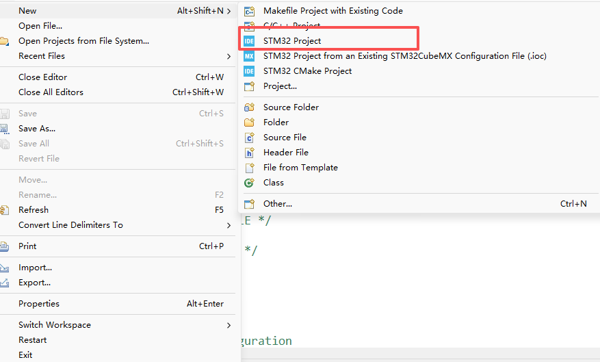
项目结构说明：
- Core：源代码文件夹
	- Src→main.c：项目源代码
- HelloHardware.ioc（xx.ioc）：芯片可视化

### 工具栏介绍


1. 编译源代码
2. 在单片机运行该代码
3. 点击下拉箭头，可在已编译的代码中选择并运行
### 代码编辑说明

编写代码要写在对应BEGIN……END注释块内编写，否则编译后会丢失代码。

## 开发

### 分配引脚

在Pinout&Configuration页面，将 PA6、PA7、PB0 配置为 GPIO_Output，并分别设置 User label 为 BLUE、GREEN、RED
**左键**点击对应的引脚，选择 GPIO_Output；
 
**右键**点击对应的引脚，选择 User label，分别输入 BLUE、GREEN、RED

*配置过引脚后，不要忘记按Ctrl+S保存以使编译器同步代码！*

### 配置GPIO

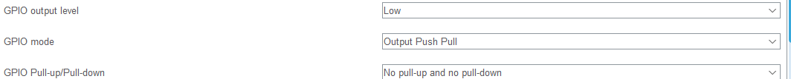
设置初始电平（GPIO output level）：高电平点亮LED，低电平熄灭LED

### 代码编写
```c
HAL_GPIO_WritePin(RED_GPIO_Port, RED_Pin, GPIO_PIN_SET); //红色，点亮  
HAL_GPIO_WritePin(BLUE_GPIO_Port, BLUE_Pin, GPIO_PIN_RESET); //蓝色，熄灭  
HAL_GPIO_WritePin(GREEN_GPIO_Port, GREEN_Pin, GPIO_PIN_RESET); //绿色，熄灭  
HAL_Delay(1000);  
HAL_GPIO_WritePin(RED_GPIO_Port, RED_Pin, GPIO_PIN_RESET); //红色，熄灭  
HAL_GPIO_WritePin(BLUE_GPIO_Port, BLUE_Pin, GPIO_PIN_RESET); //蓝色，熄灭  
HAL_GPIO_WritePin(GREEN_GPIO_Port, GREEN_Pin, GPIO_PIN_SET); //绿色，点亮  
HAL_Delay(1000);  
HAL_GPIO_WritePin(RED_GPIO_Port, RED_Pin, GPIO_PIN_RESET); //红色，熄灭  
HAL_GPIO_WritePin(BLUE_GPIO_Port, BLUE_Pin, GPIO_PIN_SET); //蓝色，点亮  
HAL_GPIO_WritePin(GREEN_GPIO_Port, GREEN_Pin, GPIO_PIN_RESET); //绿色，熄灭  
HAL_Delay(1000);
```
说明：
`HAL_GPIO_WritePin()`函数：设置一组IO口中的一个或者多个IO口的电平状态。
参数列表：`(GPIOx, GPIO_Pin, PinState)`
- `GPIOx`：定义哪组引脚
- `GPIO_Pin`：定义该组下的 某个引脚
- `PinState`：设置引脚电平状态（两个取值：`GPIO_PIN_RESET`低电平；`GPIO_PIN_SET`高电平
`HAL_Delay(Delay)`：设置延迟时间，单位为毫秒

#### 拓展：实现流水灯效果
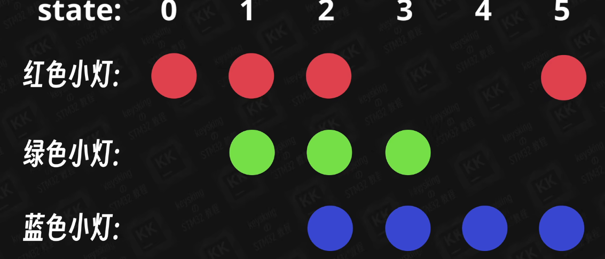

在`while(1)`（永真）循环中写入如下代码：

```c
if (state <= 2 || state == 5) {

HAL_GPIO_WritePin(LED_RED_GPIO_Port, LED_RED_Pin, GPIO_PIN_SET);

} else {

HAL_GPIO_WritePin(LED_RED_GPIO_Port, LED_RED_Pin, GPIO_PIN_RESET);

}

if (state >= 1 || state <= 3) {

HAL_GPIO_WritePin(LED_GREEN_GPIO_Port, LED_GREEN_Pin, GPIO_PIN_SET);

  

} else {

HAL_GPIO_WritePin(LED_GREEN_GPIO_Port, LED_GREEN_Pin,

GPIO_PIN_RESET);

}

if (state >= 2 || state <= 5) {

HAL_GPIO_WritePin(LED_BLUE_GPIO_Port, LED_BLUE_Pin, GPIO_PIN_SET);

} else {

HAL_GPIO_WritePin(LED_BLUE_GPIO_Port, LED_BLUE_Pin, GPIO_PIN_RESET);

}

HAL_Delay(300);

HAL_GPIO_WritePin(GPIOx, GPIO_Pin, PinState)

state++;

if (state >= 5) {

state = 0;

}
```
**别忘了在上方定义state的值：`int state = 0;`**
优化思路：目前使用 `if-else` 逻辑较为繁琐。这种定时切换状态的逻辑可描述为“有限状态机（FSM）”，每一帧 `HAL_Delay` 代表一个状态周期。
```c
switch(state) {
    case 0: // 状态0：红灯亮
        HAL_GPIO_WritePin(LED_RED_GPIO_Port, LED_RED_Pin, GPIO_PIN_SET);
        // ... 其他灯灭
        break;
    case 1: // 状态1：绿灯亮
        // ...
        break;
}
```
# 使用按键点亮LED

## 实现效果

- 按住 KEY1 绿灯亮，松开绿灯熄灭
    
- 按一下 KEY2，蓝灯亮/灭翻转一次
    
- 按一下 KEY3，红灯亮/灭翻转一次

## 识别电路原理图，确认需求

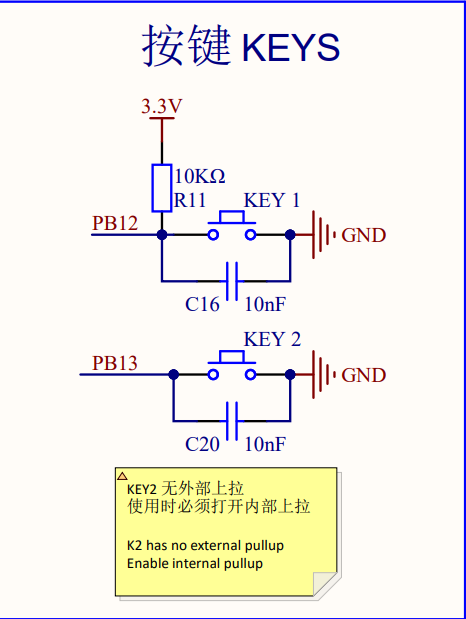

### KEY1未按下时
电容作用：消除抖动
需要将PB12设置为浮空输入模式，使用电源将GPIO口处的电平拉高的操作，称其为**上拉**，又被称为加个上拉电阻
>浮空输入模式：GPIO口内部处于高阻态（芯片内部存在巨大电阻），电阻越大，分压越多。电阻的压降几乎为0V。
>PB12读取的为高电平，3.3V
>上拉电阻：限流，防止电源与GND直接相连而短路


### KEY1按下时

PB12直接与GND连通，相当于导线。PB12读取的电平为低电平，为0V

上拉电路与下拉电路（上拉电路的中的3.3V与GND交换便形成了下拉电路）
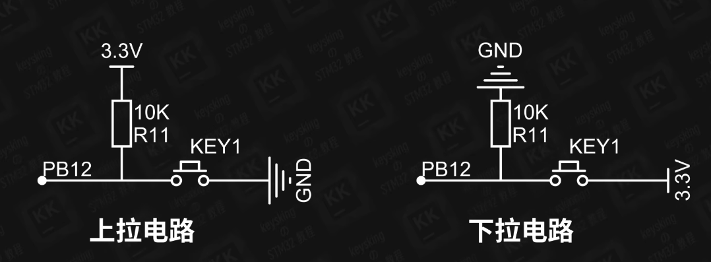

*总结：按键松开→高电平；按键按下：低电平*

## 开发

### 分配引脚
在Pinout&Configuration页面，配置如下引脚
**输出引脚**：将 PA6、PA7、PB0 分别设置为 GPIO_Output，并分别设置 User label 为 BLUE、GREEN、RED
**输入引脚**：将 PB12、PB13、PB15 设置为 GPIO_Input，并分别设置 User label 为 KEY1、KEY2、KEY3
- 左键点击对应的引脚，选择 GPIO_Output 或 GPIO_Input；
- 右键点击对应的引脚，选择 User label，分别输入 BLUE、GREEN、KEY1、KEY2

### 代码编写

#### KEY1部分

```c
HAL_GPIO_ReadPin(KEY1_GPIO_Port, KEY1_Pin); //(GPIO的分组,用户标签) 读KEY1所代表GPIO口的当前电平状态


//如果按钮为低电平（按下状态），则将绿LED设置为高电平（亮）

if (HAL_GPIO_ReadPin(KEY1_GPIO_Port, KEY1_Pin) == GPIO_PIN_RESET) {

HAL_GPIO_WritePin(LED_GREEN_GPIO_Port, LED_GREEN_Pin, GPIO_PIN_SET);

}

else{

HAL_GPIO_WritePin(LED_GREEN_GPIO_Port, LED_GREEN_Pin, GPIO_PIN_RESET);

}
```

说明：
`HAL_GPIO_ReadPin()`：读取指定引脚当前的电平状态
参数列表：`GPIOx, GPIO_Pin`
- `GPIOx`：端口号
- `GPIO_Pin`：引脚号
该函数具有返回值，返回值为高/低电平的枚举，我们可利用这一点做判断

```c
//stm32f1xx_hal_gpio.c
//…………………………
GPIO_PinState HAL_GPIO_ReadPin(GPIO_TypeDef *GPIOx, uint16_t GPIO_Pin)

{

GPIO_PinState bitstatus;

  

/* Check the parameters */

assert_param(IS_GPIO_PIN(GPIO_Pin));

  

if ((GPIOx->IDR & GPIO_Pin) != (uint32_t)GPIO_PIN_RESET)

{

bitstatus = GPIO_PIN_SET;

}

else

{

bitstatus = GPIO_PIN_RESET;

}

return bitstatus;

}
```
从上述代码可以看出，该函数返回值为`GPIO_PinState`类型。而头文件`stm32f1xx_hal_gpio.h`中的`GPIO_PIN_RESET = 0u,GPIO_PIN_SET`正是我们需要的枚举类型。
```c
//stm32f1xx_hal_gpio.h
typedef enum

{

GPIO_PIN_RESET = 0u,

GPIO_PIN_SET

} GPIO_PinState;
```

（PB13的分配引脚省略）
GPIO在芯片内部实现了上拉/下拉（浮空输入模式），根据原理图，PB13需要配备**上拉属性模式**
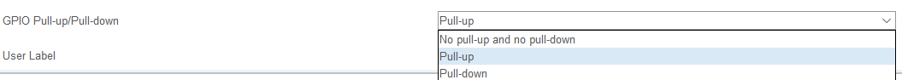

#### KEY2部分
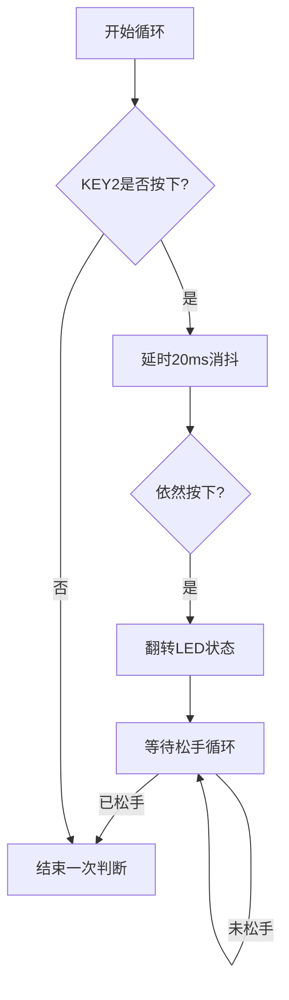
```mermaid
graph TD
    A[开始循环] --> B{KEY2是否按下?}
    B -- 是 --> C[延时20ms消抖]
    C --> D{依然按下?}
    D -- 是 --> E[翻转LED状态]
    E --> F[等待松手循环]
    F -- 未松手 --> F
    F -- 已松手 --> G[结束一次判断]
    B -- 否 --> G
```

```c
HAL_GPIO_ReadPin(KEY1_GPIO_Port, KEY1_Pin); //(GPIO的分组,用户标签) 读KEY1所代表GPIO口的当前电平状态

//利用HAL_GPIO_ReadPin自身携带的返回值枚举做判断

//如果按钮为低电平（按下状态），则将绿LED设置为高电平（亮）

if (HAL_GPIO_ReadPin(KEY1_GPIO_Port, KEY1_Pin) == GPIO_PIN_RESET) {

HAL_GPIO_WritePin(LED_GREEN_GPIO_Port, LED_GREEN_Pin, GPIO_PIN_SET);

} else {

HAL_GPIO_WritePin(LED_GREEN_GPIO_Port, LED_GREEN_Pin,

GPIO_PIN_RESET);

}
//以上是KEY1部分==================================================================

//根据原理图，不按下key2按钮时，KEY2读取高电平，按下读取低电平；并再次读取低电平时就熄灭红色led

if (HAL_GPIO_ReadPin(KEY2_GPIO_Port, KEY2_Pin) == GPIO_PIN_RESET) {

HAL_Delay(10);

//若此时仍然为按下状态，则进行以下步骤

if (HAL_GPIO_ReadPin(KEY2_GPIO_Port, KEY2_Pin) == GPIO_PIN_RESET) {

HAL_GPIO_WritePin(LED_RED_GPIO_Port, LED_RED_Pin, GPIO_PIN_SET);

HAL_GPIO_TogglePin(LED_RED_GPIO_Port, LED_RED_Pin);

//实际的小灯如果直写到上面会出现紊乱的问题，

//原因：按键从按下后，就一直在重复亮/灭的状态。需要以下代码解决：

while (HAL_GPIO_ReadPin(KEY2_GPIO_Port, KEY2_Pin)

== GPIO_PIN_RESET) {}

}
```

`HAL_Delay(10);`作用：在实际的硬件中，可能按键的物理回弹性能不够好，可能也会触发抖动，加入此行代码为软件消抖

`HAL_GPIO_TogglePin()：翻转GPIO口输出的电平
参数列表：`GPIOx`, `GPIO_Pin`
- `GPIOx`：端口号
- `GPIO_Pin`：引脚号

#### KEY3部分

- **按键松开（默认）** $\rightarrow$ 电路断开 $\rightarrow$ 上拉电阻起作用 $\rightarrow$ 引脚 = **3.3V (High)** $\rightarrow$ `ReadPin` 返回 `1`。
- **按键按下（触发）** $\rightarrow$ 电路接通 GND $\rightarrow$ 引脚 = **0V (Low)** $\rightarrow$ `ReadPin` 返回 `0`。

```c
if (HAL_GPIO_ReadPin(KEY3_GPIO_Port, KEY3_Pin)

== GPIO_PIN_RESET) {

//消抖：50ms

HAL_Delay(50);

if (!HAL_GPIO_ReadPin(KEY3_GPIO_Port, KEY3_Pin)) {

HAL_GPIO_TogglePin(LED_RED_GPIO_Port, LED_RED_Pin);

//等待Key3松开

while (!HAL_GPIO_ReadPin(KEY3_GPIO_Port, KEY3_Pin)) {

}

}

}
```

| 步骤  | 代码行                              | 动作描述 | 目的                                          |
| --- | -------------------------------- | ---- | ------------------------------------------- |
| 第一步 | `if (!HAL_GPIO_ReadPin(...))`    | 初步侦测 | 看看按键是不是被按下去了（探测到低电平）。                       |
| 第二步 | `HAL_Delay(50);`                 | 滤除噪声 | 硬核消抖。等待 50ms，跨越机械按键所有的物理抖动时间。               |
| 第三步 | `if (!HAL_GPIO_ReadPin(...))`    | 二次确认 | 50ms 后如果还是低电平，说明这绝对不是静电或杂波，而是真的按下了。         |
| 第四步 | `HAL_GPIO_TogglePin(...)`        | 执行动作 | 状态翻转。亮变灭，灭变亮。                               |
| 第五步 | `while (!HAL_GPIO_ReadPin(...))` | 死等松手 | 只要按键没松开（还是 0），程序就卡在这里。防止你按住不放时，灯像闪光灯一样疯狂翻转。 |


# GPIO内部电路原理


## I/O引脚与保护二极管
因芯片内部电路承受的电压有限，从I/O引脚（实物图中的”铜丝“）向里（左侧）有两个保护二极管，当瞬间电压波动进入I/O引脚时，电压大于3.3V（记作$V_{DD}$，即电源正极）时，上方的保护二极管导通，将电压引入电源，由电源吸收；电压小于0V（$V_{SS}$\[0V\]，即电源负极）时，下方保护二极管接通，电压进入GND。（*这个结构可以短暂抵御，若较长时间接入较高的电压，则芯片也会损坏。）*
有一部分的I/O口可以做到”5V容忍[4. 引脚耐压与保护 (Pin Tolerance)](#4.%20引脚耐压与保护%20(Pin%20Tolerance))”（可承受5V电压作为高电平输入）。这种I/O口的电压为5V
* 打开芯片手册的方法：在芯片选择页面选择Datasheet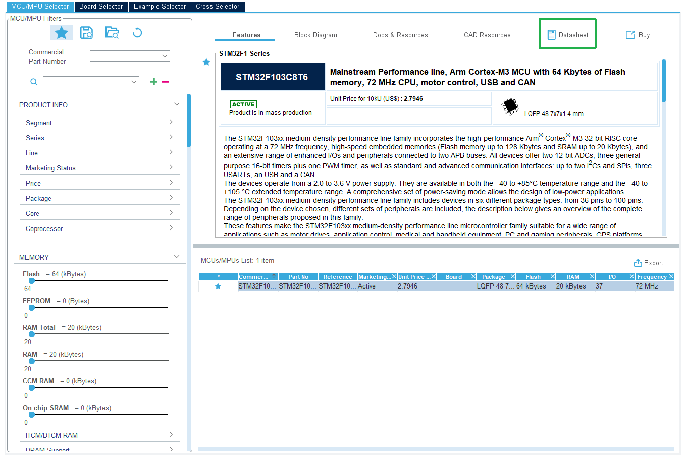，这样一张表，等待下载
* 下载后，找`Pin definitions` 表格，I/O level一列为FT的引脚，便为5V容忍引脚
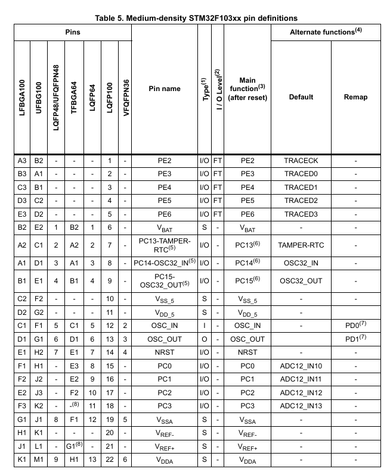
## xx寄存器（特定功能的内存单元）

> 在 STM32 中，所有代码最终都是在操作内存中特定地址的 32 位二进制开关。
> 程序与硬件电路连接的桥梁
> 

STM32F103 是 32 位单片机，它的寄存器（如 `BSRR`、`ODR`）就像一排排有 32 个槽位的开关盒。每一个位（Bit）都通过物理电路直接连接到芯片内部的逻辑门。
以 **GPIOA_BSRR** (Port Bit Set/Reset Register) 为例：
- **前 16 位 (0-15 bit)**：负责把引脚变高电平（Set）。
- **后 16 位 (16-31 bit)**：负责把引脚变低电平（Reset）。
按照每32位二进制`01`数据为一组，存储电路的开关信息。例如GPIOx_BSRR、GPIOx BRR、
GPIOx_ODR→GPIOx引脚高低电平输出，掌管GPIOA一组16个GPIO口的输出，使用`HAL_GPIO_WritePin`函数设置PA7为高电平`HAL_GPIO_WritePin(GPIOA,GPIO_PIN_7,GPIO_PIN_SET);`时，实际上就是将GPIOA_BSRR的第7位设置为了1
```c
void HAL_GPIO_WritePin(GPIO_TypeDef *GPIOx, uint16_t GPIO_Pin, GPIO_PinState PinState)
/* Check the parameters */
assert_param(IS_GPIO_PIN(GPIO_Pin) ) ;
assert _param(IS _GPIO_PIN _ACTION(PinState)) ;
if (PinState != GPIO PIN RESET){
GPIOx->BSRR = GPIO_Pin;
}

else{
GPIOx->BSRR = (uint32_t)GPIO_Pin << 16u;
}

```

## 输出驱动器

P-MOS和N-MOS：作用可简化为被控制的开关。
### 补充：MOS管的“开关性格”
- **N-MOS (下管)**：高电平驱动。负责把引脚“拉”到地（GND），实现低电平输出。
- **P-MOS (上管)**：低电平驱动。负责把引脚“推”向电源（VDD），实现高电平输出。
- **协同作业**：两者永远保持“一开一关”，防止电源和地直接打架（短路）。
STM32的输出分为两类：推挽输出和开漏输出

### 推挽输出

例：I/O口接了普通小灯（3.3V），小灯另一端为GND，小灯工作电压为3.3V，可以使用推挽输出。在此模式下P-MOS和N-MOS协同工作，使用`HAL_GPIO_WritePin`函数控制此I/O口输出高电平，函数内部对寄存器数据发生了改变，导致P-MOS激活，N-MOS关闭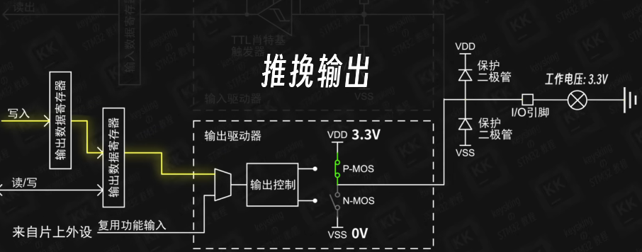，$V_{DD}$与I/O引脚连通，输出高电平，小灯亮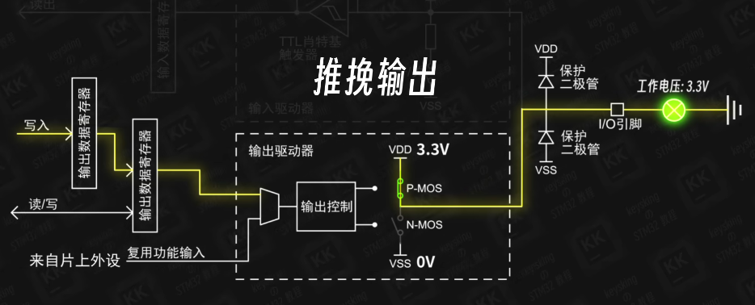；若控制I/O口输出低电平时，情况相反，P-MOS关闭，N-MOS激活，$V_{SS}$与I/O引脚连通，对外输出0V低电平，没有电流产生，小灯不亮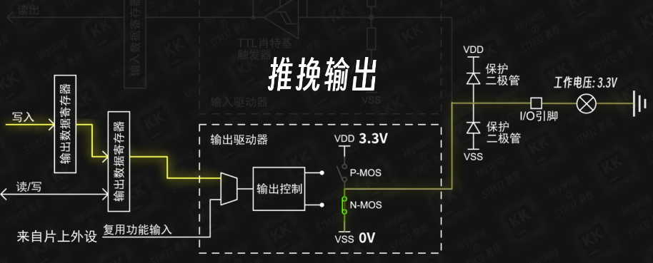
该输出具有一定的电压与电流驱动能力，可直接驱动一些合适的元件工作，但个别元件需要更高或者更低的电压驱动。

例如小灯工作电压为5V，推挽输出提供的3.3V高电平就无法驱动了，此时需要使用开漏输出模式

### 开漏输出

在上面的例子中，开漏输出模式只有N-MOS工作，P-MOS一直处于断开状态。使用`HAL_GPIO_WritePin`函数控制此I/O口输出高电平，整个I/O口内部处于高阻态（“断路”），不对外输出特定的电平信号，小灯不亮；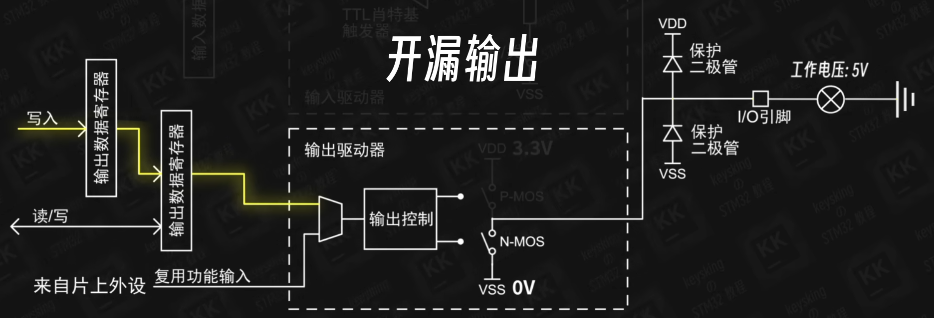若控制I/O口输出低电平时，N-MOS激活，I/O引脚与$V_{SS}$连接，小灯两端都是0V，也不会亮起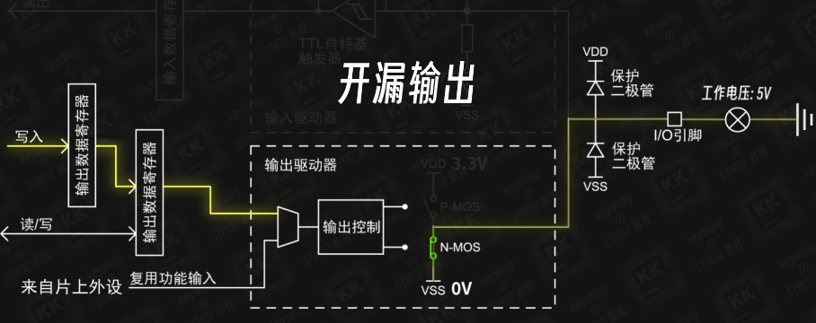。但是将GND改为从外部输入的5V（在实际电路设计中，这通常表现为接一个 **上拉电阻（Pull-up Resistor）**），电压差形成，电流产生，小灯亮起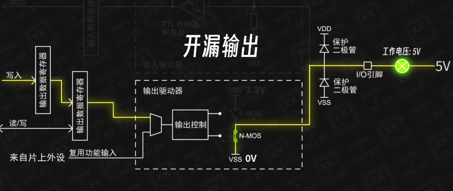。再让I/O口输出高电平，也就是N-MOS断开，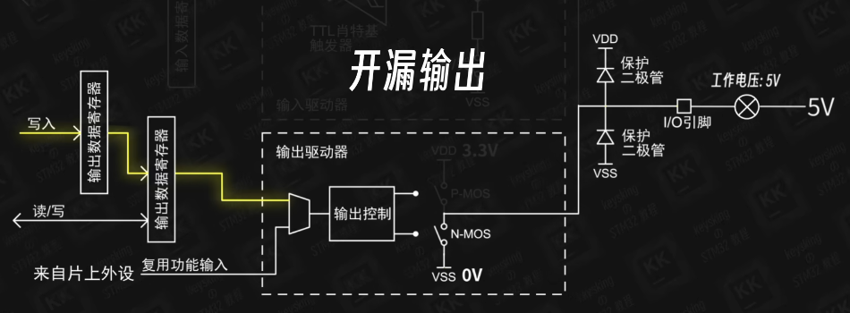仍然产生断路，无法产生电流，小灯熄灭。

### 开漏输出与推免输出的对比
推挽输出时，小灯由来自芯片的电压驱动，开漏输出不能驱动，必须依靠外部电压源驱动。
*需要使用支持5V容忍的I/O口，避免将保护二极管导入电路中造成损坏。*

|     | 推挽输出                   | 开漏输出                      |
| --- | ---------------------- | ------------------------- |
| 高电平 | P-MOS激活N-MOS断开<br>3.3V | P-MOS断开N-MOS断开<br>由外部电路决定 |
| 低电平 | P-MOS断开N-MOS激活<br>0V   | P-MOS断开N-MOS激活<br>0V      |
| 优点  | 可以直接输出3.3V             | 配合外部电路更加灵活                |
| 缺点  | 只能输出3.3V               | 高电平实际是高阻态无法输出电流           |

对于输出控制模块来说，有两个控制指令来源，①使用`HAL_GPIO_WritePin`函数控制的输出寄存器；②片上外设（例如串口模块、$I^2C$模块等）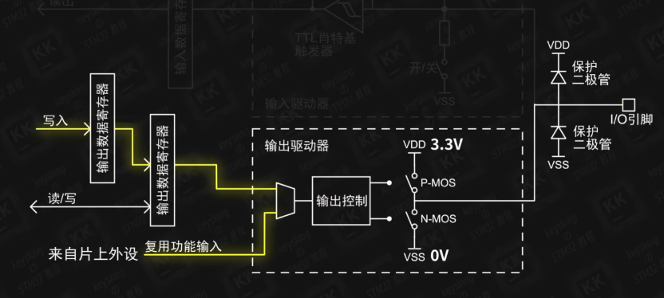。由于避免混乱，根据控制来源的不同，STM32将输出模式细分为普通的推挽输出与开漏输出、复用推挽输出与复用开漏输出。在复用模式下，调用 `HAL_GPIO_WritePin` 是**无效**的，因为引脚的“方向盘”已经交给了外设（如定时器或串口）。

## 输入控制器

外部输入的电流从I/O引脚进入以后，先经过上拉、下拉电阻，设置上拉输入时，上拉电阻启用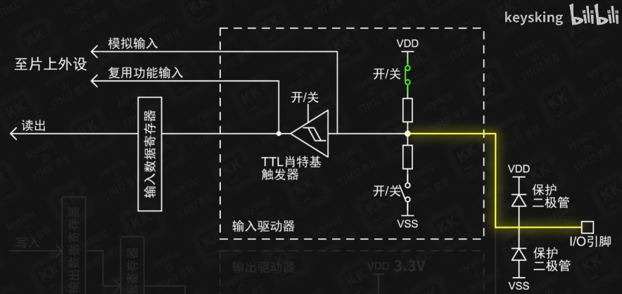，
设置下拉输入时，下拉电阻启用；设置浮空输入时，两个电阻都不会启用。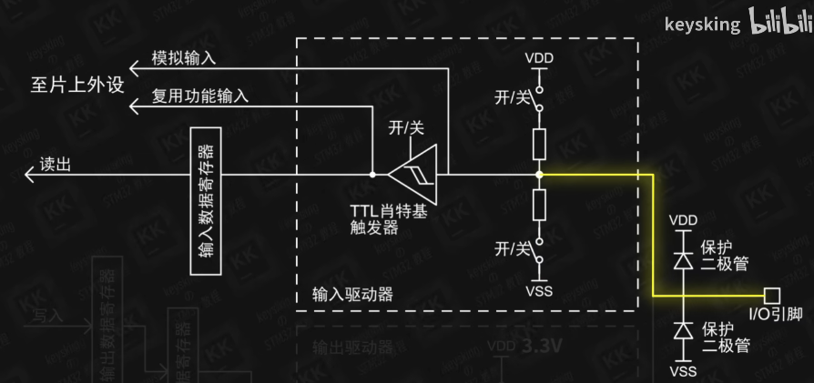继续前进，电流会与肖特基触发器/施密特触发器，作用是稳定电平。由于外部输入的电压可能不稳定，并不总能达到标准的3.3V或0V，此时可简单地规定一个参考电压（例如1.65V），高于此电压就算高电平，低于此电压就算低电平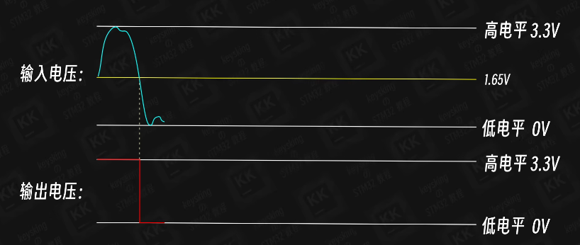。此时接入一个比较器就可实现效果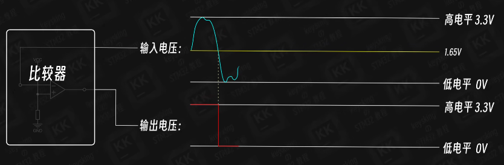。但是输入电压中噪声较多，在参考电压附近徘徊，则会导致高低电平快速变化无法准确测当前电平。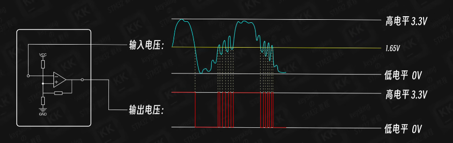对比较器稍加改造形成施密特触发器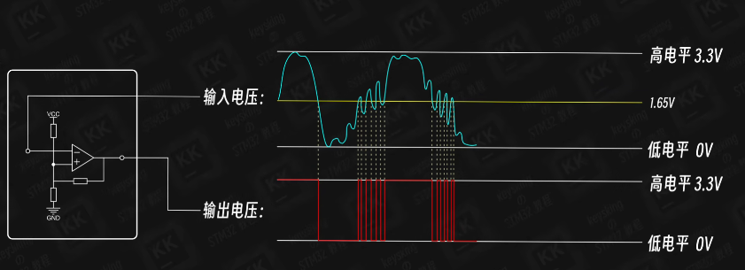，就会产生两个参考电压，当输入电压高于高参考电压则输出高电平，低于低参考电压则输出低电平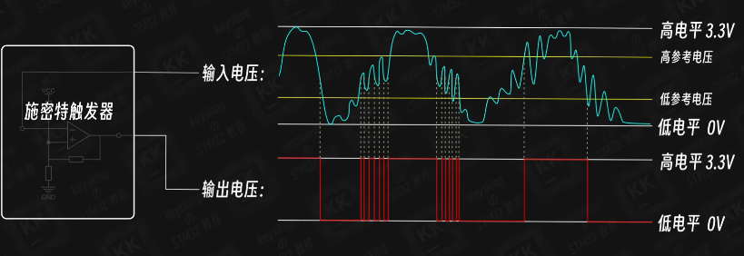。在二者之间，则保持原本的电平信号不变。最后，经过施密特触发器处理后的电平信号被写入输入数据寄存器，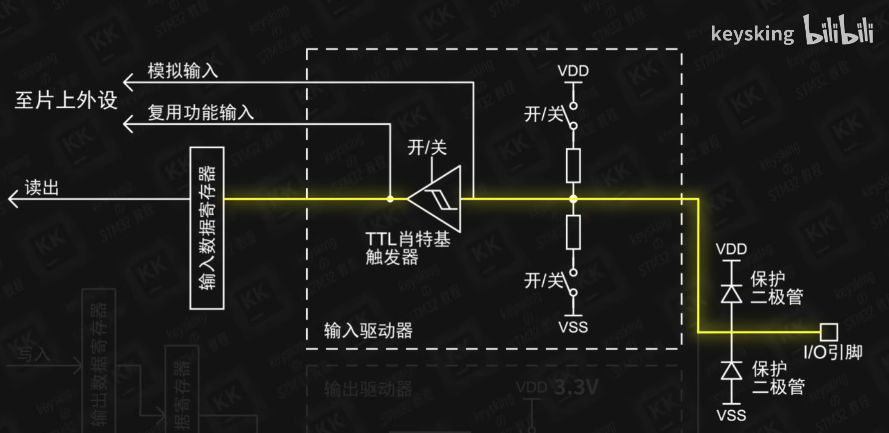等待使用`HAL_GPIO_ReadPin`函数对寄存器进行读取。
主线路上存在两条分支，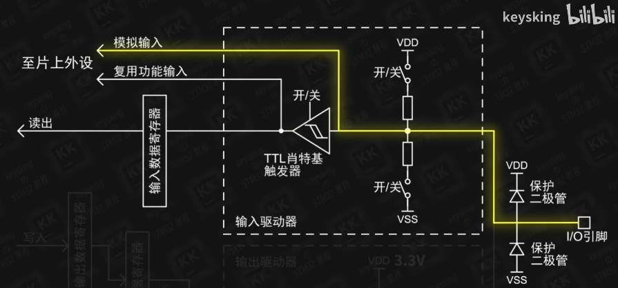一条通向了模拟输入。浮空、上拉、下拉这三种输入模式都是仅读取了高低电平（即数字信号，统称为数字输入），模拟输入则是读取输入电压的具体数值，在施密特触发器前就有了分支，将电压引入了模拟输入相关的片上外设；另一条分支在施密特触发器后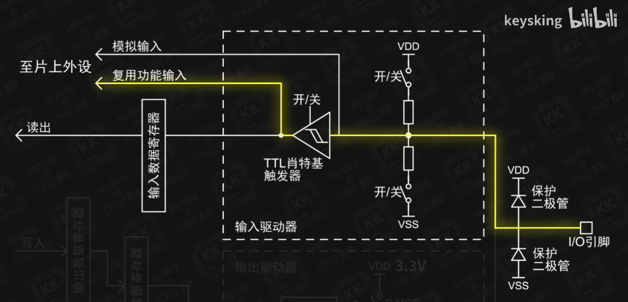，接入了像串口模块等需要输入的片上外设。与输出部分只能有一个控制源不同的是，输入部分的不同分支可同时读取施密特触发器的输出，就没有出现复用、上拉输入等模式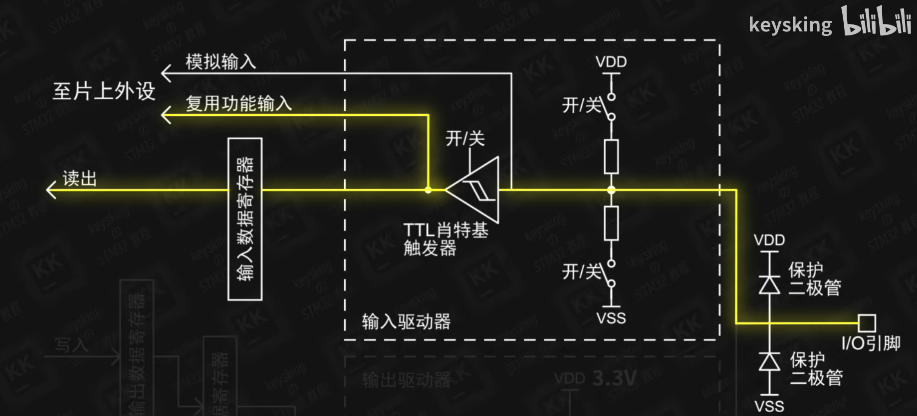，而是在片上外设上也使用普通的输入模式即可。

#### > [!CHECKLIST] 输入模式选用指南
> 1. **接按键**：必须选 **上拉/下拉**（给引脚一个默认立场）。
> 2. **接 5V 芯片信号**：选 **浮空输入**（前提是对方芯片有驱动能力，且引脚标有 FT）。
> 3. **测具体电压值**：必须选 **模拟输入**（为了不让内部电阻干扰传感器）。
> 4. **省电大法**：所有不用的引脚，通通设为 **模拟输入**（切断所有内部开关）。

# 中断（1）

> 打断正常工作流程去处理的任务，被称为“中断”。

## 中断类型

### 指令出错

### 定时器结束

### 串口接收数据

### GPIO电平变化（外部中断/EXTI)

>需求：红色小灯以4秒为周期循环闪烁（亮两秒灭两秒），当KEY1按下时，绿色小灯要翻转亮灭状态


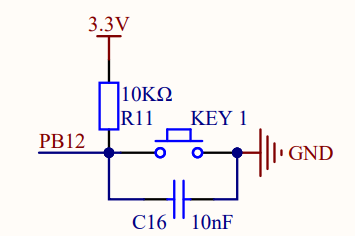
查看原理图，将PA7和PB0都标注上GPIO_Output并输入标签，代表按键KEY1的PB12设置为GPIO_Input

```c
while (1)

{

//红色小灯以4秒为周期循环闪烁

HAL_GPIO_WritePin(RED_LED_GPIO_Port, RED_LED_Pin, GPIO_PIN_SET);

HAL_Delay(2000);

HAL_GPIO_WritePin(RED_LED_GPIO_Port, RED_LED_Pin, GPIO_PIN_RESET);

HAL_Delay(2000);

//当KEY1按下时，绿色小灯要翻转亮灭状态

if(HAL_GPIO_ReadPin(KEY1_GPIO_Port,KEY1_Pin) == GPIO_PIN_RESET){

HAL_GPIO_TogglePin(GREEN_LED_GPIO_Port, GREEN_LED_Pin);

while(HAL_GPIO_ReadPin(KEY1_GPIO_Port,KEY1_Pin) == GPIO_PIN_RESET);

}
```

上面的代码不能如期工作，原因：

- `HAL_Delay(2000);`会延迟等待设定好的时间再执行下面代码，每次循环都要等待2+2=4秒才会执行一次判断的代码，且按键判断瞬间结束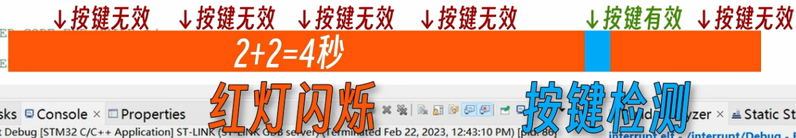

修改：将PB12从GPIO_Input修改为GPIO_EXTI12（第12号中断线），设置后需要重新设置标签，在左侧的PB12 Configuration继续设置GPIO_mode，前三个与中断有关，分别是：上升沿触发中断、下降沿触发中断、上升沿下降沿都触发中断
* 上升沿：某个GPIO口读取到的电平从低电平变到了高电平
* 下降沿：某个GPIO口读取到的电平从高电平变到了低电平
由于[KEY1按下时](#KEY1按下时)，PB12读取低电平，在按下瞬间，必然有个从高电平到低电平的变化，即下降沿
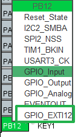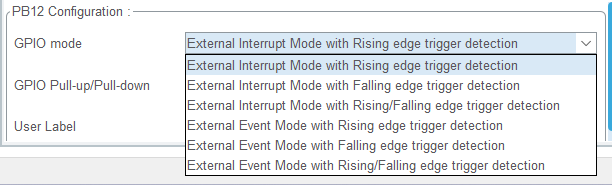
继续设置NVIC（中断控制器）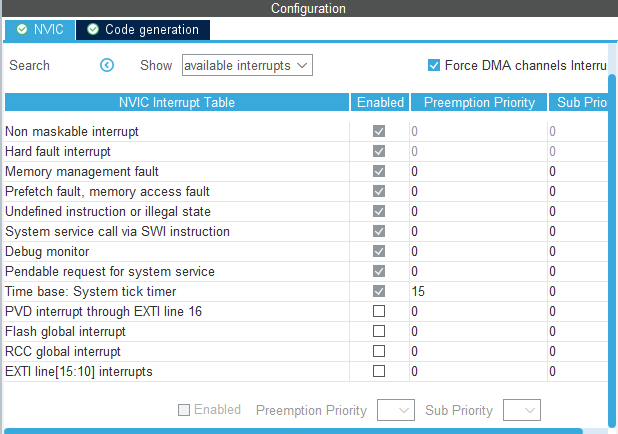，勾选开启中断向量EXTI15_10，Ctrl+S保存并生成代码。 
重新编写代码：
- 删掉旧按键判断代码
- 在Core/Src文件夹找`stm32l1xx_it.c`文件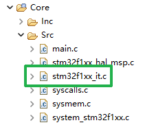（后缀`it`表示与中断有关）
- 该文件底部有个IDE生成的函数，该函数就是按下按键触发中断后，STM32会调用执行的中断处理函数
```c
void EXTI15_10_IRQHandler(void)

{

/* USER CODE BEGIN EXTI15_10_IRQn 0 */

  

/* USER CODE END EXTI15_10_IRQn 0 */

HAL_GPIO_EXTI_IRQHandler(KEY1_Pin);

/* USER CODE BEGIN EXTI15_10_IRQn 1 */

  

/* USER CODE END EXTI15_10_IRQn 1 */

}
```
- 需要在此处写绿色小灯反转亮灭的代码

	```c
	void EXTI15_10_IRQHandler(void)

{

/* USER CODE BEGIN EXTI15_10_IRQn 0 */

  

HAL_GPIO_TogglePin(GREEN_LED_GPIO_Port, GREEN_LED_Pin);

/* USER CODE END EXTI15_10_IRQn 0 */

HAL_GPIO_EXTI_IRQHandler(KEY1_Pin);

/* USER CODE BEGIN EXTI15_10_IRQn 1 */

  

/* USER CODE END EXTI15_10_IRQn 1 */

}
	```

- 实践发现仍存在小问题：存在按键按下后，绿色小灯并没有反转的情况

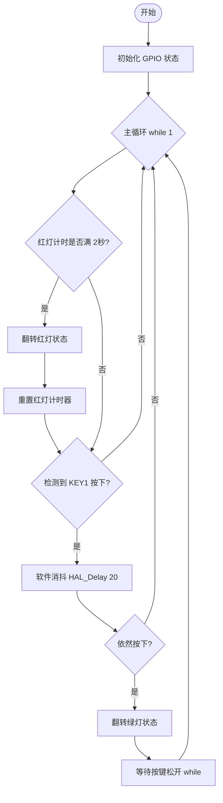
```mermaid
  graph TD
    Start([开始]) --> Init[初始化 GPIO 状态]
    Init --> Loop{主循环 while 1}
    
    %% 红灯计时逻辑
    Loop --> CheckTime{红灯计时是否满 2秒?}
    CheckTime -- 是 --> ToggleRed[翻转红灯状态]
    ToggleRed --> ResetTimer[重置红灯计时器]
    ResetTimer --> CheckKey
    CheckTime -- 否 --> CheckKey
    
    %% 按键检测逻辑
    CheckKey{检测到 KEY1 按下?}
    CheckKey -- 是 --> Debounce[软件消抖 HAL_Delay 20]
    Debounce --> ReCheck{依然按下?}
    ReCheck -- 是 --> ToggleGreen[翻转绿灯状态]
    ToggleGreen --> WaitRelease[等待按键松开 while]
    WaitRelease --> Loop
    ReCheck -- 否 --> Loop
    CheckKey -- 否 --> Loop
```
