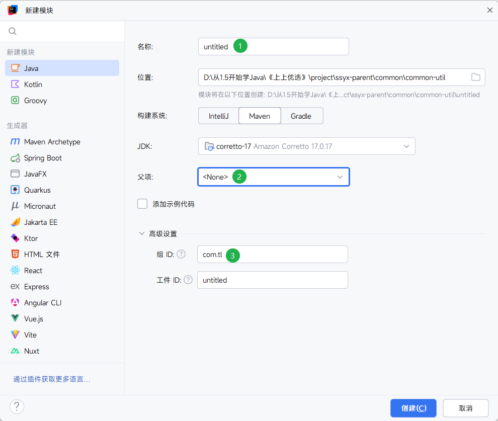
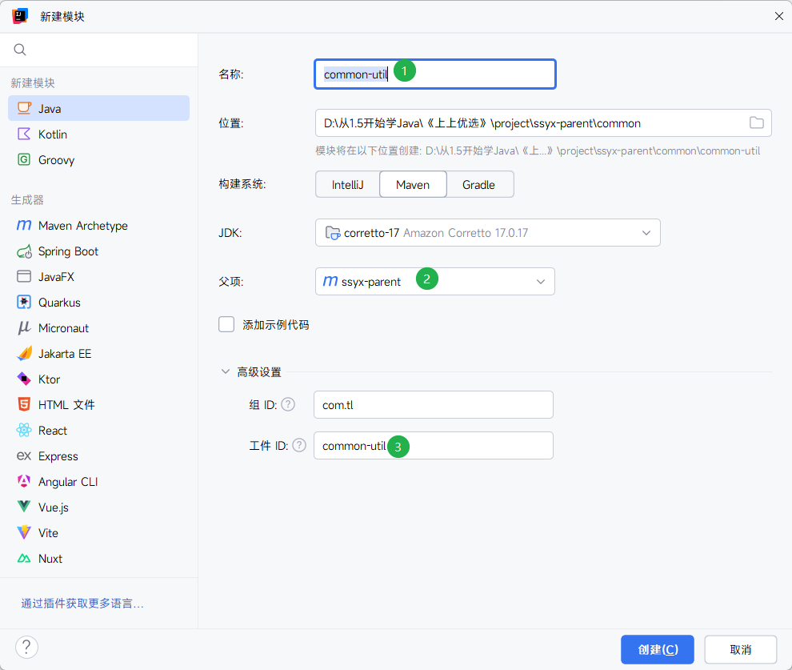
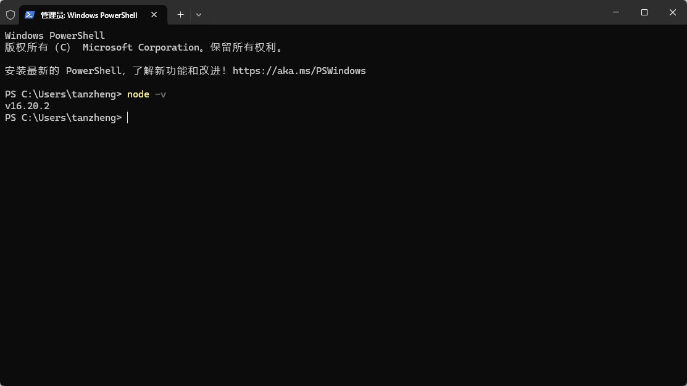

# 尚上优选
## 创建前端环境

### 创建父模块及子模块

#### 父模块




#### 子模块



### 配置依赖`pom.xml`

#### `common`

```xml
<?xml version="1.0" encoding="UTF-8"?>  
<project xmlns="http://maven.apache.org/POM/4.0.0"  
         xmlns:xsi="http://www.w3.org/2001/XMLSchema-instance"  
         xsi:schemaLocation="http://maven.apache.org/POM/4.0.0 http://maven.apache.org/xsd/maven-4.0.0.xsd">  
    <modelVersion>4.0.0</modelVersion>  
    <parent>  
        <groupId>com.tl</groupId>  
        <artifactId>ssyx-parent</artifactId>  
        <version>1.0-SNAPSHOT</version>  
    </parent>  
  
    <artifactId>common</artifactId>  
    <packaging>pom</packaging>  
    <modules>  
        <module>common-util</module>  
        <module>service-util</module>  
    </modules>  
    <dependencies>  
    <dependency>  
        <groupId>org.springframework.boot</groupId>  
        <artifactId>spring-boot-starter-web</artifactId>  
        <scope>provided </scope>  
    </dependency>  
  
        <!--lombok用来简化实体类：需要安装lombok插件-->  
        <dependency>  
            <groupId>org.projectlombok</groupId>  
            <artifactId>lombok</artifactId>  
        </dependency>  
        <!-- https://doc.xiaominfo.com/knife4j/documentation/ -->  
        <dependency>  
            <groupId>com.github.xiaoymin</groupId>  
            <artifactId>knife4j-spring-boot-starter</artifactId>  
        </dependency>  
  
        <!--用来转换json使用 {JavaObject - json | json - JavaObject}-->        <dependency>  
            <groupId>com.alibaba</groupId>  
            <artifactId>fastjson</artifactId>  
        </dependency>  
  
        <!-- 服务调用feign -->  
        <dependency>  
            <groupId>org.springframework.cloud</groupId>  
            <artifactId>spring-cloud-starter-openfeign</artifactId>  
            <scope>provided </scope>  
        </dependency>  
  
    </dependencies>  
  
</project>
```

#### `common-util`
```xml
<?xml version="1.0" encoding="UTF-8"?>  
<project xmlns="http://maven.apache.org/POM/4.0.0"  
         xmlns:xsi="http://www.w3.org/2001/XMLSchema-instance"  
         xsi:schemaLocation="http://maven.apache.org/POM/4.0.0 http://maven.apache.org/xsd/maven-4.0.0.xsd">  
    <modelVersion>4.0.0</modelVersion>  
    <parent>  
        <groupId>com.tl</groupId>  
        <artifactId>common</artifactId>  
        <version>1.0-SNAPSHOT</version>  
    </parent>  
  
    <artifactId>common-util</artifactId>  
  
    <properties>  
        <maven.compiler.source>17</maven.compiler.source>  
        <maven.compiler.target>17</maven.compiler.target>  
        <project.build.sourceEncoding>UTF-8</project.build.sourceEncoding>  
    </properties>  
  
    <!--添加依赖-->  
    <dependencies>  
        <dependency>  
            <groupId>org.apache.httpcomponents</groupId>  
            <artifactId>httpclient</artifactId>  
        </dependency>  
  
        <dependency>  
            <groupId>io.jsonwebtoken</groupId>  
            <artifactId>jjwt</artifactId>  
        </dependency>  
  
        <dependency>  
            <groupId>joda-time</groupId>  
            <artifactId>joda-time</artifactId>  
        </dependency>  
  
    </dependencies>  
  
</project>
```
#### `service-util`

```xml
<?xml version="1.0" encoding="UTF-8"?>  
<project xmlns="http://maven.apache.org/POM/4.0.0"  
         xmlns:xsi="http://www.w3.org/2001/XMLSchema-instance"  
         xsi:schemaLocation="http://maven.apache.org/POM/4.0.0 http://maven.apache.org/xsd/maven-4.0.0.xsd">  
    <modelVersion>4.0.0</modelVersion>  
    <parent>  
        <groupId>com.tl</groupId>  
        <artifactId>common</artifactId>  
        <version>1.0-SNAPSHOT</version>  
    </parent>  
  
    <artifactId>service-util</artifactId>  
  
    <properties>  
        <maven.compiler.source>17</maven.compiler.source>  
        <maven.compiler.target>17</maven.compiler.target>  
        <project.build.sourceEncoding>UTF-8</project.build.sourceEncoding>  
    </properties>  
    <dependencies>  
    <dependency>  
        <groupId>com.tl</groupId>  
        <artifactId>common-util</artifactId>  
        <version>1.0-SNAPSHOT</version>  
    </dependency>  
  
    <!-- redis -->  
    <dependency>  
        <groupId>org.springframework.boot</groupId>  
        <artifactId>spring-boot-starter-data-redis</artifactId>  
    </dependency>  
  
    <!-- spring2.X集成redis所需common-pool2-->  
    <dependency>  
        <groupId>org.apache.commons</groupId>  
        <artifactId>commons-pool2</artifactId>  
        <version>2.6.0</version>  
    </dependency>  
  
    <!-- redisson 分布式锁-->  
    <dependency>  
        <groupId>org.redisson</groupId>  
        <artifactId>redisson</artifactId>  
        <version>3.11.2</version>  
    </dependency>  
  
    <!--mybatis-plus-->  
    <dependency>  
        <groupId>com.baomidou</groupId>  
        <artifactId>mybatis-plus-boot-starter</artifactId>  
        <scope>provided</scope>  
    </dependency>  
  
    </dependencies>  
  
</project>
```

#### `model`

```xml
<?xml version="1.0" encoding="UTF-8"?>  
<project xmlns="http://maven.apache.org/POM/4.0.0"  
         xmlns:xsi="http://www.w3.org/2001/XMLSchema-instance"  
         xsi:schemaLocation="http://maven.apache.org/POM/4.0.0 http://maven.apache.org/xsd/maven-4.0.0.xsd">  
    <modelVersion>4.0.0</modelVersion>  
    <parent>  
        <groupId>com.tl</groupId>  
        <artifactId>ssyx-parent</artifactId>  
        <version>1.0-SNAPSHOT</version>  
    </parent>  
  
    <artifactId>model</artifactId>  
  
    <properties>  
        <maven.compiler.source>17</maven.compiler.source>  
        <maven.compiler.target>17</maven.compiler.target>  
        <project.build.sourceEncoding>UTF-8</project.build.sourceEncoding>  
    </properties>  
  
    <dependencies>  
        <dependency>  
            <groupId>org.projectlombok</groupId>  
            <artifactId>lombok</artifactId>  
        </dependency>  
  
        <!--mybatis-plus-->  
        <dependency>  
            <groupId>com.baomidou</groupId>  
            <artifactId>mybatis-plus-boot-starter</artifactId>  
            <scope>provided </scope>  
        </dependency>  
  
        <dependency>  
            <groupId>com.github.xiaoymin</groupId>  
            <artifactId>knife4j-spring-boot-starter</artifactId>  
            <!--在引用时请在maven中央仓库搜索2.X最新版本号-->  
            <scope>provided</scope>  
        </dependency>  
  
        <dependency>  
            <groupId>org.springframework.boot</groupId>  
            <artifactId>spring-boot-starter-data-mongodb</artifactId>  
            <scope>provided </scope>  
        </dependency>  
  
        <dependency>  
            <groupId>com.alibaba</groupId>  
            <artifactId>fastjson</artifactId>  
            <scope>provided </scope>  
        </dependency>  
  
        <!--创建索引库的-->  
        <dependency>  
            <groupId>org.springframework.boot</groupId>  
            <artifactId>spring-boot-starter-data-elasticsearch</artifactId>  
            <scope>provided </scope>  
        </dependency>  
    </dependencies>  
</project>
```
#### `service`
```xml
<?xml version="1.0" encoding="UTF-8"?>  
<project xmlns="http://maven.apache.org/POM/4.0.0"  
         xmlns:xsi="http://www.w3.org/2001/XMLSchema-instance"  
         xsi:schemaLocation="http://maven.apache.org/POM/4.0.0 http://maven.apache.org/xsd/maven-4.0.0.xsd">  
    <modelVersion>4.0.0</modelVersion>  
    <parent>  
        <groupId>com.tl</groupId>  
        <artifactId>ssyx-parent</artifactId>  
        <version>1.0-SNAPSHOT</version>  
    </parent>  
  
    <artifactId>service</artifactId>  
  
    <properties>  
        <maven.compiler.source>17</maven.compiler.source>  
        <maven.compiler.target>17</maven.compiler.target>  
        <project.build.sourceEncoding>UTF-8</project.build.sourceEncoding>  
    </properties>  
    <dependencies>  
        <!--依赖服务的工具类-->  
        <dependency>  
            <groupId>com.tl</groupId>  
            <artifactId>service-util</artifactId>  
            <version>1.0-SNAPSHOT</version>  
        </dependency>  
        <!--数据载体-->  
        <dependency>  
            <groupId>com.tl</groupId>  
            <artifactId>model</artifactId>  
            <version>1.0-SNAPSHOT</version>  
        </dependency>  
  
        <!--web 需要启动项目-->  
        <dependency>  
            <groupId>org.springframework.boot</groupId>  
            <artifactId>spring-boot-starter-web</artifactId>  
        </dependency>  
  
        <!--mybatis-plus-->  
        <dependency>  
            <groupId>com.baomidou</groupId>  
            <artifactId>mybatis-plus-boot-starter</artifactId>  
        </dependency>  
  
        <!--mysql-->  
        <dependency>  
            <groupId>mysql</groupId>  
            <artifactId>mysql-connector-java</artifactId>  
        </dependency>  
  
        <!-- 服务注册 -->  
        <dependency>  
            <groupId>com.alibaba.cloud</groupId>  
            <artifactId>spring-cloud-starter-alibaba-nacos-discovery</artifactId>  
        </dependency>  
  
        <!-- 服务调用feign -->  
        <dependency>  
            <groupId>org.springframework.cloud</groupId>  
            <artifactId>spring-cloud-starter-openfeign</artifactId>  
        </dependency>  
  
        <!-- 流量控制 -->  
        <dependency>  
            <groupId>com.alibaba.cloud</groupId>  
            <artifactId>spring-cloud-starter-alibaba-sentinel</artifactId>  
        </dependency>  
  
        <!--开发者工具-->  
        <dependency>  
            <groupId>org.springframework.boot</groupId>  
            <artifactId>spring-boot-devtools</artifactId>  
            <optional>true</optional>  
        </dependency>  
    </dependencies>  
  
  
</project>
```

### 创建相关工具类

#### 编写MybatisPlus配置类

> **MyBatis-Plus**（简称 MP）是一个**MyBatis的增强工具**，在 MyBatis 的基础上只做增强不做改变，为简化开发、提高效率而生。只需简单配置即可快速进行**单表的CURD操作**，同时提供了**自动分页，代码生成，逻辑删除**等丰富的功能。[#MyBatis-Plus教程](obsidian://open?vault=sliver_note&file=Java%E8%AF%AD%E8%A8%80%2FMyBatis-plus)

核心是两步：**（1）配置Mapper扫描**；**（2）配置MyBatisPlus分页插件**

```java
package com.tl.ssyx.common.config;  
  
import com.baomidou.mybatisplus.annotation.DbType;  
import com.baomidou.mybatisplus.extension.plugins.MybatisPlusInterceptor;  
import com.baomidou.mybatisplus.extension.plugins.inner.PaginationInnerInterceptor;  
import org.mybatis.spring.annotation.MapperScan;  
import org.springframework.context.annotation.Bean;  
import org.springframework.context.annotation.Configuration;  
  
@Configuration  
@MapperScan("com.tl.ssyx.*.mapper") //配置Mapper扫描  
public class MybatisPlusConfig {  
  
    /**  
     * mp插件  
     */  
    @Bean  
    public MybatisPlusInterceptor optimisticLockerInnerInterceptor(){  
        MybatisPlusInterceptor interceptor = new MybatisPlusInterceptor();  
        //向Mybatis过滤器链中添加分页拦截器  
        interceptor.addInnerInterceptor(new PaginationInnerInterceptor(DbType.MYSQL));  
        return interceptor;  
    }  
  
  
}
```

#### 编写统一结果返回类

如果想处理这样的数据，需要这么做：

```json
{
  "code": 200,
  "message": "成功",
  "data": [
    {
      "id": 2,
      "roleName": "系统管理员"
    }
  ],
  "ok": true
}
```
结构拆解：JSON 映射到 Java 对象

在 Java 开发中，为了处理这段 JSON，通常会定义两个类（POJO）：

1. 对应的 Java 实体类 (Role.java)

	对应 JSON 中 `data` 数组里的对象：

```java
public class Role {
    private Integer id;
    private String roleName;
    // Getter, Setter...
}
```

2. 对应的统一返回结果类 (Result.java)

	对应最外层的整个大括号结构：

```java
public class Result<T> {
    private Integer code;      // 对应 200
    private String message;    // 对应 "成功"
    private T data;            // 对应 数组/集合 (List<Role>)
    private Boolean ok;        // 对应 true
}
```

3. 这段 JSON 里的关键语法点
* ***大括号 `{}`**：代表一个 **Java 对象**（Map 或具体的 Bean）。
* **方括号 `[]`**：代表一个 **Java 集合/数组**（`List` 或 `ArrayList`）。 
* **键值对 `"key": "value"`**：
    - `"code": 200` → 数字类型。
    - `"ok": true` → 布尔类型。
    - `"data": [...]` → 该对象的 `data` 属性是一个列表。

业务代码编写：

* 编写枚举
```java
package com.tl.ssyx.common.result;  
  
import lombok.Getter;  
/**  
 * 统一返回结果状态信息类  
 *  
 */
 @Getter  
public enum ResultCodeEnum {  
  
    SUCCESS(200,"成功"),  
    FAIL(201, "失败"),  
    SERVICE_ERROR(2012, "服务异常"),  
    DATA_ERROR(204, "数据异常"),  
    ILLEGAL_REQUEST(205, "非法请求"),  
    REPEAT_SUBMIT(206, "重复提交"),  
  
    LOGIN_AUTH(208, "未登陆"),  
    PERMISSION(209, "没有权限"),  
  
    ORDER_PRICE_ERROR(210, "订单商品价格变化"),  
    ORDER_STOCK_FALL(204, "订单库存锁定失败"),  
    CREATE_ORDER_FAIL(210, "创建订单失败"),  
  
    COUPON_GET(220, "优惠券已经领取"),  
    COUPON_LIMIT_GET(221, "优惠券已发放完毕"),  
  
    URL_ENCODE_ERROR( 216, "URL编码失败"),  
    ILLEGAL_CALLBACK_REQUEST_ERROR( 217, "非法回调请求"),  
    FETCH_ACCESSTOKEN_FAILD( 218, "获取accessToken失败"),  
    FETCH_USERINFO_ERROR( 219, "获取用户信息失败"),  
  
  
    SKU_LIMIT_ERROR(230, "购买个数不能大于限购个数"),  
    REGION_OPEN(240, "该区域已开通"),  
    REGION_NO_OPEN(240, "该区域未开通"),  
    ;  
  
    private Integer code;  
  
    private String message;  
  
    private ResultCodeEnum(Integer code, String message) {  
        this.code = code;  
        this.message = message;  
    }  
}
```

- 创建统一返回结果类

```java
package com.tl.ssyx.common.result;  
  
  
import lombok.Data;  
  
@Data  
public class Result<T> {  
    //状态码  
  
    private Integer code;  
    //信息  
  
    private String message;  
    //数据  
  
    private T data;  
  
    private Result(){  
  
    }  
    //设置数据的方法（通用）  
  
    public static<T> Result<T> build(T data,ResultCodeEnum resultCodeEnum){  
        //创建结果返回类对象  
        Result<T> result = new Result<>();  
  
        //是否需要“data"？  
  
        if(data!=null){  
            //设置data  
            result.setData(data);  
        }  
        //设置其他  
        result.setCode(resultCodeEnum.getCode());  
        result.setMessage(resultCodeEnum.getMessage());  
  
        //返回对象  
        return result;  
    }  
  
    //构建成功的结果  
    public static<T> Result<T> success(T data){  
        Result<T> result = build(data,ResultCodeEnum.SUCCESS);  
        return result;  
    }  
  
    //构建失败的结果  
    public static<T> Result<T> failure(T data){  
  
        return build(data,ResultCodeEnum.FAIL);  
    }  
  
}
```

#### 编写全局异常处理与自定义异常处理类

>系统在运行过程中如果出现了异常，默认会直接返回异常信息，比如500错误提示。但是我们想让异常结果也显示为统一的返回结果对象，并且统一处理系统的异常信息，那么需要进行统一异常处理。


* 全局异常处理

```java
package com.tl.ssyx.common.exception;  
  
import com.tl.ssyx.common.config.CustomException;  
import com.tl.ssyx.common.result.Result;  
import org.springframework.web.bind.annotation.ControllerAdvice;  
import org.springframework.web.bind.annotation.ExceptionHandler;  
import org.springframework.web.bind.annotation.ResponseBody;  
  
//面向切面 AOP@ControllerAdvice  
public class GlobalExceptionHandler {  
  
    @ExceptionHandler(value = Exception.class)  
    @ResponseBody //返回JSON格式的数据，没有这个注解则无法返回  
    //先获取了全局能导致Exception的部分（系统带的），将其转成Result类的格式  
    public Result error(Exception e){  
        e.printStackTrace();  
        return Result.failure(null);  
    }  
    
}
```

* 自定义异常处理
```java
// super作用：调父类
package com.tl.ssyx.common.config;  
  
import com.tl.ssyx.common.result.ResultCodeEnum;  
import lombok.Data;  
  
@Data  
//实现throw出来的异常捕获  
public class CustomException extends RuntimeException{  
    //异常状态码  
    private Integer code;  
  
    /**  
     * 通过状态码和错误消息创建异常对象  
     * @param message  
     * @param code  
     */  
    public CustomException(String message, Integer code) {  
        super(message);  
        this.code = code;  
    }  
  
    /**  
     * 接收枚举类型对象  
     * @param resultCodeEnum  
     */  
    public CustomException(ResultCodeEnum resultCodeEnum){  
        super(resultCodeEnum.getMessage());  
        this.code = resultCodeEnum.getCode();  
    }  
  
}
```

* 补充`GlobalExceptionHandler`方法

```java
//自定义异常处理  
@ExceptionHandler(CustomException.class)  
@ResponseBody  
public Result error(CustomException e){  
    return Result.failure(null);  
}
```

#### 创建Swagger配置类

>前后端分离开发模式中，API文档是最好的沟通方式。Swagger 是一个规范和完整的框架，用于生成、描述、调用和可视化 RESTful 风格的 Web 服务。具有以下几个特点：
>1、及时性 (接口变更后，能够及时准确地通知相关前后端开发人员)
>2、规范性 (并且保证接口的规范性，如接口的地址，请求方式，参数及响应格式和错误信息)
>3、一致性 (接口信息一致，不会出现因开发人员拿到的文档版本不一致，而出现分歧)
>4、可测性 (直接在接口文档上进行测试，以方便理解业务)
* 集成knife4j
	* 文档地址：https://doc.xiaominfo.com/
	* knife4j是为Java MVC框架集成Swagger生成Api文档的增强解决方案。
	* knife4j属于service模块公共资源，因此我们集成到`service-uitl`模块

##### common模块追加依赖

```xml
<dependency>
    <groupId>com.github.xiaoymin</groupId>
    <artifactId>knife4j-spring-boot-starter</artifactId>
</dependency>
```

##### 添加配置类

```java
package com.tl.ssyx.common.config;  
  
import org.springframework.context.annotation.Bean;  
import org.springframework.context.annotation.Configuration;  
import springfox.documentation.builders.ApiInfoBuilder;  
import springfox.documentation.builders.ParameterBuilder;  
import springfox.documentation.builders.PathSelectors;  
import springfox.documentation.builders.RequestHandlerSelectors;  
import springfox.documentation.schema.ModelRef;  
import springfox.documentation.service.ApiInfo;  
import springfox.documentation.service.Contact;  
import springfox.documentation.service.Parameter;  
import springfox.documentation.spi.DocumentationType;  
import springfox.documentation.spring.web.plugins.Docket;  
import springfox.documentation.swagger2.annotations.EnableSwagger2WebMvc;  
  
import java.util.ArrayList;  
import java.util.List;  
  
import java.util.ArrayList;  
import java.util.List;  
  
/**  
 * Swagger2配置信息  
 */  
@Configuration  
@EnableSwagger2WebMvc  
public class Swagger2Config {  
  
    @Bean  
    public Docket webApiConfig() {  
        List<Parameter> pars = new ArrayList<>();  
        ParameterBuilder tokenPar = new ParameterBuilder();  
        tokenPar.name("userId")  
                .description("用户token")  
                //.defaultValue(JwtHelper.createToken(1L, "admin"))  
                .defaultValue("1")  
                .modelRef(new ModelRef("string"))  
                .parameterType("header")  
                .required(false)  
                .build();  
        pars.add(tokenPar.build());  
  
        Docket webApi = new Docket(DocumentationType.SWAGGER_2)  
                .groupName("webApi")  
                .apiInfo(webApiInfo())  
                .select()  
                //只显示api路径下的页面  
                .apis(RequestHandlerSelectors.basePackage("com.tl.ssyx"))  
                .paths(PathSelectors.regex("/api/.*"))  
                .build()  
                .globalOperationParameters(pars);  
        return webApi;  
    }  
  
    @Bean  
    public Docket adminApiConfig() {  
        List<Parameter> pars = new ArrayList<>();  
        ParameterBuilder tokenPar = new ParameterBuilder();  
        tokenPar.name("adminId")  
                .description("用户token")  
                .defaultValue("1")  
                .modelRef(new ModelRef("string"))  
                .parameterType("header")  
                .required(false)  
                .build();  
        pars.add(tokenPar.build());  
  
        Docket adminApi = new Docket(DocumentationType.SWAGGER_2)  
                .groupName("adminApi")  
                .apiInfo(adminApiInfo())  
                .select()  
                //只显示admin路径下的页面  
                .apis(RequestHandlerSelectors.basePackage("com.tl.ssyx"))  
                .paths(PathSelectors.regex("/admin/.*"))  
                .build()  
                .globalOperationParameters(pars);  
        return adminApi;  
    }  
  
    private ApiInfo webApiInfo() {  
        return new ApiInfoBuilder()  
                .title("网站-API文档")  
                .description("本文档描述了尚上优选网站微服务接口定义")  
                .version("1.0")  
                .contact(new Contact("tl", "", "tl_5099@163.com"))  
                .build();  
    }  
  
    private ApiInfo adminApiInfo() {  
        return new ApiInfoBuilder()  
                .title("后台管理系统-API文档")  
                .description("本文档描述了尚上优选后台系统服务接口定义")  
                .version("1.0")  
                .contact(new Contact("tl", "", "tl_5099@163.com"))  
                .build();  
    }  
}
```

### 导入实体类（略）

## 创建前端环境

### 前端框架介绍

>Node.js是一个事件驱动I/O服务端JavaScript环境，基于Google的V8引擎，V8引擎执行Javascript的速度非常快，性能非常好。简单的说 Node.js 就是运行在服务端的 JavaScript。
>官网：https://nodejs.org/en/
>中文网：http://nodejs.cn/
>LTS：长期支持版本
>Current：最新版
	**本项目采用的是 node-v16.16.0-x64.msi**

**之前没有安装过任何node版本，看以下内容：
双击安装程序，一路下一步（next），装完后用管理员打开cmd/PowerShell，输入`node -v`，如果可以看到版本号，证明安装成功。**


**如果之前装过更高版本的node（比如22），则再次安装16版本会出问题，只能卸载，过于麻烦且问题众多，为避免以后再次遇到同样问题进行无效查找，故在此记录这个过程：

1. 一般会推荐下nvm，即运行这个命令：`nvm install 16`，会失败，报如下的错误：
```shell
PS D:\从1.5开始学Java\《上上优选》\project\vscode\ssyx-frontend\ssyx-admin> nvm install 16.16.0nvm : 无法将“nvm”项识别为 cmdlet、函数、脚本文件或可运行程序的名称。请检查名称的拼写,如果包括路径,请确保路径正确,然后再试一次。所在位置 行:1 字符: 1+ nvm install 16.16.0+ ~~~ + CategoryInfo : ObjectNotFound: (nvm:String) [], CommandNotFoundException + FullyQualifiedErrorId : CommandNotFoundException
```

这个错误是因为电脑上还没有安装 **nvm (Node Version Manager)** 工具，或者安装后没有配置环境变量。
* 第一步：下载并安装 nvm-windows
	1. **卸载现有的 Node.js（推荐）**：为了避免冲突，建议先在“控制面板”中卸载你之前安装的 Node.js 22。
	2. **下载安装包**：访问 nvm-windows 下载页面。
	3. **选择版本**：找到 **nvm-setup.exe**（最新版本通常在最上方），下载并运行安装。
	4. **完成安装**：安装过程中一路点击 "Next" 即可。
* 第二步：配置并使用
	安装完成后，**必须重新打开一个新的 PowerShell 或 CMD 窗口**，否则命令不会生效。

