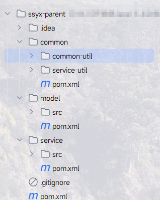

# 搭后端结构

ssyx-parent：父工程，根目录，管理子模块：

​	common：公共类父模块

​		common-util：核心工具类

​		service-util：service模块工具类

​		rabbit-util：RabbitMQ工具类（**尚未实现**）

​	model：实体类模块

​	service：系统微服务模块

​    service-client：系统远程调用封装模块（**尚未实现**）

# 创建方式

## 父模块

## 子模块

