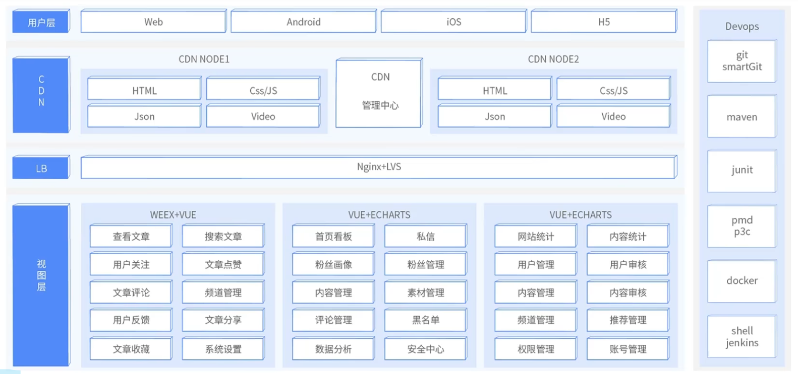
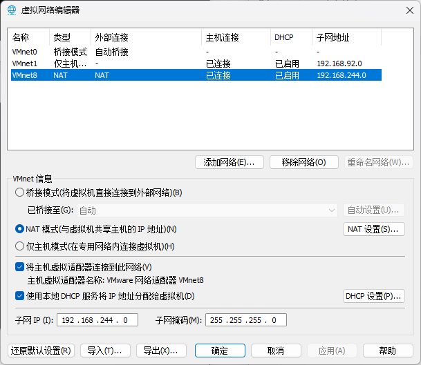
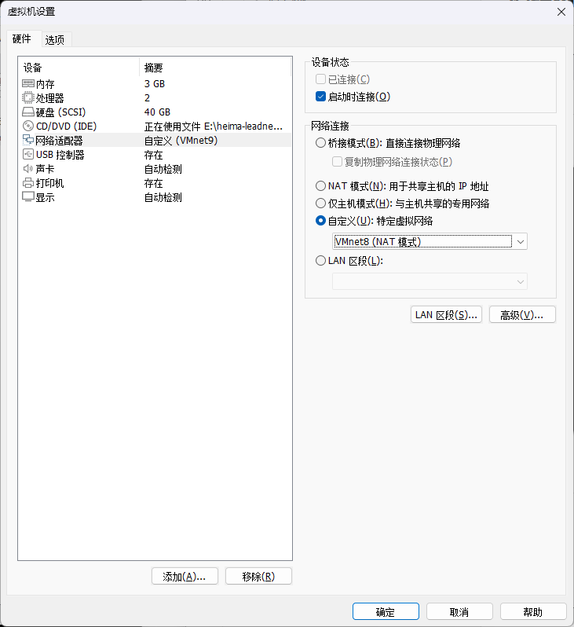
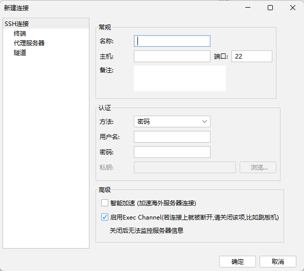
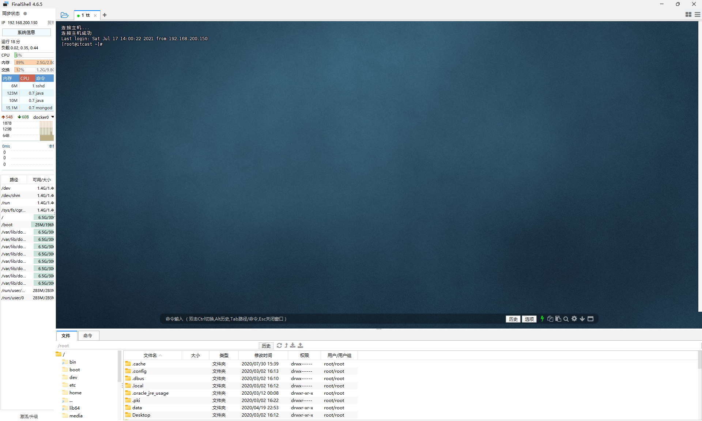
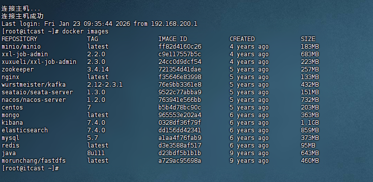

# 项目简介

> 为本司员工提供新闻搜索的功能。

# 技术栈

# Nacos环境搭建

## 准备镜像

使用VMware打开下载的镜像

## 编辑网络

>虚拟机固定IP200，需要先改网段为200

1. 编辑→虚拟网络编辑器，选中NAT

2. 指定该虚拟机的网络
右键该虚拟机→设置→选择网络适配器→选择自定义→下拉列表选择NAT8

3. 远程连接该虚拟机
Finalshell下载：https://www.hostbuf.com/t/988.html
新建连接：

名称：任意
主机：192.168.200.130（上一步编辑好的IP（130是虚拟机固定的ip）
用户名：root
密码：itcast
如图所示就连上了

## 安装Nacos（使用Docker）

### docker拉取（本文档不使用此方式）

`docker pull nacos/nacos-server:1.2.0`

### 创建容器

`docker run --env MODE=standalone --name nacos --restart=always -d -p 8848:8848 nacos/nacos-server:1.2.0`

参数解读：
 - MODE=standalone 单机版
 - --restart=always 开机启动
 - -p 8848:8848 映射端口
 - -d 创建一个守护式容器在后台运行

## 查看所有镜像

`docker images`
