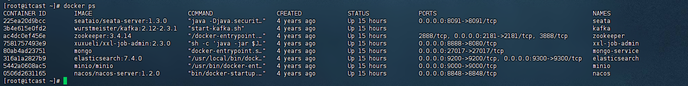
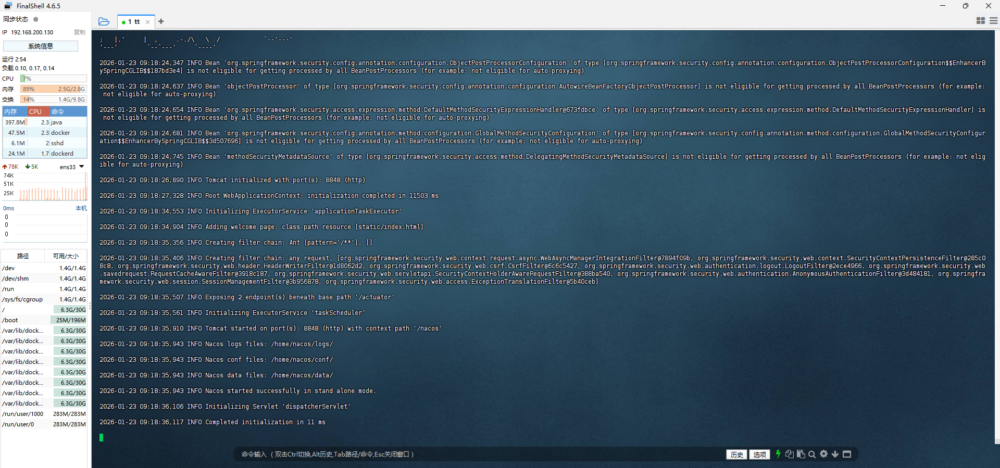
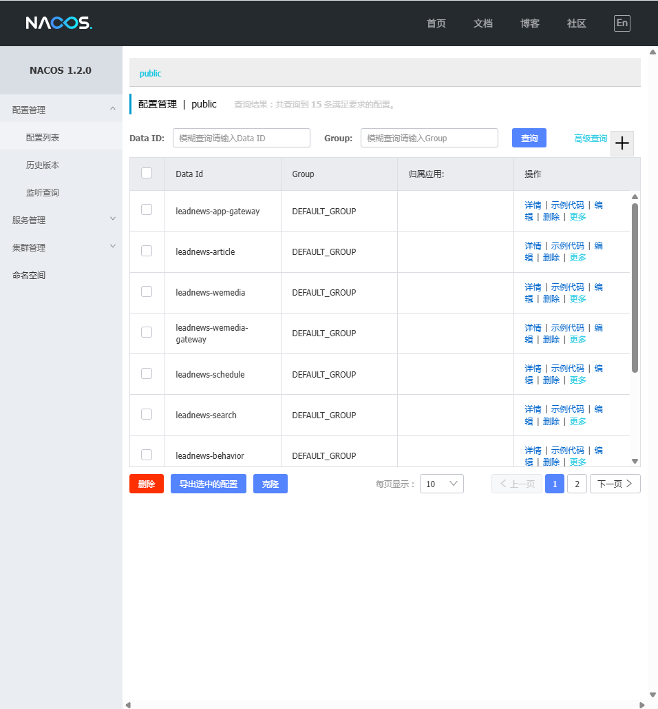

# 项目简介

> 为本司员工提供新闻搜索的功能。

# 技术栈


# Nacos环境搭建

## 准备镜像

使用VMware打开下载的镜像

## 编辑网络

>虚拟机固定IP200，需要先改网段为200

1. 编辑→虚拟网络编辑器，选中NAT


2. 指定该虚拟机的网络
右键该虚拟机→设置→选择网络适配器→选择自定义→下拉列表选择NAT8


3. 远程连接该虚拟机
Finalshell下载：https://www.hostbuf.com/t/988.html
新建连接：

名称：任意
主机：192.168.200.130（上一步编辑好的IP（130是虚拟机固定的ip）
用户名：root
密码：itcast
如图所示就连上了


## 安装Nacos（使用Docker）

### docker拉取（本文档不使用此方式）

`docker pull nacos/nacos-server:1.2.0`

### 创建容器

`docker run --env MODE=standalone --name nacos --restart=always -d -p 8848:8848 nacos/nacos-server:1.2.0`

参数解读：
 - MODE=standalone 单机版
 - --restart=always 开机启动
 - -p 8848:8848 映射端口
 - -d 创建一个守护式容器在后台运行

## docker的使用
### 查看所有镜像

`docker images`


### 检查运行状态

`docker ps`


### 查看某一个docker镜像的日志

`docker logs -f CONTAINER ID`(例如Nacos`docker logs -f 0506d2631165 `)

## 访问Nacos

`http://192.168.200.130:8848/nacos`


# 初始工程搭建

导入项目

# 登录

导入数据库脚本

```sql
CREATE DATABASE IF NOT EXISTS leadnews_user DEFAULT CHARACTER SET utf8mb4 COLLATE utf8mb4_unicode_ci;

USE leadnews_user;

SET NAMES utf8;

/*

Navicat MySQL Data Transfer

  

Source Server         : localhost

Source Server Version : 50721

Source Host           : localhost:3306

Source Database       : leadnews_user

  

Target Server Type    : MYSQL

Target Server Version : 50721

File Encoding         : 65001

  

Date: 2021-04-12 13:58:42

*/

  

SET FOREIGN_KEY_CHECKS=0;

  

-- ----------------------------

-- Table structure for ap_user

-- ----------------------------

DROP TABLE IF EXISTS `ap_user`;

CREATE TABLE `ap_user` (

  `id` int(11) unsigned NOT NULL AUTO_INCREMENT COMMENT '主键',

  `salt` varchar(32) COLLATE utf8mb4_unicode_ci DEFAULT NULL COMMENT '密码、通信等加密盐',

  `name` varchar(20) COLLATE utf8mb4_unicode_ci DEFAULT NULL COMMENT '用户名',

  `password` varchar(32) COLLATE utf8mb4_unicode_ci DEFAULT NULL COMMENT '密码,md5加密',

  `phone` varchar(11) COLLATE utf8mb4_unicode_ci DEFAULT NULL COMMENT '手机号',

  `image` varchar(255) COLLATE utf8mb4_unicode_ci DEFAULT NULL COMMENT '头像',

  `sex` tinyint(1) unsigned DEFAULT NULL COMMENT '0 男\r\n            1 女\r\n            2 未知',

  `is_certification` tinyint(1) unsigned DEFAULT NULL COMMENT '0 未\r\n            1 是',

  `is_identity_authentication` tinyint(1) DEFAULT NULL COMMENT '是否身份认证',

  `status` tinyint(1) unsigned DEFAULT NULL COMMENT '0正常\r\n            1锁定',

  `flag` tinyint(1) unsigned DEFAULT NULL COMMENT '0 普通用户\r\n            1 自媒体人\r\n            2 大V',

  `created_time` datetime DEFAULT NULL COMMENT '注册时间',

  PRIMARY KEY (`id`) USING BTREE

) ENGINE=InnoDB AUTO_INCREMENT=7 DEFAULT CHARSET=utf8mb4 COLLATE=utf8mb4_unicode_ci ROW_FORMAT=DYNAMIC COMMENT='APP用户信息表';

  

-- ----------------------------

-- Records of ap_user

-- ----------------------------

INSERT INTO `ap_user` VALUES ('1', 'abc', 'zhangsan', 'abc', '13511223453', null, '1', null, null, '1', '1', '2020-03-19 23:22:07');

INSERT INTO `ap_user` VALUES ('2', 'abc', 'lisi', 'abc', '13511223454', '', '1', null, null, '1', '1', '2020-03-19 23:22:07');

INSERT INTO `ap_user` VALUES ('3', 'sdsa', 'wangwu', 'wangwu', '13511223455', null, null, null, null, null, '1', null);

INSERT INTO `ap_user` VALUES ('4', '123abc', 'admin', '81e158e10201b6d7aee6e35eaf744796', '13511223456', null, '1', null, null, '1', '1', '2020-03-30 16:36:32');

INSERT INTO `ap_user` VALUES ('5', '123', 'suwukong', 'suwukong', '13511223458', null, '1', null, null, '1', '1', '2020-08-01 11:09:57');

INSERT INTO `ap_user` VALUES ('6', null, null, null, null, null, null, null, null, null, null, null);

  

-- ----------------------------

-- Table structure for ap_user_fan

-- ----------------------------

DROP TABLE IF EXISTS `ap_user_fan`;

CREATE TABLE `ap_user_fan` (

  `id` int(11) unsigned NOT NULL AUTO_INCREMENT COMMENT '主键',

  `user_id` int(11) unsigned DEFAULT NULL COMMENT '用户ID',

  `fans_id` int(11) unsigned DEFAULT NULL COMMENT '粉丝ID',

  `fans_name` varchar(20) COLLATE utf8mb4_unicode_ci DEFAULT NULL COMMENT '粉丝昵称',

  `level` tinyint(1) unsigned DEFAULT NULL COMMENT '粉丝忠实度\r\n            0 正常\r\n            1 潜力股\r\n            2 勇士\r\n            3 铁杆\r\n            4 老铁',

  `created_time` datetime DEFAULT NULL COMMENT '创建时间',

  `is_display` tinyint(1) unsigned DEFAULT NULL COMMENT '是否可见我动态',

  `is_shield_letter` tinyint(1) unsigned DEFAULT NULL COMMENT '是否屏蔽私信',

  `is_shield_comment` tinyint(1) unsigned DEFAULT NULL COMMENT '是否屏蔽评论',

  PRIMARY KEY (`id`) USING BTREE

) ENGINE=InnoDB DEFAULT CHARSET=utf8mb4 COLLATE=utf8mb4_unicode_ci ROW_FORMAT=DYNAMIC COMMENT='APP用户粉丝信息表';

  

-- ----------------------------

-- Records of ap_user_fan

-- ----------------------------

  

-- ----------------------------

-- Table structure for ap_user_follow

-- ----------------------------

DROP TABLE IF EXISTS `ap_user_follow`;

CREATE TABLE `ap_user_follow` (

  `id` int(11) unsigned NOT NULL AUTO_INCREMENT COMMENT '主键',

  `user_id` int(11) unsigned DEFAULT NULL COMMENT '用户ID',

  `follow_id` int(11) unsigned DEFAULT NULL COMMENT '关注作者ID',

  `follow_name` varchar(20) COLLATE utf8mb4_unicode_ci DEFAULT NULL COMMENT '粉丝昵称',

  `level` tinyint(1) unsigned DEFAULT NULL COMMENT '关注度\r\n            0 偶尔感兴趣\r\n            1 一般\r\n            2 经常\r\n            3 高度',

  `is_notice` tinyint(1) unsigned DEFAULT NULL COMMENT '是否动态通知',

  `created_time` datetime DEFAULT NULL COMMENT '创建时间',

  PRIMARY KEY (`id`) USING BTREE

) ENGINE=InnoDB DEFAULT CHARSET=utf8mb4 COLLATE=utf8mb4_unicode_ci ROW_FORMAT=DYNAMIC COMMENT='APP用户关注信息表';

  

-- ----------------------------

-- Records of ap_user_follow

-- ----------------------------

  

-- ----------------------------

-- Table structure for ap_user_realname

-- ----------------------------

DROP TABLE IF EXISTS `ap_user_realname`;

CREATE TABLE `ap_user_realname` (

  `id` int(11) unsigned NOT NULL AUTO_INCREMENT COMMENT '主键',

  `user_id` int(11) unsigned DEFAULT NULL COMMENT '账号ID',

  `name` varchar(20) CHARACTER SET utf8mb4 DEFAULT NULL COMMENT '用户名称',

  `idno` varchar(20) COLLATE utf8mb4_unicode_ci DEFAULT NULL COMMENT '资源名称',

  `font_image` varchar(100) COLLATE utf8mb4_unicode_ci DEFAULT NULL COMMENT '正面照片',

  `back_image` varchar(100) COLLATE utf8mb4_unicode_ci DEFAULT NULL COMMENT '背面照片',

  `hold_image` varchar(100) COLLATE utf8mb4_unicode_ci DEFAULT NULL COMMENT '手持照片',

  `live_image` varchar(255) COLLATE utf8mb4_unicode_ci DEFAULT NULL COMMENT '活体照片',

  `status` tinyint(1) unsigned DEFAULT NULL COMMENT '状态\r\n            0 创建中\r\n            1 待审核\r\n            2 审核失败\r\n            9 审核通过',

  `reason` varchar(50) COLLATE utf8mb4_unicode_ci DEFAULT NULL COMMENT '拒绝原因',

  `created_time` datetime DEFAULT NULL COMMENT '创建时间',

  `submited_time` datetime DEFAULT NULL COMMENT '提交时间',

  `updated_time` datetime DEFAULT NULL COMMENT '更新时间',

  PRIMARY KEY (`id`) USING BTREE

) ENGINE=InnoDB AUTO_INCREMENT=6 DEFAULT CHARSET=utf8mb4 COLLATE=utf8mb4_unicode_ci ROW_FORMAT=DYNAMIC COMMENT='APP实名认证信息表';

  

-- ----------------------------

-- Records of ap_user_realname

-- ----------------------------

INSERT INTO `ap_user_realname` VALUES ('1', '1', 'zhangsan', '512335455602781278', 'http://161.189.111.227/group1/M00/00/00/rBFwgF9bbHSAQlqFAAXIZNzAq9E126.jpg', 'http://161.189.111.227/group1/M00/00/00/rBFwgF9bbF6AR16RAAZB2e1EsOg460.jpg', 'http://161.189.111.227/group1/M00/00/00/rBFwgF9bbDeAH2qoAAbD_WiUJfk745.jpg', 'http://161.189.111.227/group1/M00/00/00/rBFwgF9ba9qANVEdAAS25KJlEVE291.jpg', '9', '', '2019-07-30 14:34:28', '2019-07-30 14:34:30', '2019-07-12 06:48:04');

INSERT INTO `ap_user_realname` VALUES ('2', '2', 'lisi', '512335455602781279', 'http://161.189.111.227/group1/M00/00/00/rBFwgF9bbHSAQlqFAAXIZNzAq9E126.jpg', 'http://161.189.111.227/group1/M00/00/00/rBFwgF9bbF6AR16RAAZB2e1EsOg460.jpg', 'http://161.189.111.227/group1/M00/00/00/rBFwgF9bbDeAH2qoAAbD_WiUJfk745.jpg', 'http://161.189.111.227/group1/M00/00/00/rBFwgF9ba9qANVEdAAS25KJlEVE291.jpg', '1', '', '2019-07-11 17:21:18', '2019-07-11 17:21:20', '2019-07-12 06:48:04');

INSERT INTO `ap_user_realname` VALUES ('3', '3', 'wangwu6666', '512335455602781276', 'http://161.189.111.227/group1/M00/00/00/rBFwgF9bbHSAQlqFAAXIZNzAq9E126.jpg', 'http://161.189.111.227/group1/M00/00/00/rBFwgF9bbF6AR16RAAZB2e1EsOg460.jpg', 'http://161.189.111.227/group1/M00/00/00/rBFwgF9bbDeAH2qoAAbD_WiUJfk745.jpg', 'http://161.189.111.227/group1/M00/00/00/rBFwgF9ba9qANVEdAAS25KJlEVE291.jpg', '9', '', '2019-07-11 17:21:18', '2019-07-11 17:21:20', '2019-07-12 06:48:04');

INSERT INTO `ap_user_realname` VALUES ('5', '5', 'suwukong', '512335455602781279', 'http://161.189.111.227/group1/M00/00/00/rBFwgF9bbHSAQlqFAAXIZNzAq9E126.jpg', 'http://161.189.111.227/group1/M00/00/00/rBFwgF9bbF6AR16RAAZB2e1EsOg460.jpg', 'http://161.189.111.227/group1/M00/00/00/rBFwgF9bbDeAH2qoAAbD_WiUJfk745.jpg', 'http://161.189.111.227/group1/M00/00/00/rBFwgF9ba9qANVEdAAS25KJlEVE291.jpg', '1', '', '2020-08-01 11:10:31', '2020-08-01 11:10:34', '2020-08-01 11:10:36');
```

tinyint类型：占1个字节， 不指定unsigned(非负数)。 值范围(-128,127)，指定了unsigned， 值范围(0,255)
tinyint通常表示小范围的数值，或者表示true或false，通常值为0表示false,值为1表示true

创建登录所需要的实体类ApUser
```java
```java
package com.heima.model.user.pojos;

import com.baomidou.mybatisplus.annotation.IdType;
import com.baomidou.mybatisplus.annotation.TableField;
import com.baomidou.mybatisplus.annotation.TableId;
import com.baomidou.mybatisplus.annotation.TableName;
import lombok.Data;

import java.io.Serializable;
import java.util.Date;

/**
 * <p>
 * APP用户信息表
 * </p>
 *
 * @author itheima
 */
@Data
@TableName("ap_user")
public class ApUser implements Serializable {

    private static final long serialVersionUID = 1L;

    /**
     * 主键
     */
    @TableId(value = "id", type = IdType.AUTO)
    private Integer id;

    /**
     * 密码、通信等加密盐
     */
    @TableField("salt")
    private String salt;

    /**
     * 用户名
     */
    @TableField("name")
    private String name;

    /**
     * 密码,md5加密
     */
    @TableField("password")
    private String password;

    /**
     * 手机号
     */
    @TableField("phone")
    private String phone;

    /**
     * 头像
     */
    @TableField("image")
    private String image;

    /**
     * 0 男
            1 女
            2 未知
     */
    @TableField("sex")
    private Boolean sex;

    /**
     * 0 未
            1 是
     */
    @TableField("is_certification")
    private Boolean certification;

    /**
     * 是否身份认证
     */
    @TableField("is_identity_authentication")
    private Boolean identityAuthentication;

    /**
     * 0正常
            1锁定
     */
    @TableField("status")
    private Boolean status;

    /**
     * 0 普通用户
            1 自媒体人
            2 大V
     */
    @TableField("flag")
    private Short flag;

    /**
     * 注册时间
     */
    @TableField("created_time")
    private Date createdTime;

}
```

# 手动加密（md5+随机字符串）

生成：用户名、密码→根据用户生成salt（salt即为随机字符串）→密码+salt = md5加密（存储到password字段中）
验证：输入用户名、密码→根据用户名查询用户→用户输入密码+数据库中的salt（MD5加密后）
