# 瑞吉外卖

## 环境搭建

### 数据库环境搭建

1. 创建数据库

`create database db_reggie`

2. 执行数据库脚本

```sql
/*
 Navicat Premium Data Transfer

 Source Server         : MySQL
 Source Server Type    : MySQL
 Source Server Version : 80029
 Source Host           : localhost:3306
 Source Schema         : db_reggie

 Target Server Type    : MySQL
 Target Server Version : 80029
 File Encoding         : 65001

 Date: 17/07/2023 21:17:32
*/

SET NAMES utf8mb4;
SET FOREIGN_KEY_CHECKS = 0;

-- ----------------------------
-- Table structure for address_book
-- ----------------------------
DROP TABLE IF EXISTS `address_book`;
CREATE TABLE `address_book`  (
  `id` bigint NOT NULL COMMENT '主键',
  `user_id` bigint NOT NULL COMMENT '用户id',
  `consignee` varchar(50) CHARACTER SET utf8 COLLATE utf8_bin NOT NULL COMMENT '收货人',
  `sex` tinyint NOT NULL COMMENT '性别 0 女 1 男',
  `phone` varchar(11) CHARACTER SET utf8 COLLATE utf8_bin NOT NULL COMMENT '手机号',
  `province_code` varchar(12) CHARACTER SET utf8mb4 COLLATE utf8mb4_0900_ai_ci NULL DEFAULT NULL COMMENT '省级区划编号',
  `province_name` varchar(32) CHARACTER SET utf8mb4 COLLATE utf8mb4_0900_ai_ci NULL DEFAULT NULL COMMENT '省级名称',
  `city_code` varchar(12) CHARACTER SET utf8mb4 COLLATE utf8mb4_0900_ai_ci NULL DEFAULT NULL COMMENT '市级区划编号',
  `city_name` varchar(32) CHARACTER SET utf8mb4 COLLATE utf8mb4_0900_ai_ci NULL DEFAULT NULL COMMENT '市级名称',
  `district_code` varchar(12) CHARACTER SET utf8mb4 COLLATE utf8mb4_0900_ai_ci NULL DEFAULT NULL COMMENT '区级区划编号',
  `district_name` varchar(32) CHARACTER SET utf8mb4 COLLATE utf8mb4_0900_ai_ci NULL DEFAULT NULL COMMENT '区级名称',
  `detail` varchar(200) CHARACTER SET utf8mb4 COLLATE utf8mb4_0900_ai_ci NULL DEFAULT NULL COMMENT '详细地址',
  `label` varchar(100) CHARACTER SET utf8mb4 COLLATE utf8mb4_0900_ai_ci NULL DEFAULT NULL COMMENT '标签',
  `is_default` tinyint(1) NOT NULL DEFAULT 0 COMMENT '默认 0 否 1是',
  `create_time` datetime NOT NULL COMMENT '创建时间',
  `update_time` datetime NOT NULL COMMENT '更新时间',
  `create_user` bigint NOT NULL COMMENT '创建人',
  `update_user` bigint NOT NULL COMMENT '修改人',
  `is_deleted` int NOT NULL DEFAULT 0 COMMENT '是否删除',
  PRIMARY KEY (`id`) USING BTREE
) ENGINE = InnoDB CHARACTER SET = utf8 COLLATE = utf8_bin COMMENT = '地址管理' ROW_FORMAT = Dynamic;

-- ----------------------------
-- Records of address_book
-- ----------------------------
INSERT INTO `address_book` VALUES (1669651832385089537, 1669648357601341442, '小王', 1, '13012345678', NULL, NULL, NULL, NULL, NULL, NULL, '贝克街221-B', '公司', 1, '2023-06-16 18:23:12', '2023-06-17 19:33:35', 1669648357601341442, 1669648357601341442, 0);
INSERT INTO `address_book` VALUES (1669923708730617857, 1669648357601341442, '杨妞', 0, '13112345678', NULL, NULL, NULL, NULL, NULL, NULL, '国防科技大学', '学校', 0, '2023-06-17 12:23:33', '2023-06-17 12:23:55', 1669648357601341442, 1669648357601341442, 0);

-- ----------------------------
-- Table structure for category
-- ----------------------------
DROP TABLE IF EXISTS `category`;
CREATE TABLE `category`  (
  `id` bigint NOT NULL COMMENT '主键',
  `type` int NULL DEFAULT NULL COMMENT '类型   1 菜品分类 2 套餐分类',
  `name` varchar(64) CHARACTER SET utf8 COLLATE utf8_bin NOT NULL COMMENT '分类名称',
  `sort` int NOT NULL DEFAULT 0 COMMENT '顺序',
  `create_time` datetime NOT NULL COMMENT '创建时间',
  `update_time` datetime NOT NULL COMMENT '更新时间',
  `create_user` bigint NOT NULL COMMENT '创建人',
  `update_user` bigint NOT NULL COMMENT '修改人',
  `is_deleted` int NOT NULL DEFAULT 0 COMMENT '是否删除',
  PRIMARY KEY (`id`) USING BTREE,
  UNIQUE INDEX `idx_category_name`(`name` ASC) USING BTREE
) ENGINE = InnoDB CHARACTER SET = utf8 COLLATE = utf8_bin COMMENT = '菜品及套餐分类' ROW_FORMAT = Dynamic;

-- ----------------------------
-- Records of category
-- ----------------------------
INSERT INTO `category` VALUES (1397844303408574465, 1, '川菜', 2, '2021-05-27 09:17:07', '2021-06-02 14:27:22', 1, 1, 0);
INSERT INTO `category` VALUES (1397844391040167938, 1, '粤菜', 3, '2021-05-27 09:17:28', '2021-07-09 14:37:13', 1, 1, 0);
INSERT INTO `category` VALUES (1413341197421846529, 1, '饮品', 11, '2021-07-09 11:36:15', '2021-07-09 14:39:15', 1, 1, 0);
INSERT INTO `category` VALUES (1413342269393674242, 2, '商务套餐', 5, '2021-07-09 11:40:30', '2023-03-24 16:36:00', 1, 1, 0);
INSERT INTO `category` VALUES (1413384954989060097, 1, '主食', 12, '2021-07-09 14:30:07', '2021-07-09 14:39:19', 1, 1, 0);
INSERT INTO `category` VALUES (1413386191767674881, 2, '儿童套餐', 6, '2021-07-09 14:35:02', '2021-07-09 14:39:05', 1, 1, 0);
INSERT INTO `category` VALUES (1638463545721720834, 1, '鲁菜', 1, '2023-03-22 16:52:05', '2023-06-16 11:10:37', 1, 1, 0);
INSERT INTO `category` VALUES (1638465424191078401, 1, '东北菜', 1, '2023-03-22 16:59:33', '2023-03-22 16:59:33', 1, 1, 0);
INSERT INTO `category` VALUES (1638465521104666625, 1, '西式快餐', 1, '2023-03-22 16:59:56', '2023-03-22 16:59:56', 1, 1, 0);
INSERT INTO `category` VALUES (1638471111002032341, 1, '湘菜', 10, '2023-06-15 19:54:18', '2023-06-15 19:54:15', 1, 1, 0);
INSERT INTO `category` VALUES (1638472645272629249, 1, '印度菜', 1, '2023-03-22 17:28:15', '2023-03-22 17:28:15', 1, 1, 0);
INSERT INTO `category` VALUES (1638473036353728513, 2, '便当', 1, '2023-03-22 17:29:48', '2023-03-22 17:29:48', 1, 1, 0);

-- ----------------------------
-- Table structure for dish
-- ----------------------------
DROP TABLE IF EXISTS `dish`;
CREATE TABLE `dish`  (
  `id` bigint NOT NULL COMMENT '主键',
  `name` varchar(64) CHARACTER SET utf8 COLLATE utf8_bin NOT NULL COMMENT '菜品名称',
  `category_id` bigint NOT NULL COMMENT '菜品分类id',
  `price` decimal(10, 2) NULL DEFAULT NULL COMMENT '菜品价格',
  `code` varchar(64) CHARACTER SET utf8 COLLATE utf8_bin NOT NULL COMMENT '商品码',
  `image` varchar(200) CHARACTER SET utf8 COLLATE utf8_bin NOT NULL COMMENT '图片',
  `description` varchar(400) CHARACTER SET utf8 COLLATE utf8_bin NULL DEFAULT NULL COMMENT '描述信息',
  `status` int NOT NULL DEFAULT 1 COMMENT '0 停售 1 起售',
  `sort` int NOT NULL DEFAULT 0 COMMENT '顺序',
  `create_time` datetime NOT NULL COMMENT '创建时间',
  `update_time` datetime NOT NULL COMMENT '更新时间',
  `create_user` bigint NOT NULL COMMENT '创建人',
  `update_user` bigint NOT NULL COMMENT '修改人',
  `is_deleted` int NOT NULL DEFAULT 0 COMMENT '是否删除',
  PRIMARY KEY (`id`) USING BTREE,
  UNIQUE INDEX `idx_dish_name`(`name` ASC) USING BTREE
) ENGINE = InnoDB CHARACTER SET = utf8 COLLATE = utf8_bin COMMENT = '菜品管理' ROW_FORMAT = Dynamic;

-- ----------------------------
-- Records of dish
-- ----------------------------
INSERT INTO `dish` VALUES (1397849739276890114, '辣子鸡', 1397844303408574465, 7800.00, '222222222', 'f966a38e-0780-40be-bb52-5699d13cb3d9.jpg', '来自鲜嫩美味的小鸡，值得一尝', 1, 0, '2021-05-27 09:38:43', '2023-06-18 11:16:17', 1, 1, 0);
INSERT INTO `dish` VALUES (1397850392090947585, '组庵鱼翅', 1638463545721720834, 4800.00, '123412341234', '740c79ce-af29-41b8-b78d-5f49c96e38c4.jpg', '组庵鱼翅，看图足以表明好吃程度', 1, 0, '2021-05-27 09:41:19', '2023-06-16 16:40:22', 1, 1, 0);
INSERT INTO `dish` VALUES (1397850851245600769, '霸王别姬', 1397844391040167938, 12800.00, '123412341234', '057dd338-e487-4bbc-a74c-0384c44a9ca3.jpg', '还有什么比霸王别姬更美味的呢？', 1, 0, '2021-05-27 09:43:08', '2023-06-18 11:16:07', 1, 1, 0);
INSERT INTO `dish` VALUES (1397851099502260226, '全家福', 1397844391040167938, 11800.00, '23412341234', 'a53a4e6a-3b83-4044-87f9-9d49b30a8fdc.jpg', '别光吃肉啦，来份全家福吧，让你长寿又美味', 1, 0, '2021-05-27 09:44:08', '2023-06-18 11:15:57', 1, 1, 0);
INSERT INTO `dish` VALUES (1397851370462687234, '邵阳猪血丸子', 1638471111002032341, 13800.00, '1246812345678', '2a50628e-7758-4c51-9fbb-d37c61cdacad.jpg', '看，美味不？来嘛来嘛，这才是最爱吖', 1, 0, '2021-05-27 09:45:12', '2023-06-18 11:15:43', 1, 1, 0);
INSERT INTO `dish` VALUES (1397851668262465537, '口味蛇', 1638472645272629249, 16800.00, '1234567812345678', '0f4bd884-dc9c-4cf9-b59e-7d5958fec3dd.jpg', '爬行界的扛把子，东兴-口味蛇，让你欲罢不能', 1, 0, '2021-05-27 09:46:23', '2023-06-16 10:41:57', 1, 1, 0);
INSERT INTO `dish` VALUES (1397852391150759938, '辣子鸡丁', 1397844303408574465, 8800.00, '2346812468', 'ef2b73f2-75d1-4d3a-beea-22da0e1421bd.jpg', '辣子鸡丁，辣子鸡丁，永远的魂', 1, 0, '2021-05-27 09:49:16', '2021-05-27 09:49:16', 1, 1, 0);
INSERT INTO `dish` VALUES (1397853183287013378, '麻辣兔头', 1397844303408574465, 19800.00, '123456787654321', '2a2e9d66-b41d-4645-87bd-95f2cfeed218.jpg', '麻辣兔头的详细制作，麻辣鲜香，色泽红润，回味悠长', 1, 0, '2021-05-27 09:52:24', '2021-05-27 09:52:24', 1, 1, 0);
INSERT INTO `dish` VALUES (1397853709101740034, '蒜泥白肉', 1397844303408574465, 9800.00, '1234321234321', 'd2f61d70-ac85-4529-9b74-6d9a2255c6d7.jpg', '多么的有食欲啊', 1, 0, '2021-05-27 09:54:30', '2021-05-27 09:54:30', 1, 1, 0);
INSERT INTO `dish` VALUES (1397853890262118402, '鱼香肉丝', 1397844303408574465, 3800.00, '1234212321234', '8dcfda14-5712-4d28-82f7-ae905b3c2308.jpg', '鱼香肉丝简直就是我们童年回忆的一道经典菜，上学的时候点个鱼香肉丝盖饭坐在宿舍床上看着肥皂剧，绝了！现在完美复刻一下上学的时候感觉', 1, 0, '2021-05-27 09:55:13', '2021-05-27 09:55:13', 1, 1, 0);
INSERT INTO `dish` VALUES (1397854652581064706, '麻辣水煮鱼', 1397844303408574465, 14800.00, '2345312·345321', '1fdbfbf3-1d86-4b29-a3fc-46345852f2f8.jpg', '鱼片是买的切好的鱼片，放几个虾，增加味道', 1, 0, '2021-05-27 09:58:15', '2021-05-27 09:58:15', 1, 1, 0);
INSERT INTO `dish` VALUES (1397854865672679425, '鱼香炒鸡蛋', 1397844303408574465, 2000.00, '23456431·23456', '0f252364-a561-4e8d-8065-9a6797a6b1d3.jpg', '鱼香菜也是川味的特色。里面没有鱼却鱼香味', 1, 0, '2021-05-27 09:59:06', '2021-05-27 09:59:06', 1, 1, 0);
INSERT INTO `dish` VALUES (1397860242057375745, '脆皮烧鹅', 1397844391040167938, 12800.00, '123456786543213456', 'e476f679-5c15-436b-87fa-8c4e9644bf33.jpeg', '“广东烤鸭美而香，却胜烧鹅说古冈（今新会），燕瘦环肥各佳妙，君休偏重便宜坊”，可见烧鹅与烧鸭在粤菜之中已早负盛名。作为广州最普遍和最受欢迎的烧烤肉食，以它的“色泽金红，皮脆肉嫩，味香可口”的特色，在省城各大街小巷的烧卤店随处可见。', 1, 0, '2021-05-27 10:20:27', '2021-05-27 10:20:27', 1, 1, 0);
INSERT INTO `dish` VALUES (1397860578738352129, '白切鸡', 1397844391040167938, 6600.00, '12345678654', '9ec6fc2d-50d2-422e-b954-de87dcd04198.jpeg', '白切鸡是一道色香味俱全的特色传统名肴，又叫白斩鸡，是粤菜系鸡肴中的一种，始于清代的民间。白切鸡通常选用细骨农家鸡与沙姜、蒜茸等食材，慢火煮浸白切鸡皮爽肉滑，清淡鲜美。著名的泮溪酒家白切鸡，曾获商业部优质产品金鼎奖。湛江白切鸡更是驰名粤港澳。粤菜厨坛中，鸡的菜式有200余款之多，而最为人常食不厌的正是白切鸡，深受食家青睐。', 1, 0, '2021-05-27 10:21:48', '2021-05-27 10:21:48', 1, 1, 0);
INSERT INTO `dish` VALUES (1397860792492666881, '烤乳猪', 1397844391040167938, 38800.00, '213456432123456', '2e96a7e3-affb-438e-b7c3-e1430df425c9.jpeg', '广式烧乳猪主料是小乳猪，辅料是蒜，调料是五香粉、芝麻酱、八角粉等，本菜品主要通过将食材放入炭火中烧烤而成。烤乳猪是广州最著名的特色菜，并且是“满汉全席”中的主打菜肴之一。烤乳猪也是许多年来广东人祭祖的祭品之一，是家家都少不了的应节之物，用乳猪祭完先人后，亲戚们再聚餐食用。', 1, 0, '2021-05-27 10:22:39', '2021-05-27 10:22:39', 1, 1, 0);
INSERT INTO `dish` VALUES (1397860963880316929, '脆皮乳鸽', 1397844391040167938, 10800.00, '1234563212345', '3fabb83a-1c09-4fd9-892b-4ef7457daafa.jpeg', '“脆皮乳鸽”是广东菜中的一道传统名菜，属于粤菜系，具有皮脆肉嫩、色泽红亮、鲜香味美的特点，常吃可使身体强健，清肺顺气。随着菜品制作工艺的不断发展，逐渐形成了熟炸法、生炸法和烤制法三种制作方法。无论那种制作方法，都是在鸽子经过一系列的加工，挂脆皮水后再加工而成，正宗的“脆皮乳鸽皮脆肉嫩、色泽红亮、鲜香味美、香气馥郁。这三种方法的制作过程都不算复杂，但想达到理想的效果并不容易。', 1, 0, '2021-05-27 10:23:19', '2023-06-16 10:41:57', 1, 1, 0);
INSERT INTO `dish` VALUES (1397861683434139649, '清蒸河鲜海鲜', 1397844391040167938, 38800.00, '1234567876543213456', '1405081e-f545-42e1-86a2-f7559ae2e276.jpeg', '新鲜的海鲜，清蒸是最好的处理方式。鲜，体会为什么叫海鲜。清蒸是广州最经典的烹饪手法，过去岭南地区由于峻山大岭阻隔，交通不便，经济发展起步慢，自家打的鱼放在锅里煮了就吃，没有太多的讲究，但却发现这清淡的煮法能使鱼的鲜甜跃然舌尖。', 1, 0, '2021-05-27 10:26:11', '2023-06-16 10:41:57', 1, 1, 0);
INSERT INTO `dish` VALUES (1397862198033297410, '老火靓汤', 1397844391040167938, 49800.00, '123456786532455', '583df4b7-a159-4cfc-9543-4f666120b25f.jpeg', '老火靓汤又称广府汤，是广府人传承数千年的食补养生秘方，慢火煲煮的中华老火靓汤，火候足，时间长，既取药补之效，又取入口之甘甜。 广府老火汤种类繁多，可以用各种汤料和烹调方法，烹制出各种不同口味、不同功效的汤来。', 1, 0, '2021-05-27 10:28:14', '2023-06-16 10:41:57', 1, 1, 0);
INSERT INTO `dish` VALUES (1397862477831122945, '上汤焗龙虾', 1397844391040167938, 108800.00, '1234567865432', '5b8d2da3-3744-4bb3-acdc-329056b8259d.jpeg', '上汤焗龙虾是一道色香味俱全的传统名菜，属于粤菜系。此菜以龙虾为主料，配以高汤制成的一道海鲜美食。本品肉质洁白细嫩，味道鲜美，蛋白质含量高，脂肪含量低，营养丰富。是色香味俱全的传统名菜。', 1, 0, '2021-05-27 10:29:20', '2023-06-16 10:41:57', 1, 1, 0);
INSERT INTO `dish` VALUES (1413342036832100354, '北冰洋', 1413341197421846529, 500.00, '', 'c99e0aab-3cb7-4eaa-80fd-f47d4ffea694.png', '', 1, 0, '2021-07-09 11:39:35', '2023-06-16 10:41:57', 1, 1, 0);
INSERT INTO `dish` VALUES (1413384757047271425, '王老吉', 1413341197421846529, 500.00, '', '00874a5e-0df2-446b-8f69-a30eb7d88ee8.png', '', 1, 0, '2021-07-09 14:29:20', '2023-06-16 10:41:57', 1, 1, 0);
INSERT INTO `dish` VALUES (1413385247889891330, '米饭', 1413384954989060097, 200.00, '', 'ee04a05a-1230-46b6-8ad5-1a95b140fff3.png', '', 1, 0, '2021-07-09 14:31:17', '2023-06-16 10:41:57', 1, 1, 0);
INSERT INTO `dish` VALUES (1669626058819002369, '手抓饼', 1638465424191078401, 1000.00, '', '6e491682-9f0c-41ef-9b6a-5e1a33631e38.jpg', '童年回忆', 1, 0, '2023-06-16 16:40:47', '2023-06-17 19:36:38', 1, 1, 0);

-- ----------------------------
-- Table structure for dish_flavor
-- ----------------------------
DROP TABLE IF EXISTS `dish_flavor`;
CREATE TABLE `dish_flavor`  (
  `id` bigint NOT NULL COMMENT '主键',
  `dish_id` bigint NOT NULL COMMENT '菜品',
  `name` varchar(64) CHARACTER SET utf8 COLLATE utf8_bin NOT NULL COMMENT '口味名称',
  `value` varchar(500) CHARACTER SET utf8 COLLATE utf8_bin NULL DEFAULT NULL COMMENT '口味数据list',
  `create_time` datetime NOT NULL COMMENT '创建时间',
  `update_time` datetime NOT NULL COMMENT '更新时间',
  `create_user` bigint NOT NULL COMMENT '创建人',
  `update_user` bigint NOT NULL COMMENT '修改人',
  `is_deleted` int NOT NULL DEFAULT 0 COMMENT '是否删除',
  PRIMARY KEY (`id`) USING BTREE
) ENGINE = InnoDB CHARACTER SET = utf8 COLLATE = utf8_bin COMMENT = '菜品口味关系表' ROW_FORMAT = Dynamic;

-- ----------------------------
-- Records of dish_flavor
-- ----------------------------
INSERT INTO `dish_flavor` VALUES (1397849417888346113, 1397849417854791681, '辣度', '[\"不辣\",\"微辣\",\"中辣\",\"重辣\"]', '2021-05-27 09:37:27', '2021-05-27 09:37:27', 1, 1, 0);
INSERT INTO `dish_flavor` VALUES (1397849739297861633, 1397849739276890114, '忌口', '[\"不要葱\",\"不要蒜\",\"不要香菜\",\"不要辣\"]', '2023-06-18 11:16:17', '2023-06-18 11:16:17', 1, 1, 0);
INSERT INTO `dish_flavor` VALUES (1397849739323027458, 1397849739276890114, '辣度', '[\"不辣\",\"微辣\",\"中辣\",\"重辣\"]', '2023-06-18 11:16:17', '2023-06-18 11:16:17', 1, 1, 0);
INSERT INTO `dish_flavor` VALUES (1397849936421761025, 1397849936404983809, '忌口', '[\"不要葱\",\"不要蒜\",\"不要香菜\",\"不要辣\"]', '2021-05-27 09:39:30', '2021-05-27 09:39:30', 1, 1, 0);
INSERT INTO `dish_flavor` VALUES (1397849936438538241, 1397849936404983809, '辣度', '[\"不辣\",\"微辣\",\"中辣\",\"重辣\"]', '2021-05-27 09:39:30', '2021-05-27 09:39:30', 1, 1, 0);
INSERT INTO `dish_flavor` VALUES (1397850141015715841, 1397850140982161409, '忌口', '[\"不要葱\",\"不要蒜\",\"不要香菜\",\"不要辣\"]', '2021-05-27 09:40:19', '2021-05-27 09:40:19', 1, 1, 0);
INSERT INTO `dish_flavor` VALUES (1397850141040881665, 1397850140982161409, '辣度', '[\"不辣\",\"微辣\",\"中辣\",\"重辣\"]', '2021-05-27 09:40:19', '2021-05-27 09:40:19', 1, 1, 0);
INSERT INTO `dish_flavor` VALUES (1397850392120307713, 1397850392090947585, '辣度', '[\"不辣\",\"微辣\",\"中辣\",\"重辣\"]', '2023-06-16 16:40:03', '2023-06-16 16:40:03', 1, 1, 0);
INSERT INTO `dish_flavor` VALUES (1397850392137084929, 1397850392090947585, '辣度', '[\"不辣\",\"微辣\",\"中辣\",\"重辣\"]', '2023-06-16 16:40:04', '2023-06-16 16:40:04', 1, 1, 0);
INSERT INTO `dish_flavor` VALUES (1397850630734262274, 1397850630700707841, '忌口', '[\"不要葱\",\"不要蒜\",\"不要香菜\",\"不要辣\"]', '2021-05-27 09:42:16', '2021-05-27 09:42:16', 1, 1, 0);
INSERT INTO `dish_flavor` VALUES (1397850630755233794, 1397850630700707841, '辣度', '[\"微辣\",\"中辣\",\"重辣\"]', '2021-05-27 09:42:16', '2021-05-27 09:42:16', 1, 1, 0);
INSERT INTO `dish_flavor` VALUES (1397850851274960898, 1397850851245600769, '忌口', '[\"不要蒜\",\"不要香菜\",\"不要辣\"]', '2023-06-18 11:16:07', '2023-06-18 11:16:07', 1, 1, 0);
INSERT INTO `dish_flavor` VALUES (1397850851283349505, 1397850851245600769, '辣度', '[\"不辣\",\"微辣\",\"中辣\",\"重辣\"]', '2023-06-18 11:16:07', '2023-06-18 11:16:07', 1, 1, 0);
INSERT INTO `dish_flavor` VALUES (1397851099523231745, 1397851099502260226, '忌口', '[\"不要葱\",\"不要蒜\",\"不要香菜\",\"不要辣\"]', '2023-06-18 11:15:57', '2023-06-18 11:15:57', 1, 1, 0);
INSERT INTO `dish_flavor` VALUES (1397851099527426050, 1397851099502260226, '辣度', '[\"不辣\",\"微辣\",\"中辣\"]', '2023-06-18 11:15:57', '2023-06-18 11:15:57', 1, 1, 0);
INSERT INTO `dish_flavor` VALUES (1397851370483658754, 1397851370462687234, '温度', '[\"热饮\",\"常温\",\"去冰\",\"少冰\",\"多冰\"]', '2023-06-18 11:15:43', '2023-06-18 11:15:43', 1, 1, 0);
INSERT INTO `dish_flavor` VALUES (1397851370483658755, 1397851370462687234, '忌口', '[\"不要葱\",\"不要蒜\",\"不要香菜\",\"不要辣\"]', '2023-06-18 11:15:43', '2023-06-18 11:15:43', 1, 1, 0);
INSERT INTO `dish_flavor` VALUES (1397851370483658756, 1397851370462687234, '辣度', '[\"不辣\",\"微辣\",\"中辣\",\"重辣\"]', '2023-06-18 11:15:43', '2023-06-18 11:15:43', 1, 1, 0);
INSERT INTO `dish_flavor` VALUES (1397852391180120065, 1397852391150759938, '忌口', '[\"不要葱\",\"不要香菜\",\"不要辣\"]', '2021-05-27 09:49:16', '2021-05-27 09:49:16', 1, 1, 0);
INSERT INTO `dish_flavor` VALUES (1397852391196897281, 1397852391150759938, '辣度', '[\"不辣\",\"微辣\",\"重辣\"]', '2021-05-27 09:49:16', '2021-05-27 09:49:16', 1, 1, 0);
INSERT INTO `dish_flavor` VALUES (1397853183307984898, 1397853183287013378, '辣度', '[\"不辣\",\"微辣\",\"中辣\",\"重辣\"]', '2021-05-27 09:52:24', '2021-05-27 09:52:24', 1, 1, 0);
INSERT INTO `dish_flavor` VALUES (1397853423486414850, 1397853423461249026, '辣度', '[\"不辣\",\"微辣\",\"中辣\",\"重辣\"]', '2021-05-27 09:53:22', '2021-05-27 09:53:22', 1, 1, 0);
INSERT INTO `dish_flavor` VALUES (1397853709126905857, 1397853709101740034, '忌口', '[\"不要葱\",\"不要蒜\",\"不要香菜\",\"不要辣\"]', '2021-05-27 09:54:30', '2021-05-27 09:54:30', 1, 1, 0);
INSERT INTO `dish_flavor` VALUES (1397853890283089922, 1397853890262118402, '辣度', '[\"不辣\",\"微辣\",\"中辣\",\"重辣\"]', '2021-05-27 09:55:13', '2021-05-27 09:55:13', 1, 1, 0);
INSERT INTO `dish_flavor` VALUES (1397854133632413697, 1397854133603053569, '温度', '[\"热饮\",\"常温\",\"去冰\",\"少冰\",\"多冰\"]', '2021-05-27 09:56:11', '2021-05-27 09:56:11', 1, 1, 0);
INSERT INTO `dish_flavor` VALUES (1397854652623007745, 1397854652581064706, '忌口', '[\"不要葱\",\"不要蒜\",\"不要香菜\",\"不要辣\"]', '2021-05-27 09:58:15', '2021-05-27 09:58:15', 1, 1, 0);
INSERT INTO `dish_flavor` VALUES (1397854652635590658, 1397854652581064706, '辣度', '[\"不辣\",\"微辣\",\"中辣\",\"重辣\"]', '2021-05-27 09:58:15', '2021-05-27 09:58:15', 1, 1, 0);
INSERT INTO `dish_flavor` VALUES (1397854865735593986, 1397854865672679425, '辣度', '[\"不辣\",\"微辣\",\"中辣\",\"重辣\"]', '2021-05-27 09:59:06', '2021-05-27 09:59:06', 1, 1, 0);
INSERT INTO `dish_flavor` VALUES (1397855742303186946, 1397855742273826817, '辣度', '[\"不辣\",\"微辣\",\"中辣\",\"重辣\"]', '2021-05-27 10:02:35', '2021-05-27 10:02:35', 1, 1, 0);
INSERT INTO `dish_flavor` VALUES (1397855906497605633, 1397855906468245506, '忌口', '[\"不要葱\",\"不要蒜\",\"不要香菜\",\"不要辣\"]', '2021-05-27 10:03:14', '2021-05-27 10:03:14', 1, 1, 0);
INSERT INTO `dish_flavor` VALUES (1397856190573621250, 1397856190540066818, '辣度', '[\"不辣\",\"微辣\",\"中辣\",\"重辣\"]', '2021-05-27 10:04:21', '2021-05-27 10:04:21', 1, 1, 0);
INSERT INTO `dish_flavor` VALUES (1397859056709316609, 1397859056684150785, '辣度', '[\"不辣\",\"微辣\",\"中辣\",\"重辣\"]', '2021-05-27 10:15:45', '2021-05-27 10:15:45', 1, 1, 0);
INSERT INTO `dish_flavor` VALUES (1397859277837217794, 1397859277812051969, '辣度', '[\"不辣\",\"微辣\",\"中辣\",\"重辣\"]', '2021-05-27 10:16:37', '2021-05-27 10:16:37', 1, 1, 0);
INSERT INTO `dish_flavor` VALUES (1397859487502086146, 1397859487476920321, '辣度', '[\"不辣\",\"微辣\",\"中辣\",\"重辣\"]', '2021-05-27 10:17:27', '2021-05-27 10:17:27', 1, 1, 0);
INSERT INTO `dish_flavor` VALUES (1397859757061615618, 1397859757036449794, '甜味', '[\"无糖\",\"少糖\",\"半躺\",\"多糖\",\"全糖\"]', '2021-05-27 10:18:32', '2021-05-27 10:18:32', 1, 1, 0);
INSERT INTO `dish_flavor` VALUES (1397860242086735874, 1397860242057375745, '辣度', '[\"不辣\",\"微辣\",\"中辣\",\"重辣\"]', '2021-05-27 10:20:27', '2021-05-27 10:20:27', 1, 1, 0);
INSERT INTO `dish_flavor` VALUES (1397860963918065665, 1397860963880316929, '辣度', '[\"不辣\",\"微辣\",\"中辣\",\"重辣\"]', '2021-05-27 10:23:19', '2021-05-27 10:23:19', 1, 1, 0);
INSERT INTO `dish_flavor` VALUES (1397861135754506242, 1397861135733534722, '甜味', '[\"无糖\",\"少糖\",\"半躺\",\"多糖\",\"全糖\"]', '2021-05-27 10:24:00', '2021-05-27 10:24:00', 1, 1, 0);
INSERT INTO `dish_flavor` VALUES (1397861370035744769, 1397861370010578945, '辣度', '[\"不辣\",\"微辣\",\"中辣\",\"重辣\"]', '2021-05-27 10:24:56', '2021-05-27 10:24:56', 1, 1, 0);
INSERT INTO `dish_flavor` VALUES (1397861683459305474, 1397861683434139649, '忌口', '[\"不要葱\",\"不要蒜\",\"不要香菜\",\"不要辣\"]', '2021-05-27 10:26:11', '2021-05-27 10:26:11', 1, 1, 0);
INSERT INTO `dish_flavor` VALUES (1397861898467717121, 1397861898438356993, '忌口', '[\"不要葱\",\"不要蒜\",\"不要香菜\",\"不要辣\"]', '2021-05-27 10:27:02', '2021-05-27 10:27:02', 1, 1, 0);
INSERT INTO `dish_flavor` VALUES (1397862198054268929, 1397862198033297410, '忌口', '[\"不要葱\",\"不要蒜\",\"不要香菜\",\"不要辣\"]', '2021-05-27 10:28:14', '2021-05-27 10:28:14', 1, 1, 0);
INSERT INTO `dish_flavor` VALUES (1397862477835317250, 1397862477831122945, '辣度', '[\"不辣\",\"微辣\",\"中辣\"]', '2021-05-27 10:29:20', '2021-05-27 10:29:20', 1, 1, 0);
INSERT INTO `dish_flavor` VALUES (1398089545865015297, 1398089545676271617, '温度', '[\"热饮\",\"常温\",\"去冰\",\"少冰\",\"多冰\"]', '2021-05-28 01:31:38', '2021-05-28 01:31:38', 1, 1, 0);
INSERT INTO `dish_flavor` VALUES (1398089782323097601, 1398089782285348866, '辣度', '[\"不辣\",\"微辣\",\"中辣\",\"重辣\"]', '2021-05-28 01:32:34', '2021-05-28 01:32:34', 1, 1, 0);
INSERT INTO `dish_flavor` VALUES (1398090003262255106, 1398090003228700673, '忌口', '[\"不要葱\",\"不要蒜\",\"不要香菜\",\"不要辣\"]', '2021-05-28 01:33:27', '2021-05-28 01:33:27', 1, 1, 0);
INSERT INTO `dish_flavor` VALUES (1398090264554811394, 1398090264517062657, '忌口', '[\"不要葱\",\"不要蒜\",\"不要香菜\",\"不要辣\"]', '2021-05-28 01:34:29', '2021-05-28 01:34:29', 1, 1, 0);
INSERT INTO `dish_flavor` VALUES (1398090455399837698, 1398090455324340225, '辣度', '[\"不辣\",\"微辣\",\"中辣\",\"重辣\"]', '2021-05-28 01:35:14', '2021-05-28 01:35:14', 1, 1, 0);
INSERT INTO `dish_flavor` VALUES (1398090685449023490, 1398090685419663362, '温度', '[\"热饮\",\"常温\",\"去冰\",\"少冰\",\"多冰\"]', '2021-05-28 01:36:09', '2021-05-28 01:36:09', 1, 1, 0);
INSERT INTO `dish_flavor` VALUES (1398090825358422017, 1398090825329061889, '忌口', '[\"不要葱\",\"不要蒜\",\"不要香菜\",\"不要辣\"]', '2021-05-28 01:36:43', '2021-05-28 01:36:43', 1, 1, 0);
INSERT INTO `dish_flavor` VALUES (1398091007051476993, 1398091007017922561, '辣度', '[\"不辣\",\"微辣\",\"中辣\",\"重辣\"]', '2021-05-28 01:37:26', '2021-05-28 01:37:26', 1, 1, 0);
INSERT INTO `dish_flavor` VALUES (1398091296164851713, 1398091296131297281, '辣度', '[\"不辣\",\"微辣\",\"中辣\",\"重辣\"]', '2021-05-28 01:38:35', '2021-05-28 01:38:35', 1, 1, 0);
INSERT INTO `dish_flavor` VALUES (1398091546531246081, 1398091546480914433, '忌口', '[\"不要葱\",\"不要蒜\",\"不要香菜\",\"不要辣\"]', '2021-05-28 01:39:35', '2021-05-28 01:39:35', 1, 1, 0);
INSERT INTO `dish_flavor` VALUES (1398091729809747969, 1398091729788776450, '辣度', '[\"不辣\",\"微辣\",\"中辣\",\"重辣\"]', '2021-05-28 01:40:18', '2021-05-28 01:40:18', 1, 1, 0);
INSERT INTO `dish_flavor` VALUES (1398091889499484161, 1398091889449152513, '辣度', '[\"不辣\",\"微辣\",\"中辣\",\"重辣\"]', '2021-05-28 01:40:56', '2021-05-28 01:40:56', 1, 1, 0);
INSERT INTO `dish_flavor` VALUES (1398092095179763713, 1398092095142014978, '辣度', '[\"不辣\",\"微辣\",\"中辣\",\"重辣\"]', '2021-05-28 01:41:45', '2021-05-28 01:41:45', 1, 1, 0);
INSERT INTO `dish_flavor` VALUES (1398092283877306370, 1398092283847946241, '辣度', '[\"不辣\",\"微辣\",\"中辣\",\"重辣\"]', '2021-05-28 01:42:30', '2021-05-28 01:42:30', 1, 1, 0);
INSERT INTO `dish_flavor` VALUES (1398094018939236354, 1398094018893099009, '辣度', '[\"不辣\",\"微辣\",\"中辣\",\"重辣\"]', '2021-05-28 01:49:24', '2021-05-28 01:49:24', 1, 1, 0);
INSERT INTO `dish_flavor` VALUES (1398094391494094850, 1398094391456346113, '辣度', '[\"不辣\",\"微辣\",\"中辣\",\"重辣\"]', '2021-05-28 01:50:53', '2021-05-28 01:50:53', 1, 1, 0);
INSERT INTO `dish_flavor` VALUES (1399574026165727233, 1399305325713600514, '辣度', '[\"不辣\",\"微辣\",\"中辣\",\"重辣\"]', '2021-06-01 03:50:25', '2021-06-01 03:50:25', 1399309715396669441, 1399309715396669441, 0);
INSERT INTO `dish_flavor` VALUES (1413389540592263169, 1413384757047271425, '温度', '[\"常温\",\"冷藏\"]', '2021-07-12 09:09:16', '2021-07-12 09:09:16', 1, 1, 0);
INSERT INTO `dish_flavor` VALUES (1413389684020682754, 1413342036832100354, '温度', '[\"常温\",\"冷藏\"]', '2021-07-09 15:12:18', '2021-07-09 15:12:18', 1, 1, 0);
INSERT INTO `dish_flavor` VALUES (1638504915387691010, 1638504915328970754, '甜味', '[\"无糖\",\"少糖\",\"半糖\",\"多糖\",\"全糖\"]', '2023-03-22 19:36:28', '2023-03-22 19:36:28', 1, 1, 0);
INSERT INTO `dish_flavor` VALUES (1638504915387691011, 1638504915328970754, '温度', '[\"热饮\",\"常温\",\"去冰\",\"少冰\",\"多冰\"]', '2023-03-22 19:36:28', '2023-03-22 19:36:28', 1, 1, 0);
INSERT INTO `dish_flavor` VALUES (1638520588721692674, 1638506549748584449, '甜味', '[\"无糖\",\"少糖\",\"半糖\",\"多糖\",\"全糖\"]', '2023-03-24 16:43:55', '2023-03-24 16:43:55', 1, 1, 0);
INSERT INTO `dish_flavor` VALUES (1639223000692379650, 1639223000675602434, '忌口', '[\"不要葱\",\"不要蒜\",\"不要香菜\",\"不要辣\"]', '2023-03-24 19:09:53', '2023-03-24 19:09:53', 1, 1, 0);
INSERT INTO `dish_flavor` VALUES (1669519529986015233, 1669519529868574722, '忌口', '[\"不要葱\",\"不要蒜\",\"不要香菜\",\"不要辣\"]', '2023-06-16 10:35:58', '2023-06-16 10:35:58', 1, 1, 0);
INSERT INTO `dish_flavor` VALUES (1669534727190945794, 1397851668262465537, '忌口', '[\"不要辣\"]', '2023-06-16 10:37:52', '2023-06-16 10:37:52', 1, 1, 0);
INSERT INTO `dish_flavor` VALUES (1669626058827390977, 1669626058819002369, '辣度', '[\"不辣\"]', '2023-06-17 19:36:38', '2023-06-17 19:36:38', 1, 1, 0);

-- ----------------------------
-- Table structure for employee
-- ----------------------------
DROP TABLE IF EXISTS `employee`;
CREATE TABLE `employee`  (
  `id` bigint NOT NULL COMMENT '主键',
  `name` varchar(32) CHARACTER SET utf8 COLLATE utf8_bin NOT NULL COMMENT '姓名',
  `username` varchar(32) CHARACTER SET utf8 COLLATE utf8_bin NOT NULL COMMENT '用户名',
  `password` varchar(64) CHARACTER SET utf8 COLLATE utf8_bin NOT NULL COMMENT '密码',
  `phone` varchar(11) CHARACTER SET utf8 COLLATE utf8_bin NOT NULL COMMENT '手机号',
  `sex` varchar(2) CHARACTER SET utf8 COLLATE utf8_bin NOT NULL COMMENT '性别',
  `id_number` varchar(18) CHARACTER SET utf8 COLLATE utf8_bin NOT NULL COMMENT '身份证号',
  `status` int NOT NULL DEFAULT 1 COMMENT '状态 0:禁用，1:正常',
  `create_time` datetime NOT NULL COMMENT '创建时间',
  `update_time` datetime NOT NULL COMMENT '更新时间',
  `create_user` bigint NOT NULL COMMENT '创建人',
  `update_user` bigint NOT NULL COMMENT '修改人',
  PRIMARY KEY (`id`) USING BTREE,
  UNIQUE INDEX `idx_username`(`username` ASC) USING BTREE
) ENGINE = InnoDB CHARACTER SET = utf8 COLLATE = utf8_bin COMMENT = '员工信息' ROW_FORMAT = Dynamic;

-- ----------------------------
-- Records of employee
-- ----------------------------
INSERT INTO `employee` VALUES (1, '管理员', 'admin', 'e10adc3949ba59abbe56e057f20f883e', '13812312312', '1', '110101199001010047', 1, '2021-05-06 17:20:07', '2021-05-10 02:24:09', 1, 1);
INSERT INTO `employee` VALUES (1669185807730364417, '张三', 'zhangsan', 'e10adc3949ba59abbe56e057f20f883e', '13012345678', '1', '21101218491010201x', 1, '2023-06-15 11:31:23', '2023-06-15 18:26:09', 1, 1);
INSERT INTO `employee` VALUES (1669288505297416194, '李四', 'lisi', 'e10adc3949ba59abbe56e057f20f883e', '13012345678', '1', '210112345678011', 1, '2023-06-15 18:19:28', '2023-06-15 18:26:07', 1, 1);
INSERT INTO `employee` VALUES (1669293124484395009, '璐璐璐', 'lululu', 'e10adc3949ba59abbe56e057f20f883e', '13012345679', '0', '123123123123123123', 1, '2023-06-15 18:37:50', '2023-06-16 16:39:46', 1, 1);

-- ----------------------------
-- Table structure for order_detail
-- ----------------------------
DROP TABLE IF EXISTS `order_detail`;
CREATE TABLE `order_detail`  (
  `id` bigint NOT NULL COMMENT '主键',
  `name` varchar(50) CHARACTER SET utf8 COLLATE utf8_bin NULL DEFAULT NULL COMMENT '名字',
  `image` varchar(100) CHARACTER SET utf8 COLLATE utf8_bin NULL DEFAULT NULL COMMENT '图片',
  `order_id` bigint NOT NULL COMMENT '订单id',
  `dish_id` bigint NULL DEFAULT NULL COMMENT '菜品id',
  `setmeal_id` bigint NULL DEFAULT NULL COMMENT '套餐id',
  `dish_flavor` varchar(50) CHARACTER SET utf8 COLLATE utf8_bin NULL DEFAULT NULL COMMENT '口味',
  `number` int NOT NULL DEFAULT 1 COMMENT '数量',
  `amount` decimal(10, 2) NOT NULL COMMENT '金额',
  PRIMARY KEY (`id`) USING BTREE
) ENGINE = InnoDB CHARACTER SET = utf8 COLLATE = utf8_bin COMMENT = '订单明细表' ROW_FORMAT = Dynamic;

-- ----------------------------
-- Records of order_detail
-- ----------------------------
INSERT INTO `order_detail` VALUES (1669923542015422466, '组庵鱼翅', '740c79ce-af29-41b8-b78d-5f49c96e38c4.jpg', 1669923474688454658, 1397850392090947585, NULL, '重辣,重辣', 1, 48.00);
INSERT INTO `order_detail` VALUES (1669923885071740929, '商务套餐A', '41af29b9-676d-49bf-8941-8b23d1cb5ece.jpg', 1669923867971563522, NULL, NULL, NULL, 5, 122.00);
INSERT INTO `order_detail` VALUES (1670030209575038978, '脆皮乳鸽', '3fabb83a-1c09-4fd9-892b-4ef7457daafa.jpeg', 1670030199319965698, 1397860963880316929, NULL, '中辣', 1, 108.00);
INSERT INTO `order_detail` VALUES (1670031354729078788, '组庵鱼翅', '740c79ce-af29-41b8-b78d-5f49c96e38c4.jpg', 1670031354729078786, 1397850392090947585, NULL, '重辣,重辣', 1, 48.00);

-- ----------------------------
-- Table structure for orders
-- ----------------------------
DROP TABLE IF EXISTS `orders`;
CREATE TABLE `orders`  (
  `id` bigint NOT NULL COMMENT '主键',
  `number` varchar(50) CHARACTER SET utf8 COLLATE utf8_bin NULL DEFAULT NULL COMMENT '订单号',
  `status` int NOT NULL DEFAULT 1 COMMENT '订单状态 1待付款，2待派送，3已派送，4已完成，5已取消',
  `user_id` bigint NOT NULL COMMENT '下单用户',
  `address_book_id` bigint NOT NULL COMMENT '地址id',
  `order_time` datetime NOT NULL COMMENT '下单时间',
  `checkout_time` datetime NOT NULL COMMENT '结账时间',
  `pay_method` int NOT NULL DEFAULT 1 COMMENT '支付方式 1微信,2支付宝',
  `amount` decimal(10, 2) NOT NULL COMMENT '实收金额',
  `remark` varchar(100) CHARACTER SET utf8 COLLATE utf8_bin NULL DEFAULT NULL COMMENT '备注',
  `phone` varchar(255) CHARACTER SET utf8 COLLATE utf8_bin NULL DEFAULT NULL,
  `address` varchar(255) CHARACTER SET utf8 COLLATE utf8_bin NULL DEFAULT NULL,
  `user_name` varchar(255) CHARACTER SET utf8 COLLATE utf8_bin NULL DEFAULT NULL,
  `consignee` varchar(255) CHARACTER SET utf8 COLLATE utf8_bin NULL DEFAULT NULL,
  PRIMARY KEY (`id`) USING BTREE
) ENGINE = InnoDB CHARACTER SET = utf8 COLLATE = utf8_bin COMMENT = '订单表' ROW_FORMAT = Dynamic;

-- ----------------------------
-- Records of orders
-- ----------------------------

-- ----------------------------
-- Table structure for setmeal
-- ----------------------------
DROP TABLE IF EXISTS `setmeal`;
CREATE TABLE `setmeal`  (
  `id` bigint NOT NULL COMMENT '主键',
  `category_id` bigint NOT NULL COMMENT '菜品分类id',
  `name` varchar(64) CHARACTER SET utf8 COLLATE utf8_bin NOT NULL COMMENT '套餐名称',
  `price` decimal(10, 2) NOT NULL COMMENT '套餐价格',
  `status` int NULL DEFAULT NULL COMMENT '状态 0:停用 1:启用',
  `code` varchar(32) CHARACTER SET utf8 COLLATE utf8_bin NULL DEFAULT NULL COMMENT '编码',
  `description` varchar(512) CHARACTER SET utf8 COLLATE utf8_bin NULL DEFAULT NULL COMMENT '描述信息',
  `image` varchar(255) CHARACTER SET utf8 COLLATE utf8_bin NULL DEFAULT NULL COMMENT '图片',
  `create_time` datetime NOT NULL COMMENT '创建时间',
  `update_time` datetime NOT NULL COMMENT '更新时间',
  `create_user` bigint NOT NULL COMMENT '创建人',
  `update_user` bigint NOT NULL COMMENT '修改人',
  `is_deleted` int NOT NULL DEFAULT 0 COMMENT '是否删除',
  PRIMARY KEY (`id`) USING BTREE,
  UNIQUE INDEX `idx_setmeal_name`(`name` ASC) USING BTREE
) ENGINE = InnoDB CHARACTER SET = utf8 COLLATE = utf8_bin COMMENT = '套餐' ROW_FORMAT = Dynamic;

-- ----------------------------
-- Records of setmeal
-- ----------------------------
INSERT INTO `setmeal` VALUES (1415580119015145474, 1413386191767674881, '儿童套餐A计划', 4000.00, 1, '', '', '61d20592-b37f-4d72-a864-07ad5bb8f3bb.jpg', '2021-07-15 15:52:55', '2021-07-15 15:52:55', 1415576781934608386, 1415576781934608386, 0);
INSERT INTO `setmeal` VALUES (1638530049284669442, 1638473036353728513, '中式简餐', 3000.00, 1, '', '无', '732709fe-4fb6-4f5a-8b31-19056e3dbe1c.jpg', '2023-03-22 21:16:21', '2023-03-22 21:16:21', 1, 1, 0);
INSERT INTO `setmeal` VALUES (1638543508286103553, 1413342269393674242, '测试套餐', 3000.00, 1, '', '', 'e0d0ff3e-9511-4712-8e1d-053b787f4262.jpg', '2023-03-22 22:09:50', '2023-06-17 13:56:34', 1, 1, 0);
INSERT INTO `setmeal` VALUES (1669548063697698817, 1413342269393674242, '商务套餐A', 12200.00, 1, '', '奇奇怪怪', '41af29b9-676d-49bf-8941-8b23d1cb5ece.jpg', '2023-06-16 11:30:52', '2023-06-16 16:43:53', 1, 1, 0);

-- ----------------------------
-- Table structure for setmeal_dish
-- ----------------------------
DROP TABLE IF EXISTS `setmeal_dish`;
CREATE TABLE `setmeal_dish`  (
  `id` bigint NOT NULL COMMENT '主键',
  `setmeal_id` varchar(32) CHARACTER SET utf8 COLLATE utf8_bin NOT NULL COMMENT '套餐id ',
  `dish_id` varchar(32) CHARACTER SET utf8 COLLATE utf8_bin NOT NULL COMMENT '菜品id',
  `name` varchar(32) CHARACTER SET utf8 COLLATE utf8_bin NULL DEFAULT NULL COMMENT '菜品名称 （冗余字段）',
  `price` decimal(10, 2) NULL DEFAULT NULL COMMENT '菜品原价（冗余字段）',
  `copies` int NOT NULL COMMENT '份数',
  `sort` int NOT NULL DEFAULT 0 COMMENT '排序',
  `create_time` datetime NOT NULL COMMENT '创建时间',
  `update_time` datetime NOT NULL COMMENT '更新时间',
  `create_user` bigint NOT NULL COMMENT '创建人',
  `update_user` bigint NOT NULL COMMENT '修改人',
  `is_deleted` int NOT NULL DEFAULT 0 COMMENT '是否删除',
  PRIMARY KEY (`id`) USING BTREE
) ENGINE = InnoDB CHARACTER SET = utf8 COLLATE = utf8_bin COMMENT = '套餐菜品关系' ROW_FORMAT = Dynamic;

-- ----------------------------
-- Records of setmeal_dish
-- ----------------------------
INSERT INTO `setmeal_dish` VALUES (1415580119052894209, '1415580119015145474', '1397862198033297410', '老火靓汤', 49800.00, 1, 0, '2021-07-15 15:52:55', '2021-07-15 15:52:55', 1415576781934608386, 1415576781934608386, 0);
INSERT INTO `setmeal_dish` VALUES (1415580119061282817, '1415580119015145474', '1413342036832100354', '北冰洋', 500.00, 1, 0, '2021-07-15 15:52:55', '2021-07-15 15:52:55', 1415576781934608386, 1415576781934608386, 0);
INSERT INTO `setmeal_dish` VALUES (1415580119069671426, '1415580119015145474', '1413385247889891330', '米饭', 200.00, 1, 0, '2021-07-15 15:52:55', '2021-07-15 15:52:55', 1415576781934608386, 1415576781934608386, 0);
INSERT INTO `setmeal_dish` VALUES (1638529638523961346, '1638529638402326529', '1638506549748584449', '烤冷面123', 900.00, 1, 0, '2023-03-22 21:14:43', '2023-03-22 21:14:43', 1, 1, 0);
INSERT INTO `setmeal_dish` VALUES (1638529638591070210, '1638529638402326529', '1397849739276890114', '辣子鸡', 7800.00, 1, 0, '2023-03-22 21:14:43', '2023-03-22 21:14:43', 1, 1, 0);
INSERT INTO `setmeal_dish` VALUES (1638530049372749826, '1638530049284669442', '1397850140982161409', '毛氏红烧肉', 6800.00, 1, 0, '2023-03-22 21:16:21', '2023-03-22 21:16:21', 1, 1, 0);
INSERT INTO `setmeal_dish` VALUES (1638530049372749827, '1638530049284669442', '1397860792492666881', '烤乳猪', 38800.00, 1, 0, '2023-03-22 21:16:21', '2023-03-22 21:16:21', 1, 1, 0);
INSERT INTO `setmeal_dish` VALUES (1639184163689717761, '1638552113186041858', '1638506549748584449', '烤冷面', 900.00, 1, 0, '2023-03-24 16:35:34', '2023-03-24 16:35:34', 1, 1, 0);
INSERT INTO `setmeal_dish` VALUES (1669626837080494082, '1669548063697698817', '1397851668262465537', '口味蛇', 16800.00, 1, 0, '2023-06-16 16:43:53', '2023-06-16 16:43:53', 1, 1, 0);
INSERT INTO `setmeal_dish` VALUES (1669947027727110145, '1638543508286103553', '1397852391150759938', '辣子鸡丁', 8800.00, 1, 0, '2023-06-17 13:56:12', '2023-06-17 13:56:12', 1, 1, 0);
INSERT INTO `setmeal_dish` VALUES (1669947027727110146, '1638543508286103553', '1397853183287013378', '麻辣兔头', 19800.00, 1, 0, '2023-06-17 13:56:12', '2023-06-17 13:56:12', 1, 1, 0);
INSERT INTO `setmeal_dish` VALUES (1669947027727110147, '1638543508286103553', '1397853709101740034', '蒜泥白肉', 9800.00, 1, 0, '2023-06-17 13:56:12', '2023-06-17 13:56:12', 1, 1, 0);

-- ----------------------------
-- Table structure for shopping_cart
-- ----------------------------
DROP TABLE IF EXISTS `shopping_cart`;
CREATE TABLE `shopping_cart`  (
  `id` bigint NOT NULL COMMENT '主键',
  `name` varchar(50) CHARACTER SET utf8 COLLATE utf8_bin NULL DEFAULT NULL COMMENT '名称',
  `image` varchar(100) CHARACTER SET utf8 COLLATE utf8_bin NULL DEFAULT NULL COMMENT '图片',
  `user_id` bigint NOT NULL COMMENT '主键',
  `dish_id` bigint NULL DEFAULT NULL COMMENT '菜品id',
  `setmeal_id` bigint NULL DEFAULT NULL COMMENT '套餐id',
  `dish_flavor` varchar(50) CHARACTER SET utf8 COLLATE utf8_bin NULL DEFAULT NULL COMMENT '口味',
  `number` int NOT NULL DEFAULT 1 COMMENT '数量',
  `amount` decimal(10, 2) NOT NULL COMMENT '金额',
  `create_time` datetime NULL DEFAULT NULL COMMENT '创建时间',
  PRIMARY KEY (`id`) USING BTREE
) ENGINE = InnoDB CHARACTER SET = utf8 COLLATE = utf8_bin COMMENT = '购物车' ROW_FORMAT = Dynamic;

-- ----------------------------
-- Records of shopping_cart
-- ----------------------------

-- ----------------------------
-- Table structure for user
-- ----------------------------
DROP TABLE IF EXISTS `user`;
CREATE TABLE `user`  (
  `id` bigint NOT NULL COMMENT '主键',
  `name` varchar(50) CHARACTER SET utf8 COLLATE utf8_bin NULL DEFAULT NULL COMMENT '姓名',
  `phone` varchar(100) CHARACTER SET utf8 COLLATE utf8_bin NOT NULL COMMENT '手机号',
  `sex` varchar(2) CHARACTER SET utf8 COLLATE utf8_bin NULL DEFAULT NULL COMMENT '性别',
  `id_number` varchar(18) CHARACTER SET utf8 COLLATE utf8_bin NULL DEFAULT NULL COMMENT '身份证号',
  `avatar` varchar(500) CHARACTER SET utf8 COLLATE utf8_bin NULL DEFAULT NULL COMMENT '头像',
  `status` int NULL DEFAULT 0 COMMENT '状态 0:禁用，1:正常',
  PRIMARY KEY (`id`) USING BTREE
) ENGINE = InnoDB CHARACTER SET = utf8 COLLATE = utf8_bin COMMENT = '用户信息' ROW_FORMAT = Dynamic;

-- ----------------------------
-- Records of user
-- ----------------------------
INSERT INTO `user` VALUES (1669648357601341442, NULL, '13012345678', NULL, NULL, NULL, 1);
INSERT INTO `user` VALUES (1669713123271299074, NULL, '13512345678', NULL, NULL, NULL, 1);
INSERT INTO `user` VALUES (1669713250862026753, NULL, '13412345678', NULL, NULL, NULL, 1);

SET FOREIGN_KEY_CHECKS = 1;
```

3. 数据表信息

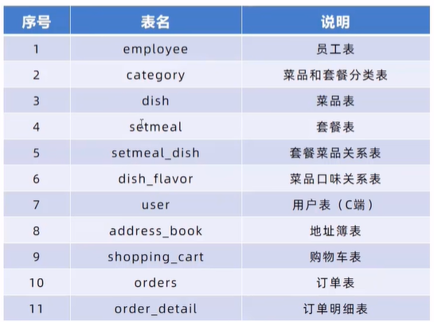

### Maven项目搭建

依次填写名称、位置、组ID、工件ID信息即可完成创建

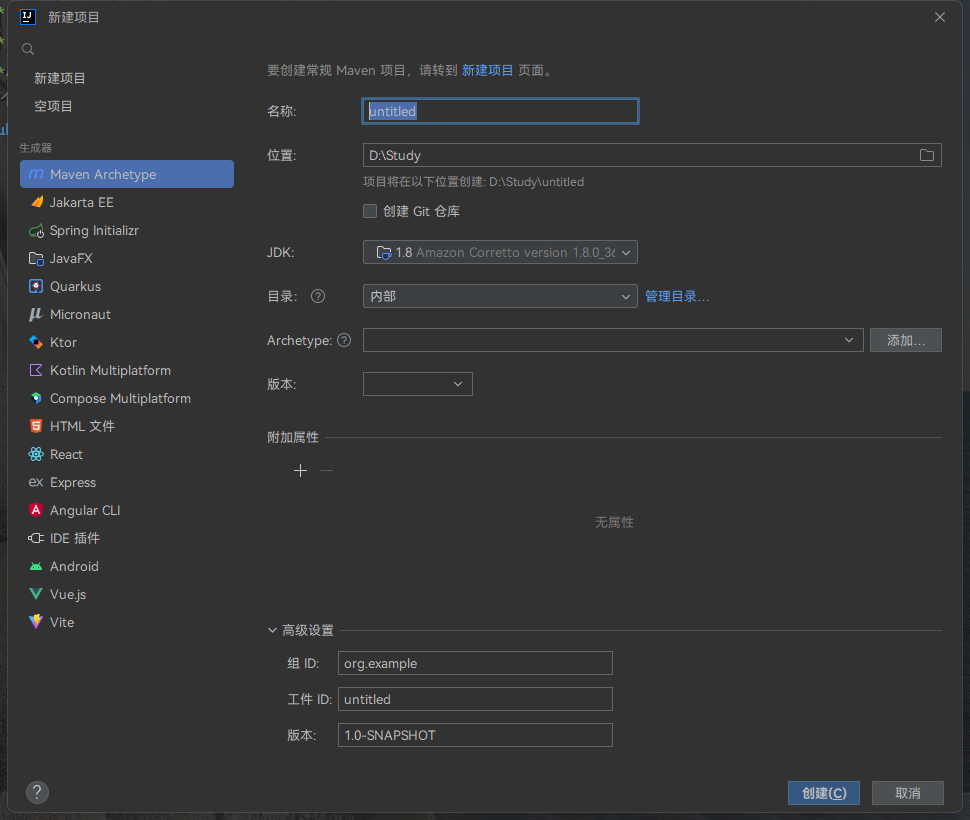

> 解决Maven加载速度慢：VM Options:-DarchetypeCatalog=local

### 导入依赖
（在项目的根pom.xml中编辑此内容）


```xml
<?xml version="1.0" encoding="UTF-8"?>
<project xmlns="http://maven.apache.org/POM/4.0.0"
         xmlns:xsi="http://www.w3.org/2001/XMLSchema-instance"
         xsi:schemaLocation="http://maven.apache.org/POM/4.0.0 http://maven.apache.org/xsd/maven-4.0.0.xsd">
  <modelVersion>4.0.0</modelVersion>
  <parent>
    <groupId>org.springframework.boot</groupId>
    <artifactId>spring-boot-starter-parent</artifactId>
    <version>2.4.5</version>
    <relativePath/> <!-- lookup parent from repository -->
  </parent>
  <groupId>com.itheima</groupId>
  <artifactId>reggie_take_out</artifactId>
  <version>1.0-SNAPSHOT</version>
  <properties>
    <java.version>1.8</java.version>
  </properties>
  <dependencies>

    <dependency>
      <groupId>org.springframework.boot</groupId>
      <artifactId>spring-boot-starter</artifactId>
    </dependency>

    <dependency>
      <groupId>org.springframework.boot</groupId>
      <artifactId>spring-boot-starter-test</artifactId>
      <scope>test</scope>
    </dependency>

    <dependency>
      <groupId>org.springframework.boot</groupId>
      <artifactId>spring-boot-starter-web</artifactId>
      <scope>compile</scope>
    </dependency>

    <dependency>
      <groupId>com.baomidou</groupId>
      <artifactId>mybatis-plus-boot-starter</artifactId>
      <version>3.4.2</version>
    </dependency>

    <dependency>
      <groupId>org.projectlombok</groupId>
      <artifactId>lombok</artifactId>
      <version>1.18.20</version>
    </dependency>

    <dependency>
      <groupId>com.alibaba</groupId>
      <artifactId>fastjson</artifactId>
      <version>1.2.76</version>
    </dependency>

    <dependency>
      <groupId>commons-lang</groupId>
      <artifactId>commons-lang</artifactId>
      <version>2.6</version>
    </dependency>

    <dependency>
      <groupId>mysql</groupId>
      <artifactId>mysql-connector-java</artifactId>
      <scope>runtime</scope>
    </dependency>

    <dependency>
      <groupId>com.alibaba</groupId>
      <artifactId>druid-spring-boot-starter</artifactId>
      <version>1.1.23</version>
    </dependency>
    <dependency>
      <groupId>io.springfox</groupId>
      <artifactId>springfox-swagger2</artifactId>
      <version>2.9.2</version>
    </dependency>
    <dependency>
      <groupId>io.springfox</groupId>
      <artifactId>springfox-swagger-ui</artifactId>
      <version>2.9.2</version>
    </dependency>
    <dependency>
      <groupId>com.aliyun</groupId>
      <artifactId>aliyun-java-sdk-core</artifactId>
      <version>4.5.16</version>
    </dependency>
    <dependency>
      <groupId>com.aliyun</groupId>
      <artifactId>aliyun-java-sdk-dysmsapi</artifactId>
      <version>1.1.0</version>
    </dependency>
  </dependencies>

  <build>
    <plugins>
      <plugin>
        <groupId>org.springframework.boot</groupId>
        <artifactId>spring-boot-maven-plugin</artifactId>
        <version>2.4.5</version>
      </plugin>
    </plugins>
  </build>
</project>
```

### 配置yml配置文件

```yml
    server:
  port: 8080
spring:
  application:
    name: reggie_take_out
  datasource:
    druid:
      driver-class-name: com.mysql.cj.jdbc.Driver
      url: jdbc:mysql://localhost:3306/db_reggie?serverTimezone=Asia/Shanghai&useUnicode=true&characterEncoding=utf-8&zeroDateTimeBehavior=convertToNull&useSSL=false&allowPublicKeyRetrieval=true
      username: root
      password: root
mybatis-plus:
  configuration:
    #在映射实体或者属性时，将数据库中表名和字段名中的下划线去掉，按照驼峰命名法映射
    map-underscore-to-camel-case: true
    log-impl: org.apache.ibatis.logging.stdout.StdOutImpl
  global-config:
    db-config:
      id-type: ASSIGN_ID
reggie:
  path: D:\\itheima\\
```

### 存放前端资源


### 配置Application启动类

```java
@Slf4j
@SpringBootApplication
public class ReggieApplication {
    public static void main(String[] args) {
        SpringApplication.run(ReggieApplication.class,args);
        log.info("项目启动成功！！！");
    }
}

```

### 设置静态资源映射

> 新建WebMvcConfig类

```java
@Slf4j
@Configuration
public class WebMvcConfig extends WebMvcConfigurationSupport {
    @Override
    protected void addResourceHandlers(ResourceHandlerRegistry registry) {
        log.info("开始静态资源映射");
        registry.addResourceHandler("/backend/**").addResourceLocations("classpath:/backend/");
        registry.addResourceHandler("/front/**").addResourceLocations("classpath:/front/");
    }
}

```

## 代码开发

### 基础模块

#### 后台登录功能

1. 需求分析

* 登录页面展示(http://localhost:8080/backend/page/login/login.html)


* 查看登录请求信息


* 数据模型


2. 编写代码

* 创建实体类Employee，与Employee表进行映射

```java
@Data
public class Employee implements Serializable {

    private static final long serialVersionUID = 1L;

    private Long id;

    private String username;

    private String name;

    private String password;

    private String phone;

    private String sex;

    private String idNumber;//身份证号码

    private Integer status;

    private LocalDateTime createTime;

    private LocalDateTime updateTime;

    @TableField(fill = FieldFill.INSERT)
    private Long createUser;

    @TableField(fill = FieldFill.INSERT_UPDATE)
    private Long updateUser;

}

```

* 创建Controller、Service、Mapper

<mark>EmployeeMapper</mark>

```java
@Mapper
public interface EmployeeMapper extends BaseMapper<Employee> {
}
```

<mark>EmployeeService</mark>

```java
public interface EmployeeService extends IService<Employee> {
}
```

<mark>EmployeeServiceImpl</mark>

```java
@Service
public class EmployeeServiceImpl extends ServiceImpl<EmployeeMapper, Employee> implements EmployeeService {
}
```

<mark>EmployeeController</mark>

```java
@Slf4j
@RestController
@RequestMapping("/employee")
public class EmployeeController {
    @Autowired
    private EmployeeServiceImpl employeeService;
}
```

3. 导入统一返回结果类R
> 此类是一个通用结果类，服务端响应的所有结果最终都会包装成此种类型返回给前端页面

```java
@Data
public class R<T> {

    private Integer code; //编码：1成功，0和其它数字为失败

    private String msg; //错误信息

    private T data; //数据

    private Map map = new HashMap(); //动态数据

    public static <T> R<T> success(T object) {
        R<T> r = new R<T>();
        r.data = object;
        r.code = 1;
        return r;
    }

    public static <T> R<T> error(String msg) {
        R r = new R();
        r.msg = msg;
        r.code = 0;
        return r;
    }

    public R<T> add(String key, Object value) {
        this.map.put(key, value);
        return this;
    }

}

```

4. 在Controller中创建登录方法


```java
@Slf4j
@RestController
@RequestMapping("/employee")
public class EmployeeController {
    @Autowired
    private EmployeeServiceImpl employeeService;

    @PostMapping("/login")
    public R<Employee> logib(HttpServletRequest request, @RequestBody Employee employee) {

        //1、将页面提交的密码进行md5加密处理
        String password = employee.getPassword();
        password = DigestUtils.md5DigestAsHex(password.getBytes());

        //2、根据页面提交的用户名来查数据库
        LambdaQueryWrapper<Employee> queryWrapper = new LambdaQueryWrapper<>();
        queryWrapper.eq(Employee::getUsername, employee.getUsername());
        Employee emp = employeeService.getOne(queryWrapper);

        //3、如果没有查询到则返回失败结果
        if (emp == null) {
            return R.error("登录失败");
        }

        //4、比对密码，如果不一致则返回失败结果
        if (!emp.getPassword().equals(password)) {
            return R.error("密码错误");
        }

        //5、查看员工状态，如果已禁用状态，则返回员工已禁用结果
        if (emp.getStatus() == 0) {
            return R.error("账号已禁用");
        }

        //6、登录成功，将用户id存入Session并返回成功结果
        request.getSession().setAttribute("employee", emp.getId());
        return R.success(emp);
    }
}

```

#### 后台退出功能

1. 需求分析


2. 在Controller中创建退出方法

```java
    //员工退出
    @PostMapping("/logout")
    public R<String> logout(HttpServletRequest request){
        //清理Session中保存的当前员工登录的id
        request.getSession().removeAttribute("employee");
        return R.success("退出成功");
    }

```

#### 完善后台登录功能

> 用户如果不登录，直接访问系统首页面，照样可以正常访问。这种设计并不合理，我们希望看到的效果应该是，只有登录成功后才可以访问系统中的页面，如果没有登录则跳转到登录页面。那么，具体应该怎么实现呢？答案就是使用过滤器或者拦截器，在过滤器或者拦截器中判断用户是否已经完成登录，如果没有登录则跳转到登录页面

1. 代码实现

* 创建自定义过滤器LoginCheckFilter

```java
@WebFilter(filterName = "LoginCheckFilter",urlPatterns = "/*")
@Slf4j
public class LoginCheckFilter implements Filter {
    @Override
    public void doFilter(ServletRequest servletRequest, ServletResponse servletResponse, FilterChain filterChain) throws IOException, ServletException {
        HttpServletRequest request=(HttpServletRequest) servletRequest;
        HttpServletResponse response=(HttpServletResponse) servletResponse;
        log.info("拦截到请求：{}",request.getRequestURI());
        filterChain.doFilter(request,response);
    }
}

```

* 在启动类加上加入注解：`@ServletComponentScan`

```java
@Slf4j
@SpringBootApplication
@ServletComponentScan
public class ReggieApplication {
    public static void main(String[] args) {
        SpringApplication.run(ReggieApplication.class,args);
        log.info("项目启动成功！！！");
    }
}

```

* 完善过滤器的处理逻辑

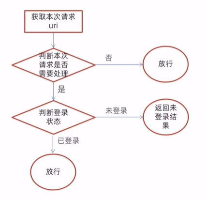


```java
@WebFilter(filterName = "LoginCheckFilter",urlPatterns = "/*")
@Slf4j
public class LoginCheckFilter implements Filter {
    //路径匹配器，支持通配符
    public static final AntPathMatcher PATH_MATCHER=new AntPathMatcher();

    @Override
    public void doFilter(ServletRequest servletRequest, ServletResponse servletResponse, FilterChain filterChain) throws IOException, ServletException {
        HttpServletRequest request=(HttpServletRequest) servletRequest;
        HttpServletResponse response=(HttpServletResponse) servletResponse;

//        1、获取本次请求的URI
        String requestURI = request.getRequestURI();

        log.info("拦截到请求：{}",requestURI);

//        定义不需要处理的请求路径
        String[] urls=new String[]{
                "/employee/login",
                "/employee/logout",
                "/backend/**",
                "/front/**"
        };
//        2、判断本次请求是否需要处理
        boolean check = check(urls, requestURI);
//        3、如果不需要处理，则直接放行
        if(check){
            log.info("本次请求{}不需要处理",requestURI);
            filterChain.doFilter(request,response);
            return;
        }
//        4、判断登录状态，如果已登录，则直接放行
        if(request.getSession().getAttribute("employee")!=null){
            log.info("用户已登录，用户id为：{}",request.getSession().getAttribute("employee"));
            filterChain.doFilter(request,response);
            return;
        }
        log.info("用户未登录");
//        5、如果未登录则返回未登录结果,通过输出流向客户端页面响应数据
        response.getWriter().write(JSON.toJSONString(R.error("NOTLOGIN")));
        return;
    }
    //路径匹配，检查本次请求是否需要放行
    public boolean check(String[] urls,String requestURI){
        for (String url : urls) {
            boolean match = PATH_MATCHER.match(url, requestURI);
            if(match==true){
                return true;
            }
        }
        return  false;
    }
}

```

### 员工管理模块
#### 新增员工信息

1. 需求分析

后台系统中可以管理员工信息，通过新增员工来添加后台系统用户。点击**添加员工**按钮跳转到新增页面，如下：


2. 代码开发

* 执行过程

    * 页面发送ajax请求，将新增员工页面中输入的数据以json的形式提交到服务端
    * 服务端Controller接收页面提交的数据并调用Service将数据进行保存
    * Service调用Mapper操作数据库，保存数据
    


```java
    //新增员工
    @PostMapping
    public R<String> save(HttpServletRequest request, @RequestBody Employee employee){
        log.info("新增员工，员工信息：{}",employee.toString());
        //设置初始密码，需要进行md5加密处理
        employee.setPassword(DigestUtils.md5DigestAsHex("123456".getBytes()));

        employee.setCreateTime(LocalDateTime.now());
        employee.setUpdateTime(LocalDateTime.now());

        Long empId = (Long) request.getSession().getAttribute("employee");

        employee.setCreateUser(empId);
        employee.setUpdateUser(empId);

        employeeService.save(employee);

        return R.success("新增员工成功");
    }

```
前面的程序还存在一个问题，就是当我们在新增员工时输入的账号已经存在，由于employee表中对该字段加入了唯一约束，此时程序会抛出异常:
`java.sql.SQLIntegrityConstraintViolationException: Duplicate entry 'heniang' for key 'idx_username'`此时需要我们的程序进行异常捕获，通常有两种处理方式：

1. 在Controller方法中加入try.catch进行异常捕获
2. 使用异常处理器进行全局异常捕获（使用此方式）

```java
@ControllerAdvice(annotations = {RestController.class, Controller.class})
@ResponseBody
@Slf4j
public class GlobalExceptionHandler {

    //进行异常处理方法
    @ExceptionHandler(SQLIntegrityConstraintViolationException.class)
    public R<String> exceptionHandler(SQLIntegrityConstraintViolationException ex){
        log.error(ex.getMessage());

        if(ex.getMessage().contains("Duplicate entry")){
            String[] split = ex.getMessage().split(" ");
            String msg=split[2]+"已存在";
            return R.error(msg);
        }

        return R.error("未知错误");
    }
}

```

#### 员工信息分页查询

1. 需求分析

> 系统中的员工很多的时候，如果在一个页面中全部展示出来会显得比较乱，不便于查看，所以一般的系统中都会以分页的方式来展示列表数据。


2. 代码开发

* 执行过程

    * 页面发送ajax请求，将分页查询参数(page.pageSize、name)提交到服务端
    * 服务端Controller接收页面提交的数据并调用Service查询数据
    * Service调用Mapper操作数据库，查询分页数据
    * Controller将查询到的分页数据响应给页面
    * 页面接收到分页数据并通过ElementUI的Table组件展示到页面上

* 配置MP分页插件

```java
@Configuration
public class MybatisPlusConfig {
    @Bean
    public MybatisPlusInterceptor mybatisPlusInterceptor(){
        MybatisPlusInterceptor mybatisPlusInterceptor = new MybatisPlusInterceptor();
        mybatisPlusInterceptor.addInnerInterceptor(new PaginationInnerInterceptor());
        return mybatisPlusInterceptor;
    }
}

```

* 员工信息分页查询

```java
@GetMapping("/page")
public R<Page> page(int page, int pageSize, String name) {
    log.info("page={},pageSize={},name={}", page, pageSize, name);

    //构造分页构造器
    Page pageInfo=new Page(page,pageSize);

    //构造条件构造器
    LambdaQueryWrapper<Employee> queryWrapper=new LambdaQueryWrapper();
    //添加过滤条件
    queryWrapper.like(!StringUtils.isEmpty(name),Employee::getName,name);
    //添加排序条件
    queryWrapper.orderByDesc(Employee::getUpdateTime);

    //执行查询
    employeeService.page(pageInfo,queryWrapper);

    return R.success(pageInfo);
}
```


#### 启用/禁用员工账号

1. 需求分析

在员工管理列表页面，可以对某个员工账号进行启用或者禁用操作。账号禁用的员工不能登录系统，启用后的员工可以正常登录。需要注意，只有管理员（admin用户）可以对其他普通用户进行启用、禁用操作，所以普通用户登录系统后启用、禁用按钮不显示。

2. 代码开发

    * 通过前端做到只有管理员admin能够看到启用、禁用按钮
    
    
    
    * 执行过程
        * 页面发送ajax请求，将参数(id、 status)提交到服务端
        * 服务端Controller接收页面提交的数据并调用Service更新数据
        * Service调用Mapper操作数据库
        


3. 根据id修改员工信息

```java
@PutMapping
public R<String> update(HttpServletRequest request,@RequestBody Employee employee){
    log.info(employee.toString());

    Long empId = (Long) request.getSession().getAttribute("employee");
    employee.setUpdateTime(LocalDateTime.now());
    employee.setUpdateUser(empId);
    employeeService.updateById(employee);

    return R.success("员工信息修改成功");
}

```

> 测试过程中没有出错，但是功能没有实现，查看数据库中数据也并没有发生改变，观察SQL：


SQL执行的结果是更新的数据行数为0，仔细观察id的值，和数据库中对应记录的id值并不相同


  * 代码修复

通过观察控制台输出的SQL发现页面传递过来的员工id的值和数据库中的id值不一致，这是怎么回事呢？分页查询时服务端响应给页面的数据中id的值为19位数字，类型为long页面中js处理long型数字只能精确到前16位，所以最终通过ajax请求提交给服务端的时候id就改变了。
前面我们已经发现了问题的原因，即js对long型数据进行处理时丢失精度，导致提交的id和数据库中的id不一致。如何解决这个问题？我们可以在服务端给页面响应json数据时进行处理，将long型数据统一转为String字符串。具体实现步骤:

1) 提供对象转换器JacksonobjectMapper，基于Jackson进行Java对象到json数据的转换（资料中已经提供，直接复制到项目中使用）

```java
    //对象映射器:基于jackson将Java对象转为json，或者将json转为Java对象
    //将JSON解析为Java对象的过程称为 [从JSON反序列化Java对象]
    //从Java对象生成JSON的过程称为 [序列化Java对象到JSON]

public class JacksonObjectMapper extends ObjectMapper {

    public static final String DEFAULT_DATE_FORMAT = "yyyy-MM-dd";
    public static final String DEFAULT_DATE_TIME_FORMAT = "yyyy-MM-dd HH:mm:ss";
    public static final String DEFAULT_TIME_FORMAT = "HH:mm:ss";

    public JacksonObjectMapper() {
        super();
        //收到未知属性时不报异常
        this.configure(FAIL_ON_UNKNOWN_PROPERTIES, false);

        //反序列化时，属性不存在的兼容处理
        this.getDeserializationConfig().withoutFeatures(DeserializationFeature.FAIL_ON_UNKNOWN_PROPERTIES);


        SimpleModule simpleModule = new SimpleModule()
                .addDeserializer(LocalDateTime.class, new LocalDateTimeDeserializer(DateTimeFormatter.ofPattern(DEFAULT_DATE_TIME_FORMAT)))
                .addDeserializer(LocalDate.class, new LocalDateDeserializer(DateTimeFormatter.ofPattern(DEFAULT_DATE_FORMAT)))
                .addDeserializer(LocalTime.class, new LocalTimeDeserializer(DateTimeFormatter.ofPattern(DEFAULT_TIME_FORMAT)))

                .addSerializer(BigInteger.class, ToStringSerializer.instance)
                .addSerializer(Long.class, ToStringSerializer.instance)
                .addSerializer(LocalDateTime.class, new LocalDateTimeSerializer(DateTimeFormatter.ofPattern(DEFAULT_DATE_TIME_FORMAT)))
                .addSerializer(LocalDate.class, new LocalDateSerializer(DateTimeFormatter.ofPattern(DEFAULT_DATE_FORMAT)))
                .addSerializer(LocalTime.class, new LocalTimeSerializer(DateTimeFormatter.ofPattern(DEFAULT_TIME_FORMAT)));

        //注册功能模块 例如，可以添加自定义序列化器和反序列化器
        this.registerModule(simpleModule);
    }
}
```
2) 在WebMvcConfig配置类中扩展Spring mvc的消息转换器，在此消息转换器中使用提供的对象转换器进行Java对象到json数据的转换

```java
@Override
protected void extendMessageConverters(List<HttpMessageConverter<?>> converters) {
    //创建消息转换器
    MappingJackson2HttpMessageConverter messageConverter = new MappingJackson2HttpMessageConverter();
    //设置对象转换器，底层使用Jackson将Java转换为json
    messageConverter.setObjectMapper(new JacksonObjectMapper());
    //将上面的消息转换器对象追加到mvc框架的转换器集合中
    converters.add(0,messageConverter);
    super.extendMessageConverters(converters);
}

```

#### 编辑员工信息

1. 需求分析

在员工管理列表页面点击编辑按钮，跳转到编辑页面，在编辑页面回显员工信息并进行修改，最后点击保存按钮完成编辑操作


2. 代码开发

    * 点击编辑按钮时，页面跳转到add.html，并在url中携带参数[员工id]
    * 在add.html页面获取url中的参数[员工id]
    * 发送ajax请求，请求服务端，同时提交员工id参数
    * 服务端接收请求，根据员工id查询员工信息，将员工信息以json形式响应给页面
        ```java
  //根据id查询员工信息
    @GetMapping("/{id}")
    public R<Employee> getById(@PathVariable String id){
    log.info("根据id查对象");
    Employee emp = employeeService.getById(id);
    if(emp!=null){
        return R.success(emp);
    }
    return R.error("没有查询到该用户信息");
    }
        ```
        
      * 页面接收服务端响应的json数据，通过VUE的数据绑定进行员工信息回显
      * 点击保存按钮，发送ajax请求，将页面中的员工信息以json方式提交给服务端
      * 服务端接收员工信息，并进行处理，完成后给页面响应
      * 页面接收到服务端响应信息后进行相应处理

> 注意:add.html页面为公共页面，新增员工和编辑员工都是在此页面操作，所以该代码部分与之前添加员工代码对应，不需要重写。

### 公共字段自动填充
前面我们已经完成了后台系统的员工管理功能开发，在新增员工时需要设置创建时间、创建人、修改时间、修改人等字段，在编辑员工时需要设置修改时间和修改人等字段。这些字段属于公共字段，也就是很多表中都有这些字段，如下：


1. 代码实现
Mybatis Plus公共字段自动填充，也就是在插入或者更新的时候为指定字段赋予指定的值，使用它的好处就是可以统一对这些字段进行处理，避免了重复代码。

* 在实体类的属性上加入`@TableField`注解，指定自动填充的策略

```java
    @TableField(fill = FieldFill.INSERT)//插入时填充字段
    private LocalDateTime createTime;

    @TableField(fill = FieldFill.INSERT_UPDATE)//插入和更新时填充字段
    private LocalDateTime updateTime;

    @TableField(fill = FieldFill.INSERT)
    private Long createUser;

    @TableField(fill = FieldFill.INSERT_UPDATE)
    private Long updateUser;
```

* 按照框架要求编写元数据对象处理器，在此类中统一为公共字段赋值，此类需要实现MetaObjectHandler接口

```java
@Component
@Slf4j
public class MyMetaObjectHandler implements MetaObjectHandler {
    //插入时自动填充
    @Override
    public void insertFill(MetaObject metaObject) {
        log.info("公共字段自动填充【insert】。。。");
        log.info(metaObject.toString());
        metaObject.setValue("createTime", LocalDateTime.now());
        metaObject.setValue("updateTime", LocalDateTime.now());
        metaObject.setValue("createUser",new Long(1));
        metaObject.setValue("updateUser",new Long(1));
    }
    //更新时自动填充
    @Override
    public void updateFill(MetaObject metaObject) {
        log.info("公共字段自动填充【update】。。。");
        log.info(metaObject.toString());
        metaObject.setValue("updateTime",LocalDateTime.now());
        metaObject.setValue("updateUser",new Long(1));
    }
}

```

### 功能完善

前面我们已经完成了公共字段自动填充功能的代码开发，但是还有一个问题没有解决，就是我们在自动填充createUser和updateUser时设置的用户id是固定值，现在我们需要改造成动态获取当前登录用户的id。

有的同学可能想到，用户登录成功后我们将用户id存入了HttpSession中，现在我从HttpSession中获取不就行了?

注意，我们在MyMetaObjectHandler类中是不能获得HttpSession对象的，所以我们需要通过其他方式来获取登录用户id。

可以使用ThreadLocal来解决此问题,它是JDK中提供的一个类。

在学习ThreadLocal之前，我们需要先确认一个事情，就是客户端发送的每次http请求，对应的在服务端都会分配一个新的线程来处理，在处理过程中涉及到下面类中的方法都属于相同的一个线程:

1. LoginCheckFilter的doFilter方法
2. EmployeeContraller的update方法
3. MyMetaObjectHandler的updateFill方法

可以在上面的三个方法中分别加入下面代码（获取当前线程id)：

```java
    long id = Thread.currentThread().getId() ;
    log.info("线程id:{}" ,id);
```


什么是ThreadLocal?

ThreadLocal并不是一个Thread，而是Thread的局部变量。当使用ThreadLocal维护变量时，ThreadLocal为每个使用该变量的线程提供独立的变量副本，所以每一个线程都可以独立地改变自己的副本，而不会影响其它线程所对应的副本。
ThreadLocal为每个线程提供单独一份存储空间，具有线程隔离的效果，只有在线程内才能获取到对应的值，线程外则不能访问。

ThreadLocal常用方法：
`public void set(T value)`：设置当前线程局部变量的值
`public T get()`：返回当前线程所对应的线程局部变量的值

我们可以在LoginCheckFilter的doFilter方法中获取当前登录用户id，并调用ThreadLocal的set方法来设置当前线程的线程局部变量的值（用户id)，然后在MyMetaObjectHandler的updateFill方法中调用ThreadLocal的get方法来获得当前线程所对应的线程局部变量的值(用户id)。

1. 实现步骤

* 编写BaseContext工具类，基于ThreadLocal封装的工具类

```java

    //基于ThreadLocal封装的工具类，用于保存和获取当前登录用户的id
    public class BaseContext {
    private static ThreadLocal<Long> threadLocal=new ThreadLocal<>();

    public static void setCurrentId(Long id){
        threadLocal.set(id);
    }

    public static Long getCurrentId(){
        return threadLocal.get();
    }
}

```

* 在LogincheckFilter的doFilter方法中调用BaseContext来设置当前登录用户的id

```java
if (request.getSession().getAttribute("employee") != null) {
    log.info("用户已登录，用户id为：{}", request.getSession().getAttribute("employee"));

    Long empId= (Long) request.getSession().getAttribute("employee");

    BaseContext.setCurrentId(empId);

    filterChain.doFilter(request, response);
    return;
}

```

* 在MyMeta0bjectHandler的方法中调用BaseContext获取登录用户的id

```java
@Component
@Slf4j
public class MyMetaObjectHandler implements MetaObjectHandler {
    //插入时自动填充
    @Override
    public void insertFill(MetaObject metaObject) {
        log.info("公共字段自动填充【insert】。。。");
        log.info(metaObject.toString());
        metaObject.setValue("createTime", LocalDateTime.now());
        metaObject.setValue("updateTime", LocalDateTime.now());
        metaObject.setValue("createUser",BaseContext.getCurrentId());
        metaObject.setValue("updateUser",BaseContext.getCurrentId());
    }
    //更新时自动填充
    @Override
    public void updateFill(MetaObject metaObject) {
        log.info("公共字段自动填充【update】。。。");
        log.info(metaObject.toString());

        metaObject.setValue("updateTime",LocalDateTime.now());
        metaObject.setValue("updateUser",BaseContext.getCurrentId());
    }
}

```

### 分类管理模块
#### 新增分类

1. 需求分析

后台系统中可以管理分类信息，分类包括两种类型，分别是菜品分类和套餐分类。当我们在后台系统中添加菜品时需要选择一个菜品分类，当我们在后台系统中添加一个套餐时需要选择一个套餐分类，在移动端也会按照菜品分类和套餐分类来展示对应的菜品和套餐。


2. 代码开发

* 实体类Category(直接从课程资料中导入即可)

```java
@Data
public class Category implements Serializable {

    private static final long serialVersionUID = 1L;

    private Long id;


    //类型 1 菜品分类 2 套餐分类
    private Integer type;


    //分类名称
    private String name;


    //顺序
    private Integer sort;


    //创建时间
    @TableField(fill = FieldFill.INSERT)
    private LocalDateTime createTime;


    //更新时间
    @TableField(fill = FieldFill.INSERT_UPDATE)
    private LocalDateTime updateTime;


    //创建人
    @TableField(fill = FieldFill.INSERT)
    private Long createUser;


    //修改人
    @TableField(fill = FieldFill.INSERT_UPDATE)
    private Long updateUser;


    //是否删除
    private Integer isDeleted;

}

```

* Mapper接口CategoryMapper

```java
@Mapper
public interface CategoryMapper extends BaseMapper<Category> {
}
```

* 业务层接口CategoryService

```java
public interface CategoryService extends IService<Category> {
}
```

* 业务层实现类CategoryServicelmpl

```java
@Service
public class CategoryServicelmpl extends ServiceImpl<CategoryMapper, Category> implements CategoryService {
}
```

* 控制层CategoryController

```java
@Slf4j
@RestController
@RequestMapping("/category")
public class CategoryController {
    @Autowired
    private CategoryService categoryService;
}
```

3. 业务逻辑

在开发代码之前，需要梳理一下整个程序的执行过程:

* 页面(backend/page/category/list.html)发送ajax请求，将新增分类窗口输入的数据以json形式提交到服务端
* 服务端Controller接收页面提交的数据并调用Service将数据进行保存
* Service调用Mapper操作数据库，保存数据

可以看到新增菜品分类和新增套餐分类请求的服务端地址和提交的json数据结构相同，所以服务端只需要提供一个方法统一处理即可


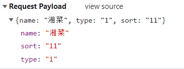

```java
//新增分类
@PostMapping
public R<String> save(@RequestBody Category category){
    log.info("category:{}",category);
    categoryService.save(category);
    return R.success("新增分类成功");
}
```

#### 菜品分类信息分页查询

1. 需求分析

系统中的分类很多的时候，如果在一个页面中全部展示出来会显得比较乱，不便于查看，所以一般的系统中都会以分页的方式来展示列表数据。

2. 代码开发

在开发代码之前，需要梳理一下整个程序的执行过程：

* 页面发送ajax请求，将分页查询参数(page.pageSize)提交到服务端
* 服务端Controller接收页面提交的数据并调用Service查询数据
* Service调用Mapper操作数据库，查询分页数据
* Controller将查询到的分页数据响应给页面
* 页面接收到分页数据并通过ElementUI的Table组件展示到页面上

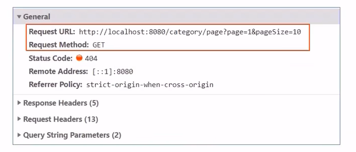

```java
@GetMapping("/page")
public R<Page> page(int page, int pageSize) {
    //构造分页构造器
    Page<Category> pageInfo=new Page<>(page,pageSize);
    //构造条件构造器
    LambdaQueryWrapper<Category> queryWrapper=new LambdaQueryWrapper<>();
    //添加排序条件，根据sort进行排序
    queryWrapper.orderByAsc(Category::getSort);
    //进行分页查询
    categoryService.page(pageInfo,queryWrapper);

    return R.success(pageInfo);
}
```

注意：要把Category中的`private Integer isDeleted;`注释掉才能查询到数据

#### 删除分类

1. 需求分析

在分类管理列表页面，可以对某个分类进行删除操作。需要注意的是**当分类关联了菜品或者套餐时，此分类不允许删除**。

2. 代码开发

* 页面发送ajax请求，将参数(id)提交到服务端
* 服务端Controller接收页面提交的数据并调用Service删除数据
* Service调用Mapper操作数据库

```java
//根据id删除分类
@DeleteMapping
public R<String> delete(Long ids){
    log.info("删除分类，id为{}",ids);
    categoryService.removeById(ids);
    //代码完善之后categoryService.remove(ids);
    return R.success("分类信息删除成功");
}
```

3. 代码完善
前面我们已经实现了根据id删除分类的功能，但是并没有检查删除的分类是否关联了菜品或者套餐，所以我们需要进行功能完善。要完善分类删除功能，需要先准备基础的类和接口：

* 实体类Dish和Setmeal （从课程资料中复制即可)

```java
@Data
public class Dish implements Serializable {

    private static final long serialVersionUID = 1L;

    private Long id;


    //菜品名称
    private String name;


    //菜品分类id
    private Long categoryId;


    //菜品价格
    private BigDecimal price;


    //商品码
    private String code;


    //图片
    private String image;


    //描述信息
    private String description;


    //0 停售 1 起售
    private Integer status;


    //顺序
    private Integer sort;


    @TableField(fill = FieldFill.INSERT)
    private LocalDateTime createTime;


    @TableField(fill = FieldFill.INSERT_UPDATE)
    private LocalDateTime updateTime;


    @TableField(fill = FieldFill.INSERT)
    private Long createUser;


    @TableField(fill = FieldFill.INSERT_UPDATE)
    private Long updateUser;


    //是否删除
    private Integer isDeleted;

}

```

```java
@Data
public class Setmeal implements Serializable {

    private static final long serialVersionUID = 1L;

    private Long id;


    //分类id
    private Long categoryId;


    //套餐名称
    private String name;


    //套餐价格
    private BigDecimal price;


    //状态 0:停用 1:启用
    private Integer status;


    //编码
    private String code;


    //描述信息
    private String description;


    //图片
    private String image;


    @TableField(fill = FieldFill.INSERT)
    private LocalDateTime createTime;


    @TableField(fill = FieldFill.INSERT_UPDATE)
    private LocalDateTime updateTime;


    @TableField(fill = FieldFill.INSERT)
    private Long createUser;


    @TableField(fill = FieldFill.INSERT_UPDATE)
    private Long updateUser;


    //是否删除
    private Integer isDeleted;
}

```

* Mapper接口DishMapper和SetmealMapper

```java
@Mapper
public interface DishMapper extends BaseMapper<Dish> {
}
```

```java
@Mapper
public interface SetmealMapper extends BaseMapper<Setmeal> {
}
```

* Service接口DishService和SetmealService

```java
public interface DishService extends IService<Dish> {
}
```

```java
public interface SetmealService extends IService<Setmeal> {
}
```

* Service实现类DishServicelmpl和SetmealServicelmpl

```java
@Service
public class DishServiceImpl extends ServiceImpl<DishMapper, Dish> implements DishService {
}
```

```java
@Service
public class SetmealServiceImpl extends ServiceImpl<SetmealMapper, Setmeal> implements SetmealService{
}
```

* 在CategoryService添加remove方法

```java
    public interface CategoryService extends IService<Category> {
    public void remove(Long id);
    }
```

* 在CategoryServicelmpl实现remove方法

```java
@Service
public class CategoryServicelmpl extends ServiceImpl<CategoryMapper, Category> implements CategoryService {

    @Autowired
    private DishService dishService;

    @Autowired
    private SetmealService setmealService;

    @Override
    public void remove(Long id) {
        LambdaQueryWrapper<Dish> dishLambdaQueryWrapper=new LambdaQueryWrapper<>();
        //添加查询条件，根据分类id进行查询
        dishLambdaQueryWrapper.eq(Dish::getCategoryId,id);
        int count1 = dishService.count(dishLambdaQueryWrapper);

        //查询当前分类是否关联菜品,如果已经关联，抛出业务异常
        if(count1>0){
            //已经关联菜品，抛出业务异常
            throw new CustomException("已经关联菜品，不能删除");
        }

        //查询当前分类是否关联了套餐，如果已经关联，抛出业务异常
        LambdaQueryWrapper<Setmeal> setmealLambdaQueryWrapper=new LambdaQueryWrapper<>();
        //添加查询条件，根据分类id进行查询
        setmealLambdaQueryWrapper.eq(Setmeal::getCategoryId,id);
        int count2 = setmealService.count(setmealLambdaQueryWrapper);

        if(count2>0){
            //已经关联套餐，抛出业务异常
            throw new CustomException("已经关联套餐，不能删除");
        }
        //正常删除分类
        super.removeById(id);
    }
}

```

* 定义异常类CustomException

```java
public class CustomException extends RuntimeException{
    public CustomException(String message){
        super(message);
    }
}
```

* 在全局异常处理器GlobalExceptionHandler添加

```java
//进行异常处理方法
@ExceptionHandler(CustomException.class)
public R<String> exceptionHandler(CustomException ex){
    log.error(ex.getMessage());

    return R.error(ex.getMessage());
}
```

#### 修改分类

1. 需求分析

在分类管理列表页面点击修改按钮，弹出修改窗口，在修改窗口回显分类信息并进行修改，最后点击确定按钮完成修改操作

2. 代码实现

```java
//修改分类
@PutMapping
public R<String> update(@RequestBody Category category){
    categoryService.updateById(category);
    return R.success("分类修改成功");
```

### 菜品管理模块

#### 文件上传与下载

1. 文件上传介绍

文件上传，也称为upload，是指将本地图片、视频、音频等文件上传到服务器上，可以供其他用户浏览或下载的过程。文件上传在项目中应用非常广泛，我们经常发微博、发微信朋友圈都用到了文件上传功能。

文件上传时，对页面的form表单有如下要求:
`method="post"`　　　　　　　　　          采用post方式提交数据
`enctype="multipart/form-data"`　　　采用multipart格式上传文件
`type="file"`　 　                                       使用input的file控件上传

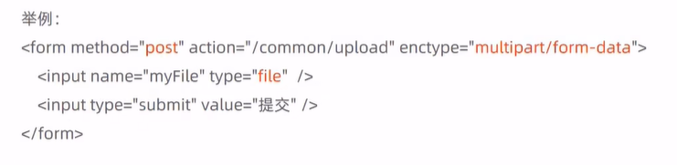

目前一些前端组件库也提供了相应的上传组件，但是底层原理还是基于form表单的文件上传。例如ElementUI中提供的upload上传组件:


服务端要接收客户端页面上传的文件，通常都会使用Apache的两个组件:
    * commons-fileupload
    * commons-io
Spring框架在spring-web包中对文件上传进行了封装，大大简化了服务端代码，我们只需要在Controller的方法中声明一个MultipartFile类型的参数即可接收上传的文件。

2. 文件下载介绍

文件下载，也称为download，是指将文件从服务器传输到本地计算机的过程。
通过浏览器进行文件下载，通常有两种表现形式:
* 以附件形式下载，弹出保存对话框，将文件保存到指定磁盘目录
* 直接在浏览器中打开

通过浏览器进行文件下载，本质上就是服务端将文件以流的形式写回浏览器的过程。

3. 文件上传代码实现

文件上传，页面端可以使用ElementuI提供的上传组件。
可以直接使用资料中提供的上传页面，位置:资料/文件上传下载页面/upload.html

```html
<!DOCTYPE html>
<html lang="en">
<head>
  <meta charset="UTF-8">
  <meta http-equiv="X-UA-Compatible" content="IE=edge">
  <meta name="viewport" content="width=device-width, initial-scale=1.0">
  <title>文件上传</title>
  <!-- 引入样式 -->
  <link rel="stylesheet" href="../../plugins/element-ui/index.css" />
  <link rel="stylesheet" href="../../styles/common.css" />
  <link rel="stylesheet" href="../../styles/page.css" />
    <link rel="shortcut icon" href="../../favicon.ico">
</head>
<body>
   <div class="addBrand-container" id="food-add-app">
    <div class="container">
        <el-upload class="avatar-uploader"
                action="/common/upload"
                :show-file-list="false"
                :on-success="handleAvatarSuccess"
                :before-upload="beforeUpload"
                ref="upload">
            </img>
            <i v-else class="el-icon-plus avatar-uploader-icon"></i>
        </el-upload>
    </div>
  </div>
    <!-- 开发环境版本，包含了有帮助的命令行警告 -->
    <script src="../../plugins/vue/vue.js"></script>
    <!-- 引入组件库 -->
    <script src="../../plugins/element-ui/index.js"></script>
    <!-- 引入axios -->
    <script src="../../plugins/axios/axios.min.js"></script>
    <script src="../../js/index.js"></script>
    <script>
      new Vue({
        el: '#food-add-app',
        data() {
          return {
            imageUrl: ''
          }
        },
        methods: {
          handleAvatarSuccess (response, file, fileList) {
              this.imageUrl = `/common/download?name=${response.data}`
          },
          beforeUpload (file) {
            if(file){
              const suffix = file.name.split('.')[1]
              const size = file.size / 1024 / 1024 < 2
              if(['png','jpeg','jpg'].indexOf(suffix) < 0){
                this.$message.error('上传图片只支持 png、jpeg、jpg 格式！')
                this.$refs.upload.clearFiles()
                return false
              }
              if(!size){
                this.$message.error('上传文件大小不能超过 2MB!')
                return false
              }
              return file
            }
          }
        }
      })
    </script>
</body>
</html>

```

4. 添加CommonController,负责文件上传与下载

```java
@Slf4j
@RestController
@RequestMapping("/common")
public class CommonController {

    //文件上传
    @PostMapping("/upload")
    public R<String> upload(MultipartFile file){
        //file 是一个临时文件，需要转存到指定位置，否则请求完成后临时文件会删除
        log.info("file:{}",file.toString());
        return null;
    }
}
```

**MultipartFile定义的file变量必须与name保持一致**

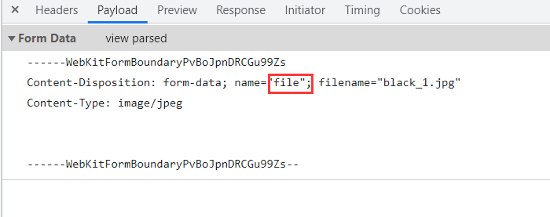

完整代码：
```java
@Slf4j
@RestController
@RequestMapping("/common")
public class CommonController {
    @Value("${reggie.path}")
    private String basePath;

    //文件上传
    @PostMapping("/upload")
    public R<String> upload(MultipartFile file){
        //file 是一个临时文件，需要转存到指定位置，否则请求完成后临时文件会删除
        //log.info("file:{}",file.toString());

        //原始文件名
        String originalFilename = file.getOriginalFilename();
        String suffix = originalFilename.substring(originalFilename.lastIndexOf("."));
        //使用UUID随机生成文件名，防止因为文件名相同造成文件覆盖
        String fileName = UUID.randomUUID().toString()+suffix;

        //创建一个目录对象
        File dir = new File(basePath);
        //判断当前目录是否存在
        if(!dir.exists()){
            //目录不存在
            dir.mkdirs();
        }

        try {
            //将临时文件转存到指定位置
            file.transferTo(new File(basePath+fileName));
        } catch (IOException e) {
            e.printStackTrace();
        }
        return R.success(fileName);
    }
}

```

5. 文件下载代码实现


```java
//文件下载
@GetMapping("/download")
public void download(String name, HttpServletResponse response){
    try {
        //输入流，通过输入流读取文件内容
        FileInputStream fileInputStream=new FileInputStream(new File(basePath+name));
        //输出流，通过输出流将文件写回浏览器，在浏览器中展示图片
        ServletOutputStream outputStream = response.getOutputStream();

        int len=0;
        byte[] bytes = new byte[1024];
        while ((len=fileInputStream.read(bytes))!=-1){
            outputStream.write(bytes,0,len);
            outputStream.flush();
        }
        outputStream.close();
        fileInputStream.close();
    } catch (Exception e) {
        e.printStackTrace();
    }
}
```

#### 新增菜品

1. 需求分析

后台系统中可以管理菜品信息，通过新增功能来添加一个新的菜品，在添加菜品时需要选择当前菜品所属的菜品分类,并且需要上传菜品图片，在移动端会按照菜品分类来展示对应的菜品信息。


2. 数据模型

新增菜品，其实就是将新增页面录入的菜品信息插入到dish表，如果添加了口味做法，还需要向dish_flavor表插入数据。所以在新增菜品时，涉及到两个表：

* dish(菜品表)


* dish_flavor(菜品口味表)


3. 代码开发——准备工作

* 实体类DishFlavor(直接从课程资料中导入即可，Dish实体前面课程中已经导入过了)

```java
@Data
public class DishFlavor implements Serializable {

    private static final long serialVersionUID = 1L;

    private Long id;


    //菜品id
    private Long dishId;


    //口味名称
    private String name;


    //口味数据list
    private String value;


    @TableField(fill = FieldFill.INSERT)
    private LocalDateTime createTime;


    @TableField(fill = FieldFill.INSERT_UPDATE)
    private LocalDateTime updateTime;


    @TableField(fill = FieldFill.INSERT)
    private Long createUser;


    @TableField(fill = FieldFill.INSERT_UPDATE)
    private Long updateUser;


    //是否删除
    private Integer isDeleted;
}

```

* Mapper接口DishFlavorMapper

```java
@Mapper
public interface DishFlavorMapper extends BaseMapper<DishFlavor> {
}

```

* 业务层接口DishFlavorService

```java
public interface DishFlavorService extends IService<DishFlavor> {
}
```

* 业务层实现类 DishFlavorServicelmpl

```java
@Service
public class DishFlavorServiceImpl extends ServiceImpl<DishFlavorMapper, DishFlavor>implements DishFlavorService {
}
```

* 控制层 DishController
  
```java
@RestController
@RequestMapping("/dish")
public class DishController {
    @Autowired
    private DishService dishService;
    @Autowired
    private DishFlavorService dishFlavorService;
}
```

4. 代码开发-梳理交互过程
在开发代码之前，需要梳理一下新增菜品时前端页面和服务端的交互过程:
* 页面(backend/page/food/add.html)发送ajax请求，请求服务端获取菜品分类数据并展示到下拉框中
* 页面发送请求进行图片上传，请求服务端将图片保存到服务器
* 页面发送请求进行图片下载，将上传的图片进行回显
* 点击保存按钮，发送ajax请求，将菜品相关数据以json形式提交到服务端

开发新增菜品功能，其实就是在服务端编写代码去处理前端页面发送的这4次请求即可。

菜品分类下拉框：在CategoryController添加

```java
//根据条件查询分类数据
@GetMapping("/list")
public R<List<Category>> list(Category category){
    //条件构造器
    LambdaQueryWrapper<Category> lambdaQueryWrapper=new LambdaQueryWrapper<>();
    //添加条件
    lambdaQueryWrapper.eq(category.getType()!=null,Category::getType,category.getType());
    //添加排序条件
    lambdaQueryWrapper.orderByAsc(Category::getSort).orderByAsc(Category::getUpdateTime);
    List<Category> list = categoryService.list(lambdaQueryWrapper);
    return R.success(list);
}

```
* 导入DishDto（位置:资料/dto)，用于封装页面提交的数据
> DTO，全称为Data Transfer object，即数据传输对象，一般用于展示层与服务层之间的数据传输。

```java
@Data
public class DishDto extends Dish {

    private List<DishFlavor> flavors = new ArrayList<>();

    private String categoryName;

    private Integer copies;
}

```
新增菜品同时插入菜品对应的口味数据,需要操作两张表：dish、dishflavor

在DishService接口中添加方法saveWithFlavor,在DishServiceImpl实现

```java
@Service
public class DishServiceImpl extends ServiceImpl<DishMapper, Dish> implements DishService {
    @Autowired
    private DishFlavorService dishFlavorService;

    @Override
    @Transactional
    public void saveWithFlavor(DishDto dishDto) {
        //保存菜品基本信息到菜品表dish
        this.save(dishDto);

        Long dishid = dishDto.getId();
        //菜品口味
        List<DishFlavor> flavors = dishDto.getFlavors();
        flavors = flavors.stream().map((item) -> {
            item.setDishId(dishid);
            return item;
        }).collect(Collectors.toList());
        //dishFlavorService.saveBatch(dishDto.getFlavors());
        //保存菜品口味到菜品数据表dish_flavor
        dishFlavorService.saveBatch(flavors);
    }
}

```
由于以上代码涉及多表操作，在启动类上开启事务支持添加`@EnableTransactionManagement`注解，但是本人添加该注解会报错，项目启动会失败，并且springboot该注解应该是默认开启的，故没有添加

```java
@PostMapping
public R<String> save(@RequestBody DishDto dishDto){
    dishService.saveWithFlavor(dishDto);
    return R.success("新增菜品成功");
}
```

#### 菜品信息分页查询

1. 需求分析

系统中的菜品数据很多的时候，如果在一个页面中全部展示出来会显得比较乱，不便于查看，所以一般的系统中都会以分页的方式来展示列表数据。


2. 代码开发-梳理交互过程

在开发代码之前，需要梳理一下菜品分页查询时前端页面和服务端的交互过程:

* 页面`(backend/page/food/list.html)`发送ajax请求，将分页查询参数`(page、pageSize、name)`提交到服务端，获取分页数据
* 页面发送请求，请求服务端进行图片下载，用于页面图片展示

开发菜品信息分页查询功能，其实就是在服务端编写代码去处理前端页面发送的这2次请求即可。

```java
@GetMapping("/page")
public R<Page> page(int page, int pageSize, String name) {
  //构造分页构造器
  Page<Dish> pageInfo = new Page<>(page, pageSize);

  Page<DishDto> dishDtoPage = new Page<>();

  //构造条件构造器
  LambdaQueryWrapper<Dish> queryWrapper = new LambdaQueryWrapper<>();

  //添加过滤条件
  queryWrapper.like(!StringUtils.isEmpty(name), Dish::getName, name);

  //添加排序条件
  queryWrapper.orderByDesc(Dish::getUpdateTime);

  //进行分页查询
  dishService.page(pageInfo, queryWrapper);

  //对象拷贝
  BeanUtils.copyProperties(pageInfo,dishDtoPage,"records");

  List<Dish> records = pageInfo.getRecords();
  List<DishDto> list=records.stream().map((item)->{
    DishDto dishDto=new DishDto();

    BeanUtils.copyProperties(item,dishDto);
    Long categoryId = item.getCategoryId();
    //根据id查分类对象
    Category category = categoryService.getById(categoryId);
    if(category!=null){
      String categoryName = category.getName();
      dishDto.setCategoryName(categoryName);
    }
    return dishDto;
  }).collect(Collectors.toList());

  dishDtoPage.setRecords(list);

  return R.success(dishDtoPage);
}

```

#### 修改菜品

1. 需求分析

在菜品管理列表页面点击修改按钮，跳转到修改菜品页面，在修改页面回显菜品相关信息并进行修改，最后点击确定按钮完成修改操作


2. 代码开发——梳理交互过程

在开发代码之前，需要梳理一下修改菜品时前端页面（ add.html)和服务端的交互过程:

* 页面发送ajax请求，请求服务端获取分类数据，用于菜品分类下拉框中数据展示
* 页面发送ajax请求，请求服务端，根据id查询当前菜品信息，用于菜品信息回显

    * DishController处理Get请求
    ```java
    //根据Id查询菜品信息与对应的口味信息
    @GetMapping("/{id}")
    public R<DishDto> getById(@PathVariable Long id){
        DishDto dishDto = dishService.getByIdWithFlavor(id);
        return R.success(dishDto);
}
    ```
    * 在DishServiceImpl添加getByIdWithFlavor方法
```java
    @Override
    @Transactional
    public DishDto getByIdWithFlavor(Long id) {
        //查询菜品基本信息
        Dish dish = this.getById(id);
        DishDto dishDto=new DishDto();
        BeanUtils.copyProperties(dish,dishDto);
        //查询菜品口味信息
        LambdaQueryWrapper<DishFlavor> queryWrapper=new LambdaQueryWrapper<>();
        queryWrapper.eq(DishFlavor::getDishId,dish.getId());
        List<DishFlavor> list = dishFlavorService.list(queryWrapper);
        dishDto.setFlavors(list);
        return dishDto;
    } 
```


* 页面发送请求，请求服务端进行图片下载，用于页图片回显
* 点击保存按钮，页面发送ajax请求，将修改后的菜品相关数据以json形式提交到服务端

    * 在DishController添加put方法
    ```java
    //修改菜品
    @PutMapping
    public R<String> update(@RequestBody DishDto dishDto){
        dishService.updateWithFlavor(dishDto);
        return R.success("修改菜品成功");
    }
    ```
    * 在DishServiceImpl添加updateWithFlavor方法
    
    ```java
    @Override
    public void updateWithFlavor(DishDto dishDto) {
    //更新dish表基本信息
    this.updateById(dishDto);

    //更新dish_flavor表信息delete操作
    LambdaQueryWrapper<DishFlavor> queryWrapper = new LambdaQueryWrapper<>();
    queryWrapper.eq(DishFlavor::getDishId, dishDto.getId());
    dishFlavorService.remove(queryWrapper);

    //更新dish_flavor表信息insert操作
    List<DishFlavor> flavors = dishDto.getFlavors();

    flavors = flavors.stream().map((item) -> {
        item.setDishId(dishDto.getId());
        return item;
    }).collect(Collectors.toList());

    dishFlavorService.saveBatch(flavors);
    }

    ```
    
#### 停售/起售菜品，删除菜品

1. 需求分析
在商品买卖过程中，商品停售，起售可以更加方便的让用户知道店家还有什么类型的商品在卖。删除方法也更方便的管理菜品

2. 代码实现

在DishController添加sale方法与delete方法,通过数组保存ids，批量起售停售、删除都能生效

```java
//停售起售菜品
@PostMapping("/status/{status}")
public R<String> sale(@PathVariable int status,
                      String[] ids){
    for(String id: ids){
        Dish dish = dishService.getById(id);
        dish.setStatus(status);
        dishService.updateById(dish);
    }
    return R.success("修改成功");
}
//删除菜品
@DeleteMapping
public R<String> delete(String[] ids){
    for (String id:ids) {
        dishService.removeById(id);
    }
    return R.success("删除成功");
}
```

### 套餐管理模块

#### 新增套餐

1. 需求分析
套餐就是菜品的集合。
后台系统中可以管理套餐信息，通过新增套餐功能来添加一个新的套餐，在添加套餐时需要选择当前套餐所属的套餐分类和包含的菜品，并且需要上传套餐对应的图片，在移动端会按照套餐分类来展示对应的套餐。

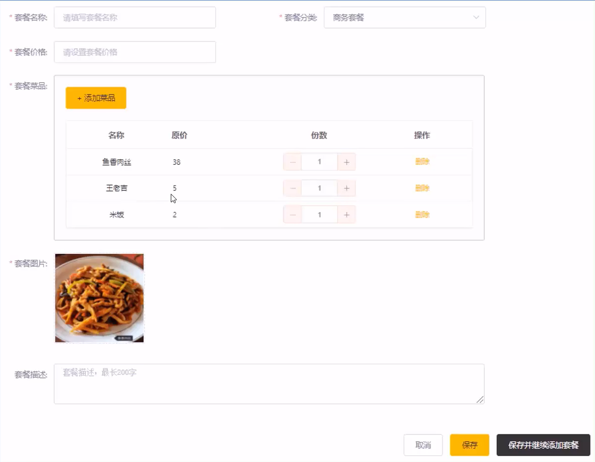

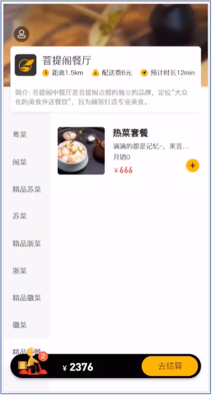

2. 数据模型
新增套餐，其实就是将新增页面录入的套餐信息插入到setmeal表，还需要向setmeal_dish表插入套餐和菜品关联数据。所以在新增套餐时，涉及到两个表:

* setmeal：套餐表
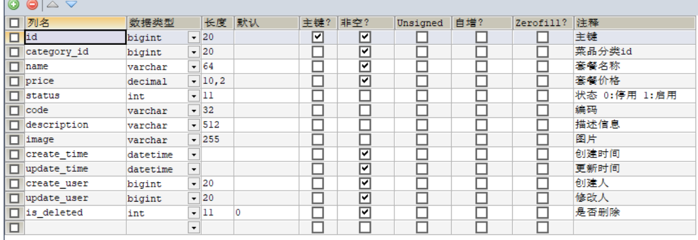

* setmeal_dish：套餐菜品关系表


3. 代码开发-准备工作

在开发业务功能前，先将需要用到的类和接口基本结构创建好:
    * 实体类SetmealDish(直接从课程资料中导入即可，Setmeal实体前面+ 课程中已经导入过了)
    * DTO SetmealDto(直接从课程资料中导入即可)
    * Mapper接口SetmealDishMapper
    * 业务层接口SetmealDishService
    * 业务层实现类SetmealDishServicelmpl
    * 控制层SetmealController

4， 代码开发-梳理交互过程
在开发代码之前，需要梳理一下新增套餐时前端页面和服务端的交互过程:
* 页面(backend/ page/comboladd.html)发送ajax请求，请求服务端获取套餐分类数据并展示到下拉框中
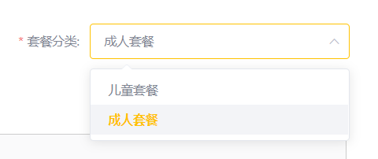
* 页面发送ajax请求，请求服务端获取菜品分类数据并展示到添加菜品窗口中
* 页面发送ajax请求，请求服务端，根据菜品分类查询对应的菜品数据并展示到添加菜品窗口中

* 在DishController添加list方法

```java
//根据条件查询对应菜品数据
@GetMapping("/list")
public R<List<Dish>> list(Dish dish){

    //构造查询条件
    LambdaQueryWrapper<Dish> lambdaQueryWrapper=new LambdaQueryWrapper<>();
    //添加条件，查询状态为1的（起售状态）
    lambdaQueryWrapper.eq(Dish::getStatus,1);
    lambdaQueryWrapper.eq(dish.getCategoryId()!=null,Dish::getCategoryId,dish.getCategoryId());
    //条件排序条件
    lambdaQueryWrapper.orderByAsc(Dish::getSort).orderByDesc(Dish::getUpdateTime);

    List<Dish> list=dishService.list(lambdaQueryWrapper);

    return R.success(list);
}

```


* 页面发送请求进行图片上传，请求服务端将图片保存到服务器
* 页面发送请求进行图片下载，将上传的图片进行回显
* 点击保存按钮，发送ajax请求，将套餐相关数据以json形式提交到服务端

在SetmealServiceImpl实现saveWithDish方法：新增套餐，同时要保持与菜品的关联关系

```java
@Service
public class SetmealServiceImpl extends ServiceImpl<SetmealMapper, Setmeal> implements SetmealService{

    @Autowired
    private SetmealDishService setmealDishService;

    //新增套餐，同时要保持与菜品的关联关系
    @Override
    @Transactional
    public void saveWithDish(SetmealDto setmealDto) {
        //保存套餐基本信息，操作setmeal，执行insert操作
        this.save(setmealDto);

        List<SetmealDish> setmealDishes = setmealDto.getSetmealDishes();

        setmealDishes.stream().map((item)->{
            item.setSetmealId(setmealDto.getId());
            return item;
        }).collect(Collectors.toList());

        //保存套餐和菜品的关联信息，操作setmeal_dish，执行insert操作
        setmealDishService.saveBatch(setmealDishes);

    }
}

```

在SetmealController添加save方法

```java
@RestController
@RequestMapping("/setmeal")
@Slf4j
public class SetmealController {
    @Autowired
    private SetmealService setmealService;

    @Autowired
    private SetmealDishService setmealDishService;

    @PostMapping
    public R<String> save(@RequestBody SetmealDto setmealDto){
        log.info("setmeal:{}",setmealDto);
        setmealService.saveWithDish(setmealDto);
        return R.success("新增套餐成功");
    }
}

```

#### 套餐分页查询
1. 需求分析
系统中的套餐数据很多的时候，如果在一个页面中全部展示出来会显得比较乱，不便于查看，所以一般的系统中都会以分页的方式来展示列表数据。

2. 代码开发-梳理交互过程

在开发代码之前，需要梳理一下套餐分页查询时前端页面和服务端的交互过程:

* 页面`(backend/page/combo/list.html)`发送ajax请求，将分页查询参数`(page、pageSize、name)`提交到服务端，获取分页数据

* 页面发送请求，请求服务端进行图片下载，用于页面图片展示

```java
@GetMapping("/page")
public R<Page> page(int page,int pageSize,String name){
    //构造分页构造器
    Page<Setmeal> pageInfo=new Page<>(page,pageSize);

    Page<SetmealDto> pageDtoInfo=new Page<>();
    //构造条件构造器
    LambdaQueryWrapper<Setmeal> queryWrapper=new LambdaQueryWrapper<>();
    //根据name进行模糊查询
    queryWrapper.like(!StringUtils.isEmpty(name),Setmeal::getName,name);
    //添加排序条件，根据sort进行排序
    queryWrapper.orderByDesc(Setmeal::getUpdateTime);
    //进行分页查询
    setmealService.page(pageInfo,queryWrapper);

    //对象拷贝
    BeanUtils.copyProperties(pageInfo,pageDtoInfo,"records");

    List<Setmeal> records=pageInfo.getRecords();

    List<SetmealDto> list= records.stream().map((item)->{
        SetmealDto setmealDto=new SetmealDto();

        BeanUtils.copyProperties(item,setmealDto);
        Long categoryId = item.getCategoryId();
        //根据id查分类对象
        Category category = categoryService.getById(categoryId);
        if(category!=null){
            String categoryName = category.getName();
            setmealDto.setCategoryName(categoryName);
        }
        return setmealDto;
    }).collect(Collectors.toList());

    pageDtoInfo.setRecords(list);

    return R.success(pageDtoInfo);
}

```

#### 删除、起售、停售套餐
1. 需求分析
在套餐管理列表页面点击删除按钮，可以删除对应的套餐信息。也可以通过复选框选择多个套餐，点击批量删除按钮一次删除多个套餐。注意，对于状态为售卖中的套餐不能删除，需要先停售，然后才能删除。
2. 代码实现
开发删除套餐功能，其实就是在服务端编写代码去处理前端页面发送的这2次请求即可。
观察删除单个套餐和批量删除套餐的请求信息可以发现，两种请求的地址和请求方式都是相同的，不同的则是传递的id个数，所以在服务端可以提供一个方法来统一处理。

```java
@DeleteMapping
public R<String> delete(String[] ids){
    int index=0;
    for(String id:ids) {
        Setmeal setmeal = setmealService.getById(id);
        if(setmeal.getStatus()!=1){
            setmealService.removeById(id);
        }else {
            index++;
        }
    }
    if (index>0&&index==ids.length){
        return R.error("选中的套餐均为启售状态，不能删除");
    }else {
        return R.success("删除成功");
    }
}

@PostMapping("/status/{status}")
public R<String> sale(@PathVariable int status,String[] ids){
    for (String id:ids){
        Setmeal setmeal = setmealService.getById(id);
        setmeal.setStatus(status);
        setmealService.updateById(setmeal);
    }
    return R.success("修改成功");
}

```

#### 修改套餐
1. 需求分析
在套餐管理列表页面点击修改按钮，跳转到修改套餐页面，在修改页面回显套餐相关信息并进行修改，最后点击确定按钮完成修改操作

2. 代码开发-梳理交互过程

在开发代码之前，需要梳理一下修改套餐时前端页面（ add.html）和服务端的交互过程:

* 页面发送ajax请求，请求服务端获取分类数据，用于套餐分类下拉框中数据展示
* 页面发送ajax请求，请求服务端，根据id查询当前套餐信息，用于套餐信息回显
    * SetmealController处理Get请求

    ```java
    //根据Id查询套餐信息
    @GetMapping("/{id}")
    public R<SetmealDto> getById(@PathVariable Long id){
        SetmealDto setmealDto=setmealService.getByIdWithDish(id);
        return R.success(setmealDto);
    }
    ```
    * SetmealServiceImpl添加getByIdWithDish方法

```java
    @Override
    public SetmealDto getByIdWithDish(Long id) {
        //查询套餐基本信息
        Setmeal setmeal = this.getById(id);
        SetmealDto setmealDto = new SetmealDto();
        BeanUtils.copyProperties(setmeal, setmealDto);

        //查询套餐菜品信息
        LambdaQueryWrapper<SetmealDish> queryWrapper=new LambdaQueryWrapper<>();
        queryWrapper.eq(SetmealDish::getSetmealId,setmeal.getId());
        List<SetmealDish> list = setmealDishService.list(queryWrapper);

        setmealDto.setSetmealDishes(list);
        return setmealDto;
    }
```


* 页面发送请求，请求服务端进行图片下载，用于页图片回显
* 点击保存按钮，页面发送ajax请求，将修改后的菜品相关数据以json形式提交到服务端
    * 在SetmealServiceImpl添加updateWithDish方法

```java
    @Override
public void updateWithDish(SetmealDto setmealDto) {
    //更新setmeal表基本信息
    this.updateById(setmealDto);

    //更新setmeal_dish表信息delete操作
    LambdaQueryWrapper<SetmealDish> queryWrapper = new LambdaQueryWrapper<>();
    queryWrapper.eq(SetmealDish::getSetmealId, setmealDto.getId());
    setmealDishService.remove(queryWrapper);

    //更新setmeal_dish表信息insert操作
    List<SetmealDish> SetmealDishes = setmealDto.getSetmealDishes();

    SetmealDishes = SetmealDishes.stream().map((item) -> {
        item.setSetmealId(setmealDto.getId());
        return item;
    }).collect(Collectors.toList());

    setmealDishService.saveBatch(SetmealDishes);
}
```

   * 在SetmealController处理put请求

```java
//修改套餐
@PutMapping
public R<String> update(@RequestBody SetmealDto setmealDto){
    setmealService.updateWithDish(setmealDto);
    return R.success("修改成功");
}
```

### 手机验证码登录

#### 短信发送
1. 短信服务介绍
目前市面上有很多第三方提供的短信服务，这些第三方短信服务会和各个运营商（移动、联通、电信)对接，我们只需要注册成为会员并且按照提供的开发文档进行调用就可以发送短信。需要说明的是，这些短信服务一般都是收费服务。
常用短信服务:
* 阿里云
* 华为云
* 腾讯云
* 京东
* 梦网
* 乐信

2. 阿里云短信服务-介绍

阿里云短信服务（Short Message Service)是广大企业客户快速触达手机用户所优选使用的通信能力。调用API或用群发助手，即可发送验证码、通知类和营销类短信;国内验证短信秒级触达，到达率最高可达99%;国际/港澳台短信覆盖200多个国家和地区，安全稳定，广受出海企业选用。
应用场景:
* 验证码
* 短信通知
* 推广短信

3. 阿里云短信服务-注册账号

阿里云官网: [阿里云](https://www.aliyun.com/)
点击官网首页注册按钮。

4. 阿里云短信服务-设置短信签名
注册成功后，点击登录按钮进行登录。登录后进入短信服务管理页面，选择国内消息菜单:

短信签名是短信发送者的署名，表示发送方的身份。

5. 阿里云短信服务-设置短信模板

切换到【模板管理】标签页:


短信模板包含短信发送内容、场景、变量信息。

6. 阿里云短信服务-设置AccessKey

光标移动到用户头像上，在弹出的窗口中点击【AccessKey管理】∶


7. 代码开发
使用阿里云短信服务发送短信，可以参照官方提供的文档即可。
具体开发步骤:

* 导入maven坐标

```xml
 <dependency>
  <groupId>com.aliyun</groupId>
  <artifactId>aliyun-java-sdk-core</artifactId>
  <version>4.5.16</version>
</dependency>
<dependency>
    <groupId>com.aliyun</groupId>
    <artifactId>aliyun-java-sdk-dysmsapi</artifactId>
    <version>1.1.0</version>
</dependency>
```
* 调用API

```java
public class SMSUtils {

	/**
	 * 发送短信
	 * @param signName 签名
	 * @param templateCode 模板
	 * @param phoneNumbers 手机号
	 * @param param 参数
	 */
	public static void sendMessage(String signName, String templateCode,String phoneNumbers,String param){
		DefaultProfile profile = DefaultProfile.getProfile("cn-hangzhou", "", "");
		IAcsClient client = new DefaultAcsClient(profile);

		SendSmsRequest request = new SendSmsRequest();
		request.setSysRegionId("cn-hangzhou");
		request.setPhoneNumbers(phoneNumbers);
		request.setSignName(signName);
		request.setTemplateCode(templateCode);
		request.setTemplateParam("{\"code\":\""+param+"\"}");
		try {
			SendSmsResponse response = client.getAcsResponse(request);
			System.out.println("短信发送成功");
		}catch (ClientException e) {
			e.printStackTrace();
		}
	}
}

```

#### 手机验证码登录

1. 需求分析
为了方便用户登录，移动端通常都会提供通过手机验证码登录的功能。
手机验证码登录的优点:
* 方便快捷，无需注册，直接登录
* 使用短信验证码作为登录凭证，无需记忆密码
* 安全
登录流程:
    输入手机号>获取验证码>输入验证码>点击登录>登录成功
注意:通过手机验证码登录，手机号是区分不同用户的标识。
2. 数据模型
通过手机验证码登录时，涉及的表为user表，即用户表。结构如下:


3. 代码开发

在开发代码之前，需要梳理一下登录时前端页面和服务端的交互过程:
    * 在登录页面(front/page/login.html)输入手机号，点击【获取验证码】按钮，页面发送ajax请求，在服务端调用短信服务API给指定手机号发送验证码短信
    * 在登录页面输入验证码，点击【登录】按钮，发送ajax请求，在服务端处理登录请求

开发手机验证码登录功能，其实就是在服务端编写代码去处理前端页面发送的这2次请求即可。
在开发业务功能前，先将需要用到的类和接口基本结构创建好:
    * 实体类User(直接从课程资料中导入即可)
    * Mapper接口UserMapper
    * 业务层接口UserService
    * 业务层实现类UserServicelmpl
    * 控制层UserController
    * 工具类SMSutils、 ValidateCodeutils（直接从课程资料中导入即可)

前面我们已经完成了LogincheckFilter过滤器的开发，此过滤器用于检查用户的登录状态。我们在进行手机验证码登录时，发送的请求需要在此过滤器处理时直接放行。


LoginCheckFilter过滤器添加

```java
//        4-2、判断登录状态，如果已登录，则直接放行
if (request.getSession().getAttribute("user") != null) {
    log.info("用户已登录，用户id为：{}", request.getSession().getAttribute("user"));

    Long userId= (Long) request.getSession().getAttribute("user");

    BaseContext.setCurrentId(userId);

    filterChain.doFilter(request, response);
    return;
}
```

**由于资料中代码不全login.js自行添加**

```js
function sendMsgApi(data) {
    return $axios({
        'url':'/user/sendMsg',
        'method':'post',
        data
    })
}
```

login.html

```html
    // this.form.code = (Math.random()*1000000).toFixed(0)
    sendMsgApi({phone:this.form.phone})
```

UserController处理post请求（发送验证码的请求）

```java
@PostMapping("/sendMsg")
public R<String> sendMsg(@RequestBody User user, HttpSession session){
    //获取手机号
    String phone=user.getPhone();
    if(!StringUtils.isEmpty(phone)) {
        //生成随机的4位验证码
        String code = ValidateCodeUtils.generateValidateCode(4).toString();
        log.info("code={}",code);
        //调用阿里云提供的短信服务API完成发送短信
        //SMSUtils.sendMessage("瑞吉外卖","",phone,code);

        //需要将生成的验证码保存到Session
        session.setAttribute(phone,code);
        return R.success("手机验证码短信发送成功");
    }
    return R.error("手机短信发送失败");
}

```

由于前端页面有部分代码缺失，建议拷贝资料中day05的front代码

在UserController编写login处理post请求

```java
@PostMapping("/login")
public R<User> login(@RequestBody Map map, HttpSession session) {
    log.info("map:{}", map.toString());
    //获取手机号
    String phone = map.get("phone").toString();
    //获取验证码
    String code = map.get("code").toString();
    //从Session中获取保存的验证码
    Object codeInSession = session.getAttribute(phone);
    //进行验证码比对（页面提交的验证码和Session中保存的验证码比对）
    if (codeInSession != null && codeInSession.equals(code)) {
        //如果能够比对成功，说明登录成功

        LambdaQueryWrapper<User> queryWrapper = new LambdaQueryWrapper<>();
        queryWrapper.eq(User::getPhone, phone);
        User user = userService.getOne(queryWrapper);
        if (user == null) {
            //判断当前手机号是否为新用户，如果是新用户则自动完成注册
            user = new User();
            user.setPhone(phone);
            user.setStatus(1);
            userService.save(user);
        }
        session.setAttribute("user",user.getId());
        return R.success(user);
    }
    return R.error("登陆失败");
}

```

4. 效果展示


### 用户地址簿模块

#### 需求分析

地址簿，指的是移动端消费者用户的地址信息，用户登录成功后可以维护自己的地址信息。同一个用户可以有多个地址信息，但是**只能有一个默认地址**。


#### 数据模型

用户的地址信息会存储在address_book表，即地址簿表中。具体表结构如下:


#### 导入功能代码

功能代码清单:
    * 实体类AddressBook(直接从课程资料中导入即可)
    * Mapper接口AddressBookMapper
    * 业务层接口AddressBookService
    * 业务层实现类AddressBookServicelmpl
    * 控制层AddressBookController(直接从课程资料中导入即可)
    
```java
@Slf4j
@RestController
@RequestMapping("/addressBook")
public class AddressBookController {

    @Autowired
    private AddressBookService addressBookService;

    /**
     * 新增
     */
    @PostMapping
    public R<AddressBook> save(@RequestBody AddressBook addressBook) {
        addressBook.setUserId(BaseContext.getCurrentId());
        log.info("addressBook:{}", addressBook);
        addressBookService.save(addressBook);
        return R.success(addressBook);
    }

    /**
     * 设置默认地址
     */
    @PutMapping("default")
    public R<AddressBook> setDefault(@RequestBody AddressBook addressBook) {
        log.info("addressBook:{}", addressBook);
        LambdaUpdateWrapper<AddressBook> wrapper = new LambdaUpdateWrapper<>();
        wrapper.eq(AddressBook::getUserId, BaseContext.getCurrentId());
        wrapper.set(AddressBook::getIsDefault, 0);
        //SQL:update address_book set is_default = 0 where user_id = ?
        addressBookService.update(wrapper);

        addressBook.setIsDefault(1);
        //SQL:update address_book set is_default = 1 where id = ?
        addressBookService.updateById(addressBook);
        return R.success(addressBook);
    }

    /**
     * 根据id查询地址
     */
    @GetMapping("/{id}")
    public R get(@PathVariable Long id) {
        AddressBook addressBook = addressBookService.getById(id);
        if (addressBook != null) {
            return R.success(addressBook);
        } else {
            return R.error("没有找到该对象");
        }
    }

    /**
     * 查询默认地址
     */
    @GetMapping("default")
    public R<AddressBook> getDefault() {
        LambdaQueryWrapper<AddressBook> queryWrapper = new LambdaQueryWrapper<>();
        queryWrapper.eq(AddressBook::getUserId, BaseContext.getCurrentId());
        queryWrapper.eq(AddressBook::getIsDefault, 1);

        //SQL:select * from address_book where user_id = ? and is_default = 1
        AddressBook addressBook = addressBookService.getOne(queryWrapper);

        if (null == addressBook) {
            return R.error("没有找到该对象");
        } else {
            return R.success(addressBook);
        }
    }

    /**
     * 查询指定用户的全部地址
     */
    @GetMapping("/list")
    public R<List<AddressBook>> list(AddressBook addressBook) {
        addressBook.setUserId(BaseContext.getCurrentId());
        log.info("addressBook:{}", addressBook);

        //条件构造器
        LambdaQueryWrapper<AddressBook> queryWrapper = new LambdaQueryWrapper<>();
        queryWrapper.eq(null != addressBook.getUserId(), AddressBook::getUserId, addressBook.getUserId());
        queryWrapper.orderByDesc(AddressBook::getUpdateTime);

        //SQL:select * from address_book where user_id = ? order by update_time desc
        return R.success(addressBookService.list(queryWrapper));
    }
}

```

#### 功能测试


### 菜品展示模块
#### 需求分析
用户登录成功后跳转到系统首页，在首页需要根据分类来展示菜品和套餐。如果菜品设置了口味信息需要展示 [选择规格] 按钮，否则显示 [+] 按钮。
#### 代码开发
1. 代码开发-梳理交互过程
在开发代码之前，需要梳理一下前端页面和服务端的交互过程:
* 页面(front/index.html)发送ajax请求，获取分类数据（菜品分类和套餐分类)
* 页面发送ajax请求，获取第一个分类下的菜品或者套餐

开发菜品展示功能，其实就是在服务端编写代码去处理前端页面发送的这2次请求即可。

**注意:首页加载完成后，还发送了一次ajax请求用于加载购物车数据，此处可以将这次请求的地址暂时修改一下，从静态json文件获取数据，等后续开发购物车功能时再修改回来，如下:**

```js
//获取购物车内商品的集合
function cartListApi(data) {
    return $axios({
        // 'url': '/shoppingCart/list',
        'url':'/front/cartData.json',
        'method': 'get',
        params:{...data}
    })
}

```

cartData.json：`{"code":1,"msg":null,"data":[],"map":{}}`

2. 改造DishController中的list方法

```java
@GetMapping("/list")
public R<List<DishDto>> list(Dish dish) {

    //构造查询条件
    LambdaQueryWrapper<Dish> lambdaQueryWrapper = new LambdaQueryWrapper<>();
    //添加条件，查询状态为1的（起售状态）
    lambdaQueryWrapper.eq(Dish::getStatus, 1);
    lambdaQueryWrapper.eq(dish.getCategoryId() != null, Dish::getCategoryId, dish.getCategoryId());
    //条件排序条件
    lambdaQueryWrapper.orderByAsc(Dish::getSort).orderByDesc(Dish::getUpdateTime);

    List<Dish> list = dishService.list(lambdaQueryWrapper);

    List<DishDto> dishDtoList = list.stream().map((item) -> {
        DishDto dishDto = new DishDto();

        BeanUtils.copyProperties(item, dishDto);
        Long categoryId = item.getCategoryId();
        //根据id查分类对象
        Category category = categoryService.getById(categoryId);
        if (category != null) {
            String categoryName = category.getName();
            dishDto.setCategoryName(categoryName);
        }

        //当前菜品id
        Long dishId = item.getId();
        LambdaQueryWrapper<DishFlavor> queryWrapper = new LambdaQueryWrapper<>();
        queryWrapper.eq(DishFlavor::getDishId, dishId);
        //SQL: select* from dishflavor where dish_id=?;
        List<DishFlavor> dishFlavorlist = dishFlavorService.list(queryWrapper);
        dishDto.setFlavors(dishFlavorlist);
        return dishDto;
    }).collect(Collectors.toList());

    return R.success(dishDtoList);
}

```
3. 在SetmealController里添加list方法显示套餐信息

```java
@GetMapping("/list")
public R<List<Setmeal>> list(Setmeal setmeal){
    LambdaQueryWrapper<Setmeal> queryWrapper=new LambdaQueryWrapper<>();
    queryWrapper.eq(setmeal.getCategoryId()!=null,Setmeal::getCategoryId,setmeal.getCategoryId());
    queryWrapper.eq(setmeal.getStatus()!=null,Setmeal::getStatus,setmeal.getStatus());
    queryWrapper.orderByDesc(Setmeal::getUpdateTime);

    List<Setmeal> list = setmealService.list(queryWrapper);
    return R.success(list);
}

```

4. 功能测试


### 购物车模块

#### 需求分析

移动端用户可以将菜品或者套餐添加到购物车。对于菜品来说，如果设置了口味信息，则需要选择规格后才能加入购物车;对于套餐来说，可以直接点击 [+] 将当前套餐加入购物车。在购物车中可以修改菜品和套餐的数量,也可以清空购物车。


#### 代码开发
1. 代码开发-梳理交互过程

在开发代码之前，需要梳理一下购物车操作时前端页面和服务端的交互过程:
    * 点击 [加入购物车] 或者 [+] 按钮，页面发送ajax请求，请求服务端，将菜品或者套餐添加到购物车
    * 点击购物车图标，页面发送ajax请求，请求服务端查询购物车中的菜品和套餐
    * 点击清空购物车按钮，页面发送ajax请求，请求服务端来执行清空购物车操作


2. 代码开发-准备工作
在开发业务功能前，先将需要用到的类和接口基本结构创建好:
    *  实体类ShoppingCart(直接从课程资料中导入即可)
    * Mapper接口ShoppingCartMapper
    * 业务层接口ShoppingcartService
    * 业务层实现类ShoppingCartServicelmpl
    * 控制层ShoppingCartController

3. 代码开发-添加购物车

```java
@PostMapping("/add")
public R<ShoppingCart> add(@RequestBody ShoppingCart shoppingCart) {
    log.info("购物车数据：{}", shoppingCart);
    //设置用户id，指定当前是哪个用户的购物车数据
    Long currentId = BaseContext.getCurrentId();
    shoppingCart.setUserId(currentId);

    //查询当前菜品或者套餐是否已经在购物车当中
    Long dishId = shoppingCart.getDishId();

    LambdaQueryWrapper<ShoppingCart> queryWrapper = new LambdaQueryWrapper<>();
    queryWrapper.eq(ShoppingCart::getUserId, currentId);

    if (dishId != null) {
        //添加到购物车的为菜品
        queryWrapper.eq(ShoppingCart::getDishId, dishId);
    } else {
        //添加到购物车的为套餐
        queryWrapper.eq(ShoppingCart::getSetmealId, shoppingCart.getSetmealId());
    }
    //SQL:select *from shopping_cart where user_id=? and dish_id/setmeal_id =?
    ShoppingCart cartServiceone = shoppingcartService.getOne(queryWrapper);

    if(cartServiceone!=null) {
        //如果已经存在，则在原来的基础上加一
        Integer number = cartServiceone.getNumber();
        cartServiceone.setNumber(number+1);
        shoppingcartService.updateById(cartServiceone);
    }else {
        //如果不存在，则添加到购物车中，默认为一
        shoppingCart.setNumber(1);
         shoppingCart.setCreateTime(LocalDateTime.now());
        shoppingcartService.save(shoppingCart);
        cartServiceone=shoppingCart;
    }
    return R.success(cartServiceone);
}

```

4. 代码开发-查看购物车

(把前端假数据改回来)

```js
function cartListApi(data) {
    return $axios({
        'url': '/shoppingCart/list',
        // 'url':'/front/cartData.json',
        'method': 'get',
        params:{...data}
    })
}
```

查看购物车

```java
@GetMapping("/list")
public R<List<ShoppingCart>> list(){
    log.info("查看购物车");
    LambdaQueryWrapper<ShoppingCart> queryWrapper=new LambdaQueryWrapper<>();
    queryWrapper.eq(ShoppingCart::getUserId,BaseContext.getCurrentId());
    queryWrapper.orderByDesc(ShoppingCart::getCreateTime);
    List<ShoppingCart> list = shoppingcartService.list(queryWrapper);
    return R.success(list);
}
```

5. 代码开发-清空购物车

```java
@DeleteMapping("/clean")
public R<String> clean(){

    LambdaQueryWrapper<ShoppingCart> queryWrapper=new LambdaQueryWrapper<>();
    queryWrapper.eq(ShoppingCart::getUserId,BaseContext.getCurrentId());
    shoppingcartService.remove(queryWrapper);
    return R.success("清空购物车成功");
}
```

6. 代码开发-减少菜品

```java
@PostMapping("/sub")
public R<ShoppingCart> sub(@RequestBody ShoppingCart shoppingCart){
    Long setmealId = shoppingCart.getSetmealId();
    Long dishId = shoppingCart.getDishId();
    LambdaQueryWrapper<ShoppingCart> queryWrapper=new LambdaQueryWrapper<>();
    queryWrapper.eq(ShoppingCart::getUserId,BaseContext.getCurrentId());

    if (setmealId!=null){
        queryWrapper.eq(ShoppingCart::getSetmealId,setmealId);
    }else {
        queryWrapper.eq(ShoppingCart::getDishId,dishId);
    }
    ShoppingCart one = shoppingcartService.getOne(queryWrapper);
    Integer number = one.getNumber();
    if(number==1){
        shoppingcartService.remove(queryWrapper);
    }else {
        one.setNumber(number-1);
        shoppingcartService.updateById(one);
    }

    return R.success(one);
}
```


### 下单模块

#### 需求分析

移动端用户将菜品或者套餐加入购物车后，可以点击购物车中的 【去结算】 按钮，页面跳转到订单确认页面，点击 【去支付】 按钮则完成下单操作。

#### 数据模型

用户下单业务对应的数据表为orders表和order_detail表:

1. orders:订单表


2. orders_detail:订单明细表


#### 代码开发
1. 代码开发-梳理交互过程

在开发代码之前，需要梳理一下用户下单操作时前端页面和服务端的交互过程:

* 在购物车中点击 【去结算】 按钮，页面跳转到订单确认页面
* 在订单确认页面，发送ajax请求，请求服务端获取当前登录用户的默认地址
* 在订单确认页面，发送ajax请求，请求服务端获取当前登录用户的购物车数据
* 在订单确认页面点击 【去支付】 按钮，发送ajax请求，请求服务端完成下单操作


2. 代码开发-准备工作

在开发业务功能前，先将需要用到的类和接口基本结构创建好:
* 实体类Orders、OrderDetail（直接从课程资料中导入即可)
* Mapper接口OrderMapper、OrderDetailMapper
* 业务层接口OrderService、OrderDetailService
* 业务层实现类OrderServicelmpl、OrderDetailServicelmpl
* 控制层OrderController、OrderDetailController

3. 代码开发

* 在OrderService添加submit方法用于用户下单

```java
@Service
public class OrderServiceImpl extends ServiceImpl<OrderMapper, Orders> implements OrderService {

    @Autowired
    private ShoppingcartService shoppingcartService;

    @Autowired
    private UserService userService;

    @Autowired
    private AddressBookService addressBookService;

    @Autowired
    private OrderDetailService orderDetailService;

    @Override
    @Transactional
    public void submit(Orders orders) {
        //获取当前用户id
        Long currentId = BaseContext.getCurrentId();
        //查询当前用户的购物车数据
        LambdaQueryWrapper<ShoppingCart> queryWrapper=new LambdaQueryWrapper<>();
        queryWrapper.eq(ShoppingCart::getUserId,currentId);
        List<ShoppingCart> list = shoppingcartService.list(queryWrapper);

        if (list==null||list.size()==0){
            throw new CustomException("购物车为空，不能下单");
        }
        //查询用户数据
        User user = userService.getById(currentId);
        //查询地址数据
        Long addressBookId = orders.getAddressBookId();
        AddressBook addressBook = addressBookService.getById(addressBookId);
        if(addressBook==null){
            throw new CustomException("地址有误，不能下单");
        }

        long orderId = IdWorker.getId();//订单号

        AtomicInteger amount=new AtomicInteger(0);

        List<OrderDetail> orderDetails=list.stream().map((item)->{
            OrderDetail orderDetail = new OrderDetail();
            orderDetail.setOrderId(orderId);
            orderDetail.setNumber(item.getNumber());
            orderDetail.setDishFlavor(item.getDishFlavor());
            orderDetail.setDishId(item.getDishId());
            orderDetail.setSetmealId(item.getSetmealId());
            orderDetail.setName(item.getName());
            orderDetail.setImage(item.getImage());
            orderDetail.setAmount(item.getAmount());
            amount.addAndGet(item.getAmount().multiply(new BigDecimal(item.getNumber())).intValue());
            return orderDetail;
        }).collect(Collectors.toList());


        //向订单表中插入一条数据
        orders.setNumber(String.valueOf(orderId));
        orders.setId(orderId);
        orders.setOrderTime(LocalDateTime.now());
        orders.setCheckoutTime(LocalDateTime.now());
        orders.setStatus(2);
        orders.setAmount(new BigDecimal(amount.get()));//计算总金额
        orders.setUserId(currentId);
        orders.setUserName(user.getName());
        orders.setConsignee(addressBook.getConsignee());
        orders.setPhone(addressBook.getPhone());
        orders.setAddress((addressBook.getProvinceName()==null?"":addressBook.getProvinceName())
                +(addressBook.getCityName()==null?"":addressBook.getCityName())
                +(addressBook.getDistrictName()==null?"":addressBook.getDistrictName())
                +(addressBook.getDetail()==null?"":addressBook.getDetail()));
        this.save(orders);

        //向订单明细表中插入多条数据
        orderDetailService.saveBatch(orderDetails);
        //清空购物车数据
        shoppingcartService.remove(queryWrapper);
    }
}

```

* 在OrderController的submit方法处理post请求实现上面的方法

```java
//用户下单
@PostMapping("/submit")
public R<String> submit(@RequestBody Orders orders){
    log.info("订单数据:{}",orders);
    orderService.submit(orders);
    return R.success("下单成功");
}
```

4. 功能测试

* 下单界面


* 下单成功


### 功能补充

#### 用户登出

在UserController添加loginout方法

```java
//用户登出
@PostMapping("/loginout")
public R<String> loginout(HttpServletRequest request){
    //清理Session中保存的当前用户登录的id
    request.getSession().removeAttribute("user");
    return R.success("退出成功");
}
```

#### 订单管理

导入OrderDto需手动添加`private int sumNum;`（前端会计算数量）

在OrderController添加`userPage`方法

```java
//订单管理
@Transactional
@GetMapping("/userPage")
public R<Page> userPage(int page,int pageSize){
    //构造分页构造器
    Page<Orders> pageInfo = new Page<>(page, pageSize);

    Page<OrdersDto> ordersDtoPage = new Page<>();

    //构造条件构造器
    LambdaQueryWrapper<Orders> queryWrapper = new LambdaQueryWrapper<>();

    //添加排序条件
    queryWrapper.orderByDesc(Orders::getOrderTime);

    //进行分页查询
    orderService.page(pageInfo,queryWrapper);

    //对象拷贝
    BeanUtils.copyProperties(pageInfo,ordersDtoPage,"records");

    List<Orders> records=pageInfo.getRecords();

    List<OrdersDto> list = records.stream().map((item) -> {
        OrdersDto ordersDto = new OrdersDto();

        BeanUtils.copyProperties(item, ordersDto);
        Long Id = item.getId();
        //根据id查分类对象
        Orders orders = orderService.getById(Id);
        String number = orders.getNumber();
        LambdaQueryWrapper<OrderDetail> lambdaQueryWrapper=new LambdaQueryWrapper<>();
        lambdaQueryWrapper.eq(OrderDetail::getOrderId,number);
        List<OrderDetail> orderDetailList = orderDetailService.list(lambdaQueryWrapper);
        int num=0;

        for(OrderDetail l:orderDetailList){
            num+=l.getNumber().intValue();
        }

        ordersDto.setSumNum(num);
        return ordersDto;
    }).collect(Collectors.toList());

    ordersDtoPage.setRecords(list);
    
    return R.success(ordersDtoPage);
}

```

#### 再来一单


用户可以通过该方法快速再下一单


在OrderController中添加again方法处理post请求

```java
//再来一单
@Transactional
@PostMapping("/again")
public R<String> again(@RequestBody Orders order1){
    //取得orderId
    Long id = order1.getId();
    Orders orders = orderService.getById(id);
    //设置订单号码
    long orderId = IdWorker.getId();
    orders.setId(orderId);
    //设置订单号码
    String number = String.valueOf(IdWorker.getId());
    orders.setNumber(number);
    //设置下单时间
    orders.setOrderTime(LocalDateTime.now());
    orders.setCheckoutTime(LocalDateTime.now());
    orders.setStatus(2);
    //向订单表中插入一条数据
    orderService.save(orders);
    //修改订单明细表
    LambdaQueryWrapper<OrderDetail> queryWrapper=new LambdaQueryWrapper<>();
    queryWrapper.eq(OrderDetail::getOrderId,id);
    List<OrderDetail> list = orderDetailService.list(queryWrapper);
    list.stream().map((item)->{
        //订单明细表id
        long detailId = IdWorker.getId();
        //设置订单号码
        item.setOrderId(orderId);
        item.setId(detailId);
        return item;
    }).collect(Collectors.toList());

    //向订单明细表中插入多条数据
    orderDetailService.saveBatch(list);
    return R.success("再来一单");
}

```

#### 管理端订单明细

在OrderController添加`page`方法处理get请求

```java
@GetMapping("/page")
public R<Page> page(int page, int pageSize, String number,String beginTime,String endTime){
    //构造分页构造器
    Page<Orders> pageInfo = new Page<>(page, pageSize);

    Page<OrdersDto> ordersDtoPage=new Page<>();
    //构造条件构造器
    LambdaQueryWrapper<Orders> queryWrapper = new LambdaQueryWrapper<>();
    //根据number进行模糊查询
    queryWrapper.like(!StringUtils.isEmpty(number),Orders::getNumber,number);
    //根据Datetime进行时间范围查询

//        log.info("开始时间：{}",beginTime);
//        log.info("结束时间：{}",endTime);
    if(beginTime!=null&&endTime!=null){
        queryWrapper.ge(Orders::getOrderTime,beginTime);
        queryWrapper.le(Orders::getOrderTime,endTime);
    }
    //添加排序条件
    queryWrapper.orderByDesc(Orders::getOrderTime);

    //进行分页查询
    orderService.page(pageInfo,queryWrapper);

    //对象拷贝
    BeanUtils.copyProperties(pageInfo,ordersDtoPage,"records");

    List<Orders> records=pageInfo.getRecords();

    List<OrdersDto> list=records.stream().map((item)->{
        OrdersDto ordersDto=new OrdersDto();

        BeanUtils.copyProperties(item,ordersDto);
        String name="用户"+item.getUserId();
        ordersDto.setUserName(name);
        return ordersDto;
    }).collect(Collectors.toList());

    ordersDtoPage.setRecords(list);
    return R.success(ordersDtoPage);
}

```


#### 外卖订单派送

在OrderController处理post请求修改status

```java
 @PutMapping
public R<String> send(@RequestBody Orders orders){
    Long id = orders.getId();
    Integer status = orders.getStatus();
    LambdaQueryWrapper<Orders> queryWrapper=new LambdaQueryWrapper<>();
    queryWrapper.eq(Orders::getId,id);
    Orders one = orderService.getOne(queryWrapper);
    one.setStatus(status);
    orderService.updateById(one);
    return R.success("派送成功");
}

```


