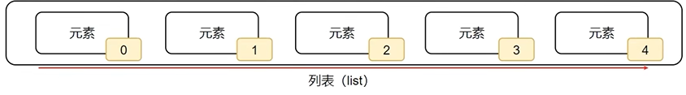
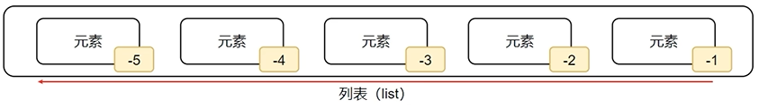
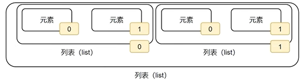

# Python

## 第一章 入门Python

### 下载Python解释器和编译器

* 编译器：[python解释器](https://www.python.org/)
* 编译器：[pycharm](https://www.jetbrains.com.cn/pycharm/)

## 第二章 Python基础语法
### 字面量与字符串
#### 字面量
> 在代码中，被写下来的固定的值，称之为字面量
Python中常用的：6种值（数据）类型

|      类型       |                       描述                        |                                      说明                                       |
| :------------: | :----------------------------------------------: | :----------------------------------------------------------------------------: |
|   数字\(Number\)   | 支持 整数 \(int\) 浮点数 \(float\) 复数\(complex\) 布尔\(bool\) |                               整数\(int\),如:10、\-10                                |
|                |                                                  |                           浮点数\(float\),如:13\.14、\-13\.14                           |
|                |                                                  |                         复数\(complex\),如:4\+3j,以结尾表示复数                          |
|                |                                                  | 布尔\(bool\)表达现实生活中的逻辑,即真和假,True表示真, False表示假。 True本质上是一个数字记作1,,False记作0 |
|  字符串\(String\)  |                 描述文本的一种数据类型                 |                           字符串\(string\)由任意数量的字符组成                           |
|   列表\(List\)    |                    有序的可变序列                    |                       Python中使用最频繁的数据类型,可有序记录一堆数据                       |
|   元组\(Tuple\)   |                   有序的不可变序列                    |                           可有序记录一堆不可变的Python数据集合                           |
|    集合\(Set\)    |                    无序不重复集合                    |                           可无序记录一堆不重复的Python数据集合                           |
| 字典\(Dictionary\) |                  无序Key\-Value集合                   |                        可无序记录一堆Key\-Value型的Python数据集合                         |

#### 字符串

字符串（string），又称文本。是由任意数量的字符如中文、英文、各类符号、数字等组成

> 被引号包围起来的，都是字符串

|     类型     |  程序中的写法   |           说明            |
| :---------: | :---------: | :----------------------: |
|     整数     |   666,\-88    |      和现实中的写法一致       |
| 浮点数\(小数\) | 13\.14,\-5\.21 |      和现实中的写法一致       |
| 字符串\(文本\) |  "黑马程序员"   | 程序中需要加上双引号来表示字符串 |

### 注释

注释：在程序代码中对程序代码进行解释说明的文字

#### 单行注释
`#`为开头
#### 多行注释

```python

"""
    多行注释
"""

```

### 变量

变量：在程序运行时，能存储计算结果或能表示值的抽象概念
变量的定义格式：`变量名称 = 变量的值`
> 变量的值可以改变
>print语句输出多份内容：`print(内容1,内容2，……,内容N)`

### 数据类型

验证数据的类型：`type()`

语法：`type(被查看类型的数据)`

#### 直接输出

```python
print(type("Hello World"))
print(type(555))
print(type(11.123))

"""输出
<class 'str'>
<class 'int'>
<class 'float'>
"""
```

#### 用变量存储`type()`的结果

```python
string_type = type("Hello World")
int_type = type(555)
float_type = type(11.123)

print(string_type)
print(int_type)
print(float_type)
```

> 以上查看的都是字面量类型。此外还可以查看变量中存储的数据类型

```python
name = "sliverAkai"
name_type = type(name)
print(name_type)

```

### 数据类型转换

#### 常见的转换语句

| 语句\(函数\) |           说明           |
| :--------------: | :-----------------------: |
|   int\(x\)    |  将x转换为一个整数   |
|  float\(x\)  | 将x转换为一个浮点数 |
|   str\(x\)    | 将对象x转换为字符串 |

```python
# 将数字类型转为字符串

num_str = str(11)
print(type(num_str),num_str)

float_str = str(11.345)
print(type(float_str),float_str)

float_str = str(11.345)
print(type(float_str),float_str)

# 将字符串转换成数字
num = int("11")
print(type(num), num)
num2 = float("11.345")
print(type(num2), num2)
# 错误示例：想要将字符串转换成数字，必须要求字符串内的内容都是数字
# num3 = int("六六六")
# print(type(num3), num3)

# 整数转浮点数
float_num = float(11)
print(type(float_num), float_num)

# 浮点数转整数
int_num = int(11.345)
print(type(int_num), int_num)

```

* 任何类型都能转字符串
* 字符串不能任意转数字
* 浮点数转整数丢失精度

### 标识符

标识符：变量的名字、方法的名字、类的名字...
标识符命名规范：
1. 只允许出现英文、中文、数字、下划线
2. 数字不可以开头
3. 大小写敏感
4. 不能使用关键字
*不推荐使用中文*

Python中的关键字：

<table><tr><td>False</td><td>True</td><td>None</td><td>and</td><td>as</td><td>assert</td><td>break</td><td>class</td></tr><tr><td>continue</td><td>def</td><td>del</td><td>elif</td><td>else</td><td>except</td><td>finally</td><td>for</td></tr><tr><td>from</td><td>global</td><td>if</td><td>import</td><td>in</td><td>is</td><td>lambda</td><td>nonlocal</td></tr><tr><td>not</td><td>or</td><td>pass</td><td>raise</td><td>return</td><td>try</td><td>while</td><td>with</td></tr><tr><td>yield</td></tr></table>

变量命名规范：
1. 明了、简洁
2. 下划线命名法
3. 英文字母全小写

### 运算符

#### 算术（数学）运算符

| 运算符 |  描述  |                          实例                           |
| :----: | :----: | :-----------------------------------------------------: |
|   +    |   加   |               两个对象相加.a + b输出结果30                |
|   -    |   减   |      得到负数或是一个数减去另一个数。a - b输出结果-10       |
|   *    |   乘   | 两个数相乘或是返回一个被重复若干次的字符串.a * b输出结果 200 |
|   /    |   除   |                      b / a输出结果2                      |
|   //   | 取整除 |   返回商的整数部分.9 // 2输出结果4；9.0 // 2.0输出结果4.0   |
|   %    |  取余  |               返回除法的余数.b % a输出结果0               |
|   **  |  指数  |      a ** b为10的20次方,输出结果0000000000000000000       |

#### 赋值运算符

| 运算符 |    描述    |                           实例                           |
| :----: | :-------: | :------------------------------------------------------: |
|   =    | 赋值运算符 | 把=号右边的结果 赋给左边的变量，如 num=1+2*3，结果num的值为7 |

#### 复合赋值运算符 

| 运算符 |      描述       |            实例             |
| :----: | :-------------: | :-------------------------: |
|  \+=   |  加法赋值运算符  |   c \+= a等效于c = c \+ a   |
|  \-=   |  减法赋值运算符  |  c \-= a等效于 c = c \- a   |
|  \*=   |  乘法赋值运算符  |   c \*= a等效于c = c \* a   |
|   /=   |  除法赋值运算符  |    c /= a等效于c = c / a    |
|   %=   |  取模赋值运算符  |    c %= a等效于c = c % a    |
| \*\*= |   幂赋值运算符   | c \*\*= a等效于c = c \*\* a |
|  //=   | 取整除赋值运算符 |   c //= a等效于c = c // a   |

### 字符串扩展

#### 字符串三种定义方式

* 单引号定义法：`name = 'sliverAkai' ` 
* 双引号定义法：`name = "sliverAkai" ` 
* 三引号定义法：`name = """sliverAkai""" `
> 三引号定义法和多行注释的写法一致，支持换行；使用变量接收就是字符串，反之为注释

#### 字符串的引号嵌套
* 单引号定义法：可以内含双引号
* 双引号定义法：可以内含单引号
* 使用转义字符：使用`\`解除引号的作用

#### 字符串拼接

两个字符串（文本）字面量，可以使用`+`进行拼接

`print("sliver" + "aKai")`
输出结果：`sliverAkai`

>字符串无法直接和数字进行拼接

#### 字符串格式化

>多个变量占位，变量要用括号括起来，并且按照占位的顺序填入

```python
name = "sliverAkai"
age = 24
message = "我叫：%s，今年%s岁。" % (name,age)
print(message)
```

1. 常用的三类数据类型占位

| 格式符号 |             转化              |
| :------: | :--------------------------: |
|    %s    | 将内容转换成字符串,放入占位位置 |
|    %d    |  将内容转换成整数,放入占位位置  |
|    %f    | 将内容转换成浮点型,放入占位位置 |

2. 精度控制：`m.n`
* `m`：控制宽度，要求是数字
* `.n`：控制小数点精度，要求是数字，会进行小数的四舍五入
例：
`%5d`：整数宽度为5位。11设置5d变为`[空][空][空]11`
`%5.2f`：整数宽度为5位，小数精度为2
小数点和小数部分也算入宽度。例，11.345设置`%7.2f`后，结果为`[][]11.35`

3. 快速写法
* `f"内容{变量}"`
* `"%s\%d\%f" %(表达式、表达式、表达式)`

4. 对表达式进行格式化

* 表达式：一条具有明确执行结果的代码语句

```python
name = "sliverAkai"
age = 100
print(f"我是{name},年龄{age}岁")

print("1+1=%d" % (1+1))
print("字符串在Python中的类型名：%s" % type('字符串'))
```

### 数据输入

1. 输出：`print()`
2. 输入：`input()`

`input()`语句可在要求输入者输入内容前进行输出提示内容，如：

```python
name = input("你的年龄是：")
print("你的年龄：" % name)
```
>键盘输入任何类型的数据，获取到的数据永远都是字符串

## 第三章 Python判断语句

布尔类型的字面量：
* `True`：表示真（是、肯定）
* `False`：表示假（否、否定）

### 比较运算符

| 运算符 |                          描述                           |             示例              |
| :----: | :----------------------------------------------------: | :---------------------------: |
|   ==   |         判断内容是否相等,满足为True,不满足为False         |   如a=3,b=3,则a==b\)为 True   |
|  \!=   |        判断内容是否不相等,满足为True,不满足为False         | 如a=1,b=3,则\(a\!= b\)为 True |
|   >    |   判断运算符左侧内容是否大于右侧 满足为True,不满足为False   |   如a=7,b=3,则\(a>b\)为True   |
|   <    |   判断运算符左侧内容是否小于右侧 满足为True,不满足为False   |   如a=3,b=7,则\(a<b\)为True   |
|   >=   | 判断运算符左侧内容是否大于等于右侧 满足为True,不满足为False |  如a=3,b=3,则\(a>=b\)为 True  |
|   <=   | 判断运算符左侧内容是否小于等于右侧 满足为True,不满足为False |  如a=3,b=3,则\(a<=b\)为True   |

### if语句

```python
if 要判断的条件:
    条件成立时，要做的事情
```

* 归属于if判断的代码语句快，需要在前方填充4个空格进行缩进
* 判断条件后有`:`，不可缺少
* 判断条件的结果一定是布尔类型

### if-else语句

```python
if 要判断的条件:
    满足条件时要做的事情1
    满足条件时要做的事情2
    满足条件时要做的事情3
    ...
else:
    不满足条件时要做的事情1
    不满足条件时要做的事情2
    不满足条件时要做的事情3
    ...
```

* else后面不需要写判断条件
* else的代码块也需要4个空格作为缩进

### if-elif-else语句

```python
if 条件1:
    条件1满足时要做的事情
    条件1满足时要做的事情
    ...
elif 条件2:
    条件2满足时要做的事情
    条件2满足时要做的事情
    ...
elif 条件N:
    条件N满足时要做的事情
    条件N满足时要做的事情
else:
    所有条件都不满足要做的事情
    所有条件都不满足要做的事情
    ...
```

* 判断是有互斥且有顺序的
* else可省略不写，效果等同3个独立的if判断
* 可在条件判断中直接写input语句，节省代码量

### 判断语句的嵌套

```python
if 条件1:
    满足条件1 要做的事情1
    满足条件1 要做的事情2
    if 条件2:
        满足条件2 要做的事情1
        满足条件2 要做的事情2
    ...

```

* 嵌套判断语句用于多条件、多层次的逻辑判断
* `if elif else`可以自由组合
* 满足缩进的要求即可

## 第四章 Python循环语句

### while循环基础

```python
while 条件:
    条件满足时，做的事情1
    条件满足时，做的事情2
    条件满足时，做的事情3
```

* 条件需要给出布尔类型的结果
* 注意空格缩进
* 需要给出循环终止条件，否则会无限循环

### while嵌套循环

```python
while 条件1:
    条件满足1时，做的事情1
    条件满足1时，做的事情2
    条件满足1时，做的事情3
    ...
    while 条件2:
        条件满足2时，做的事情1
        条件满足2时，做的事情2
        条件满足2时，做的事情3
        ...
```

* 注意条件的控制，避免无限循环
* 多层嵌套靠缩进来确定层次关系

### 补充知识

1. `print()`输出不换行

>加上`end = ''`就可以了

2. 制表符：`\t`

案例：九九乘法表

```python
i = 1
while i <= 9:  # 控制行数
    # 定义内层循环的控制变量
    j = 1
    while j <= i:
        # 内层循环的print语句，不要换行，通过\t制表符进行对齐
        print(f"{j} * {i} = {j * i}\t", end='')
        j += 1
    i += 1
    print()

```

### for循环的基础语法

#### 基础语法

```python
for 临时变量 in 待处理数据集:
    循环满足条件时执行的代码
```
* for循环无法定义循环条件
* 循环内的语句要有空格缩进

#### `range`语句

> 待处理数据集。严格意义上称之为序列类型

语法1：`range(num)`
`range(5)`取得数据是：`[0,1,2,3,4]`
语法2：`range(num1,num2)`
从num1开始，到num2结束的数字序列（不包含num2本身）
`range(5,10)`取得数据是：`[5,6,7,8,9]`
语法3：`range(num1,num2,step)`
从num1开始，到num2结束的数字序列（不包含num2本身），数字之间的步长用step为准（step默认为1）
`range(5,10,2)`取得数据是：`[5,7,9]`

#### for循环的变量作用域

临时变量，在<font color = "red">编程规范</font>上，作用范围，只限定在for循环内部。如果在for循环外部访问临时变量：
* 实际上可以访问
* 在编程规范上不允许、不建议这么做
* 如果需要访问临时变量，可以预先在循环外定义它

#### for循环的嵌套使用

```python
for 临时变量 in 待处理数据集(序列):
    循环满足条件时应做的事情1
    循环满足条件时应做的事情2  
    循环满足条件时应做的事情N
    ...
        for 临时变量 in 待处理数据集(序列):
        循环满足条件时应做的事情1
        循环满足条件时应做的事情2  
        循环满足条件时应做的事情N
```

> for循环和while循环可以相互嵌套使用

```python
for循环 或 while循环:
    循环满足条件时应做的事情1
    循环满足条件时应做的事情2  
    循环满足条件时应做的事情N
    ...
    for循环 或 while循环:
        循环满足条件时应做的事情1
        循环满足条件时应做的事情2  
        循环满足条件时应做的事情N
```

### continue和break

#### continue

* 用于中断本次循环，直接进入下一次循环

```python
for i in range(1,100)
    语句1
    continue
    语句2 # 该语句不执行
```

* 嵌套使用
```python
for i in range(1,100)
    语句1
    for j in range(1,100)
        语句2    
        continue # 只能影响内部循环
        语句3
    语句4
```

#### break

* 直接结束循环

```python
for i in range(1,100):
    语句1
    break
    语句2 # 该语句不执行
语句3
```

* 嵌套使用

```python
for i in range(1,100)
    语句1
    for j in range(1,100)
        语句2    
        break
        语句3
    语句4
```

### 综合案例

```python
balance = 10000

for employee in range(1, 21):
    import random

    performance = random.randint(1, 10)
    if performance < 5:
        print(f"员工{employee}，绩效分:{performance}。不满足条件")
        continue  # 跳过发放

    # 判断余额
    if balance >= 1000:
        balance -= 1000
        print(f"员工{employee}，绩效分：{performance}。满足条件发放工资1000元。公司账户余额：{balance}")
    else:
        print(f"余额不足，当前余额：{balance}，不足以发工资，下个月再来")
        break  # 结束发放
```

## 第五章 Python函数

### 函数初体验

函数：是组织好的，可重复使用的，用来实现特定功能的代码段

使用函数和不使用函数的区别：

```python
# 不使用len()统计字符串长度
str1 = "itheima"
str2 = "itcast"
str3 = "python"

# 定义计数器
count = 0
for i in str1:
    count += 1
print(f"字符串{str1}的长度是：{count}")
count = 0
for j in str2:
    count += 1
print(f"字符串{str2}的长度是：{count}")
count = 0
for k in str3:
    count += 1
print(f"字符串{str3}的长度是：{count}")


# 使用函数

def my_len(data):
    count = 0
    for i in data:
        count += 1
    print(f"字符串{data}的长度是{count}")
```

### 函数的基础定义语法

函数的定义：

```python
def 函数名(传入参数):
    函数体
    return 返回值
```

函数的调用：

`函数名(参数)`

注意事项：
* 参数若不使用，可以省略
* 返回值如不使用，可以省略
* 函数必须先定义后使用

### 函数的参数

函数的传入参数

>传入参数的功能：在函数进行计算的时候，接受外部（调用时）提供的数据

```python
# 定义函数

def add(x, y):
    result = x + y
    print(f"{x} + {y}的计算结果是：{result}")

# 调用函数

add(1, 4)

```
形参（形式参数）：提供的`x`，`y`。表示函数声明将要使用两个参数
>参数之间用逗号分隔
实参（实际参数）：提供的`1`和`4`。表示函数执行时真正使用的参数值
>传入时，按照顺序传入数据，使用逗号分隔

传入的参数不受限制：
* 可以不使用参数
* 可以使用任意个参数

### 函数的返回值

#### 函数返回值的定义

```python
def 函数名(传入参数):
    函数体
    return 返回值
变量 = 函数(参数)
```

* 函数体遇到`return`就结束了，写在`return`后的代码不会执行

#### None类型

Python中有个特殊的字面量：`None`，类型是`<class 'NoneType'>`
函数返回了None，就表示这个函数没有返回什么有意义的内容，也就是返回了空

```python
# 无return语句的函数返回值

def say_hi():
    print('hello')
result = say_hi()
print(f"无返回值类型，返回的内容是：{result}")
print(f"无返回值类型，返回的内容类型是：{type(result)}")

# 主动返回None
def say_hi2():
    print("你好")
    return None
result = say_hi2()
print(f"无返回值类型，返回的内容是：{result}")
print(f"无返回值类型，返回的内容类型是：{type(result)}")

```

应用场景：

* 用在函数无返回值上
* 用在if判断上
    * ` None`等同于`False`
    * 用于在函数中主动返回`None`，配合if判断做相关处理

```python
def check_age(age):
    if age > 18:
        return "SUCCESS"
    else:
        return None


result = check_age(16)
if not result:
    # 进入if表示result是None值，等同于False
    print("未成年")
```
* 用在声明无内容的变量上
    * 定义变量。但暂时不需要变量有具体值，可以用`None`代替
    
### 函数的说明文档

函数是纯代码语言，想要理解其含义就需要一行行地去阅读理解代码，效率比较低。可以给函数添加说明文档，辅助理解函数的作用

```python
def func(x,y):
    """
    函数说明
    :param x：形参x的说明
    :param y：形参y的说明
    :return：返回值的说明
    """
    函数体
    return 返回值
```

* 内容应该写在函数体之前

### 函数的嵌套调用

函数嵌套调用：一个函数里面又调用了另外一个函数

```python
def func_b():
    print("----2----")
def func_a():
    print("----1----")
    func_b()
    print("----3----")
    
# 调用函数func_a()
func_a()
```

流程：函数A执行到调用函数B的语句，会将函数B全部执行完毕后，继续执行A的剩余内容

### 变量在函数中的作用域

变量的作用域：指的是变量的作用范围。主要分为两类：局部变量和全局变量

局部变量：定义在函数体内部的变量，即在函数体内生效

```python
def testA():
    num = 100
    print(num)
testA() #100
def testA():
    num = 100
    print(num)
testA() #100
print(num) # name 'num' is not defined

```

全局变量：在函数体内外均生效的变量

```python
num = 100
def testA():
    print(num)


def testB():
    print(num)


testA() # 100
testB() # 100
print(num) # 100
```

将函数内定义的变量声明为全局变量：使用`global`关键字

```python
num = 200
def testA():
    print(num)


def testB():
    global num # 设置内部定义的变量为全局变量
    num = 500 # 局部变量
    print(num)

testA() # 200
testB() # 500
print(num) # 500
```

### 综合案例

```python

# 定义全局变量

money = 5000000
name = None

# 要求客户输入姓名

name = input("请输入您的姓名：")


# 定义查询函数
def query(show_header):
    if show_header:
        print("------------查询余额------------")
    print(f"{name}，您好，您的余额剩余{money}元")


# 定义存款函数
def saving(num):
    global money  # money在函数内部定义为全局变量
    money += num
    print("------------存款------------")
    print(f"{name}，您好，您存款{money}元成功")
    # 调用query()函数
    query(False)


# 定义取款函数
def get_money(num):
    global money
    money -= num
    print("------------取款------------")
    print(f"{name}，您好，您取款{money}元成功")
    query(False)


# 定义主菜单函数
def main():
    print("------------主菜单------------")
    print(f"{name}，您好，欢迎来到中国建设银行自助银行机")
    print("查询余额\t[1]")
    print("存款\t\t[2]")
    print("取款\t\t[3]")
    print("退出\t\t[4]")
    return input("请输入您的选择：")


while True:
    keyword_input = main()
    if keyword_input == "1":
        query(True)
        continue  # 通过continue继续下一次循环
    elif keyword_input == "2":
        num = int(input("请输入您要存入的金额："))
        saving(num)
        continue
    elif keyword_input == "3":
        num = int(input("请输入您要取出的金额："))
        get_money(num)
        continue
    else:
        print("程序已退出")
        break

```

## 第六章 Python数据容器

### 数据容器入门

数据容器：一种容纳多份数据的数据类型，容纳的每一份数据被称为1个元素。每一个元素可以是任意类型的数据，如字符串、数字、布尔等

数据容器根据特点的不同，划分为列表（list）、元组（tuple）、字符串（str）、集合（set）、字典（dict）

### 列表（list）

#### 列表的定义

```python
# 字面量
[元素1，元素2，元素3，元素4……]
# 定义变量
变量名称 = [元素1，元素2，元素3，元素4……]

# 定义空列表
变量名称 = []
变量名称 = list()
```

列表内的每一个数据，被称为元素
* 以`[]`作为标识
* 列表内每一个元素之间用`,`隔开

> 列表可以一次存储多个数据，且可以为不同的数据类型，支持嵌套

#### 列表的下标索引

> 取出特定位置的数据，使用下标索引

列表中每一个元素都有下标索引，从前向后，<font color = "red">从0开始，依次递增</font>



```python
my_list = ["Tom", "John", "Smith"]
# 列表[下标索引]
print(my_list[0])
print(my_list[1])
print(my_list[2])
# print(my_list[3])  # list index out of range
```
或者反向索引，从后向前，<font color = "red">从-1开始，依次递减</font>


```python
my_list = ["Tom", "John", "Smith"]
print(my_list[-1])
print(my_list[-2])
print(my_list[-3])
```

嵌套索引

```python
my_list = [[1, 2, 3],[4, 5, 6]]
print(my_list[1][1])
```



#### 列表的常用操作

方法：在Python中，如果将函数定义为类的成员，那么这个函数被称为**方法**

```python
# 函数
def add(x,y)
    return x + y
```

```python
# 方法
class Student:
    def add(self,x,y):
        return x + y
```

方法和函数的功能一致，有传入参数和返回值，只是使用格式不同
函数的使用：`num = add(1, 2)`
方法的使用：
```
student = Student()
num = student.add(1, 2)
```

列表的特点：
* 可以容纳多个元素（上限为2^63^-1、9223372036854775807个）
* 可以容纳不同类型的元素（混装）
* 数据是有序存储的（有下标序号）
* 允许重复数据
* 可以修改（增加或删除元素）

1. 列表的查询方法
    * 功能：查找指定元素在列表的下标，如果找不到，报错`ValueError`
    * 语法：`列表.index(元素)`

```python
my_list = ["Tom", "John", "Smith"]

# 查找某元素在列表内的下标索引

index = my_list.index("Smith")
print(f"Smith在列表中的索引是：{index}")

# 索引不存在不报错
index = my_list.index("666")
print(f"666在列表中的索引是：{index}")
```

2. 列表的修改方法
    * 功能：可使用如下的语法，直接对指定下标（正、反向均可）的值进行修改
    * 语法：`列表[下标] = 值`     
```python
my_list[0] = "汤姆"
print(f"列表被修改，值：{my_list}")
```

3. 列表的插入方法
    * 插入指定元素
        * 功能：在指定的下标位置，插入指定的元素
        * 语法：`列表.insert(下标,元素)`
    * 追加单个元素
        * 功能：将指定元素，追加到列表的尾部
        * 语法：`列表.append(元素)`
    * 追加多个元素
        * 功能：将其他数据容器的内容取出，依次追加到列表的尾部
        * 语法：`列表.extend(其他数据容器)`

```python
my_list.insert(1,"best")
print(f"列表被插入，值：{my_list}")
```

```python
my_list.append("Scare")
print(f"列表被追加，值：{my_list}")
```

```python
my_list2 = [1, 2, 3]
my_list.extend(my_list2)
print(f"列表被批量追加，值：{my_list}")
```

4. 列表的删除方法
    * 语法①：`del 列表[下标]`
    * 语法②：`列表.pop(下标)`
   
```python
my_list = ["Tom", "John", "Smith"]
del my_list[2]
print(f"列表元素被删除，值：{my_list}")
```

```python
my_list = ["Tom", "John", "Smith"]
my_list = ["Tom", "John", "Smith"]
element = my_list.pop(2)
print(f"通过pop方法取出元素后列表内容：{my_list}，取出的元素是：{element}")
```

5. 删除某元素在列表的第一个匹配项
    * 语法：`列表.remove(元素)`
```python
my_list = ["Tom", "Tom", "John", "John", "Smith"]
my_list.remove("Tom")
print(f"通过remove方法移除元素㕈，列表的结果：{my_list}")
```

6. 列表清空
    * 语法：`列表.clear()`
    
```python
my_list.clear()
print(f"列表被清空，{my_list}")
```

7. 统计某元素在列表中的数量
    * 语法：`列表.count(元素)`

```python
my_list = ["Tom", "Tom", "John", "John", "Smith"]
count = my_list.count("Smith")
print(f"列表中Smith的数量是：{count}个")
```

8. 统计列表中全部的元素数量
    * 语法：`len(列表)`
    
```python
my_list = ["Tom", "Tom", "John", "John", "Smith"]
count = len(my_list)
print(f"列表中的元素：{count}个")
```

#### 列表的遍历

> 将容器内的元素依次取出进行处理的行为，称之为遍历(迭代)

1. while循环

```python
index = 0
while index < len(列表):
    元素 = 列表[index]
    对元素进行处理
    index += 1
```

2. for循环

```python
for 临时变量 in 数据容器:
    对临时变量进行处理
```

3. 对比
* 循环控制上：
    * while循环可以自定循环条件，并自行控制
    * for循环不可以自定循环条件，只能一个个从容器内取出数据
* 无限循环上：
    * while循环可以通过条件控制做到无限循环
    * for循环理论上不可以，因为被遍历的容器容量并不是无限的
* 使用场景上：
    * while循环适用于任何想要循环的场景
    * for循环适用于：遍历数据容器的场景或简单的固定次数循环场景
    
练习：把偶数取出放另一个列表

```python
nature = [1, 2, 3, 4, 5, 6, 7, 8, 9, 10]
even = []
# 使用while循环
def _while():
    index = 0
    while index < len(nature):
        element = nature[index]
        if element % 2 == 0:
            even.append(element)
        index += 1
    print(f"使用while循环：{even}")


# for循环
def _for():
    for element in nature:
        if element % 2 == 0:
            even.append(element)
    print(f"使用for循环：{even}")

_for()
```

### 元组（tuple）

> 元组一旦定义完成，就不可以修改了

#### 元组的定义

定义元组使用小括号，使用逗号隔开各个数据，数据可以是不同的数据类型

```python
# 字面量
(元素1，元素2，元素3，元素4……)
# 定义变量
变量名称 = [元素1，元素2，元素3，元素4……]

# 定义空元组
变量名称 = ()
变量名称 = tuple()
```
> 元组若只有一个数据，这个数据后面要添加逗号
`t2 = ('Hello',)`

> 元组也支持嵌套

`t5 = ((1,2,3),(4,5,6))`

#### 元组的下标索引

```python
t5 = ((1,2,3),(4,5,6))
num = t5[1][2]
print(f"从嵌套元组中取出的数据是：{num}")
# 取出6
```

#### 元组的常用操作

1. `index`查找方法

```python
t6 = ("Tom","John","Smith")
index = t6.index("John")
print(f"在元组t6中查找John的下标是：{index}")

```

2. `count`方法

```python
t7 = ("John","Smith","Tom","Hades","John","Smith","Tom")
num = t7.count("Tom")
print(f"在元组t7中统计Tom的数量有：{num}")
```

3. `len`方法

```python
t8 = ("John","Smith","Tom","Hades","John","Smith","Tom")
num = len(t8)
print(f"在元组t8中元素有：{num}")
```

#### 元组的遍历

1. while循环

```python
index = 0
while index < len(列表):
    元素 = 列表[index]
    对元素进行处理
    index += 1
```

2. for循环

```python
for 临时变量 in 数据容器:
    对临时变量进行处理
```

#### 注意事项

* 不可以修改元组的内容，否则会报错
`TypeError: 'tuple' object does not support item assignment`

* 可以修改元组内的list的内容（修改元素、增加、删除、反转等）

```python
t9 = (1,2,["Tom","John","Smith"])
print(f"t9的内容是：{t9}")
t9[2][0] = "汤姆"
t9[2][1] = "约翰"
print(f"t9的内容是：{t9}")
```

元组的特点：
* 可以容纳多个元素
* 可以容纳不同类型的元素（混装）
* 数据是有序存储的（有下标序号）
* 允许重复数据
* 不可以修改（增加或删除元素）
* 支持for循环

### 字符串(str)

> 字符串是字符的容器，一个字符串可以存放任意数量的字符

字符串的特点：
* 只能存储字符串
* 长度任意（取决于内存大小）
* 支持下标索引
* 允许重复字符串存在
* 不可以修改（增加或删除元素）
* 支持for循环

#### 字符串的下标索引

```python
my_str = "Hello World"
value = my_str[5]
value2 = my_str[-5]
print(f"value: {value}, value2: {value2}")

# value: W, value2: W
```

> 字符串同样是一个<font color = "red">无法修改</font>的数据容器
`TypeError: 'str' object does not support item assignment`

#### 字符串的常用操作

1. 查找特定字符串的下标索引值
语法：`字符串.index(字符串)`

```python
my_str = "HelloWorld"
value = my_str.index("World")
print(f"查找World下标： {value}")
```

2. 字符串的替换
    * 语法：`字符串.replace(字符串1,字符串2)`
    * 功能：将字符串内的全部字符串1替换为字符串2
    > 不是修改字符串本身，而是得到了一个新的字符串

```python
my_str = "HelloWorld"
new_my_str = my_str.replace("World", "世界")
print(f"旧字符串：{my_str},新字符串：{new_my_str}")
```

3. 字符串的分割
    * 语法：`字符串.split(分隔符字符串)`
    * 功能：按照指定的分隔符字符串，将字符串划分为多个字符串，并存入列表中
    > 字符串本身不变，而是得到了一个列表对象

```python
my_str = "Hello World I am your daddy"
my_str_list = my_str.split(" ") # 按照空格进行分割
print(f"将字符串{my_str}进行split切分，内容为{my_str_list}，类型是：{type(my_str_list)}")
```

4. 字符串的规整操作
    * 去前后空格
    `字符串.strip()`
    * 去前后指定的字符串
    `字符串.strip(字符串)`
    
```python
# 去前后空格
my_str = " Hello World I am your daddy "
new_my_str = my_str.strip()
print(f"原字符串：{my_str}，新字符串：{new_my_str}")

# 去前后指定的字符串
my_str = "21Hello World I am your daddy12"
new_my_str = my_str.strip("12")
print(f"原字符串：{my_str}，新字符串：{new_my_str}")
```

> 若`strip()`传参，其实是将字符串内部的字符按照单个字符来处理

5. 统计字符串中出现的出现次数
    * 语法：`count()`
    
```python
my_str = "Hello World I am your daddy"
count = my_str.count("l")
print(f"{my_str}中l出现的次数是：{count}")
```

6. 统计字符串的长度
    * 语法：`len()`
    
```python
my_str = "Hello World I am your daddy"
num = len(my_str)
print(f"{my_str}的长度：{num}")
```

#### 字符串的遍历

1. while循环

```python
my_str = "Hello World"
index = 0
while index < len(my_str):
    print(my_str[index])
    index += 1
```

2. for循环

```python
my_str = "Hello World"
for i in my_str:
    print(i)
```

### 序列的切片

> 序列是指内容连续、有序、可使用下标索引的一类数据容器。列表、元组、字符串都可以视为序列

切片：从一个序列中，取出一个子序列
*从序列中，从指定位置开始，依次取出元素，到指定位置结束，得到一个新序列。*
语法：`序列[起始下标:结束下标:步长]`
* 起始下标：表示从何处开始，可以留空（留空表示从头开始）
* 结束下标（不含）：表示何处结束，可以留空（留空表示截取到结尾）
* 步长：依次取元素的间隔
    * 步长为`1`：一个一个取元素
    * 步长为`2`：每次跳过1个元素取
    * 步长为`N`：每次跳过N-1个元素取
    * 步长为`负数`：反向取（<font color = "red">注意：起始下标和结束下标也要反向标记</font>）
> 此操作不会对序列本身造成影响，而是会得到一个新的序列

```python
my_list = [0,1,2,3,4,5,6,7,8,9]
result1 = my_list[1:4] # 省略步长
print(f"结果1：{result1}")
# 结果1：[1, 2, 3]

my_tuple = (0,1,2,3,4,5,6,7,8,9)
result2 = my_list[:] # 起始和结束不写表示从头到尾；步长为1可以省略
print(f"结果2：{result2}")
# 结果2：[0, 1, 2, 3, 4, 5, 6, 7, 8, 9]

my_str = "0123456789"
result3 = my_str[::2] # 从头开始，到最后结束，步长为2
print(f"结果3：{result3}")
# 结果3：02468

my_str = "0123456789"
result4 = my_str[::-1] # 等同于将序列反转
print(f"结果4：{result4}")
# 结果4：9876543210

my_list = [0,1,2,3,4,5,6,7,8,9] # 从3开始，到1结束，倒着取
result5 = my_list[3:1:-1]
print(f"结果5：{result5}")
# 结果5：[3, 2]

my_tuple = (0,1,2,3,4,5,6,7,8,9)
result6 = my_tuple[::-2] # 从头开始，到最后结束，步长为-2
print(f"结果6：{result6}")
# 结果6：(9, 7, 5, 3, 1)

```

### 集合（set）
#### 集合的定义
```python
# 字面量12
{元素1，元素2，元素3，元素4……}
# 定义变量
变量名称 = {元素1，元素2，元素3，元素4……}

# 定义空集合
变量名称 = set()
```

#### 集合的操作

> 集合无序，所以集合不支持下标索引访问

集合的特点：
* 可以容纳多个数据
* 可以容纳不同类型的数据（混装）
* 数据是无序存储的（不支持下标索引）
* 不允许重复数据存在
* 可以修改（增加或删除元素）
* 支持for循环


1. 添加新元素
    * 语法：`集合.add(元素)`
    * 功能：将指定元素添加到集合内
    * 结果：集合本身被修改，添加了新元素
    
```python  
my_set = {"Tom", "John", "Smith","Tom", "John", "Smith"}
my_set.add("Tina")
print(f"my_set添加元素后的结果是：{my_set}")
```

2. 移除元素
    * 语法：`集合.remove(元素)`
    * 功能：将指定元素从集合内移除
    * 结果：集合本身被修改，移除了元素
    
```python
my_set = {"Tom", "John", "Smith","Tom", "John", "Smith"}
my_set.remove("Tom")
print(f"my_set移除Tom元素后的结果是：{my_set}")
```

3. 从集合中随机取出元素

    * 语法：`集合.pop()`
    * 功能：从集合中随机取出一个元素
    * 结果：得到一个元素的结果，同时集合本身被修改，元素被移除
    
```python
my_set = {"Tom", "John", "Smith"}
element = my_set.pop()
print(f"集合被取出元素后的结果是：{my_set}，取出元素后：{my_set}")
```

4. 清空集合

    * 语法：`集合.clear()`
    * 功能：清空集合
    * 结果：集合本身被清空
    
```python
my_set = {"Tom", "John", "Smith"}
my_set.clear()
print(f"集合被清空后的结果是：{my_set}")
```

5. 取出两个集合的差集

    * 语法：`集合1.difference(集合2)`
    * 功能：取出集合1和集合2的差集（集合1有而集合2没有的）
    * 结果：得到一个新集合，集合1和集合2不变

```python
set1 = {1,2,3}
set2 = {1,5,6}
set3 = set1.difference(set2)
print(f"取出差集的结果是：{set3}")
print(f"取差集后，原有set1的内容：{set1}")
print(f"取差集后，原有set2的内容：{set2}")
```

6. 消除两个集合的差集

    * 语法：`集合1.difference_update(集合2)`
    * 功能：对比集合1和集合2，在集合1内删除和集合2相同的元素
    * 结果：集合1被修改，集合2不变
    
```python
set1 = {1,2,3}
set2 = {1,5,6}
set1.difference_update(set2)
print(f"删除差集后，原有set1的内容：{set1}")
print(f"删除差集后，原有set2的内容：{set2}")
```

7. 两个集合合并

    * 语法：`集合1.union(集合2)`
    * 功能：将集合1和集合2组合成新集合
    * 结果：得到新集合，集合1和集合2不变
    
```python
set1 = {1,2,3}
set2 = {1,5,6}
set3 = set1.union(set2)
print(f"两集合合并结果：{set3}")
print(f"合并后集合1：{set1}")
print(f"合并后集合2：{set2}")
```

8. 统计集合元素数量

    * 语法：`len(集合)`
    
```python
set1 = {1,2,3,4,5,1,2,3,4,5}
num = len(set1)
print(f"集合内的元素数量：{num}个") # 5个
```

9. 集合的遍历

> 集合不支持下标索引，不能用while循环，可以用for循环

```python
set1 = {1,2,3,4,5}
for element in set1:
    print(f"集合的元素有：{element}")
```

### 字典（dict）

字典的特点：
* 可以容纳多个数据
* 可以容纳不同类型的数据
* 每一份数据都是Key-Value键值对
* 可以通过Key获取到Value，Value不可重复（重复会覆盖）
* 不支持下标索引
* 可以修改（增加或删除元素）
* 支持for循环

#### 字典的定义
> 字典内的Key不允许重复，重复添加等同于覆盖原有数据

```python
# 字面量
{key:value,key:value,……,key:value}
# 定义变量
my_dict = {key:value,key:value,……,key:value}

# 定义空集合
my_dict = {}
my_dict = dict()

```

#### 字典数据的获取

> 字典和集合一样，不可使用下标索引
> 但可以通过Key值来取得对应的Value

```python
my_dict1 = {"Tom":99,"Jack":100,"Jill":20}
score = my_dict1["Tom"]
print(score) # 输出99
```

#### 字典的嵌套
> 字典的Key和Value可以是任意数据类型（Key不能是字典）

例：记录以下表格的信息
| 姓名 | 语文 | 数学 | 英语 |
|----|----|----|----|
| 小明 | 77 | 66 | 33 |
| 小红 | 88 | 86 | 55 |
| 小刚 | 99 | 96 | 66 |

```python
stu_score_dict = {
    "小明": {
        "语文": 77,
        "数学": 66,
        "英语": 33
    }, "小红": {
        "语文": 88,
        "数学": 86,
        "英语": 55
    }, "小刚": {
        "语文": 99,
        "数学": 96,
        "英语": 66
    }
}
print(f"考试信息：{stu_score_dict}")
# 查小红的语文信息
score = stu_score_dict["小红"]["语文"]

print(f"小红的语文信息:{score}")
```

#### 字典的常用操作

`my_dict = {"周杰伦":99,"林俊杰":88,"张学友":77}`

1. 新增元素
    * 语法：`字典[key] = value`
    * 结果：字典被修改，新增了元素

```python
my_dict["杨幂"] = 66
print(f"新增操作：{my_dict}")
```

2. 更新元素
    * 语法：`字典[key] = value`
    * 结果：字典被修改，新增了更新
    * 注意：字典Key不能重复，所以对已存在的Key执行上述操作就是更新Value值
    
```python
my_dict["周杰伦"] = 59
print(f"修改操作：{my_dict}")
```

3. 删除元素：
    * 语法：`字典.pop(Key)`
    * 结果：获得指定Key的Value，同时字典被修改，指定Key的数据被删除
    
```python
score = my_dict.pop("周杰伦")
print(f"获取成绩：{score}，同时字典中数据被删除：{my_dict}")
```

4. 清空元素
    * 语法：`字典.clear()`
    * 结果：字典被清空
    
```python
my_dict.clear()
print(f"字典被清空：{my_dict}")
```

5. 获取全部的Key
    * 语法：`字典.keys()`
    * 结果：得到字典中全部的key
    
```python
keys = my_dict.keys()
print(f"字典中全部的Key：{keys}")
```

6. 遍历字典

* 方式1：通过获取全部的key来完成遍历

```python
for key in keys:
    print(f"字典的Key是：{key}")
```

* 方式2：直接对字典进行for循环，每一次循环都是直接得到key

```python
for key in my_dict:

    print(f"字典的Key是：{key}")
    print(f"字典的Value是：{my_dict[key]}")
```

7. 统计字典内的元素数量

    * 语法：`len()`
    
```python
num = len(my_dict)
print(f"字典内的元素数量：{num}")
```

```python
info_dict = {
    "王力宏": {
        "部门": "科技部",
        "工资": 3000,
        "级别": 1
    },
    "周杰伦": {
        "部门": "市场部",
        "工资": 5000,
        "级别": 2
    },
    "林俊杰": {
        "部门": "市场部",
        "工资": 7000,
        "级别": 3
    },
    "张学友": {
        "部门": "科技部",
        "工资": 4000,
        "级别": 1
    },
    "刘德华": {
        "部门": "市场部",
        "工资": 6000,
        "级别": 2
    }
}

# 获取全部字典
print("全体员工当前信息如下：")
print(info_dict)
print()

for name in info_dict:
    if info_dict[name]["级别"] == 1:
        # 获取字典
        employee_info_dict = info_dict[name]
        # 修改员工信息
        employee_info_dict["级别"] = 2
        employee_info_dict["工资"] += 1000
        # 将员工的信息更新回info_dict
        info_dict[name] = employee_info_dict
print(info_dict)
```

### 五种数据容器的比较

|        | 元素数量 |  元素类型  | 下标索引 | 重复元素 | 可修改性 | 数据有序 |           使用场景           |
| ------ | -------- | --------- | -------- | -------- | -------- | -------- | --------------------------- |
| 列表   | 支持多个 | 任意       | 支持     | 支持     | 支持     | 是       | 可修改、可重复地记录一批数据   |
| 元组   | 支持多个 | 任意       | 支持     | 支持     | 不支持   | 是       | 不可修改、可重复地记录一批数据 |
| 字符串 | 支持多个 | 任意       | 支持     | 支持     | 不支持   | 是       | 一串字符的记录                |
| 集合   | 支持多个 | 仅字符     | 不支持   | 不支持   | 支持     | 否       | 不可重复的数据记录            |
| 字典   | 支持多个 | Key:Value | 不支持   | 不支持   | 支持     | 否       | 以Key检索Value的数据记录      |


### 数据容器的通用操作

1. 遍历
    * 使用for循环
2. 统计
    * `len(容器)`：求容器长度
    * `max(容器)`：求容器中最大的元素
    * `min(容器)`：求容器中最小的元素
3. 转换
    * `list(容器)`：将给定容器转换为列表
    * `str(容器)`：将给定容器转换为字符串
    * `tuple(容器)`：将给定容器转换为元组
    * `set(容器)`：将给定容器转换为集合
4. 排序（带`reverse = True`表示反转）
    * `sorted(容器,[reverse = True])`
    
### 字符串大小比较

字符串所用的所有字符：大写字母、小写字母、数字、特殊符号，这些字符都有对应的ASCII值。字符串进行比较就是基于ASCII进行比较。

字符串按位比较，也就是一位一位进行对比，只要有一位大，那么整体就大

## 第七章 Python函数进阶

### 函数的多返回值

```python
def return_num():
    return 1
    return 2
result = return_num()
print(result) # 1
```

如果一个函数写了两个return，程序只会执行第一个return。因为return可以退出当前函数，导致return下方的代码不执行。要想函数返回多个返回值，使用以下写法：

```python
def test_return():
    return 1,2
x,y = test_return()
print(x)
print(y)
```

### 函数的多种参数使用方式

常见参数使用方式：
    * 位置参数
    * 关键字参数
    * 缺省参数
    * 不定长参数
    
#### 位置参数
> 调用函数时根据函数定义的参数位置来传递参数。注意传递的参数和定义的参数的顺序及个数必须一致

```python
def user_info(name,age,gender)
    print(f"您的名字是{name},年龄是{age},性别是{gender}")

user_info('Tom',20,'男')
```

#### 关键字参数
> 函数调用时通过`键=值`形式传递参数。可以让函数更加清晰、容易使用，同时也清除了参数的顺序要求

```python
def user_info(name,age,gender):
    print(f"您的名字是{name},年龄是{age},性别是{gender}")

# 关键字传参
user_info(name = "小明",age = 20,gender = "男")

# 可以不按照固定顺序
user_info(age = 20,gender = "男",name = "小明")

# 可以和位置参数混用，位置参数必须在前，且匹配参数顺序
user_info = ("小明",age = 20,gender = "男")
```

**注意：函数调用时，如果有位置参数时，位置参数必须在关键字参数的前面，但关键字参数之间不存在先后顺序**

#### 缺省参数
> 缺省参数也叫默认参数，用于定义函数，为参数提供默认值。调用函数时可不传该默认参数的值。

注意：所有未知参数必须出现在默认参数前，包括函数定义和调用
作用：当调用函数时没有传递参数，就会使用默认使用缺省参数对应的值

**函数调用时，如果为缺省参数传值则修改默认参数值，否则使用这个默认值。**

```python
def user_info(name,age,gender = '男'):
    print(f"您的名字是{name},年龄是{age},性别是{gender}")
user_info('Tom',19) # 您的名字是Tom,年龄是19,性别是男
```

#### 不定长参数
> 不定长参数也叫可变参数，用于不确定调用时会传递多少个参数（不传参也可以）的场景

作用：当调用函数时不确定参数个数时，

不定长参数的类型：位置传递、关键字传递

1. 位置传递

```python
def user_info(*args):
    print(args)
    
user_info('Tom')
```

**上述例子中，传进的所有参数都会被args变量收集，他会根据传进参数的位置合并为一个元组。args为元组类型**

2. 关键字传递

```python
def user_info(**kwargs):
    print(kwargs)
    
user_info(name = 'Tom',age = 18,id = 110)
```

**参数是`键=值`形式的情况下，所有的`键=值`都会被kwarg接收，同时根据`键=值`组成字典。**

### 匿名函数

#### 函数作为参数传递

> 函数本身也可以作为参数传入另一个函数内

```python
def test_func(compute):
    result = compute(1,2)
    print(result)
def compute(x,y):
    return x + y
```
函数compute，作为参数传入了test_func函数中使用
* test_func需要一个函数作为参数传入，这个函数需要接收两个数字进行计算，计算逻辑由被传入函数决定；
* compute函数接受两个数字对其进行计算。compute函数作为参数，传递给了test_func函数使用
* 最终，在test_func函数内部，由传入的compute函数，完成了对数字的计算操作
**这是一种计算逻辑的传递，而非数据的传递**

#### Lambda函数

函数定义中，使用`def`关键字可以定义**带有名称**的函数；`lambda`关键字**定义匿名**函数（无名称）。有名称的函数，可以基于名称重复使用；无名称的匿名函数，只可**临时使用一次**。

语法：`lambda 传入参数:函数体`
* lambda是关键字，表示定义匿名函数
* 传入参数表示匿名函数的形式参数。如`x,y`表示接收两个形式参数
* 函数体，就是函数的执行逻辑。要注意：<font color = "red">只能写一行，无法写多行代码</font>.

```python
def test_func(compute):
    result = compute(1,2)
    print(result)
test_func(lambda x,y:x+y)
```

## 第八章 Python文件操作

### 文件的编码

编码技术即翻译的规则，记录了如何将内容翻译成二进制，以及如何将二进制翻译回可识别内容

计算机中有许多可用编码：
* UTF-8
* GBK
* BIG

### 文件的读取

文件可分为文本文件、视频文件、音频文件、图像文件、可执行文件等多种文件类别

文件的操作步骤：打开文件、读写文件、关闭文件

1. 打开操作
    * 语法：`open(name,mode,encoding)`
    * 解析
        * `name`是要打开的目标文件名的字符串（可以包含文件所在的具体路径）
        * `mode`设置打开文件的模式（访问模式）：只读、写入、追加等
        * `encoding`是编码格式（推荐UTF-8）
        

**mode常用的三种基础访问模式**

| 模式 |                                                  描述                                                  |
| ---- | ------------------------------------------------------------------------------------------------------ |
| `f`  | 以只读方式打开文件。文件的指针将会放在文件的开头，这是默认模式                                                |
| `w`  | 打开一个文件只用于写入。如果该文件已存在则打开文件，并从开头开始编辑，原有内容会被删除；如果该文件不存在，创建文件 |
| `a`  | 打开一个文件用于追加。如果该文件已存在，新的内容将会被写入到已有内容之后；如果该文件不存在，创建新文件进行写入     |
        
2. 读操作

    * `read()`方法
        * 语法：`文件对象.read(num)`
        * 解析：`num`表示要从文件中读取的数据的长度（单位是字节）。如果没有传入`num`，那么就表示读取文件中所有的数据。
    * `readlines()`方法
        * 解析：`readlines`可以按照行的方式把整个文件中的内容进行一次性读取，并且返回的是一个列表，其中每一行的数据为一个元素
    * `readline()`方法
        * 解析：一次读取一行
    * `for line in 文件对象`：`for`循环文件行，依次循环得到一行数据
    ```python
    for line in f:
        print(f"每一行数据：{line}")
    ```
    * `close()`方法
        * 解析：关闭文件对象
        ```python
        f = open("python.txt","r")
        f.close()
        ```
*最后通过`close`来关闭对象（也就是关闭对文件的占用）。如果不调用`close`，同时程序没有停止运行，那么这个文件将一直被python程序占用。*
    * `with open(文件对象) as f`方法
        * 解析：自动完成对文件的`close`
        ```python
        with open("python.txt","r") as f:
            f.readlines()
        ```
### 文件的写入

1. 打开文件：`f = open('python.txt', 'w')`
2. 文件写入：`f.write('hello world')`
3. 内容刷新：`f.flush()`

注意：
* 直接调用`write`，内容并未真正写入文件，而是会积攒在程序的内存中，称之为**缓冲区**。当调用`flush`的时候，内容会真正写入文件。这样做的好处是避免频繁操作硬盘，导致效率下降。
* 若文件不存在，`w`模式会创建新文件；文件存在则会清空原有内容再进行写入

### 文件的追加写入

1. 打开文件：`f = open('python.txt', 'a')`
2. 文件写入：`f.write('hello world')`
3. 内容刷新：`f.flush()`

注意：
* `a`模式，文件不存在会创建文件；存在则会在最后追加写入文件
* 可以使用`\n`换行符

### 文件操作综合案例


1. 文件内容
```txt
name,date,money,type,remarks
周杰轮,2022-01-01,100000,消费,正式
周杰轮,2022-01-02,300000,收入,正式
周杰轮,2022-01-03,100000,消费,测试
林俊节,2022-01-01,300000,收入,正式
林俊节,2022-01-02,100000,消费,测试
林俊节,2022-01-03,100000,消费,正式
林使节,2022-01-04,100000,消费,测试
林俊节,2022-01-05,500000,收入,正式
张学油,2022-01-01,100000,消费,正式
张学油,2022-01-02,500000,收入,正式
张学油,2022-01-03,900000,收入,测试
王力鸿,2022-01-01,500000,消费,正式
王力鸥,2022-01-02,300000,消费,测试
王力鸥,2022-01-03,950000,收入,正式
刘德滑,2022-01-01,300000,消费,测试
刘德滑,2022-01-02,100000,消费,正式
刘德滑,2022-01-00,200000,消费,正式
```
2. 源代码

```python
# 打开文件，得到文件对象
fr = open ("bill.txt",'r',encoding='utf-8')
fw = open('bill.txt.bak','w',encoding='utf-8')

# for循环读取文件
for line in fr:
# 判断内容，将满足的内容写出
    line = line.strip()
    if line.split(",")[4] == '测试':
        continue # 进入下一次循环。本次内容就跳过
    # 将内容写出
    fw.write(line)
    # 前面操作丢失了回车符，要手动添加换行符
    fw.write("\n")
# 关闭两个文件
fr.close()
fw.close()
```

