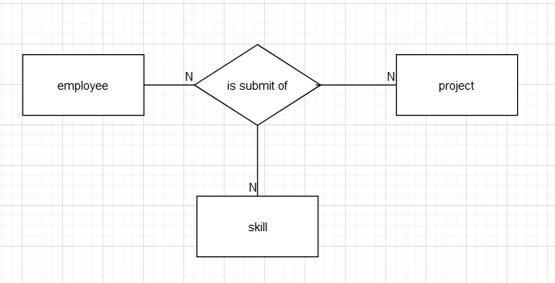

> 专升本考试的考点以及题型：
基础理论：数据库基本概念（数据、数据库、DBMS、DBS、三个世界、数据模型、三大完整性约束、范式、安全性、并发性、独立性、关系代数）
SQL编程：DDL、DML、DQL、DCL
单项选择
判断
设计（E-R图、范式、写代码）

## 第一章 概述

### 一、数据与信息

数据（Data）是数据库中存储的基本对象

数据的定义：描述事物的符号记录

组成数据的符号种类：数字、字符串、日期、逻辑值、文本（汉字）、图形、图像、声音

判断题：

数据就是以数字、字符串…等存储在计算机里的符号。（√）

单独的数据无法表达明确含义。（√）

信息是由数据组成的。（√）

数据与信息的区别：

信息：是经过加工处理并对人类社会实践和生产活动产生决策影响的数据。

数据是信息的符号表示（载体）；信息则是数据的内涵，是对数据语义的解释

### 二、数据库（DB）

数据库（Database）的定义：长期存储在计算机内、有组织的、可共享的数据集合。

判断题：

<mark>数据库内只存数据。（×）</mark> (除了数据本身，还存储数据的组织形态)

<mark>数据库完全消除了冗余度。（×）</mark>

数据库的特征：冗余度低、数据独立性较高

### 三、数据库管理系统（DBMS）

数据库管理系统（Database Management System）：位于用户与操作系统之间的一层数据管理软件。

DBMS的主要功能

* 数据定义功能：提供数据定义语言（DDL），用于定义数据库中的数据对象。（表、视图、索引、存储过程、触发器）。

* 数据操纵功能：提供数据操纵语言（DML），用于操纵数据实现对数据库的基本操作。（查询、插入、删除、修改）。

* 数据库的运行管理：保证数据的安全性，完整性（正确/有效），多用户对数据的并发使用及发生故障后的系统恢复（一定要有冗余数据）。

* 数据库的建立和维护功能：提供实用程序，完成数据库数据批量装载，数据库转储，介质故障恢复，数据库的重组织和性能监视等。

### 四、数据库系统（DBS）
>
> DBS包含DBMS和DB

数据库系统（Database System）：是指在计算机系统引入数据库后的系统。

数据库系统的构成：由计算机硬件系统、数据库、数据库管理系统（及其开发工具）、应用系统、操作系统、数据库管理员（DBA）、用户组成。

数据库管理员：数据库大管家——负责全面管理和控制数据库系统，是数据库系统中最重要的人员。

<mark>创建DBMS是否为DBA的职责？（否）</mark>

### 五、数据管理技术的产生和发展

1. 数据管理：对数据进行分类、组织、编码、存储、检索和维护，是数据处理的中心问题

2. 数据管理技术的发展过程：人工管理阶段、文件系统阶段、数据库系统阶段

    * 人工管理阶段（手工管理阶段）
用于科学计算，无直接存取存储设备（不保存数据），没有操作系统（无专门数据保存数据）

    * 文件系统阶段：有文件系统，数据可长期保存

        <mark>哪个阶段没有文件管理软件？（人工管理阶段）</mark>

    * 数据库系统阶段：共享性高，避免数据间的不一致性，易于扩充

3. 数据的独立性：高度的物理独立性和一定的逻辑独立性

    * 物理独立性：数据的物理存储改变了，应用程序不用改变

    * 逻辑独立性：数据的逻辑结构改变了，用户程序也可以不变

4. DBMS对数据的控制功能：数据的安全性保护、数据的完整性检查、并发控制、数据库恢复

5. 数据的安全性保护：保护数据以防止不合法的使用造成的数据的泄数据库恢复密和破坏

6. 数据的完整性检查：将数据控制在有效的范围内，或保证数据之间满足一定的关系

7. 并发控制：对多用户的并发操作加以控制和协调，防止相互干扰而得到错误的结果

8. 数据库恢复：将数据库从错误状态恢复到某一已知的正确状态

### 六、数据模型

数据模型分成两个不同的层次：

1. 概念模型（E-R图）：也称信息模型，它是按用户的观点来对数据信息建模
2. 数据模型（逻辑模型）：主要包括网状模型、层次模型、关系模型等，它是按计算机系统的观点对数据建模

3. 客观对象的抽象过程——两步抽象
    * 现实世界中的客观对象抽象为概念模型（信息世界），把概念模型转换为某一DBMS支持的数据模型（机器世界）

4. 概念模型是现实世界到机器世界的一个中间层次

    <mark>对现实世界的第一层抽象 。（概念模型）</mark>

    <mark>概念模型是哪一个世界的模型？（信息世界）</mark>

    信息世界的概念模型独立于具体的机器硬件和DBMS，数据世界（机器世界）的逻辑模型与具体机器和DBMS相关。当应用的DBMS是关系型时，数据世界里的逻辑模型是关系模式。

    <mark>关系模式就是逻辑模型？（√）</mark>
   <mark> 逻辑模型就是关系模式？（×）</mark>

> 改：应用于关系型数据库管理系统之上的逻辑模型就是关系模式

    非关系模型：层次结构、网状结构

    层次模型：树结构

    网状模型：图结构

    关系模型：表结构

    面向对象模型：对象结构

4. 数据模型三阶段：层次数据模型、网状数据模型、关系数据模型

* 层次数据模型：树型结构——查询效率高

优点：层次数据模型简单；性能优于关系模型，不低于网状模型

缺点：不能表达多对多的关系

* 联系种类：一对一：`1:1` ；一对多：`1:N` ；多对多：`M:N`

* 网状模型：允许一个以上的结点无双亲；一个结点可以有多于一个的双亲

    网状模型与层次模型的区别：网状模型允许两个结点之间有多种联系

    优点：能完整表达三种联系；存取效率高（了解）

    缺点：结构复杂

5. 关系模型的数据结构

* 关系模型的基本概念：关系模型中数据的逻辑结构是一张二维表，它由行和列组成。

* 关系：一个关系对应一张表

* 元组（记录）：表中一行即为一个元组

* 属性：表中一列即为一个属性，给一个属性起一个名称即属性名

* 主码（Key）：表中的某个属性组，可以唯一确定一个元组

* 域：属性的取值范围

* 分量：元组中的一个属性值

* 关系模式的表示方法：`关系名(属性1,属性2,…,属性n)`。关系必须是规范化的，即必须满足一定的规范条件。最基本的规范条件：关系的每一个分量必须是一个不可分的数据项（最小原子项）

    关系模型的优点：数据简单、清晰

    缺点：查询效率不如非关系模型

### 七、数据模型的要素

数据结构：对系统静态特性的描述（层次、网状、关系）

<mark>对一个数据模型，它的结构特点是不能改变的。（√）</mark>

数据操作：是动态特征，包括检索、更新（插入、删除、修改）

数据的约束条件：一组完整性规则的集合

### 八、数据库系统的三级模式结构

(看到外模式就想到视图)  


### 九、概念模型（E-R图）

概念模型用于信息世界的建模

1. 实体：客观存在并可相互区别的事物称为实体。用□表示，矩形框内写明实体名

2. 属性：实体所具有的某一特性称为属性，一个属性可以由若干个属性来刻画，用○表示，并用无向边与相应的实体连接起来（联系也有属性）

3. 联系：用◇表示，菱形框内写明联系名，并用无向边与相应的实体连接起来；同时在无向边旁标注联系的类型【(1:1)(1:n)(m:n)】

4. 码的分类：

* 码：能唯一标识实体的属性集称为码
* 超码：能唯一确定元组的属性组合|可以有多个
* 候选码：能唯一确定的元组的最少属性集合|可以有多个
* 主码：候选码中选一个|有且只能有一个
<mark>任何一个关系模式肯定有主码。（√）</mark>
* 外码
* 实体型
* 实体集
* 联系（实体间）：一对一(1:1)；一对多(1:n)；多对多(m:n)
<mark>联系可发生在多实体之间。（√）</mark>

## 第二章 数据库设计

### 一、数据库设计步骤概括

1. 需求分析（现实世界）：获得用户对数据库的要求→需求规格说明书
2. 概念结构设计（现实世界第一步抽象）：获得概念模型图—E-R图（信息世界）
3. 逻辑结构设计（层次/网状/关系）：关系模式—RDBMS（关系型数据库管理系统）
4. 数据库物理设计（逻辑/物理→机器世界）
5. 数据库实施（DDL）：具体定义数据库对象
6. 数据库运行和维护（DML/DQL）

### 二、具体设计步骤

1. 需求分析：
需求分析的重点是调查、收集、与分析用户在数据管理中的信息要求、处理要求、安全性与完整性要求。（使用工具：数据流图与数据字典）
2. 概念结构设计
概念结构设计独立于具体的DBMS和机器硬件；

    逻辑结构设计（逻辑模型图）与具体的DBMS和机器硬件密切相关。

    数据字典：集中保存数据的数据描述。数据字典的内容：数据项、数据结构、数据流、数据存储、处理过程

    <mark>逻辑模型就是关系模式？（×）</mark>

    > 应用于RDBMS（关系型的数据库管理系统）之上的逻辑模型才是关系模式。

    <mark>关系模式就是逻辑模型？（√）</mark>

    描述概念模型的工具：E-R图

    特点：易于向关系、网状、层次等各种数据模型转换

    合并部分E-R图，生成初步E-R图存在的冲突：属性冲突、命名冲突、结构冲突

    属性冲突：属性域冲突——属性值的类型、取值范围或取值集合不同

    命名冲突：同名异义、异名同义

    结构冲突：同一对象在不同应用中具有不同的抽象

3. 逻辑结构设计：将概念结构转换为某个DBMS所支持的数据模型

    转换内容：E-R图由实体、实体的属性和实体之间的联系三个要素组成。

    将E-R图转换为关系模型：将实体、实体的属性和实体之间的联系转换为关系模式。

    转换原则：

    ①实体类型的转换将每个实体类型转换成一个关系模式，实体的属性即为关系的属性，实体标识符即为关系的键； R(属性1，属性2，…，属性n)

    ②联系类型的转换根据不同的情况做不同的处理(一对一 1:1)：可将任何一段的主关键字和联系的属性并入另一端。结果中关系模式的主键就是该关系模式原来的主键。

    外关键字(外键/码)：不是当前关系的主码，但却是另外一个关系模式的主码，那么，在当前关系模式里称为外关键字。

    将E-R图转换成关系模式，其中：

* 每一个实体必须转换成独立的关系模式；
* 每一个M:N联系必须转换成独立的关系模式；
* 每一个1:1、1:n联系可以转换成独立的关系模式，也可以省略（考试时必须省略）

    例：有三个实体，两个联系，如果：

* 两个联系都是1:1，最多转换成（5）个关系模式？最少转换成（3）个关系模式；
* 两个联系都是1:m，最多转换成（5）个关系模式？最少转换成（3）个关系模式；
* 两个联系都是n:m，最多转换成（5）个关系模式？最少转换成（5）个关系模式；
* 两个联系，一个是1:m，一个是m:n，最多转换成（5）个关系模式？最少转换成（4）个关系模式。

    ②联系类型的转换根据不同的情况做不同的处理(一对多)：

    

    在n端实体集中增加新属性，新属性由联系对应的1端实体集的码和联系自身的属性构成，新增属性后原关系的码不变（1端联系、属性并入n端）

> 学生(学号，姓名，性别，出生日期，所在系，宿舍编号)

> 宿舍(宿舍编号，宿舍名，宿舍地址)

将联系类型也转换成关系模式，其属性为两端实体类型的(主)键加上联系类型的属性，而键为两端实体键的组合(m:n)

做E-R图题的小技巧：
思路：

* 找到题中所述的实体，并找到实体之间的联系（二元联系）。联系有三种可能：一对一、一对多、多对多。

* 判断联系类型：先让实体`A`假设为1，看它能对应实体`B`的个数，然后反过来，假设实体`B`为1，看它能对应实体`A`的个数，就可以得到实体对应关系——
例如：
1个学生可关注多个商品，而1个商品可被多个学生关注，所以学生和商品的关系是<font color = "red"><b>多对多</b></font>；
1个学生属于1个班级，而1个班级可以有多个学生，所以班级和学生的关系是<font color = "red"><b>一对多</b></font>；
1个学生拥有1张饭卡，而1张饭卡只属于1个学生。所以学生和饭卡的关系是<font color = "red"><b>一对一</b></font>

* 绘制E-R图常见问题

> 真正画的时候会遇到困难，下面通过反例来学习E-R图的绘制

    反例1：区分功能和关系
    管理员可以管理用户。但是如果系统不记录哪个管理员可以管理哪些用户，那么就无需在ER图上绘制该关系。只有需要在数据库保存的关系，才需要在ER图上保存。
    反例2：区分程序功能和数据库数据
    个人挂号排队一般不用保存到数据库，所以无需在ER图上表示。另外，如果要显示排队信息，我认为应当是给每个用户一个id序号，程序实现排队，而不是数据库去记录这个排队信息。

* 三元关系

  * 关系的度：表示关系所关联的实体数量。二元关系与三元关系的度分别为2和3，以此可以类推至n元。二元关系是最常见的关系。
  * 二元回归：一个学生与另一个学生之间的领导关系称为二元回归关系。（即学生对应班长，班长是由学生中选出的）
    
  * 二元关系：两个实体关联的实体数量
    
  * 三元关系：三个实体关联的实体数量
    
* 关系的连通数：表示关系所关联的实例数量的约束
    连通数的值可以是“一”或“多”。（即一对一；一对多；多对多）

例：

1. 

```
图中蕴含的语义为：
    ① 一名技术员对于每一个项目使用一本手册
    ② 每一本手册对于每一个项目属于一名技术员
    ③ 一名技术员可能在做多个项目，对于不同的项目维护不同的手册
```

```
用函数依赖表示为：
    ① emp-id, project-name -> notebook-no
    ② emp-id, notebook-no -> project-name
    ③ project-name, notebook-no -> emp-id
```

2. 

```
图中蕴含的语义为：
    ① 每一个员工在一个地点只能被分配一个项目，但可以在不同地点做不同的项目
    ② 在一个特定的地点，一个员工只能做一个项目
    ③ 在一个特定的地点，一个项目可以由多个员工来做
```

```
用函数依赖表示为：
    ① emp-id, loc-name -> project-name
    ② emp-id, project-name -> loc-name
```

3. 

```
图中蕴含的语义为：
    ① 一名经理手下的一名工程师可能参与多个项目
    ② 一名经理管理的一个项目可能会有多名工程师
    ③ 做某一个项目的一名工程师只会有一名经理
```

```
用函数依赖表示为：
    ① project-name, emp-id -> mgr-id
```

4. 

```
图中蕴含的语义为：
    ① 一名员工在一个项目中可以使用多种技能
    ② 一名员工的一种技能可以在多个项目中使用
    ③ 一种技能在一个项目中可以被多名员工使用
```

```
用函数依赖表示为：
    该类型并无任何函数依赖
```

* E-R图转关系模式
<font color = "red"><b>所有的关系模式都应当转换为一张表。</b></font>

  * 根据关系是1:1、1:n、m:n 转成表

    * 对于 1:1的  可以将关系保存到任何一个实体表中，
    * 对于1：n的，可以将关系保存到n的那个实体里，例如班级和学生是1对多，那么可以在学生表中增加一个班级id的字段，说明该学生是哪个班级的
    * 对于多对多的关系 m：n的 ，关系保存到新表中

4. 数据模型的优化
得到初步数据模型后，还应当适当的修改，调整数据模型的结构，这就是数据模型的优化。优化通常以规范化理论为指导。

5. 数据库物理设计阶段
    为逻辑数据模型选取一个最适合应用环境的物理结构（包括存储结构和存取方法）(由DBMS自动完成)

    确定数据库物理结构的内容：①确定数据的存储结构；②设计数据的存储路径；③确定数据的存放位置；④确定系统配置

    评价物理结构：存储空间，存取时间，维护代价
6. 数据库实施阶段
建立数据库(DDL)；编制与调试应用程序；组织数据入库；试运行

7. 数据库运行和维护阶段

## 第三章 关系数据库设计理论

### 一、关系的完整性约束

1. 关系模型三要素：结构(数据模型的静态特征)、操作(数据模型的动态特征)、约束条件
2. 关系模型三类完整性约束：实体完整性约束、参照完整性约束、用户自定义完整性（实体/参照是关系模型必须满足的完整性约束条件，被称为关系的两个不变性）
3. 实体完整性约束：若属性A是基本关系R的主属性(候选码中的属性)，则属性A不能取空值[null]。

例：

学生(学号，姓名，性别，年龄，院系) 主属性：学号

课程(课程号，课程名，学分) 主属性：课程号

学习(学号，课程号，学分) 主属性：学号+课程号

参照完整性约束：若属性（或属性组）F是基本关系R的外码，它与基本关系S的主码KS相对应（基本关系R和S不一定是不同的关系），则对于R中每个元组在F上的值必须为：或者取空值（F的每个属性均为空值）；或者等于S中某格元组的主码值

例：
学生(学号，姓名，性别，年龄，院系编号)；院系(院系编号，院系名称，院系地址)

总结：当外码不是关系模式的主属性时，可以取空值或将其作为主码的关系模式中已经有的值。

用户自定义完整性约束：针对某一关系数据库的约束条件，反映某一具体应用所涉及的数据必须满足的语义要求

### 二、关系

1. 属性：关系中不同列可以对应相同的域，为了加以区分，必须对每列起一个名字，称为属性
2. 三类关系：

* 基本关系(基本表或虚表)：实际存在的表，是实际存储数据的逻辑表示[create table]
* 查询表：查询结果对应的表[select]
* 视图表：由基本表或其他视图表导出的表，是虚表，不对应实际存储的数据[create view]

    基本关系的性质：

    ①列是同质的：每一列的分量是同一类型的数据，来自同一个域；

    ②不同的列可出自同一个域：其中的每一列称为一个属性；不同的属性要给予不同的属性名；

    ③列的顺序无所谓；

    ④任意两个元组不能完全相同；

    ⑤行的顺序无所谓；

    ⑥分量必须取原子值

关系模式的冗余和异常问题
| SNO | CNO | CNAME | GRADE | TNAME | TSEX | TITLE | TADDR   |
|:---:|:---:|:-----:|:-----:|:-----:|:----:|:-----:|:-------:|
| S2  | C4  | 数据结构  | 82    | 魏X    | F    | 讲师    | 枚乘路45号  |
| S4  | C4  | 数据结构  | 87    | 魏X    | F    | 讲师    | 枚乘路45号  |
| S4  | C4  | 数据结构  | 63    | 魏X    | F    | 讲师    | 枚乘路45号  |
| S6  | C2  | C++   | 89    | 马y    | M    | 副教授   | 民主东街3号  |
| S4  | C2  | C++   | 92    | 马y    | M    | 副教授   | 民主东街3号  |
| S8  | C6  | C#    | 64    | 王Z    | M    | 副教授   | 明源西路26号 |

数据冗余：如果一门课程有多个学生选修，那么在关系中要出现多个元组，也就是这门课程的课程名和任课教师信息(教师姓名，教师性别，教师职称，教师住址)要重复多次存储

3. 更新异常：
插入异常：想插入的信息插不进去
删除异常：不想删除的信息被删掉

### 三、函数依赖

X函数确定Y或Y函数依赖于X，记作$x\rightarrow y$

①不可能存在x上的属性值相等，而在y上的属性值不等
②$x\leftrightarrow y$(等价于1:1)，如$指纹\leftrightarrow 身份证号$

如果是M:N类型的联系，那么两个实体不存在任何依赖关系
例：

1. 课程(课程号，课程名，学分)
分析：
课程号→课程名；课程号→学分

2. 教师(教师号，教师名，课程号，职称，院系)
分析：教师号→教师名；教师号→课程号；教师号→职称；教师号→院系
或——教师号→(教师名，课程号，职称，院系)
3. 教学(教师号，课程号，任务量)
分析：(教师号，课程号)→任务量
R(学号，姓名，性别，课程号，课程名，学分，考试成绩)
$学号\rightarrow 姓名$
$学号\rightarrow 性别$
$课程号\rightarrow 课程名,学号$
$x\rightarrow y$
完全函数依赖和部分函数依赖
在关系模式R(U)中，如果$x\rightarrow y$，并且对于X的任何一个真子集$x^\prime$，都有$x^\prime\rightarrow y$，则称Y完全函数依赖于X，记作$x \stackrel{f}{\longrightarrow}y$。若$x→y$，但Y不完全函数依赖于X，则称Y部分函数依赖于X，记作$x \stackrel{p}{\longrightarrow}y$。

4. 联系的类型

* 若两个实体类型是1:1
则它们的依赖关系：$x\leftrightarrow y$
* 若两个实体类型是1:m
则它们的依赖关系：$x\leftarrow y$
* 若两个实体类型是M:n
则它们的依赖关系：不存在
* 若两个实体A和B，A依赖于B($B\rightarrow A$)「箭头指向平端」，那么两者的联系类型：1：M
* 若两个实体A和B的联系类型是1：M，那么两者的依赖关系：$B\rightarrow A$

```
一、设有一个反映工程及其所使用相关材料信息的关系模式：
R(工程号，工程名，工程地址，开工日期，完工日期，材料号，材料名称，使用数量)
如果规定：
每个工程的地址、开工日期、完工日期唯一；不同工程的地址、开工和完工日期可能相同；工程名与材料名称均有重名；每个工程使用若干种材料，每种材料可应用于若干工程中。根据上述规定：
1) 写出模式R的基本FD（依赖集）和关键码。
FD={工程号->工程名，工程号->工程地址，工程号->开工日期，工程号->完工日期，材料号->材料名称，（工程号，材料号）->使用数量}
关键码：（工程号，材料号）
2) R最高达到第几范式，并说明理由。
R最高达到1NF。因为存在非主属性工程名对候选码（工程号，材料号）的部分函数依赖，所以没有到达2NF,是1NF
3) 将R规范到3NF。
R1（工程号，材料号，使用数量）
R2（工程号，工程名，工程地址，开工日期，完工日期）
R3（材料号，材料名称）

二、设某人才市场数据库中有一个记录应聘人员信息的关系模式：
R（人员编号，姓名，性别，职位编号，职位名称，考试成绩）
如果规定：每人可应聘多个职位，每个职位可由多人应聘且必须参加相关考试，考试成绩由人员编号和职位编号确定。
根据上述规定：

1) 写出模式R的基本FD和关键码。
FD={人员编号->姓名，人员编号->性别，职位编号->职位名称，（人员编号，职位编号）->考试成绩}
关键码：（人员编号，职位编号）
2) R最高达到第几范式，并说明理由。
R最高达到1NF。因为存在非主属性【姓名】对候选码（人员编号，职位编号）的部分函数依赖，所以没有达到2NF，是1NF
3) 将R规范到3NF。
R1（人员编号，职位编号，考试成绩）
R2（人员编号，姓名，性别）
R3（职位编号，职位名称）

三、设有关系模式
R（运动员编号，比赛项目，成绩，比赛类别，比赛主管）。规定每个运动员每参加一个比赛项目，只有一个成绩，每个比赛项目只属于一个比赛类别，每个比赛类别只有一个比赛主管。完成下面问题：

1) 写出模式R的基本FD和关键码。
FD={（运动员编号，比赛项目）->成绩，比赛项目->比赛类别,比赛类别->比赛主管}
    关键码：（运动员编号，比赛项目）

2) R最高达到第几范式，并说明理由。
3) 将R规范到3NF。
    R1（运动员编号,比赛项目，成绩）
    R2（比赛项目，比赛类别，比赛主管）2NF
    R21（比赛项目，比赛类别）
    R22  (比赛类别，比赛主管)
```

5. 传递函数依赖

    传递函数依赖属于关系模式R(U)，传递函数依赖在关系模式 R(U)中,设 X,Y,Z 是 U 的不同的属性子集,如果 X 确定 Y、Y 确定 Z,且有 X 不包含 Y,Y 不确定 X，$(X\cup Y)\cap Z = \emptyset$,则称 Z 传递函数依赖于X。

### 四、范式

1. 第一范式（1NF）

    定义：如果一个关系模式R的属性都是不可分的基本数据项，则R属于1NF

    > 基本数据项=最小原子项

2. 第二范式（2NF）

    定义：若关系模式R属于1NF，并且每一个非主属性都完全函数依赖于R的（主）码，则R属于2NF

3. 第三范式（3NF）

    定义：关系模式R中若不存在这样的码X、属性组Y及非主属性Z（Z (强制依赖)Y），使得$X\rightarrow Y$，$Y\rightarrow Z$，成立，$Y\rightarrow X$不成立，则称$R\in 3NF$。

    ```
    2NF的分析方法
    1. 分析各个属性的依赖关系，由依赖关系分析出候选码，从而得出主属性和非主属性有哪些；
    2. 分析是否每一个非主属性都完全函数依赖于候选码，若满足就是2NF；否则就是1NF
    ```

    ```
    优化2NF的方法：
    将原来关系模式中完全函数依赖的属性取出（两个决定一个），部分函数依赖的属性取出构成新的关系模式（一个决定另一个）。
    优化的过程就是对原来关系模式的分解过程。
    若满足1NF的关系模式的候选码只有一列（主属性只有一列），那么该关系模式肯定是2NF
    ```

    ```
    3NF判定：若满足2NF的关系模式的非主属性只有一个，那么该关系模式肯定是3NF
    ```

判断：
关系模式的优化级别（范式的等级）越高，说明该关系模式越好。（×）

1. 满足每个属性都是最小原子项的条件的关系模式是1NF
2. 满足每个非主属性都完全函数依赖与候选码的条件的1NF是2NF，或者满足不存在某个非主属性部分函数依赖于候选码条件的1NF是2NF
3. 满足不存在某个非主属性传递函数依赖于候选码条件的2NF是3NF
4. 满足每个非主属性都完全依赖于候选码条件和不存在某个非主属性传递函数依赖于候选码条件的1NF是3NF

例3：设有如下关系R

| 课程名 | 教师名 | 教师地址 |
|-----|-----|------|
| C1  | 马千里 | D1   |
| C2  | 于得水 | D1   |
| C3  | 余快  | D2   |
| C4  | 于得水 | D1   |

* 它为第几范式？为什么？
* 是否存在删除异常？若存在，则说明是在什么情况下发生的
* 将它分解为高一级范式，分解后的关系模式是如何解决分解前可能存在的删除操作异常的？

1. 课程名→教师名；课程名→教师地址；教师名→教师地址；候选码：课程名
主属性为一列，是二范式
该关系模式是二范式，原因：它的候选码只有一列，但存在非主属性对候选码的传递依赖，故肯定是2NF。
2. 存在删除异常

    假如取消了C3这门课，删除该课程信息的同时教师余快的信息也随之删除，但是此老师仍然存在。故会发生删除异常。
3. R1(课程名，教师名)；R2(教师名，教师地址)

    假如取消了C3这门课，删除该课程信息的同时不会影响教师余快的信息，他的信息仍然存在。故不会发生删除异常。

### 附：数据库的闭包
>
> 数据库的闭包就是由一个属性直接或间接推导出的所有属性的集合
如：$f={a\rightarrow b,b\rightarrow c,a\rightarrow d}$,则$a$的闭包就是${a,b,c,d}$

例如：设关系$R(A,B,C,D,E,G)$，有函数依赖集$F={AB\rightarrow C,BC\rightarrow AD,D\rightarrow E,CG\rightarrow B}$
求：AB的闭包${AB}^+$

答：①令$X_0=(AB)$ *x表示要求闭包的集合；“0”表示闭包初始状态*
②$\because AB\rightarrow C，X_1=(ABC)$
③又$\because BC\rightarrow AD，X_2=(ABCD)$
④又$\because D\rightarrow E，X_3=(ABCDE)$
AB直接或间接推导出的属性已经遍历完成，故${AB}^+=(ABCDE)$

练习题

1. 设有函数依赖集：$F=(D\rightarrow G，C\rightarrow A，CD\rightarrow E，A\rightarrow B)$

    求：①$D^+$；②$C^+$；③$A^+$；④$(CD)^+$；⑤$(AD)^+$；⑥$(ACD)^+$

①$\because X_0=D，D\rightarrow G，\therefore x_0=(DG)^+$

②$\because X_0=C，C\rightarrow A，\therefore x_1=(CA)^+；\because X_2=A，A\rightarrow B，\therefore x_2=(ABC)^+$

③$\because X_0=A，A\rightarrow B，\therefore x_1=(AB)^+$

④$\because X_0=CD，C\rightarrow A，CD\rightarrow E，D\rightarrow G，x_1=(ACDEG)^+；\because A\rightarrow B，x_2=(ABCDEG)^+，\therefore x_2=(ABCDEG)^+$

⑤$\because X_0=AD，A\rightarrow B，D\rightarrow G，x_1=(ABDG)^+，\therefore x_1=(ABDG)^+$

⑥$\because X_0=(ACD)^+，A\rightarrow B，CD\rightarrow E，D\rightarrow G，x_1=(ABCDEG)^+，\therefore x_1=(ABCDEG)^+$

由函数依赖集推导关系候选码理论：
对给定的关系$R(A_1,A_2,\cdots,A_n)$和函数依赖集F，可将R属性分为4类：

* L类：仅出现在F的函数依赖集左边的属性。
* R类：仅出现在F的函数依赖集右边的属性。
* N类：在F的函数依赖集左右两边均未出现的属性。
* LR类：在F的函数依赖集左右两边均出现的属性。

定理1：对于给定的关系模式R及其函数依赖集F，若X（X属于R），R中属性X是L类属性，则X必为R的任意候选键成员。

定理2：对于给定的关系模式R及其函数依赖集F，若X（X属于R），R中属性X是R类属性，则X不在R的任意候选键成员。

定理3：对于给定的关系模式R及其函数依赖集F，若X（X属于R），R中属性X是N类属性，则X必包含R的任意候选键中。

定理4：若$R_m=(r_1,r_2,\cdots,r_n)$是关系R的候选键，且$(R_m)^+$，则$R_m$是关系R的唯一候选键

例如：

1. 设有关系模式$R(X,Y,Z,W)$与它的函数依赖集合$F={XY\rightarrow Z，W\rightarrow X}$，则R的关键码为（D）
A. XY   B. XW  C. YZ  D. YW
2. 已知关系模式$R(A,B,C,D,E)$及其上的函数依赖集合$F=(A\rightarrow D，B\rightarrow C，E\rightarrow A)$。该关系模式的候选关键字是（B）
A. AB  B. BE  C. CD  D. DE
3. 已知关系R(P,Q,M,N)，F是R上成立的函数依赖集，$F=\{P\rightarrow Q，Q\rightarrow M\}$，则R的候选关键字是（D）

    A. P&nbsp;&nbsp;&nbsp;B. Q&nbsp;&nbsp;&nbsp;C. PQ&nbsp;&nbsp;&nbsp;D. PN

4. 已知$R=(L,B,O,Q,S,D)$，函数依赖集$F=(L\rightarrow B，B\rightarrow O，L\rightarrow Q，S\rightarrow D)$
求：R的候选码

    答：L，S都是L类型属性，故L，S必是R关系的候选码组成，又因为$(LS)^+=(LBOQSD)$.故L、S是R的唯一候选码

5. 已知$R=(C,T,S,N,G)$，函数依赖集$F=(C\rightarrow T，CS\rightarrow G，S\rightarrow N)$

    求：候选码，并判断R是属于几范式

    答：C，S都是L类型属性，故C，S必是R关系的候选码组成，又因为$(CS)^+=(CTSGN)$.故C、S是R的唯一候选码
    因为$C\rightarrow T，S\rightarrow N$，存在非主属性对码的部分依赖，所以R是1NF

    补充问题：将其优化成3NF

    `R1(C,S,G)`
    `R2(C,T)`
    `R3(S,N)`

    函数依赖的推导理论：

    W,X,Y,Z是关系R的属性：

* 若$X\rightarrow Y$，$Y\rightarrow Z$，则$X\rightarrow Z$；
* 若$X\rightarrow Y$，则$XZ\rightarrow YZ$
* 若$X\rightarrow Y$，Z属于Y，则$X\rightarrow Z$
* 若$X\rightarrow Y$，$WY\rightarrow Z$，则$WX\rightarrow Z$
* 若$X\rightarrow YZ$，$X\rightarrow Y$，则$X\rightarrow Z$
* 若$X\rightarrow Y$，$Z\rightarrow W$，则$XZ\rightarrow  YW$
* 若X和Y是1:1关系，则存在函数依赖：$X\rightarrow Y$且$Y\rightarrow X$
* 若X和Y是m:1关系，则存在函数依赖：$X\rightarrow Y$
* 若X和Y是m:n关系，则X和Y不存在任何函数依赖关系
练习题：

1. 下面关于函数依赖的叙述中，不正确的是(   )

    A. 若$X\rightarrow Y$，$X\rightarrow Z$，则$X\rightarrow YZ$

    B. 若$XY\rightarrow Z$，则$X\rightarrow Z$，$Y\rightarrow Z$

    *正确形式：若$X\rightarrow YZ$，则$X\rightarrow Z$，$Y\rightarrow Z$*

    C. 若$X\rightarrow Y$，$Y\rightarrow Z$，则$X\rightarrow Z$

    D. 若$X\rightarrow Y$，$Y'$包含于$Y$，则$X\rightarrow Y'$

2. 下面关于函数依赖的叙述中不正确的是（）

    A. 若$X\rightarrow Y$，$X\rightarrow Z$，则$X\rightarrow YZ$

    B. 若$XY\rightarrow Z$，则$X\rightarrow Z$，$Y\rightarrow Z$

    C. 若$X\rightarrow Y$，$WY\rightarrow Z$，则$XW\rightarrow Z$

    D. 若$X\rightarrow Y$，$XZ\rightarrow YZ$

3. 当B属性函数依赖于A属性时，属性A与B的联系是（ B ） **箭头指向多端**

    A. 一对多      B. 多对一
    C. 多对多      D. 以上都不是

4. 在关系模式中，如果属性A和B存在1对1的联系则说明（   ）

    A. $A\rightarrow B$      B. $B\rightarrow A$
    C. $A\leftrightarrow B$      D. 以上都不是

## 第四章 关系数据库

### 关系代数

1. 关系代数运算的分类

* 传统的集合运算：并、交、差、广义笛卡尔积
* 专门的关系运算：选择、投影、连接、除

> 掌握：运算符长什么样？运算规则？

|              |             |               |                     |
| ------------ | ----------- | ------------- | ------------------- |
| 并$\cup$     | 交$\cap$    | 差$\\-$       | 广义笛卡尔积$\times$ |
| 选择$\sigma$ | 投影$\prod$ | 连接$\bowtie$ | 除$\div$             |

2. 并 (结果为二者元组之和去除重复行)

* 条件：R和S具有相同的目(列)，相应的属性取自同一个域
* 规则（结果）：仍为n目关系，由属于R或属于S的元组组成——即两个都有的放在结果里

例：

<p>R表
<table>
    <tr>
        <td>A</td>
        <td>B</td>
        <td>C</td>
    </tr>
    <tr>
        <td>a1</td>
        <td>b1</td>
        <td>c1</td>
    </tr>
    <tr>
        <td>a1</td>
        <td>b2</td>
        <td>c2</td>
    </tr>
    <tr>
        <td>a2</td>
        <td>b2</td>
        <td>c1</td>
    </tr>
</table>

<p>S表
<table>
    <tr>
        <td>A</td>
        <td>B</td>
        <td>C</td>
    </tr>
    <tr>
        <td>a1</td>
        <td>b2</td>
        <td>c2</td>
    </tr>
    <tr>
        <td>a1</td>
        <td>b3</td>
        <td>c2</td>
    </tr>
    <tr>
        <td>a2</td>
        <td>b2</td>
        <td>c1</td>
    </tr>
</table>

$R\cup S$
<table>
    <tr>
        <td>A</td>
        <td>B</td>
        <td>C</td>
    </tr>
    <tr>
        <td>a1</td>
        <td>b1</td>
        <td>c1</td>
    </tr>
    <tr>
        <td>a1</td>
        <td>b2</td>
        <td>c2</td>
    </tr>
    <tr>
        <td>a1</td>
        <td>b3</td>
        <td>c2</td>
    </tr>
    <tr>
        <td>a2</td>
        <td>b2</td>
        <td>c1</td>
    </tr>
</table>

2. 差（前者去除二者重复行）
条件：R和S具有相同的目(列)，相应的属性取自同一个域
规则（结果）：仍为n目关系，由属于R而不属于S的所有元组组成

<p>R
<table>
    <tr>
        <td>A</td>
        <td>B</td>
        <td>C</td>
    </tr>
    <tr>
        <td>a1</td>
        <td>b1</td>
        <td>c1</td>
    </tr>
    <tr>
        <td>a1</td>
        <td>b2</td>
        <td>c2</td>
    </tr>
    <tr>
        <td>a2</td>
        <td>b2</td>
        <td>c1</td>
    </tr>
</table>

<p>S
<table>
    <tr>
        <td>A</td>
        <td>B</td>
        <td>C</td>
    </tr>
    <tr>
        <td>a1</td>
        <td>b2</td>
        <td>c2</td>
    </tr>
    <tr>
        <td>a1</td>
        <td>b3</td>
        <td>c2</td>
    </tr>
    <tr>
        <td>a2</td>
        <td>b2</td>
        <td>c1</td>
    </tr>
</table>

$R-S$
<table>
    <tr>
        <td>A</td>
        <td>B</td>
        <td>C</td>
    </tr>
    <tr>
        <td>a1</td>
        <td>b1</td>
        <td>c1</td>
    </tr>
</table>

$S-R$
<table>
    <tr>
        <td>A</td>
        <td>B</td>
        <td>C</td>
    </tr>
    <tr>
        <td>a1</td>
        <td>b3</td>
        <td>c2</td>
    </tr>
</table>

3. 交(结果为二者重复行)
条件：R和S具有相同的目(列)，相应的属性取自同一个域
规则（结果）：仍为n目关系，既属于R又属于S的元组

<p>R
<table>
    <tr>
        <td>A</td>
        <td>B</td>
        <td>C</td>
    </tr>
    <tr>
        <td>a1</td>
        <td>b1</td>
        <td>c1</td>
    </tr>
    <tr>
        <td>a1</td>
        <td>b2</td>
        <td>c2</td>
    </tr>
    <tr>
        <td>a2</td>
        <td>b2</td>
        <td>c1</td>
    </tr>
</table>

<p>S
<table>
    <tr>
        <td>A</td>
        <td>B</td>
        <td>C</td>
    </tr>
    <tr>
        <td>a1</td>
        <td>b2</td>
        <td>c2</td>
    </tr>
    <tr>
        <td>a1</td>
        <td>b3</td>
        <td>c2</td>
    </tr>
    <tr>
        <td>a2</td>
        <td>b2</td>
        <td>c1</td>
    </tr>
</table>

$R\cap S$

<table>
    <tr>
        <td>A</td>
        <td>B</td>
        <td>C</td>
    </tr>
    <tr>
        <td>a1</td>
        <td>b2</td>
        <td>c2</td>
    </tr>
    <tr>
        <td>a2</td>
        <td>b2</td>
        <td>c1</td>
    </tr>
</table>

4. 广义笛卡尔积
R：n目关系，k1个元组
S：m目关系，k2个元组
$R\times S$：
列：$(n+m)$列的元组的集合；行：$k_1×k_2$个元组 （列 加 行 乘）

    若R有3列，5行元组；S有5列，3行元组。则$R\times S$结果关系有<mark>15</mark>行<mark>8</mark>列

<p>R
<table>
    <tr>
        <td>A</td>
        <td>B</td>
        <td>C</td>
    </tr>
    <tr>
        <td>a1</td>
        <td>b1</td>
        <td>c1</td>
    </tr>
    <tr>
        <td>a1</td>
        <td>b2</td>
        <td>c2</td>
    </tr>
    <tr>
        <td>a2</td>
        <td>b2</td>
        <td>c1</td>
    </tr>
</table>

<p>S
<table>
    <tr>
        <td>A</td>
        <td>B</td>
        <td>C</td>
    </tr>
    <tr>
        <td>a1</td>
        <td>b2</td>
        <td>c2</td>
    </tr>
    <tr>
        <td>a1</td>
        <td>b3</td>
        <td>c2</td>
    </tr>
    <tr>
        <td>a2</td>
        <td>b2</td>
        <td>c1</td>
    </tr>
</table>

$R\times S$

<table>
    <tr>
        <td>R.A</td>
        <td>R.B</td>
        <td>R.C</td>
        <td>S.A</td>
        <td>S.B</td>
        <td>S.C</td>
    </tr>
    <tr>
        <td>a1</td>
        <td>b1</td>
        <td>c1</td>
        <td>a1</td>
        <td>b2</td>
        <td>c2</td>
    </tr>
    <tr>
        <td>a1</td>
        <td>b1</td>
        <td>c1</td>
        <td>a1</td>
        <td>b3</td>
        <td>c2</td>
    </tr>
    <tr>
        <td>a1</td>
        <td>b1</td>
        <td>c1</td>
        <td>a2</td>
        <td>b2</td>
        <td>c1</td>
    </tr>
    <tr>
        <td>a1</td>
        <td>b2</td>
        <td>c2</td>
        <td>a1</td>
        <td>b2</td>
        <td>c2</td>
    </tr>
    <tr>
        <td>a1</td>
        <td>b2</td>
        <td>c2</td>
        <td>a1</td>
        <td>b3</td>
        <td>c2</td>
    </tr>
    <tr>
        <td>a2</td>
        <td>b2</td>
        <td>c2</td>
        <td>a2</td>
        <td>b2</td>
        <td>c1</td>
    </tr>
    <tr>
        <td>a2</td>
        <td>b2</td>
        <td>c1</td>
        <td>a1</td>
        <td>b2</td>
        <td>c2</td>
    </tr>
    <tr>
        <td>a2</td>
        <td>b2</td>
        <td>c1</td>
        <td>a1</td>
        <td>b3</td>
        <td>c2</td>
    </tr>
    <tr>
        <td>a2</td>
        <td>b2</td>
        <td>c1</td>
        <td>a2</td>
        <td>b2</td>
        <td>c1</td>
    </tr>
</table>

5. 选择 $\sigma_F(R)$：在关系 R 中选择满足给定条件的所有元组构成的新关系。F 表示选择条件，R 表示关系模式名。如：

    $\sigma_{sno='111'}(S)$：学号是111的学生记录

    $\sigma_{sex='女'\wedge age>18}(S)$：性别是女且年龄大于18岁的学生记录

    在选择运算中，表示条件 F 可以有两种方式标识列：
    * 实际列名标识：当属性值为数值型时，不能用单引号，非数值型时必须用单引号括起来；
    * 列在关系模式中的序号标识：不管属性值是什么类型，都必须用单引号括起来
    例：查询信息系（IS 系）全体学生
$\sigma_{sdept='IS'}(Student)$或$\sigma_{5='IS'}(Student)$

> 选择运算只对关系模式的行进行筛选，在列的方向上没有任何损失。

6. 投影：$\pi_A(R)$：从 R 中选择出若干属性列组成新的关系模式。A 是 R 中的属性列集合

> 投影操作是对关系模式的列进行的筛选，但在行与列的方向都有可能有损失。

7. 连接

* 普通连接（又称$\theta$连接）：任何关系模式均可进行，从两个关系的笛卡尔积中选取属性间满足一定条件的元组。

    ${R\bowtie S\atop A\theta B}$：A 和 B：分别为 R 和 S 上度数相等且可比的属性组

    $\theta$：比较运算符$（>、<、!=）$
    > 若为$=$，即等值连接

* 等值连接：任何关系模式均可进行
* 自然连接：运算的条件是关系模式必须至少有一个共同的属性列才能进行自然连接

例：普通连接${R\bowtie S\atop C<E}$

<p>R
<table>
    <tr>
        <td>A</td>
        <td>B</td>
        <td>C</td>
    </tr>
    <tr>
        <td>a1</td>
        <td>b1</td>
        <td>5</td>
    </tr>
    <tr>
        <td>a1</td>
        <td>b2</td>
        <td>6</td>
    </tr>
    <tr>
        <td>a2</td>
        <td>b3</td>
        <td>8</td>
    </tr>
    <tr>
        <td>a2</td>
        <td>b4</td>
        <td>12</td>
    </tr>
</table>

<p>S
<table>
    <tr>
        <td>B</td>
        <td>E</td>
    </tr>
    <tr>
        <td>b1</td>
        <td>3</td>
    </tr>
    <tr>
        <td>b2</td>
        <td>7</td>
    </tr>
    <tr>
        <td>b3</td>
        <td>10</td>
    </tr>
    <tr>
        <td>b3</td>
        <td>2</td>
    </tr>
    <tr>
        <td>b5</td>
        <td>2</td>
    </tr>
</table>

${R\bowtie S\atop C<E}$

<table>
    <tr>
        <td>A</td>
        <td>R.B</td>
        <td>C</td>
        <td>S.B</td>
        <td>E</td>
    </tr>
    <tr>
        <td>a1</td>
        <td>b1</td>
        <td>5</td>
        <td>b2</td>
        <td>7</td>
    </tr>
    <tr>
        <td>a1</td>
        <td>b1</td>
        <td>5</td>
        <td>b3</td>
        <td>10</td>
    </tr>
    <tr>
        <td>a1</td>
        <td>b2</td>
        <td>6</td>
        <td>b2</td>
        <td>7</td>
    </tr>
    <tr>
        <td>a1</td>
        <td>b2</td>
        <td>6</td>
        <td>b3</td>
        <td>10</td>
    </tr>
    <tr>
        <td>a2</td>
        <td>b3</td>
        <td>8</td>
        <td>b3</td>
        <td>10</td>
    </tr>
</table>

等值连接：${R\bowtie S\atop R.B=S.B}$

<table>
    <tr>
        <td>A</td>
        <td>R.B</td>
        <td>C</td>
        <td>S.B</td>
        <td>E</td>
    </tr>
    <tr>
        <td>a1</td>
        <td>b1</td>
        <td>5</td>
        <td>b1</td>
        <td>3</td>
    </tr>
    <tr>
        <td>a1</td>
        <td>b2</td>
        <td>6</td>
        <td>b2</td>
        <td>7</td>
    </tr>
    <tr>
        <td>a2</td>
        <td>b3</td>
        <td>8</td>
        <td>b3</td>
        <td>10</td>
    </tr>
    <tr>
        <td>a2</td>
        <td>b3</td>
        <td>8</td>
        <td>b3</td>
        <td>2</td>
    </tr>
</table>

自然连接：${R\bowtie S}$

<table>
    <tr>
        <td>A</td>
        <td>B</td>
        <td>C</td>
        <td>E</td>
    </tr>
    <tr>
        <td>a1</td>
        <td>b1</td>
        <td>5</td>
        <td>3</td>
    </tr>
    <tr>
        <td>a1</td>
        <td>b2</td>
        <td>6</td>
        <td>7</td>
    </tr>
    <tr>
        <td>a2</td>
        <td>b3</td>
        <td>8</td>
        <td>10</td>
    </tr>
    <tr>
        <td>a2</td>
        <td>b3</td>
        <td>8</td>
        <td>2</td>
    </tr>
</table>

8. 除：除法操作是用含有 m 个属性的关系 R 除以一个含有 n 个属性的关系 S，运算结果是一个含有 m-n 个属性的新关系。记作$R\div S$（商列的确定方法）。关系 R 与关系 S 必须满足下列两个条件才能相除：①关系 R 中的属性包含关系 S 中的全部属性；②关系 R 中的某些属性不出现在 S 中
例：$R(A,B,C,D,E)$， $S_1(F)$；$S_2(A,B)$；$S_3(A,B,F)$；$S_4(A,B,E)$；$S_5(A,B,C,D,E)$
其中：

* S1 不可用除法运算。原因：R 中不包含 S 有的属性列
* S2 可用除法运算；原因：R 中包含 S 中有的属性列
* S3 不可用除法运算；原因：S 中包含了 R 中没有的属性列
* S4 可用除法运算；原因：R 中包含了 S 的所有的属性列
* S5 不可用除法运算.原因：两个关系完全相同
**规则：从被除数中减去除数的属性列**

例：
<table>
    <tr>
        <td>SNO</td>
        <td>SNAME</td>
        <td>CNO</td>
        <td>CANME</td>
    </tr>
    <tr>
        <td>S1</td>
        <td>BAO</td>
        <td>C1</td>
        <td>DB</td>
    </tr>
    <tr>
        <td>S1</td>
        <td>BAO</td>
        <td>C2</td>
        <td>OS</td>
    </tr>
    <tr>
        <td>S1</td>
        <td>BAO</td>
        <td>C3</td>
        <td>DS</td>
    </tr>
    <tr>
        <td>S1</td>
        <td>BAO</td>
        <td>C4</td>
        <td>MIS</td>
    </tr>
    <tr>
        <td>S2</td>
        <td>GU</td>
        <td>C1</td>
        <td>DB</td>
    </tr>
    <tr>
        <td>S2</td>
        <td>GU</td>
        <td>C2</td>
        <td>OS</td>
    </tr>
    <tr>
        <td>S3</td>
        <td>AN</td>
        <td>C2</td>
        <td>OS</td>
    </tr>
    <tr>
        <td>S4</td>
        <td>LI</td>
        <td>C2</td>
        <td>OS</td>
    </tr>
    <tr>
        <td>S4</td>
        <td>LI</td>
        <td>C4</td>
        <td>MIS</td>
    </tr>
</table>

<p>S1
<table>
    <tr>
        <td>CNO</td>
        <td>CNAME</td>
    </tr>
    <tr>
        <td>C2</td>
        <td>OS</td>
    </tr>
</table>

<p>S2
<table>
    <tr>
        <td>CNO</td>
        <td>CNAME</td>
    </tr>
    <tr>
        <td>C2</td>
        <td>OS</td>
    </tr>
    <tr>
        <td>C4</td>
        <td>MIS</td>
    </tr>
</table>

<p>S3
<table>
    <tr>
        <td>CNO</td>
        <td>CANME</td>
    </tr>
    <tr>
        <td>C1</td>
        <td>DB</td>
    </tr>
    <tr>
        <td>C2</td>
        <td>OS</td>
    </tr>
    <tr>
        <td>C4</td>
        <td>MIS</td>
    </tr>
</table>

$R\div S1$
<table>
    <tr>
        <td>SNO</td>
        <td>SNAME</td>
    </tr>
    <tr>
        <td>S1</td>
        <td>BAO</td>
    </tr>
    <tr>
        <td>S2</td>
        <td>GU</td>
    </tr>
    <tr>
        <td>S3</td>
        <td>AN</td>
    </tr>
    <tr>
        <td>S4</td>
        <td>LI</td>
    </tr>
</table>

$R\div S2$
<table>
    <tr>
        <td>SNO</td>
        <td>SNAME</td>
    </tr>
    <tr>
        <td>S1</td>
        <td>BAO</td>
    </tr>
    <tr>
        <td>S4</td>
        <td>LI</td>
    </tr>
</table>

$R\div S3$
<table>
    <tr>
        <td>SNO</td>
        <td>SNAME</td>
    </tr>
    <tr>
        <td>S1</td>
        <td>BAO</td>
    </tr>
</table>

练习：
<p>R
<table>
    <tr>
        <td>P</td>
        <td>Q</td>
        <td>T</td>
        <td>Y</td>
    </tr>
    <tr>
        <td>2</td>
        <td>b</td>
        <td>c</td>
        <td>d</td>
    </tr>
    <tr>
        <td>9</td>
        <td>a</td>
        <td>e</td>
        <td>f</td>
    </tr>
    <tr>
        <td>2</td>
        <td>b</td>
        <td>e</td>
        <td>f</td>
    </tr>
    <tr>
        <td>9</td>
        <td>a</td>
        <td>d</td>
        <td>e</td>
    </tr>
    <tr>
        <td>7</td>
        <td>g</td>
        <td>e</td>
        <td>f</td>
    </tr>
    <tr>
        <td>7</td>
        <td>g</td>
        <td>c</td>
        <td>d</td>
    </tr>
</table>

<p>W
<table>
    <tr>
        <td>T</td>
        <td>Y</td>
        <td>B</td>
    </tr>
    <tr>
        <td>c</td>
        <td>d</td>
        <td>m</td>
    </tr>
    <tr>
        <td>c</td>
        <td>d</td>
        <td>n</td>
    </tr>
    <tr>
        <td>d</td>
        <td>f</td>
        <td>n</td>
    </tr>
</table>

<p>D
<table>
    <tr>
        <td>T</td>
        <td>Y</td>
    </tr>
    <tr>
        <td>c</td>
        <td>d</td>
    </tr>
    <tr>
        <td>e</td>
        <td>f</td>
    </tr>
</table>

求：
①$R_1=\pi_{Y,T}^{\left(R\right)}$

②$R_2=\sigma_{P>^\prime5^\prime\bigwedge T=^\prime e^\prime}^{\left(R\right)}$

③$R_3={R\bowtie W\atop R.T=W.Y}$

④$R_4=R\bowtie\ W$

⑤$R_5=\pi_{2,1,6}^{\left(\sigma_{3=5}^{\left(R\times D\right)}\right)}$

⑥$R_6=R\div D$

$R_1 =$
<table>
    <tr>
        <td>Y</td>
        <td>T</td>
    </tr>
    <tr>
        <td>d</td>
        <td>c</td>
    </tr>
    <tr>
        <td>f</td>
        <td>e</td>
    </tr>
    <tr>
        <td>c</td>
        <td>d</td>
    </tr>
</table>

$R_2=$
<table>
    <tr>
        <td>P</td>
        <td>Q</td>
        <td>T</td>
        <td>Y</td>
    </tr>
    <tr>
        <td>9</td>
        <td>a</td>
        <td>e</td>
        <td>f</td>
    </tr>
    <tr>
        <td>7</td>
        <td>g</td>
        <td>e</td>
        <td>f</td>
    </tr>
</table>

$R_3=$
<table>
    <tr>
        <td>P</td>
        <td>Q</td>
        <td>R.T</td>
        <td>R.Y</td>
        <td>W.T</td>
        <td>W.Y</td>
        <td>B</td>
    </tr>
    <tr>
        <td>9</td>
        <td>a</td>
        <td>d</td>
        <td>e</td>
        <td>c</td>
        <td>d</td>
        <td>m</td>
    </tr>
    <tr>
        <td>9</td>
        <td>a</td>
        <td>d</td>
        <td>e</td>
        <td>c</td>
        <td>d</td>
        <td>n</td>
    </tr>
</table>

$R_4=$
<table>
    <tr>
        <td>P</td>
        <td>Q</td>
        <td>T</td>
        <td>Y</td>
        <td>B</td>
    </tr>
    <tr>
        <td>2</td>
        <td>b</td>
        <td>c</td>
        <td>d</td>
        <td>m</td>
    </tr>
    <tr>
        <td>2</td>
        <td>b</td>
        <td>c</td>
        <td>d</td>
        <td>n</td>
    </tr>
    <tr>
        <td>7</td>
        <td>g</td>
        <td>c</td>
        <td>d</td>
        <td>m</td>
    </tr>
    <tr>
        <td>7</td>
        <td>g</td>
        <td>c</td>
        <td>d</td>
        <td>n</td>
    </tr>
</table>

$R_5=$
<table>
    <tr>
        <td>Q</td>
        <td>P</td>
        <td>Y</td>
    </tr>
    <tr>
        <td>b</td>
        <td>2</td>
        <td>d</td>
    </tr>
    <tr>
        <td>a</td>
        <td>9</td>
        <td>f</td>
    </tr>
    <tr>
        <td>b</td>
        <td>2</td>
        <td>f</td>
    </tr>
    <tr>
        <td>g</td>
        <td>7</td>
        <td>f</td>
    </tr>
    <tr>
        <td>g</td>
        <td>7</td>
        <td>d</td>
    </tr>
</table>

$R_6=$
<table>
    <tr>
        <td>P</td>
        <td>Q</td>
    </tr>
    <tr>
        <td>2</td>
        <td>b</td>
    </tr>
    <tr>
        <td>9</td>
        <td>a</td>
    </tr>
    <tr>
        <td>9</td>
        <td>a</td>
    </tr>
    <tr>
        <td>7</td>
        <td>g</td>
    </tr>
    <tr>
        <td>7</td>
        <td>g</td>
    </tr>
</table>

## 第五章 数据库安全

### 一、安全性

数据库的安全性是指保护数据库，防止不合法的使用所造成的数据泄露和破坏。

可移植性：在任何平台都可运行

完整性：实体完整性、参照完整性、用户自定义完整性

并发控制：能让多人访问的系统

数据库安全性控制的常用方法：

1. 用户标识和鉴定（登录）

* 两种身份验证模式：Windows 身份验证和混合身份验证模式
* 两种身份验证方式：Windows 身份验证和 SQL 身份验证

2. 存取控制（DCL）
规定不同用户对于不同数据对象所允许执行的操作，并控制各用户只能存取他有权存取的数据

    存取控制机制的组成：定义存取权限——分配、收回；
    检查存取权限：由 DBMS 的安全子系统检查

    **DBA 角色拥有最高级别的权限**

    授权粒度：指可定义的数据对象的范围。授权定义中数据对象的粒度越细，即可以定义的数据对象的范围越小，授权子系统就越灵活

    数据库对象的权限：

    |       权限       |       定义        |
    | --------------- | ----------------- |
    | alter           | 修改表定义         |
    | delete          | 删除表记录         |
    | index           | 在表上建索引       |
    | insert          | 向表中插入数据记录 |
    | select          | 查找表中记录       |
    | update          | 修改表中的数据     |
    | all(privileges) | 上述所有权限       |

3. SQL 的授权功能：

    grant 语句的一般格式：

```sql
grant<权限>[,<权限>]… //尖括号内不可省，方括号内可以省略
[on <对象类型> <对象名>]
to <用户>[,<用户>]… //可分给多个用户
[with grant option];
```

功能：对指定操作对象【on】的指定操作权限【grant】授予指定的用户【to】

接受权限的用户：一个或多个具体用户；public（全体用户）

*如果指定了 `with grant option`，则获得某种权限的用户还可以把这种权限再授予别的用户*

例 1：把查询 Student 表的权限授给用户 U1

```sql
grant select
on [table] student //table 可省略
to U1; //只有一个要求时，分号可省。两条语句之间用 go
```

例2：把对Student表和Course表的全部权限授予用户U2和U3

```sql
grant all privileges // privileges可省
on table Student,Course //table可省略
To U2,U3;
```

例3：把对表SC的查询权限授予所有用户

```sql
grant select
on table sc
to public
```

例4：把查询Student表和修改学生姓名的权限授给用户U4

```sql
grant update(Sname),select
on table Student
to U4
```

例5：把对表SC的insert权限授予U5用户，并允许他再将此权限授予其他用户

```sql
grant insert
on table sc
to U5
with grant option
```

例6：DBA把在数据库S_C中建立表的权限授予用户U8

```sql
grant create table
on database S_C
to U8
```

4. SQL收回权限的功能
revoke语句的一般格式：

```sql
revoke<权限>[,<权限>]…  
 [on <对象类型> <对象名>]
 from <用户>[,<用户>]…
```

功能：对指定用户【from】的指定对象【on】收回指定的权限【revoke】

例7：把用户U4修改学生学号的权限收回

```sql
revoke update(Sno)
on table Student 
from U4;
```

例8：收回所有用户对表SC的查询权限

```sql
revoke select
on table sc
from public
```

例9：把用户U5对SC表的insert权限收回

```sql
revoke insert
on table sc
from U5
```

5. SQL拒绝用户或角色权限
deny语句的一般格式：

```sql
deny <权限>[,…n]
on <表>|<视图>
|<表>|<视图>[<列名>[,…n]
to <用户>|<登录账户>[,…n]
```

例：利用DENY语句拒绝用户Stu_User使用CREATE VIEW语句。

`deny create view to Stu_User  //与创建有关的命令无需写on`

6. 定义视图

    视图把要保密的数据对无权存取这些数据的用户隐藏起来，从而自动地对数据提供一定程度的安全保护
7. 审计

    审计动能启动一个专用的审计日志，系统自动将用户对数据库的所有操作记录在上面。DBA可以利用审计日志中的追踪信息。
8. 密码存储（加密）

    数据加密：防止数据库中数据在存储和传输中失密的有效手段

### 二、并发控制

1. 并发控制：指当多个用户并发地数据库进行操作时，对他们加以控制，协调，以保证并发操作正确执行，并保持数据库的一致性
填空题：如果对数据库并发访问不加以控制将导致_______问题的发生。（数据不一致）
2. 事务：是用户定义的一个数据库操作序列，这些操作要么全做，要么全不做，是一个不可分割的工作单位。
一个应用程序通常包含多个事务

    定义事务开始：`begin transaction`

    事务结束（1）：`commit`——事务正常结束；提交事务的所有操作

    事务结束（2）：`rollback`——事务异常终止；回滚事务的所有操作

3. 事物的ACID特性（原则）：原子性、一致性、隔离性、持续（久）性

* 原子性：事务是数据库的逻辑工作单位，不能再分解
* 一致性：事务执行的结果必须是使数据库从一个一致性状态变到另一个一致性状态
  * 一致性状态：数据库中只包含成功事务提交的结果
  * 不一致状态：数据库中包含失败事务的结果
* 隔离性：一个事务的执行不能被其他事务干扰
* 持续（久）性：一个事务一旦提交，它对数据库中数据的改变就应该是永久性的

4. 并发操作带来的数据不一致性：丢失修改、不可重复读（幻读）、读“脏”数据

* 丢失修改：指在一个事务读取一个数据时，另外一个事务也访问了该数据，那么在第一个事务中修改了这个数据后，第二个事务也修改了这个数据。这样第一个事务内的修改结果就被丢失，因此称为丢失修改。

| T1             | T2            |
|----------------|---------------|
| ①读A=16         |               |
| ②              | 读A=16         |
| ③A←A-1， 写回A=15 |               |
| ④              | A←A-1， 写回A=15 |

* 不可重复读：是指在数据库访问中，一个事务范围内两次执行相同的查询却返回了不同的数据

|                    T1                     |        T2        |
| :---------------------------------------: | :--------------: |
|                  ①读A=50                  |                  |
|                  读B=100                  |                  |
|                 求和=150                  |                  |
|                     ②                     |     读B=100      |
| ③读A=50 ，读B=200，求和=250，  （演算不对） | B←B*2，写回B=200 |

* 读“脏”数据：当一个事务正在访问数据并且对数据进行了修改，而这种修改还没有提交到数据库中，这时另外一个事务也访问了这个数据，然后使用了这个数据。

| T1                 | T2     |
|:------------------:|:------:|
| ①读C=100，C←C*2，写回C  |        |
| ②                  | 读C=200 |
| ③rollback， C恢复为100 |        |

5. 封锁：实现并发控制的一个非常重要的技术

* 基本封锁类型：排它锁（简记为X锁）；共享锁（简记为S锁）
* 排它锁又称为写锁。若事务T对数据对象A加上X锁，则只允许T读取和修改A，其它任何事务都不能再对A加任何类型的锁，直到T释放A上的锁。
* 共享锁又称为读锁。若事务T对数据对象A加上S锁，则其它事务只能再对A加S锁，而不能加X锁，直到T释放A上的S锁。
* 封锁粒度：封锁对象可以很大也可以很小。可以对整个数据库枷锁，也可对某格属性值加锁。

    > 封锁对象的大小（范围）称为封锁的粒度

    封锁的粒度越大，系统中能够被封锁的对象就越少，并发度也就越小，但同时系统开销也越小；封锁的粒度越小，并发度越高，但系统开销也就越大。

* 死锁（加锁不合理）：在同处于等待状态的两个或多个事务中，相互循环等待的状态称为死锁。
* 死锁的解除：处理时间长的事务具有较高的优先级，处理时间较短的事务具有较低的优先级。当发生冲突时，保留优先级高的事务，取消优先级低的事务。

### 三、恢复

1. 恢复的原理：事务故障、系统故障、介质故障

* 事务故障：某事务在运行过程中由于种种原因未运行至正常终止点就夭折了
* 系统故障：由于某种原因造成整个系统的正常运行突然停止，致使所有正在运行的事务都以非正常方式终止。发生故障时，内存中数据库缓冲区的信息全部丢失，但存储在外部存储设备上的数据未受影响
* 介质故障：硬件故障使存储在外存中的数据部分丢失或全部丢失。介质故障比前两类故障发生的可能性小的多，但破坏性最大

2. 恢复的实现技术：数据转储（冗余）；登记日志文件；恢复策略

* 事务故障的恢复方法：由恢复子系统利用日志文件撤消此事务已对数据库进行的修改。事务故障的恢复由系统自动完成，不需要用户干预
* 系统故障的恢复方法：撤消故障发生时未完成的事务；重做已完成的事务。系统故障的恢复由系统在重新启动时自动完成，不需要用户干预。
* 介质故障的恢复方法：利用转储数据，重装数据库，使数据库恢复到一致性状态；重做已完成的事务。后援副本存储的是数据，用途是故障后的恢复。

## 附：用关系代数实现查询

设有如下所示的关系`S(S#,sname,age,sex)`、`C(C#,cname,teacher)`和`SC(S#,C#,grade)`。试用关系代数表达式表示下列查询语句：

1. 检索“程军”老师所授课程的课程号（C#）和课程名（cname）

    $\pi_{(C\#,cname)}^{(\sigma _{teacher='程军'}^{(C)})}$

2. 检索年龄大于21岁的男学生的学号（S#）和姓名（sname）

    $\pi_{(S\#,sname)}^{(\sigma _{sex='男'\wedge age>21}^{(s)})}$

3. 检索至少选修“程军”老师所授全部课程的学生姓名（sname）

* 先选出“程军”老师教的所有课程
* 从SC表中筛选包含了所有的“程军”所讲的课程号

    $\pi_{sname}^{(S\bowtie(\pi _{s\#,c\#}^{(SC)})\div(\sigma _{teacher='程军'}^{(C)}))}$

4. 检索“李强”同学不学课程的课程号（C#）

    $\pi_{c\#}^{(C)}-\pi_{c\#}^{(\sigma^{(S\bowtie SC)}_{sname='李强'})}$

    *整体中减去有的元素即为没有的元素*

5. 检索至少选修两门课程的学生学号（S#）

    $\pi_{S\#}^{(\sigma _{1=4\wedge 2\ne5}^{(SC\times SC)})}$

6. 检索全部学生都选修的课程的课程号（C#）和课程名（cname）

    $\pi_{C\#,cname}^{(C\bowtie {(\pi _{c\#,s\#}^{(SC)}\div \pi _{s\#}^{(S)})})}$

7. 检索选修课程包含“程军”老师所授课程之一的学生学号(S#)

    $\pi _{S\#}^{(\sigma ^{(C\bowtie SC)}_ {teacher='程军'})}$

8. 检索选修课程号为 k1 和 k5 的学生学号(S#)

    $\pi _{s\#,c\#}^{(SC)} \div \pi _{c\#='k1'\vee c\#='k5'}^{(\sigma (C))}$

9. 检索选修全部课程的学生姓名(sname)

    $\pi _{sname}^{(S\bowtie{(\pi _{s\#,c\#}^{(SC)}\div\pi_{c\#}^{(C)})})}$

10. 检索选修课程包含学号为 2 的学生所修课程的学生学号(S#)

    $\pi_{s\#,c\#}^{(SC)}\div\pi_{c\#}^{\sigma_{s\#='2'}^{(SC)}}$

11. 检索选修课程名为“C 语言”的学生学号（S#）和姓名（sname）

    $\pi_{s\#,sname}^{(\sigma^{(S\bowtie SC\bowtie C)}_{cname='C语言'})}$

## 第六章 关系数据库标准查询语言

### 一、概述

* DDL——数据定义语言
* DML——增删改
* DQL——查询
* DCL——数据查询语言

> SQL(Structured Query Language)=结构化查询语言

特点：

* 综合统一：SQL 语言集数据定义语言 DDL、数据操纵语言 DML、数据控制语言 DCL 的功能于一体
* 高度非过程化：只需提出“做什么”，不必指明“怎么做”
* 面向集合的操作方式
* 同一种语法结构提供两种使用方式：自含式语言、嵌入式语言
* 易学易用

| SQL功能  |            动词            |
| :------: | :-----------------------: |
| 数据定义 |  create drop alter——DDL   |
| 数据查询 |        select——DQL        |
| 数据操纵 | insert update delete——DML |
| 数据控制 |  grant revoke deny——DCL   |

SQL Server 2008 提供 5 个系统级数据库

1. master 数据库
主数据库，是 SQL Server 中最重要的数据库，记录 SQL Server 级别的信息，如果该数据库被损坏，则系统将无法正常启动
2. tempdb 数据库
临时数据库，被整个系统的所有数据库使用。保存所有的临时表、临时存储过程和临时操作等。每次启动 SQL 时都会重新创建，当用户断开连接时自动删除
3. model 数据库
模板数据库，当用户创建数据库时，通过复制该模板生成新数据库
4. msdb 数据库
给 SQL Server 代理（是 SQL Server 中的一个 Windows 服务）。提供必要的信息以运行作业
5. resource 数据库
资源数据库，是一个只读数据库，包含 SQL Server 中多有的系统对象

从下面 4 个选项中选择出不属于 SQL 系统数据库的一项：（D）
A. msdb B. tempdb C. master D. JXGL

### 二、数据定义概述

1. 数据库文件类型

* 主数据文件
是数据库的起点，包含着数据库的初始信息。每个数据库有且只有一个主数据文件。扩展名为`.mdf`
* 辅助数据文件
不是数据库必须的文件。当一个数据库需要存储的数据量很大时，可以用辅助数据文件来保存主数据文件无法存储的数据。扩展名为`.ndf` <mark>（0 或多个）</mark>

3. 事务日志文件
每个数据库至少拥有一个，也可拥有多个日志文件。用来记录所有事务以及每个事务对数据库所做的修改。扩展名为`.ldf` <mark>（1或多个）</mark>

在支持数据库运行的三类文件中：

* 有且只有一个的文件是：主数据文件
* 可以有也可以没有的文件是：辅助数据文件
* 可以有 0 或多个的文件是：辅助数据文件
* 可以有 1 或多个的文件是：事务日志文件/辅助数据文件

2. 创建用户数据库

```sql
create database <数据库名> //书写时，不带<> 名字也可是中文 （若不写如下代码，则以默认形式创建）
on//on 接数据文件，( )内的代码不可省
 [primary] //[ ]内的代码可省，定义文件组——默认就在 primary（主文件组）
(
    name=<逻辑文件名>, 
    filename=<物理文件名>, //从盘符写起，到扩展名
    [size=<初始大小>], //默认 MB，以字节方式
    [maxsize={<文件最大长度>|unlimited}], //unlimited：无限制 |或者若不写此行，则等于 unlimited
    [filegrowth=<文件增长幅度>] //该行和 size 共同使用。都可省，但要写就都写上
)
log on 
(
    name=<逻辑文件名>, 
    filename=<物理文件名>, //日志文件、主数据文件必须都存在一个目录下
    [size=<初始大小>], 
    [maxsize={<文件最大长度>|unlimited}],
    [filegrowth=<文件增长幅度>] //以百分比为单位
) 
//最后一行的逗号可省
```

> 若想写多个数据文件：在上个定义后加上逗号和一对圆括号

练习：

1. 创建 student 数据库，主数据文件逻辑名为 students，存放在 primary 文件组上，初始大小为 3MB，自动增长，每次增加 1MB，最大大小无限制，物理存储位置为：F:\Data 文件夹中，物理文件名`students.mdf`
2. 辅助文件逻辑名 students_data1，初始大小为 5MB，自动增加，每次增加 1MB，最大增加到 10MB，物理存储位置为 F:\Data 文件夹中，物理文件名为 `students_data1.ndf`
3. 日志文件逻辑名为 student_log，初始大小为 2MB，自动增加，每次增加 10%，最大增加到 6MB，物理存储位置为：F:\Data 文件夹中，物理文件名为 `students_log.ldf`

```sql
/* 1. */
create database student
on primary
(
    name='students',
    size=3MB,
    filegrowth=1MB,
    maxsize=unlimited,
    filename=F:\Data\students.mdf
)
/* 2. */
(
    name='students_data1',
    size=5MB,
    filegrowth=1MB,
    maxsize=10MB,
    filename=F:\Data\students_data1.ndf
)
/* 3. */
log on
(
    name='students_log',
    size=2MB,
    filegrowth=10%,
    maxsize=6MB,
    filename=F:\Data\students_log.ldf
)
```

3. 修改数据库
修改数据库的语句为：`alter database`

* 增加数据文件

```sql
alter database 数据库名 //只能是辅助数据文件
add file(
    name=<逻辑文件名>, 
    filename=<物理文件名>,
    [size=<初始大小>],
    [maxsize={<文件最大长度>|unlimited}],
    [filegrowth=<文件增长幅度>]
)
```

* 增加日志文件

```sql
alter database 数据库名
    add log file(
    name=<逻辑文件名>, 
    filename=<物理文件名>,
    [size=<初始大小>],
    [maxsize={<文件最大长度>|unlimited}],
    [filegrowth=<文件增长幅度>]
) //对日志文件的详细定义
```

* 修改文件属性

```sql
alter database 数据库名
modify file //改什么属性，写什么属性
    (name=_________， //逻辑文件名
    ______________,  //修改后的参数 
    ) 
```

* 删除数据文件

```sql
alter database 数据库名 //只能删辅助数据文件
remove file 逻辑文件名
go //（只有一个语句块时，go 可省）
```

* 删除数据库
`drop database <数据库名>`

* 更名数据库
`sp_renamedb '原名','新名'`

### 三、创建数据表

1. 基本语句格式：

```sql
create table<表名>
(<列名><数据类型>[<列级完整性约束条件>]
[, <列名><数据类型>[<列级完整性约束条件>]
 [,<表级完整性约束条件>])
```

* SQL Server支持的数据类型

| 数据类型  | 符号标识                                                                                     |
|:-----:|:----------------------------------------------------------------------------------------:|
| 数值型   | bigint(大整型)、int(普通整型)、smallint(小整型)、tinyint(微整型)、decimal/numeric(详细定义小数位数)、float、real    |
| 字符型   | char(普通字符)、varchar(可变字符)、nchar(统一字符)、nvarchar(统一可变)  nchar是char的两倍、text(文本型)、ntext(统一文本) |
| 货币型   | money、smallmoney                                                                         |
| 日期时间型 | datetime、smalldatetime                                                                   |

2. 常用列级完整性约束

* not null与null （当为空时，可省略null）
（不允许为空与允许为空约束）
* primary key （主关键字约束）
* unique（唯一性约束）
* foreign key （外关键字约束）
* check （用户自定义取值约束）
* default （缺省值约束）

上述约束中，除了`not null与null`和`default`，也可用在表级完整性约束中。（用在表级完整性约束上：`primary key`、`unique`、`foreign key`、`check`）

> （当既定义了primary key，又定义了not null时，not null可省略）

涉及多个列时，必须用表级完整性约束，例如：

`foreign key(sno) references s (sno) //外键(sno)参照S表(sno)`
`foreign key(cno) references c (cno)//外键(cno)参照C表(cno)`

3. 更改表结构：`alter table<表名>`

* 更改列字段

```sql
alter table 表名
add 列字段名 字段类型 约束
```

* 更改列字段类型

```sql
alter table 表名
alter column 列字段名 更改的属性
```

* 删除列

```sql
alter table 表名
drop column 列字段名
```

* 添加主键约束

```sql
alter table 表名
add constraint 约束名 primary key (列字段名)
```

例：设置BOOK中的BOOK_ID为主键

```sql
alter table BOOK
add constraint PK_a primary key(BOOK_ID)
```

* 添加唯一值约束

```sql
alter table 表名
add constraint 约束名 unique (列字段名)
```

* 添加检查约束

```sql
alter table 表名
add constraint 约束名 check (条件) --用逻辑运算符来描述数据范围
```

* 添加默认值约束

```sql
add table 表名
add constraint 约束名 default 值 for 列字段名
```

* 添加外键约束

```sql
alter table 表名
add constraint 约束名 foreign key (列字段名) reference 主表 (列字段名)
```

例：设置AUTHOR中的BOOK_ID为外键

```sql
alter table AUTHOR
add constraint FK_a foreign key(BOOK_ID) references BOOK(BOOK_ID)
```

* 删除约束

```sql
alter table 表名
drop constraint 约束名
```

* 删除表结构：`drop table <表名>`

### 四、查询数据

* 基本语句格式

```sql
    select[all|distinct]
        <目标列表达式>[<别名>]
        [,<目标列表达式>[<别名>]]…
    from<表名或视图名>[<别名>]
        [,<表名或视图名>][<别名>]
        [,<表名或视图名>[<别名>]]…
    [where<条件表达式>]
    [group by<列名>[,<列名>]…
    [having<条件表达式>]]
    [order by<列名>,[<列名>]…[asc|desc]];
```

* 单表查询

    查询仅涉及一个表，是一种最简单的查询操作。选择表中的若干列；选择表中的若干元组（行）；对查询结果排序（`order by`）；使用集函数（聚合函数）；对查询结果分组（`group by`）
    选择表中的若干列：属于投影运算（不消除重复行）
    select子句的<目标列表达式>上：查询指定列；查询全部列；查询经过计算的值

        查询指定列：带列名
        查询全部列：将<目标列表达式>指定为"*"
        查询经过计算的值：<目标列表达式>为表达式
        算术表达式
        函数(聚合函数|集函数)
        选择表中的若干元组：查询满足条件的元组
    消除取值重复的行(distinct)：`select distinct <列名>`

    SQL代码中的select和关系代数的投影运算的比较
    1. 共同点：都可筛选出指定的列；
    2. 不同点：select对元组不去除重复内容（元组），投影运算自动去除重复内容（元组）

* 查询满足条件的元组（属于选择运算）

  * 通过where子句：比较大小、确定范围(`between…and…`)、确定集合(`in`)、字符串匹配(`like`)、涉及空值查询(`is null/is not null`)、多重条件查询(`and/or`)

  * 比较运算符：`=`，`>`，`<`，`>=`，`<=`，`!=`，`<>`，`!>`，`!<`

  * 用in必有圆括号，值有多个用逗号，数值型不能加单引号，非数值必须加单引号

    ```sql
    -- 例：查询年龄是16，18，20岁的学生信息
    select * from student
    where sage in (16,18,20)
    /*
    select * from student
    where sage=16 or sage=18 or sage=20
    */
    ```

* 字符串查询（模糊查询）

    `[not] like '<匹配串>'[escape'<换码字符>']`

    说明：
  * <匹配串>：指定匹配模板

  * 匹配模板：固定字符串或含有通配符的字符串。当匹配模板为固定字符串时，可以用`=`运算符取代`like`，用`!=`或`<>`运算符取代`not like`

  * 通配符
    `%`(百分号)：代表任意长度（长度可以为0）的字符串
    `_`(下划线)：代表任意单个字符
    `[]`代表指定范围内的任何字符
    `[^]`代表不在指定范围内的任何字符
    练习：

    ① 限制Tel列是7位数字

    `Tel like '[0-9] [0-9] [0-9] [0-9] [0-9] [0-9] [0-9]'`

    ② 限制XX列每个字符串都是以M开头，第二个字符不是C的字符串

    `XX like 'M[^C]%'`

    ③ 查询sname列是姓张王李的姓氏

    `sname like '[张王李]%'`或`sname like '张%' or sname like '王%' or sname like '李%'`

    <mark>like关键字后必须要有单引号</mark>

    ④ 查询所有姓刘学生的姓名、学号和性别

    ```sql
    select Sname,Sno,Sex
    from Student
    where Sname like '刘%';
    ```

    ⑤ 查询姓“欧阳”且全名为三个汉字的学生的姓名

    ```sql
    select Sname
    from Student
    where Sname like '欧阳_';
    ```

    ⑥ 查询名字中第二个字为“阳”字的学生的姓名和学号

    ```sql
    Select Sname,Sno
    from Student
    where Sname like '_阳%';
    ```

  * escape：当用户要查询的字符串本身含有`%`或`_`时，要使用`escape ' '`对通配符进行转义
    ① 例：查询课程名是DB_Design的课程

    ```sql
    select Cno, Credit
    from Course
    where Cname like 'DB\_Design' escape '\'
    --或：Cname=DB_Design
     ```

    ② 例：查询课程名中含有DB_%%的课程信息

    ```sql
    select *
    from course
    where Cname like '%DB\_\%\%%' escape '\'
    ```

* 涉及空值的查询

    使用`is null`或`is not null`。`is null`不能用`=null`代替

* 多重条件查询

    用`and`和`or`来连接多个查询条件。`and`的优先级比`or`高

    ```sql
    -- 例：查询16，18，20岁的女生信息
    select *
    from student
    where (sage=16 or sage=18 or sage=20) and sex='女'
    -- where sage in(16,18,20) and sex='女'
    ```

* 对查询结果排序

    方法：使用`order by`

    可以按一个或多个属性列排序；
    升序：`asc`；降序：`desc`（默认是升序） （空值视为最大值）

    当排序列含空值时：

    `asc`：排序列为空值的元组最后显示

    `desc`：排序列为空值的元组最先显示

    系号升序，同一系中的学生按年龄降序：`order by Sdept, Sage desc`

    输出结果选项：利用top语句输出查询结果集的前面若干行元组

    例：从SC表中输出学习“C1”号课程的成绩前三名学生的学号和成绩。

    ```sql
    -- 返回前百分之n的记录：`top n percent`
    select top 3 sno,grade
    from sc
    where cno='C1'
    order by grade desc and grade is not null 
    -- is not null的作用为过滤掉不考试的学生
    ```

* 使用聚合函数

  * 计数（求个数）
        `count(*)`：统计当前表中元组数
        `count(列名)`：统计当前列中非空值个数
  * 计算总和
    `sum(列名)`：统计当前列中数据和值
  * 计算平均值
    `avg(列名)`：统计当前列中数据平均值
  * 求最大值
  * 求最小值
    `max(列名)`：统计当前列中数据最大值
    `min(列名)`：统计当前列中数据最小值
    *以上除计数外，仅针对数值列进行聚合。*
    *在一个表中，`count(*)`等价于`count(主属性列)`*

* 使用group by进行分组——一定用聚合函数

    分组方法：按指定的一列或多列值分组（用聚合函数的前提下），值相等的为一组

    使用`group by`子句后，`select`子句的列名列表中只能出现分组属性和集函数

    ```sql
    --例1：查询计算机系学生的平均年龄
    select avg Sage
    from Student
    where Sdept='计算机系'
    ```

    ```sql
    -- 例2：查询每个系的平均年龄
    select sdept, avg(Sage)
    from Student
    group by sdept
    /*错误示范：
    select sdept,sname, avg(Sage)
    from Student
    group by sdept
    */
    ```

    ```sql
    -- 例3：查询每个系女学生的平均年龄
    select sdept, avg(sage)
    from student
    where sex='女'
    group by sdept
    ```

    ```sql
    -- 例4：查询每个系女学生的平均年龄，只在查询结果中显示平均年龄大于20岁的院系和平均年龄
    select sdept, avg(sage)
    from student
    where sex='女'
    group by sdept
    having avg(sage)>20
    ```

    ```sql
    -- 例5：查询每个系女学生的平均年龄，只在查询结果中显示平均年龄大于20岁的院系和平均年龄。结果按平均年龄的降序排序
    select sdept, avg(sage)
    from student
    where sex='女'
    group by sdept
    having avg(sage)>20
    order by avg(sage) desc
    ```

* 连接查询
    > 同时涉及多个表的查询称为连接查询

  * 等值连接（谓词连接）【接在where后面】

        `[<表名1>.]<列名1> = [<表名2>.]<列名2>`

  * join on连接

    ```sql
    select <目标列表达式> [,…n]
    from<表1> inner join<表2>
    on<连接条件表达式>[,…n]
    ```

    例：有以下的关系模式：
    student(sno,sname,sex,sage,sdept)
    course(cno,cname,credit)
    sc(sno,cno,grade)

    ```sql
        -- 问：查询90分以上学生的学号、姓名、选修课程号、选修课程名和成绩
        select sno,sname,cno,cname,grade
        from student,course,sc
        where student.sno=sc.sno and course.cno=sc.cno and grade>90
        /*
        select student.sno,sname,course.cno,cname,grade
        from student join sc on student.sno=sc.sno join course on course.cno=sc.cno
        where grade > 90
        */
    ```

* 嵌套查询（先从里面执行）
    查询块：一个select-from-where语句成为一个查询块
    嵌套查询：将一个查询块嵌套在另一个查询块的where子句或having短语的条件中的查询被称为嵌套查询

    ```sql
    -- 例：查询选学2号课程的学生姓名
    select Sname              //外层查询；父查询
    from Student
    where Sno in
        select sno            //内层查询；子查询
        from sc
        where cno='2'
    /*
    select sname
    from student,sc
    where student.sno=sc.sno and cno='2'
    或
    select sname
    from student join sc on student.sno=sc.cno
    where cno='2'
    */
    ```

    <b>子查询的限制：不能使用`order by`</b>

    ```sql
    -- 例：查询选修了课程名为“信息系统”的学生学号和姓名嵌套查询
    select sno,sname //③最后在student关系中取出Sno和Sname
    from student
    where sno in
        select sno//②然后在SC关系中找出选修了3号课程的学生学号
        from sc
        where cno in
            select cno //①首先在course关系中找出“信息系统”的课程号，结果为3号
            from course
            where cname='信息系统'
    /*
    select student.sno,sname
    from student,sc,course
    where student.sno=sc.sno and course.cno=sc.cno and cname='信息系统'
    或
    select student.sno,sname
    from student join sc on student.sno=sc.sno join course on course.cno=sc.cno
    where cname='信息系统'
    */
    ```

    ```sql
    -- 例：统计女生选学的课程号
    select cno
    from sc
    where sno in
    (
        select sno
        from student
        where sex='女'
    )
    ```

    ```sql
    -- 例：统计女生选学的课程名
    select cname
    from course
    where cno in
    (
        select cno
        from sc
        where sno in
        (
            select sno
            from student
            where sex='女'
        )
    )
    ```

* 使用having筛选最终输出结果

    > 只有满足having指定条件的组才输出

    having和where的区别：
  * 作用对象不同。where作用于基表或视图，从中选择满足条件的元组；having作用于组（分组聚合函数），从中选择满足条件的组

* 带有exists的子查询
通过逻辑运算符`exists`或`not exists`，检查子查询所返回的结果是否存在。使用`exists`时，如果在子查询的结果集内包含至少一个元组，则存在性测试返回`"true"`；如果该结果集内为空，则存在性测试返回`"false"`。带有存在性测试`exists`的子查询不返回任何数据。由`exists`引出的子查询，其<目标列表达式>一般用"`*`"表示。

    ```sql
    -- 例：查询所有选修了“C2”课程的姓名
    select sname
    from s
    where exists   //exists：相关子查询
     (
            select *
         from sc
         where sno=s.sno and sc.cno=’c2’
        )
        -- 无关子查询
    /*
    select sname
    from s
    where sno in
    (
        select sno
        from sc
        where cno=’c2’
    )
    */
    ```

1. 查询女生选学的课程号

    ```sql
    -- 方法1：多表连接
    select cno
    from s,sc
    where s.sno=sc.sno and sex=’女’
    -- 方法2：无关子查询
    /*
    select cno
    from sc
    where sno in
    (
        select sno 
        from s
        where sex=’女’
    )
    */
    --方法3：相关子查询
    /*
    select cno
    from sc
    where exists
    (
        select *
        from s
        where sc.sno=s.sno and sex=’女’
    )
    */
    ```

2. 查询没有选修1号课程的学生学号和姓名

```sql
    -- 方法1：多表连接
    select s.sno,sname
    from s,sc
    where s.sno=sc.sno and cno<>'1'
    -- 方法2：无关子查询
    /*
    select sno,sname from s
    where sno not in
    ( 
        select sno 
        from sc
        where cno=’1’
    )
    -- 方法3：相关子查询
    select sno,sname
    from s
    where not exists
    (
        select *
        from sc
        where s.sno=sc.sno and cno=’1’
    )
    */
```

3. 查询全部学生都选学的课程名

```sql
    select cname
    from s
    where not exists
    (
        select *
        from sc
        where not exists
        (
            select * 
            from s
            where sc.sno=s.sno and sc.cno=c.cno
        )
    )
```

4. 查询选修了全部课程的学生姓名

```sql
    select sname
    from s
    where not exists
    (
        select *
        from sc
        where not exists
        (
            select *
            from c
            where sc.sno=s.sno and sc.cno=c.cno
        )
    )
```

### 五、插入数据

> 两种插入数据方式：插入单个元组；插入子查询结果

1. 插入单个元组（一次只能插入一条记录）

```sql
insert into <表名>[(<属性列1>[,<属性列2>…)] //属性有时可以省
values(<常量1>[,<常量2>]…)
```

说明：当插入的记录涉及的属性值个数与顺序原表完全一致时，其后可以省略属性列；若不一致，则必须完整的写出属性列。
例如：`s(sno,sname,sex,sage,sdept)`

例：插入一条记录：0100，王10，男，20，IS

```sql
    insert into s
    values('0100','王10','男',20,'IS')
    -- 若改为：男，王10，20，IS，0100
    -- 则insert into 后必须写出属性列，且值必须一一对应
    /* 
    insert into s(sex,sname,sage,sdept,sno)
    values(‘男’，’王10’，20，’IS’，’0100’)
    */
    -- 数值型不可以加单引号，文本型必须加单引号
 -- 若改为：0101，女
    /*
    insert into s(sno,sex)
    values(‘0101’,’女’)
    */
```

例：在表BOOK中插入数据（'1203'，'数据库系统与应用教程'，32.8）

```sql
insert into BOOK
values ('1203','数据库系统与应用教程',32.8)
```

2. 插入子查询结果

```sql
insert into<表名>
[(<属性列1>[,<属性列2>…)]
子查询; -- 表已存在
```

例：对每一个系，求学生的平均年龄，并把结果写入数据库

```sql
    -- 第一步：建表
    -- 第二步：插入数据
    insert into Deptage(Sdept,Average)
     select Sdept,AVG(Sage)
     from Student
     group by Sdept
```

练习：
① 将成绩高于90分的学生的姓名，院系，成绩插入到一个新表XXTAB中。关系模式如下：
`s(sno,sname,sex,sage,sdept)`
`sc(sno,cno,grade)`

```sql
/* 创建新表 */
create table XXTAB
(
 XXname char(8) not null,
 XXdept varchar(16) not null,
 XXgrade int null
);
-- go
insert into XXTab
 select sname,sdept,grade
 from s,sc
 where s.sno=sc.sno and grade>90
/*
使用join on连接
insert into XXTab
 select sname,sdept,grade
 from s join sc on s.sno=sc.sno
 where grade>90
*/
```

② 利用上面的关系模式，将不及格的学生的姓名，院系插入到表XXTAB中

```sql
    insert into XXTAB(sname,sdept)
        select sname,sdept
        from s,sc
        where s.sno=sc.sno and grade<60
```

### 六、修改数据

```sql
    update<表名>
    set<列名>=<表达式>[,<列名>=<表达式>]…
    [where<条件>];
```

功能：修改指定表中满足`where`子句条件的元组

例：将学生95001的年龄改为22岁

```sql
    update student
    set sage=22
    where sname='95001'
```

例：修改表BOOK中的BOOK_ID为"1013"的PRICE，使之为原PRICE的0.75倍

```sql
update table BOOK
set price = price * 0.75
where BOOK_ID = '1013'
```

带子查询的修改：

```sql
update SC
set grade=0
where sno in
 (
        select sno
        from student
        where Sdept=’CS’
 )
```

在进行update更新时，若更改的表和涉及的条件列不在同一个表中时，要使用带子查询的更新

练习：
① 将女生的成绩增加10分

```sql
update sc
set grade = grade + 10
where sno in
 (
 select sno
 from s
 where sex='女'
    )
```

② 将选学了c01号课程的学生调整到IS系

```sql
update s
set sdept='IS'
where sno in
 (
  select sno
  from sc
  where cno='c01'
 )
```

### 七、删除数据

```sql
delete from<表名>
    [where<条件>]
```

例：删除表AUTHOR中的AUTHOR_NAME为"王红"的记录

```sql
delete from AUTHOR
where AUTHOR_NAME = '王红'
```

判断下列语句哪些是正确，哪些是不正确的？

1. `delete 表1`   正确。将表1的数据清空
2. `delete * from 表1`  错误。delete不能删除某列
3. `delete from 表1` 正确
4. `delete * 表1` 正确
5. `delete 表1 where 条件` 正确

例：有以下的关系模式
`s(sno,sname,sex,sage,sdept)`
`sc(sno,cno,grade)`
`c(cno,cname,cteacher)`完成以下操作：

* 删除所有女生的选课信息

```sql
delete
 from sc
 where sno in
  (
            select sno
      from s
      where sex='女'
        )
```

* 删除所有女生选学的课程记录

```sql
delete
 from c
 where cno in
 (
        select cno
     from sc
     where sno in
  (
            select sno
      from s
      where sex='女'
        )
    )
```

### 八、视图

视图的特点：虚表。是从一个或几个基本表（或视图）导出的表（三级模式中的子模式），基表中的数据发生变化，从视图中查询出的数据也会随之改变；反之不一定。

1. 创建视图

 ```sql
 create view<视图名>
    [(<列名>[,<列名>]…)]
    as <子查询>
    [with check option]
 ```

例：建立信息系学生的视图

```sql
create view IS_Student
as
    select sno,sname,sage
    from student
    where sdept='IS';
```

创建视图时，`with check option`用于限制对视图的更新操作是否必须满足创建视图时的where条件；若加上`with check option`，则对视图的任何更新（增加记录，修改记录，删除记录）都必须满足创建视图时的where条件

练习：创建视图vwl，显示所有20岁以下学生的信息

```sql
create view vwl
as
    select sno,sname,sdept
    from student
    where sage<20
    with check option
```

行列子集视图（只有它可以更新）：从单个基本表导出，只是去掉了基本表的某些行和某些列，但保留了码。必须明确指定组成视图的所有列名的情形：

* 某个列不是单纯的属性名，而是集函数（聚合函数）或列表达式
* 目标列为 `*`
* 多表连接时，选出了几个同名列作为视图的字段
* 需要在视图中为某个列启用新的更合适的名字

例：

* 创建视图vw11，显示每一个女生成绩在90分以上的课程数

```sql
create view vw11(sno,countnum)
as
    select s.sno,count(cno)
    from s,sc
    where s.sno=sc.sno and sex=’女’ and grade>90
    group by s.sno
```

* 创建视图vw12，显示每一个女生成绩在90分以上的课程数超过3门的学生的学号，课程数

```sql
create view vw12(sno,countnum)
as
    select s.sno,count(cno)
    from s,sc
    where s.sno=sc.sno and sex='女' and grade > 90
    group by s.sno
    having count(cno)>3
```

> alter的语法规则和create一样

例：

* 修改vw12，显示每一个男生成绩在90分以上的课程数超过3门的学生的学号，课程数

```sql
alter view vw12(sno,countnum)
as
    select s.sno,count(cno)
    from s,sc
    where s.sno=sc.sno and sex= '男' and grade > 90
    group by s.sno
    having count(cno)>3
```

2. 修改视图

```sql
alter view 视图名[列名1,…列名n]
    as 子查询
```

3. 删除视图
`drop view 视图名`

注意：

* 删除视图对基本表没有任何影响；
* 删除了基本表，视图就不可用；
* 修改了基本表，视图中内容肯定改变，
* 修改了视图，基本表不一定会受到影响

例：有以下的关系模式，创建视图vw22，显示女生选学的课程信息，包括课程名，课程号，授课教师，成绩
`c(cno,cname,cteacher)`
`s(sno,sname,sex,sage,sdept)`
`sc(sno,cno,grade)`

```sql
create view vw22(课程名，课程号，授课教师，成绩)
    as
        select cno,c.cno,cteacher,grade
        from s,sc,c
        where s.sno=sc,cno and sc.cno=c.cno and sex='女'
```

视图的作用：

* 视图能够简化用户的操作
* 视图使用户能以多角度看待同一数据
* 视图对重构数据库提供了一定程度的逻辑独立性
* 视图能够对机密数据提供安全保护

<i>易错点：视图可以提高查询速度？（错）</i>

### 九、索引

> 提高查询速度只和索引有关；视图是指简化代码

1. 概念：索引是对数据库表中一个或多个列的值进行排序的结构，其主要目的是提高SQL Server系统的性能，加快数据的查询速度和减少系统的响应时间。

2. 分类

* 聚集索引和非聚集索引
    聚集索引会对基本表进行物理排序。在每一张基本表中只能有一个聚集索引。当建立主键约束时，如果基本表中没有聚集索引，SQL Server会用主键列作聚集索引键。
判断：聚集索引只能建在主键列上？（×）
* 唯一索引和非唯一索引
    唯一索引确保在被索引的列中，所有数据都是唯一的，不包含重复的值。如无特殊说明，默认建立的是非聚集索引、非唯一索引。
* 简单索引和复合索引
 只针对基本表的一列建立的索引，这种索引称为简单索引；针对多个列建立的索引称为复合索引或组合索引。

3. 创建索引：每个表只能创建一个聚集索引，多个非聚集索引；当没有创建任何索引时，定义了主关键字，则就自动建立了聚集索引
4. 使用SQL创建索引

```sql
create [unique][clustered|nonclustered] 
--一般情况下，create后一个也不写
--clustered聚集索引；nonclustered非聚集索引
--不写nonclustered表示默认非聚集索引
index<索引名>
on<表名或视图名>(<列名>[asc|desc][,…n])
--asc升序|desc降序
```

例：为数据库的课程表C的列CNAME创建名为I_CNAME的唯一索引

```sql
create unique
index I_CNAME
on C(CNAME)
```

例：为选修课程表SC的CNO、GRADE列创建名为I_CNO_GRADE的复合索引。其中CNO为升序，GRADE为降序

```sql
create index I_CNO_GRADE
on SC(CNO asc, GRADE desc)
```

### 十、联合查询

1. 集合并运算
    集合并运算是将来自不同查询的结果集合组合起来，形成一个具有综合信息的查询结果集（并集）（去重复的元组）
例：查询S表中姓“李”的学生和姓“刘”的学生的姓名

```sql
select sname
from s
where sname like '李%'
union
select sname
from s
where sname like '刘%'

/*
或：
    select sname
    from s
    where
    sname like ‘李%’
    or
    sname like ‘刘%’
*/
```

2. 集合交运算
集合交运算是将来自不同查询的结果集合中共有的元组组合起来，形成一个具有综合信息的查询结果集
例：查询既选修了“C1”号课程又选修了“C2”号课程的学生的学号

```sql
select sno
from sc
where cno = 'C1'
    intersect
    select sno
    from sc
    where cno='C2'
/* 或：

select sno
from sc
where sno ='c1' and sno in
    (
    select sno
    from sc
    where cno ='c2'
    )
*/
```

3. 集合差运算
集合差运算是属于左查询结果集但不属于右查询结果集的元组组合起来，形成一个具有综合信息的查询结果集
例：查询选修了"C1"号课程但没有选修了"C3"号课程的学生的学号

```sql

select sno
from sc
where cno='c1'
except
select sno
from sc
where cno ='c3'

/*
或：
select sno
from sc
where sno = 'c1' and sno not in
(
    select sno
    from sc
    where cno = 'c3'
)

或：
select sno
from sc
where sno =’c1’ and sno in
(
    select sno
    from sc
    where cno != 'c3'
)
```

### 十一、游标

游标的概念（文件指针）：游标是一种能从包括多个元组的集合中每次取出一个元组的机制。游标总是与select查询语句相关联。

1. 游标管理（利用T-SQL语句定义）

* 声明游标

```sql
declare 游标名 cursor
for
select 语句
```

* 打开游标（使用游标读取记录前必须先打开）
`open 游标名`
* 读取游标

```sql
fetch next|prior|first|last|absolute n|absolute -n|relative n|relative -n
from 游标名
/*
NEXT：返回紧跟当前行之后的结果行，并且当前行递增为结果行。如果 FETCH NEXT为对游标的第一次提取操作，则返回结果集中的第一行。NEXT为默认的游标提取选项。
PRIOR：返回紧临当前行前面的结果行，并且当前行递减为结果行。如果 FETCH PRIOR 为对游标的第一次提取操作，则没有行返回并且游标置于第一行之前。
FIRST：返回游标中的第一行并将其作为当前行。
LAST：返回游标中的最后一行并将其作为当前行。
ABSOLUTE {n | @nvar}：如果 n 或 @nvar 为正数，返回从游标头开始的第 n 行并将返回的行变成新的当前行。如果 n 或 @nvar 为负数，返回游标尾之前的第 n 行并将返回的行变成新的当前行。如果 n 或 @nvar 为 0，则没有行返回。n 必须为整型常量且 @nvar 必须为 smallint、tinyint 或 int。
RELATIVE {n | @nvar}：如果 n 或 @nvar 为正数，返回当前行之后的第 n 行并将返回的行变成新的当前行。如果 n 或 @nvar 为负数，返回当前行之前的第 n 行并将返回的行变成新的当前行。如果 n 或 @nvar 为 0，返回当前行。如果对游标的第一次提取操作时将 FETCH RELATIVE 的 n 或 @nvar 指定为负数或 0，则没有行返回。n 必须为整型常量且 @nvar 必须为 smallint、tinyint 或 int。
*/
```

* 关闭游标
`close 游标名`
* 删除游标
`deallocate 游标名`

### 十二、存储过程

1. 概述
所谓存储过程就是一组预编译的T-SQL语句，存储在SQL SERVER中，被作为一种数据库对象保存起来，存储过程的执行是在服务器端。
2. 存储过程分类

* 系统提供的
* 扩展存储过程
* 用户定义存储过程：由用户创建的一组T-SQL语句集合

3. 创建存储过程T-SQL语句

```sql
create procedure|pro 存储过程名
[@形参名 数据类型……]
[@变参名 数据类型……[output]]
as
--T-SQL语句…
```

4. 调用存储过程

```sql
EXECUTE|EXEC 存储过程名 参数
             [output]
```

5. 修改存储过程

```sql
alter procedure|pro 存储过程名
[@形参名 数据类型……]
[@变参名 数据类型……[output]]
as
-- T-SQL语句…
```

5. 删除存储过程
`drop procedure|pro 存储过程名`

### 十三、触发器

触发器是一种特殊类型的存储过程，通过事件进行触发被自动调用

1. 触发器的分类

* DML触发器：当数据库服务器中发生数据操作语言事件时执行的存储过程，分为两大类：
  * AFTER触发器：执行了某一操作之后触发器才被触发，且只能定义在表上
  * INSTEAD OF触发器：执行了某一操作之前就被触发，可以定义在表上，也可以定义在视图上
* DDL触发器：当数据库服务器中发生数据定义语言事件时执行的存储过程

2. 创建触发器

```sql
create trigger <触发器名>
on <表名>|<视图名>
for|after|instead of
[insert][,update][,delete]
as
<T-SQL语句>|<语句块>
```

3. 修改触发器

```sql
alter trigger <触发器名>
on <表名>|<视图名>
for|after|instead of
[insert][,update][,delete]
as
<T-SQL语句>|<语句块>
```

4. 删除触发器
`drop trigger <触发器名>`

十六、函数

1. 函数分类
①系统函数：数学运算，字符串运算，时间日期……
②用户定义函数

* 标量型函数

```sql
create function <函数名>
([@参数列表……])
returns 返回值类型
as
 begin
  <T-SQL>
  return <返回值类型>
end
```

* 内联型函数

```sql
create function <函数名>
returns TABLE
as
return (select 查询语句)
```

例：定义函数S_CNO，当给定一个学生的学号时，返回该学生的学号和课程名

```sql
create function S_CNO(@s_no char(8))
returns TABLE
as
 return (
        select cno,cname
        from sc join c on sc.cno=c.cno
        where sno=@s_cno
        )
```

* 多语句表值型函数：是标量值型函数和内联表值型函数的结合
